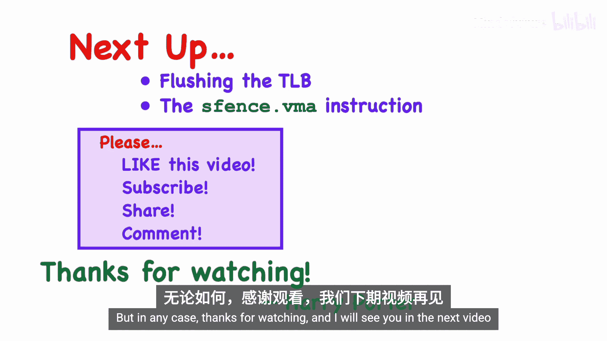

# 020：Sv39, Sv48, Sv57 分页方案详解 🖥️

在本节课中，我们将学习RISC-V 64位系统中的虚拟内存分页方案。我们将详细描述并比较SV32、SV39、SV48和Sv57这几种分页机制，了解它们如何扩展以支持更大的地址空间和巨型页。

## 概述

本视频是虚拟内存系列的第5部分，属于RISC-V架构大系列。我们将重点从32位机器的SV32方案转向64位机器的SV39、SV48和Sv57方案。这些方案通过增加页表树的层级，自然地支持了千兆页（Giga Page）、太字节页（Terra Page）和拍字节页（Petta Page）。

## 从32位到64位的变化

上一节我们介绍了32位机器的SV32分页方案。本节中，我们来看看64位机器的变化。一个64位RISC-V机器可以实现SV39、SV48或Sv57中的一种或多种分页方案。

所有RISC-V机器都使用固定的**4 KB**页大小。这是RISC-V中少数不可调整的参数之一。

*   **页表项大小**：在32位机器上，页表项（PTE）是32位（4字节）。在64位机器上，页表项自然扩展为64位（8字节）。
*   **页表节点容量**：页表树中的每个节点本身就是一个页（4 KB）。因此，对于64位机器，一个节点现在只能容纳 `4096 bytes / 8 bytes = 512` 个页表项，而不是32位时的1024个。
*   **树结构变化**：这意味着我们从基数为1024的树（每个节点有1024个子节点）转变为基数为512的树。因此，用于索引页表节点的位数从10位减少到9位。

## 虚拟地址格式

对于32位机器，虚拟地址是32位，虚拟页号（VPN）为20位，被分成两个10位的部分。对于64位机器，虚拟地址的大小取决于所使用的分页方案。

以下是不同方案下虚拟地址的构成：

*   **SV39**：页表树有3级，需要3个9位的索引。因此，虚拟页号为 `3 * 9 = 27` 位。加上12位的页内偏移，虚拟地址总长为 `27 + 12 = 39` 位。
*   **SV48**：页表树有4级，需要4个9位的索引。虚拟页号为 `4 * 9 = 36` 位，虚拟地址总长为 `36 + 12 = 48` 位。
*   **Sv57**：页表树有5级，需要5个9位的索引。虚拟页号为 `5 * 9 = 45` 位，虚拟地址总长为 `45 + 12 = 57` 位。

公式可以总结为：
`虚拟地址长度 = (页表层级数 * 9) + 12`

## 物理地址与页表项格式

无论使用哪种分页方案，64位RISC-V机器的物理地址都是**56位**。由于页内偏移仍是12位，这意味着物理页号（PPN）现在是 `56 - 12 = 44` 位。

接下来，我们比较一下32位和64位机器的页表项格式。

**32位机器页表项格式**：
包含22位的物理页号（PPN）和各种权限位。

**64位机器页表项格式（SV39/SV48/Sv57通用）**：
页表项大小为64位。物理页号从22位扩展为44位。权限位与32位完全相同。顶部新增了10位：其中7位保留供未来RISC-V扩展使用，另外3位用于名为SVPBMT（基于页的内存类型）的扩展，该扩展与缓存和内存操作顺序约束有关。

## 页表树结构与地址转换

让我们回顾一下SV32的两级页表树结构，然后扩展到更多层级。

**SV32（两级树）**：
虚拟地址被分成两部分（VPN[1], VPN[0]）和一个偏移量。内存管理单元（MMU）首先使用VPN[1]索引根节点，找到指向二级节点的页表项，然后使用VPN[0]索引二级节点，找到指向最终4 KB数据页的叶页表项。

**SV39（三级树）**：
虚拟地址被分成三部分（VPN[2], VPN[1], VPN[0]）和一个偏移量。MMU依次使用VPN[2]、VPN[1]、VPN[0]作为索引，遍历三级页表树，最终定位到数据页。

**SV48（四级树）与 Sv57（五级树）**：
遵循相同的模式。虚拟页号被分解成多个9位的字段，MMU使用这些字段依次索引页表树的每一层，直到找到叶页表项。如果在遍历过程中遇到无效的页表项，则会停止并触发页错误异常。

## 巨型页（Huge Pages）

页表遍历不一定非要到达最底层。如果在较高层就遇到了一个“叶”页表项（即其R/W/X权限位不全为0），则意味着我们遇到了一个巨型页。巨型页的大小取决于它在树中的位置。

以下是不同方案支持的巨型页类型和大小：

*   **SV32**：
    *   仅支持**巨页（Mega Page）**，大小为 **4 MB**。偏移量为22位（`10 + 12`）。
*   **SV39**：
    *   **巨页（Mega Page）**：大小为 **2 MB**。偏移量为21位（`9 + 12`）。
    *   **千兆页（Giga Page）**：大小为 **1 GB**。偏移量为30位（`9 + 9 + 12`）。
*   **SV48**：
    *   支持巨页（2 MB）、千兆页（1 GB）。
    *   **太字节页（Terra Page）**：大小为 **512 GB**（约0.5 TB）。偏移量为39位（`9 + 9 + 9 + 12`）。
*   **Sv57**：
    *   支持巨页（2 MB）、千兆页（1 GB）、太字节页（512 GB）。
    *   **拍字节页（Petta Page）**：大小为 **256 TB**（约0.25 PB）。偏移量为48位（`9 + 9 + 9 + 9 + 12`）。

当MMU遇到巨型页时，它从页表项中获取对齐的物理页号高位部分，并从虚拟地址中获取对应的多位偏移量，组合形成最终的物理地址。页表项中对应于下级索引的位必须为0，以确保地址对齐。

## 总结

本节课中，我们一起学习了RISC-V 64位系统上的分页实现。我们看到，其基本思想与SV32方案几乎相同，但为了适应更大的虚拟地址空间和更多的物理内存，各个字段的位数分配有所不同。关键变化包括页表项扩展为64位、页表节点容量变为512项、以及通过增加页表层级（SV39/SV48/Sv57）来支持更大的地址空间。同时，多级页表树也自然地支持了从巨页到拍字节页的各种巨型页，这有助于减少TLB缺失，提升大内存区域访问的性能。

在下一节视频中，我们将讨论如何刷新转址旁路缓存（TLB），并介绍用于刷新TLB的 `sfence.vma` 指令。