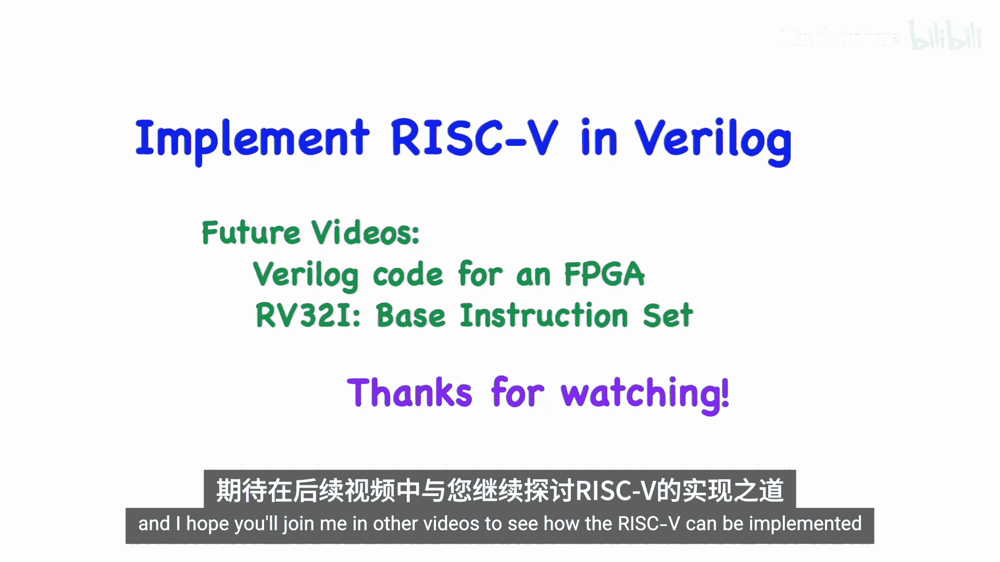

# 022：指令编码详解 🧠


在本节课中，我们将要学习RISC-V指令集架构（ISA）的核心部分——指令编码。我们将详细介绍RV32I规范下的各种指令格式，包括R型、I型、S型、B型、U型和J型指令，并解释它们如何被编码成32位的机器码。理解这些编码是后续进行汇编编程或硬件实现的基础。

## 寄存器组

RISC-V架构包含32个通用寄存器，每个寄存器在RV32I规范下为32位宽。每个寄存器都有一个编号（x0到x31）和一个可选的别名，这些别名反映了寄存器在编程中的常见用途。例如，x1寄存器也常被称为`ra`（返回地址寄存器），用于存储函数调用后的返回地址。

所有寄存器都是通用目的，但有一个重要的例外：**x0寄存器**。它的值被硬件固定为0，且不可更改。它可以作为0值的来源，也可以作为不需要结果的操作的目的寄存器。

除了通用寄存器，还有一个**程序计数器（PC）**，用于指向当前正在执行的指令地址。

## 指令编码概述

RISC-V指令集主要分为两类：**标准指令集**和**压缩指令集**。标准指令集是必须实现的，所有指令长度固定为32位。压缩指令集是可选的，指令长度为16位，用于减少代码体积。本教程仅关注32位的标准指令集。

所有32位标准指令的最低两位（bits [1:0]）总是`11`。其他位组合用于标识压缩指令。

指令编码有几种基本格式，它们共享一些共同的字段：
*   **rd**：5位，目的寄存器编号。
*   **rs1**：5位，第一个源寄存器编号。
*   **rs2**：5位，第二个源寄存器编号。
*   **opcode**：7位，主要操作码，用于区分指令大类。
*   **funct3**：3位，辅助操作码，用于在同类指令中进一步区分。
*   **funct7**：7位，另一个辅助操作码字段。

立即数（Immediate）字段在不同格式中的位置和组合方式不同，用蓝色高亮显示。

以下是主要的指令格式类型：

*   **R型**：用于寄存器到寄存器的操作（如加法）。
*   **I型**：用于包含立即数的操作（如加立即数）和加载指令。
*   **S型**：用于存储指令。
*   **B型**：用于条件分支指令。
*   **U型**：用于操作大立即数的指令（如加载高位立即数）。
*   **J型**：用于长跳转指令（跳转并链接）。

## 指令格式详解

上一节我们介绍了指令编码的概览，本节中我们来看看每种格式的具体构成。

### R型指令

R型指令用于两个寄存器之间的算术逻辑单元（ALU）操作。其格式如下：

```
| funct7 (7 bits) | rs2 (5 bits) | rs1 (5 bits) | funct3 (3 bits) | rd (5 bits) | opcode (7 bits) |
```

一个典型的例子是`add`指令，它将`rs1`和`rs2`寄存器的值相加，结果存入`rd`寄存器。R型指令还包括减法、位运算（与、或、异或）和移位操作。

### I型指令

I型指令包含一个12位的立即数，该立即数会被符号扩展为32位后使用。其格式如下：

```
| immediate[11:0] (12 bits) | rs1 (5 bits) | funct3 (3 bits) | rd (5 bits) | opcode (7 bits) |
```

I型指令主要分为三类：
1.  **ALU立即数指令**：如`addi`（加立即数）。其`funct3`字段与对应的R型指令相同。
2.  **加载指令**：如`lw`（加载字）。内存地址由`rs1 + 符号扩展的立即数`计算得出。
3.  **跳转并链接寄存器指令**：`jalr`。目标地址由`rs1 + 符号扩展的立即数`计算得出，同时将下一条指令的地址（PC+4）存入`rd`寄存器。

### S型与B型指令

S型指令用于存储数据到内存，B型指令用于条件分支。它们都没有`rd`字段，并且立即数字段被拆分存放。

**S型格式**：
```
| immediate[11:5] (7 bits) | rs2 (5 bits) | rs1 (5 bits) | funct3 (3 bits) | immediate[4:0] (5 bits) | opcode (7 bits) |
```
存储地址由`rs1 + 符号扩展的立即数`计算，将`rs2`寄存器中的字节、半字或字存入该地址。

**B型格式**：
```
| immediate[12|10:5] (7 bits) | rs2 (5 bits) | rs1 (5 bits) | funct3 (3 bits) | immediate[4:1|11] (5 bits) | opcode (7 bits) |
```
B型指令的立即数编码方式比较特殊，它被重组并左移1位（即乘以2），形成最终的偏移量。目标地址为`PC + 符号扩展的偏移量`。由于指令地址总是2字节对齐，这种编码方式在12位立即数的基础上提供了大约±4KB的跳转范围。

条件包括：等于(`beq`)、不等于(`bne`)、小于(`blt`)、大于等于(`bge`)以及它们的无符号版本。

### U型与J型指令

U型和J型指令包含更大的20位立即数字段，用于构建32位的地址或数据。

**U型格式**：
```
| immediate[31:12] (20 bits) | rd (5 bits) | opcode (7 bits) |
```
U型指令有两条：
*   `lui`（加载高位立即数）：将20位立即数左移12位后加载到`rd`寄存器的高20位，低12位置0。
*   `auipc`（PC加高位立即数）：将20位立即数左移12位后与当前PC值相加，结果存入`rd`寄存器。

**J型格式**：
```
| immediate[20|10:1|11|19:12] (20 bits) | rd (5 bits) | opcode (7 bits) |
```
J型指令只有一条：`jal`（跳转并链接）。其20位立即数经过复杂的重组和左移1位后，形成PC相对的跳转偏移量。目标地址为`PC + 偏移量`。同时，它将下一条指令的地址（PC+4）存入`rd`寄存器。`jal`可用于函数调用（`rd`设为`ra`）或长距离无条件跳转（`rd`设为`x0`）。

## 系统指令与CSR指令

上一节我们介绍了数据处理和流程控制指令，本节中我们来看看与系统控制和状态相关的指令。

系统指令共享相同的`opcode`，通过`funct3`字段区分。`ecall`用于发起系统调用，`ebreak`用于调试断点。

控制与状态寄存器（CSR）指令用于读写处理器内部的特殊寄存器。CSR由12位地址标识。以下是主要的CSR指令：

*   `csrrw`：原子性地读取CSR旧值到`rd`，并将`rs1`的值写入CSR。
*   `csrrs`：原子性地读取CSR旧值到`rd`，并将CSR中对应`rs1`掩码为1的位设置为1。
*   `csrrc`：原子性地读取CSR旧值到`rd`，并将CSR中对应`rs1`掩码为1的位清除为0。

以上三条指令的变体`csrrwi`、`csrrsi`、`csrrci`使用5位零扩展的立即数作为源操作数，而非寄存器。

常见的CSR包括`cycle`（时钟周期计数器）、`time`（实时时钟）和`mstatus`（机器模式状态寄存器）。

## 总结



本节课中我们一起学习了RISC-V RV32I指令集的编码方式。我们从32个通用寄存器开始，详细剖析了R型、I型、S型、B型、U型和J型指令的位域布局和用途。我们还介绍了用于系统调用和访问控制状态寄存器（CSR）的指令。理解这些指令如何从汇编助记符转换为32位的机器码，是进行RISC-V汇编编程或使用Verilog等硬件描述语言实现处理器内核的基石。掌握了这些知识，你就为深入探索RISC-V软硬件生态打下了坚实的基础。