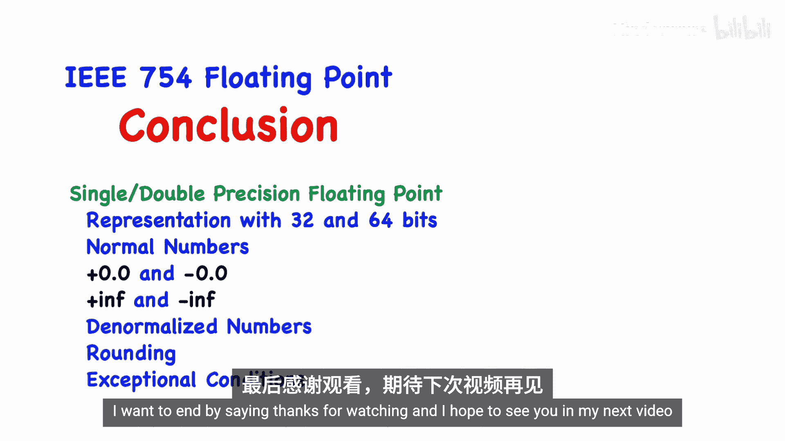

# 024：IEEE 754浮点数标准 🧮


在本节课中，我们将要学习计算机中浮点数的表示方法，即IEEE 754标准。无论您使用RISC-V、ARM还是Intel处理器，此标准都是通用的。理解浮点数是学习RISC-V可选F（单精度）和D（双精度）扩展的基础。

## 概述：科学计数法与二进制

上一节我们介绍了课程背景，本节中我们来看看浮点数的基本思想。它源于科学计数法。

在十进制科学计数法中，一个数由符号、尾数（有效数字）和以10为底的指数组成，例如：**-3.456 × 10²**。

二进制浮点数采用相同的思路，但底数变为2。其通用形式为：
```
(-1)^s × M × 2^E
```
其中：
*   **s** 是符号位（0表示正，1表示负）。
*   **M** 是尾数（一个二进制小数）。
*   **E** 是指数。

我们的习惯是将小数点（在二进制中称为二进制点或基数点）放在第一个有效数字之后。对于二进制数，这意味着将点放在第一个`1`之后。

## 单精度与双精度表示 🧱

理解了基本形式后，我们来看看计算机中具体的实现方式。IEEE 754标准主要定义了两种格式：单精度（32位）和双精度（64位）。

在C语言中，`float`类型对应单精度，`double`类型对应双精度。在RISC-V中，单精度指令以`F`开头，双精度指令以`D`开头。如果处理器支持双精度（D扩展），则必定也支持单精度（F扩展）。

以下是两种精度的位字段布局：

**单精度（32位）**
*   **1位** 符号位 (s)
*   **8位** 指数位 (exp)
*   **23位** 尾数位 (frac)

**双精度（64位）**
*   **1位** 符号位 (s)
*   **11位** 指数位 (exp)
*   **52位** 尾数位 (frac)

对于**规格化（Normal）** 数，尾数域存储的是小数点后的部分，而小数点前隐含了一个`1`（即`1.frac`）。这种设计节省了一位，提高了精度。

## 精度与数值范围示例 🔍

浮点数具有固定的位数，因此只能精确表示一部分有理数，数值之间存在间隔。

对于单精度浮点数，我们常说其具有**约7位十进制有效数字**的精度。对于双精度浮点数，则具有**约16位十进制有效数字**的精度。

数值之间的间隔并非均匀。指数越大，能表示的数值范围越广，但相邻可表示值之间的间隔也越大；反之，越接近0，间隔越小。

让我们通过两个例子来感受一下：

**示例1：大数（间隔大）**
假设一个单精度数的二进制表示为：
```
0 10001100 11001100110011001100110
```
（符号位0，指数140，尾数0.7999999...）
其表示的十进制值约为 **7.9999998 × 10¹⁰**（约800亿）。下一个可表示的数是通过将尾数最低位加1得到的，其值约为 **7.9999998 × 10¹⁰ + 4096**。两者间隔为4096，但前7位十进制数字相同。

**示例2：小数（间隔小）**
假设一个单精度数的二进制表示为：
```
0 01101111 01010101010101010101010
```
（指数111，尾数0.3333333...）
其表示的十进制值约为 **1.0000001 × 10⁻⁵**。下一个可表示的数约是 **1.0000001 × 10⁻⁵ + 1.8 × 10⁻¹²**。间隔极小，同样前7位十进制数字相同。

## 特殊值 ⚠️

除了规格化数字，IEEE 754标准还定义了几种特殊的位模式来表示特定值。

这些特殊值通过指数域的全0或全1来区分：

*   **零（Zero）**：指数域全0，尾数域全0。有**+0**和**-0**两种表示。
*   **无穷大（Infinity）**：指数域全1，尾数域全0。用于表示溢出，有**+∞**和**-∞**。
*   **非数（NaN， Not a Number）**：指数域全1，尾数域**非全0**。表示无效操作的结果（如0/0， ∞-∞）。
*   **非规格化数（Denormalized/Subnormal Numbers）**：指数域全0，尾数域**非全0**。用于表示非常接近0的数，此时隐含的整数位是`0`而不是`1`，精度会降低。

以下是单精度浮点数的特殊值编码示例：
*   **+0**: `0x00000000`
*   **-0**: `0x80000000`
*   **+∞**: `0x7f800000`
*   **-∞**: `0xff800000`
*   **NaN**: `0x7fc00000` （一种典型值）

## 舍入与异常处理 ⚙️

由于浮点数表示能力有限，运算结果可能无法精确表示，此时需要进行舍入。

IEEE 754定义了多种舍入模式：
*   向最近偶数舍入（Round to Nearest, Ties to Even - 默认且最常用）
*   向零舍入（Round toward Zero）
*   向下舍入（Round Down / Toward -∞）
*   向上舍入（Round Up / Toward +∞）

处理器中通常有一个**控制状态寄存器（CSR）** 来设置当前的舍入模式。

在运算过程中，可能会发生以下异常情况，相应的状态标志位会被置位（且是“粘性的”，直到被手动清除）：
1.  **不精确（Inexact）**：结果被舍入。
2.  **上溢（Overflow）**：结果幅值太大，返回±∞。
3.  **下溢（Underflow）**：结果幅值太小，可能返回非规格化数或0。
4.  **除零（Divide by Zero）**：例如1.0/0.0 = ∞。
5.  **无效操作（Invalid Operation）**：如0/0、∞-∞，返回NaN。

## 使用注意事项与总结 📝

最后，我们需要警惕浮点数与数学中实数的区别：
*   存在**±0**。
*   运算结果可能不精确。
*   **不满足结合律**！例如，`(a + b) + c` 不一定等于 `a + (b + c)`。
*   需要注意上溢和下溢。
*   一个有用的特性是：任何32位整数（有符号或无符号）都可以用**双精度浮点数精确表示**。



本节课中我们一起学习了IEEE 754浮点数标准的核心内容。我们探讨了单精度和双精度浮点数的二进制表示方法，包括规格化数、零、无穷大、NaN和非规格化数等特殊值。我们还了解了舍入模式和各种运算异常条件。掌握这些基础知识，对于理解RISC-V或其他任何架构的浮点运算单元都至关重要。