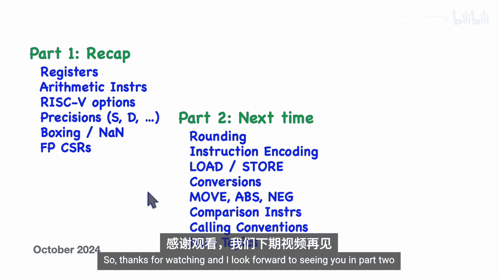

# 025：浮点指令（第一部分）


在本节课中，我们将要学习RISC-V处理器架构中的浮点运算实现。这是关于RISC-V浮点指令系列视频的第一部分。上一节我们介绍了浮点数的通用表示方法，本节中我们来看看RISC-V处理器如何具体实现浮点运算。

## 概述

本视频将介绍浮点寄存器、执行算术运算的基本指令、RISC-V的各种浮点选项（如单精度、双精度等），以及如何将较小精度的值“装箱”到较大的NaN值中。我们还将描述浮点控制和状态寄存器，其中包含了舍入模式等信息。在下一部分视频中，我们将更详细地讨论舍入，并介绍浮点指令的二进制编码、加载/存储指令、精度转换指令、比较指令以及调用约定等主题。

## 浮点寄存器

如果处理器核心实现了浮点运算，那么除了32个通用整数寄存器外，还会有32个额外的浮点寄存器，命名为 **F0** 到 **F31**。与整数寄存器不同，寄存器F0没有特殊含义。

这些寄存器的大小取决于处理器核心实现了哪些选项。以下是相关选项：
*   **选项F**：单精度，需要32位。
*   **选项D**：双精度，需要64位，并要求已实现选项F。
*   **选项Q**：四倍精度，需要128位，并要求已实现选项D。
*   **选项Zfh**：半精度，需要16位，并要求已实现选项F。

无论实现哪些选项，都只有一套寄存器集，其大小为所支持的最大精度。例如，如果实现了选项F和D，寄存器将是64位，能够容纳单精度或双精度值。

## 基本浮点指令

以下是我们的第一条浮点指令示例：
```
fadd.s fd, fs1, fs2
```
它将两个浮点寄存器中的值相加，并将结果放入目标浮点寄存器。由于有32个寄存器，这些寄存器在指令中用5位字段编码。浮点指令的编码与整数指令非常相似，只是操作码位不同。

我们可以对浮点指令做一些概括：
1.  它们都以字母 **F** 开头，表示浮点。
2.  它们有一个**大小后缀**。例如，`.s` 表示单精度加法。

对于其他精度，也有相应的指令：
*   `.h`：半精度
*   `.d`：双精度
*   `.q`：四倍精度

处理器核心具体实现哪些指令，取决于它实现了哪些可选扩展。如果尝试执行未实现的指令（例如，核心未实现四倍精度却执行 `fadd.q`），将引发非法指令异常。

## 浮点指令分类

我们将要描述的浮点指令很多，但可以初步分为以下几类：

以下是主要类别：
*   **算术指令**：加、减、乘、除、平方根、最小值、最大值。
*   **分类指令**：用于确定浮点数的类型（如正负无穷、零、规格化数、非规格化数、NaN）。
*   **加载/存储指令**：在内存和浮点寄存器之间移动浮点数。
*   **比较指令**：测试特定条件，并将整数寄存器设置为1或0以表示结果。
*   **转换指令**：在整数寄存器的整数值与不同精度的浮点数之间进行转换。
*   **其他杂项指令**：例如，在浮点寄存器之间移动值、计算绝对值或取反等。

## 算术运算指令

基本的浮点算术指令从浮点寄存器中获取参数，并将结果放入目标浮点寄存器。

如果核心实现了浮点运算，那么它将拥有以下单精度指令（后缀为 `.s`）：
```
fadd.s, fsub.s, fmul.s, fdiv.s, fmin.s, fmax.s, fsqrt.s
```
如果核心还实现了双精度，则还会有以下指令（后缀为 `.d`）：
```
fadd.d, fsub.d, fmul.d, fdiv.d, fmin.d, fmax.d, fsqrt.d
```
如果核心实现了四倍精度，则会有以下指令（后缀为 `.q`）：
```
fadd.q, fsub.q, fmul.q, fdiv.q, fmin.q, fmax.q, fsqrt.q
```
如果核心还实现了半精度，则会有以下指令（后缀为 `.h`）：
```
fadd.h, fsub.h, fmul.h, fdiv.h, fmin.h, fmax.h, fsqrt.h
```
本视频将描述所有浮点指令，但具体哪些指令可用，取决于您的RISC-V核心实现了哪些可选扩展。

## 装箱（Boxing）概念

接下来要问的问题是，例如，在实现了双精度的核心上尝试执行单精度算术指令会发生什么？单精度值需要32位，但我们的寄存器是64位。

对于源操作数，只使用低32位，高32位被忽略。对于目标寄存器，结果被放入64位寄存器的低半部分，而高半部分被设置为全1。

这与在RV64机器上进行32位整数运算类似，但区别在于：整数运算的结果会进行符号扩展，而浮点运算的高半部分总是用全1填充。

为了理解这是如何工作的，让我们回顾一下NaN值。如果一个值的指数位全为1，并且尾数部分至少有一个1位，则该值被解释为NaN。符号位无关紧要。

例如，这个双精度值将被解释为NaN。我们甚至不关心这个值的低半部分是什么。实际上，我们可以在低半部分隐藏一些东西，这被称为**有效载荷**。我们要做的是将一个单精度浮点值隐藏在低半部分。

因此，作为一个双精度值，它被解释为NaN，但如果我们只看低半部分，那么我们就得到了我们的单精度值。这种技术被称为**装箱**。

在同时实现单精度和双精度的核心上，我们可以将一个单精度数装箱在一个双精度数内。我们也可以将一个双精度数装箱在四倍精度数内，或者将一个半精度数装箱在单精度数内。基本上思路相同。

实际上，我们可以递归地进行装箱。例如，一个半精度值可以被装箱在一个单精度数内，而这个单精度数本身又被装箱在一个双精度值内。

## 关于NaN的补充说明

有时你会遇到**静默NaN**和**信号NaN**的区别。
*   **静默NaN**：如果指令的一个操作数是静默NaN，那么结果将是另一个NaN。静默NaN会被传播。
*   **信号NaN**：如果指令的一个操作数是信号NaN，那么计算将停止，指令将引发异常。

在RISC-V中，默认情况下所有的NaN都是静默的。信号NaN是一个可能不会在您的处理器中实现的选项。

## 分类指令

一个非常有用的指令是 **`fclass`** 指令。它获取浮点寄存器中的一个值，判断它是哪种类型的浮点数，并将一个代码值存储到一个通用整数寄存器中。

这个指令有几种变体，对应四种不同的精度后缀。浮点值可以是：正/负无穷、正/负零、规格化数、非规格化数，或者可能是NaN。

以下是所有可能的代码值。其中一个整数值会被移动到目标通用整数寄存器中，以告知您所拥有的值的类型。

## 浮点控制与状态寄存器

浮点控制和状态寄存器包含两个控制浮点指令操作的字段：
1.  **舍入模式字段**：包含一个代码，指示浮点算术指令在结果无法精确表示时应如何舍入。
2.  **标志位字段**：包含五个标志位。

舍入模式代码及其符号名如下：
*   **RNE**：向最接近的值舍入， ties to even（当精确结果恰好位于两个可表示值的中间时，舍入到最低有效位为0的值）。
*   **RTZ**：向零舍入。
*   **RDN**：向下舍入（向负无穷舍入）。
*   **RUP**：向上舍入（向正无穷舍入）。
*   **RMM**：向最接近的值舍入，ties to max magnitude（当精确结果恰好位于两个可表示值的中间时，舍入到绝对值较大的值）。

标志位会在特定条件发生时由任何指令设置，以便在一系列计算后检查是否发生了任何异常情况：
*   **无效操作位**：如果发生无效操作（例如正无穷加负无穷）则置位。
*   **除零位**：如果尝试除以零则置位。
*   **上溢位**：如果计算发生上溢则置位。
*   **下溢位**：如果计算发生下溢则置位。
*   **不精确位**：如果精确结果无法用给定精度表示则置位。

还有两个独立的寄存器：**`fflags`**（包含五个浮点标志位）和 **`frm`**（舍入模式寄存器）。它们包含的位与FCSR寄存器中的相应位完全相同。因此，如果您想修改或查询这些位，使用哪个寄存器都可以。

## 访问控制与状态寄存器

为了查询或修改这些控制和状态寄存器，我们有以下指令：
*   `frcsr rd`：读取FCSR到整数寄存器rd。
*   `fscsr rd, rs` / `fscsr rs`：将整数寄存器rs的值写入FCSR（可选同时读取旧值到rd）。
*   `frmr rd`：读取舍入模式寄存器到rd。
*   `fsrm rd, rs` / `fsrm rs`：设置舍入模式寄存器。
*   `frflags rd`：读取标志位寄存器到rd。
*   `fsflags rd, rs` / `fsflags rs`：设置标志位寄存器。

需要指出的是，这些指令实际上是**伪指令**。汇编器会将它们翻译成实际存在的机器指令（如 `csrr`, `csrw`, `csrrs` 等），这展示了伪指令机制的强大之处。

## 总结

本节课中我们一起学习了RISC-V浮点实现的第一部分内容。我们介绍了浮点寄存器，描述了执行算术运算的基本指令，讨论了单、双、四倍及半精度等不同精度选项。我们解释了如何将较小精度的值装箱到较大精度的NaN值中。最后，我们讨论了用于浮点指令的控制和状态寄存器。

在下一节视频中，我们将更详细地讨论舍入模式，介绍浮点指令的二进制编码，并讲解加载/存储指令、不同精度间的转换指令、移动/绝对值/取反指令以及浮点值比较指令。我们还将讨论浮点调用约定并涵盖其他一些主题。



