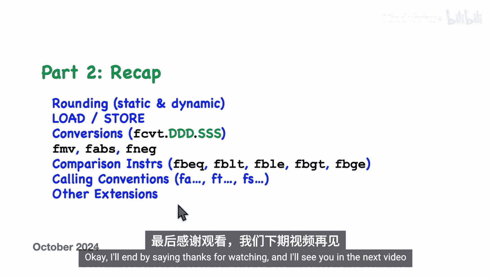

# 026：浮点指令（第二部分）

在本节课中，我们将继续学习RISC-V架构中的浮点指令。上一节我们介绍了浮点寄存器、算术指令、不同精度以及浮点控制与状态寄存器。本节中，我们将深入探讨舍入模式、指令编码、加载/存储指令、转换指令、比较指令以及浮点调用约定等核心内容。

## 舍入模式：动态与静态

上一节我们介绍了浮点运算，本节中我们来看看如何指定舍入模式。RISC-V提供了两种指定舍入模式的方法：动态舍入和静态舍入。

*   **动态舍入**：使用浮点控制与状态寄存器中的舍入模式位来决定结果应如何舍入。
*   **静态舍入**：直接在指令中指定舍入模式。

以下是这两种方法在汇编语言中的示例：

*   使用动态舍入（即使用控制与状态寄存器中的设置），无需在指令中做任何额外操作。
*   使用静态舍入，需要在指令中添加一个额外的操作数，使用以下符号之一：
    *   `rne`：向最接近的值舍入（四舍六入五成双）。
    *   `rtz`：向零舍入。
    *   `rdn`：向下舍入（向负无穷大）。
    *   `rup`：向上舍入（向正无穷大）。
    *   `rmm`：向最接近的值舍入，平局时取最大幅度值。

舍入模式适用于算术指令以及部分转换指令，并且适用于各种精度。对于某些结果总是精确的指令（例如 `fmin`、`fmax` 指令，或单精度转双精度转换），如果尝试指定静态舍入模式，汇编器会报错。

## 浮点指令编码

了解浮点指令如何编码为二进制机器码有很多细节，但我们可以通过一个例子来感受一下。以下是一条浮点减法指令，每条指令都被编码为一个32位的完整指令。

浮点指令包含多个字段：

*   **操作码字段**：决定指令的基本类型和具体操作（如加法、减法、乘法等）。
*   **精度字段**：决定是单精度、双精度还是其他精度。
*   **寄存器字段**：指定目标寄存器和源寄存器。
*   **舍入模式字段**：一个3位的字段，用于指定舍入模式。

以一条静态指定“向零舍入”的减法指令为例，其舍入模式字段会被编码为 `001`。如果我们不指定任何舍入模式（即使用动态舍入），则编码为 `111`，此时舍入模式由浮点控制与状态寄存器决定。

## 加载与存储指令

与通用寄存器类似，浮点寄存器也有一系列加载和存储指令，用于在内存和浮点寄存器之间移动数据。

以下是可用的指令类型：

*   `flh` / `fsh`：加载/存储半字（2字节）。
*   `flw` / `fsw`：加载/存储字（4字节，单精度）。
*   `fld` / `fsd`：加载/存储双字（8字节，双精度）。
*   `flq` / `fsq`：加载/存储四字（16字节，四精度）。

地址计算方式为：**内存地址 = 基址寄存器（RS1） + 指令中的偏移量**。其中，基址寄存器 `RS1` 使用的是通用整数寄存器。具体能使用哪些指令取决于你的RISC-V核心实现了哪些扩展（例如，没有实现四精度浮点，就不能使用 `flq`/`fsq`）。

对于整数加载，较小的值会被符号扩展以填充较大的寄存器。对于浮点加载，当加载的数据大小小于寄存器本身时，值会被“装箱”，即作为非数字值的有效载荷进行封装。

## 转换指令

转换指令用于将源寄存器中的值复制到目标寄存器，并在过程中进行格式转换。源和目标可以是浮点值或整数值，分别对应浮点寄存器和通用寄存器。

转换指令的一般格式为：`fcvt.{目标格式}.{源格式} rd, rs`。例如，`fcvt.s.w rd, rs` 表示将32位有符号整数（源在通用寄存器 `rs`）转换为单精度浮点数（目标在浮点寄存器 `rd`）。

格式说明符如下：

*   **浮点格式**：`s`（单精度）、`d`（双精度）、`q`（四精度）、`h`（半精度）。对应寄存器必须是浮点寄存器。
*   **整数格式**：`w`（32位有符号）、`wu`（32位无符号）、`l`（64位有符号）、`lu`（64位无符号）。对应寄存器必须是通用整数寄存器。

可用的转换指令非常多，具体取决于核心实现的扩展。

## 移动、绝对值与取反指令

除了转换，还有几条指令用于在通用整数寄存器和浮点寄存器之间直接移动比特位，而不进行任何数值转换。这意味着相同的比特模式在两种寄存器中会被解释为完全不同的值。

以下是相关的移动指令：

*   `fmv.x.w` / `fmv.w.x`：在32位通用寄存器（`x`）和单精度浮点寄存器（`w`）之间移动32位数据。
*   `fmv.x.d` / `fmv.d.x`：在64位通用寄存器（`x`）和双精度浮点寄存器（`d`）之间移动64位数据（适用于RV64且实现双精度）。

此外，还有三条实用的浮点伪指令：

*   `fabs.s rd, rs`：计算绝对值（清除符号位）。
*   `fneg.s rd, rs`：取反。
*   `fmv.s rd, rs`：寄存器间移动。

它们的底层实现分别是 `fsgnjx.s`、`fsgnjn.s` 和 `fsgnj.s` 指令。

## 浮点比较指令

测试在编程中很重要，让我们看看如何比较浮点值。所有比较指令都遵循相同的模式：比较两个浮点寄存器中的值，然后将结果（1表示真，0表示假）写入一个通用整数寄存器。

以下是比较指令的示例：

*   `feq.s rd, rs1, rs2`：单精度相等测试。
*   `flt.s rd, rs1, rs2`：单精度小于测试。
*   `fle.s rd, rs1, rs2`：单精度小于等于测试。

执行比较指令后，通常会使用分支指令（如 `beq`、`bne`）来测试结果寄存器，以决定程序流向。需要注意的是，硬件只直接实现了小于（`flt`）和小于等于（`fle`）操作。大于（`fgt`）和大于等于（`fge`）是伪指令，通过交换操作数并调用 `flt`/`fle` 来实现。

**浮点比较的注意事项**：

1.  **相等性测试**：由于舍入误差，两个在数学上相等的数在浮点表示中可能不完全相等，因此直接测试相等性存在风险。更好的做法是计算差值，并与一个很小的阈值（epsilon）进行小于比较。
2.  **与非数字比较**：任何与非数字（NaN）进行的 `<`、`<=`、`>`、`>=` 比较都被视为无效操作，会设置控制与状态寄存器中的无效操作标志。但奇怪的是，相等性比较（`feq`）不被视为无效操作。
3.  **NaN的自比较**：`NaN == NaN` 的结果总是假（`false`），这与直觉相悖。
4.  **正零与负零**：`+0.0` 和 `-0.0` 在比较时是相等的，但 `1.0 / +0.0` 得到正无穷，而 `1.0 / -0.0` 得到负无穷，这挑战了“相等”的直观含义。

## 浮点寄存器命名与调用约定

与通用寄存器（`x0`-`x31`）类似，浮点寄存器（`f0`-`f31`）也有别名，反映了它们在函数调用中的角色：

*   **参数寄存器**：`fa0` - `fa7`，用于传递浮点参数。
*   **临时寄存器**：`ft0` - `ft11`，调用者保存，可在函数内自由使用。
*   **被调用者保存寄存器**：`fs0` - `fs11`，如果函数要使用它们，必须保存原值并在返回前恢复。

汇编器会自动处理这些别名，建议在编程中使用这些更具描述性的名称。调用约定与整数寄存器类似：浮点参数通过 `fa0`-`fa7` 传递，函数内可使用临时寄存器，若需使用被调用者保存寄存器则需保存和恢复其值。

## 其他可选扩展

最后，我们简要介绍几个可能不太常见但值得了解的可选RISC-V扩展：

*   **ZFA扩展**：增加了一些指令，如浮点立即数加载（`fli`）、浮点舍入到整数（`fround`）等。
*   **Zfinx/Zdinx/Zhinx扩展**：这些扩展允许浮点指令直接操作通用整数寄存器（`x`寄存器），而不是独立的浮点寄存器（`f`寄存器）。这样，浮点寄存器就成为了通用寄存器的别名。这样做的好处是硬件内部可以使用与IEEE 754标准不同的格式（如更多位数、补码指数、显式前导位）来存储浮点数，以优化性能或简化硬件。
*   **Zhinxmin扩展**：提供对半精度浮点的极简支持，主要提供半精度与单/双精度之间的转换指令，以便在更大精度下进行运算后再转换回来。

## 总结

本节课中，我们一起深入学习了RISC-V浮点指令的第二部分内容。

我们探讨了**动态和静态两种舍入模式**，了解了浮点指令的**基本编码格式**。我们学习了用于在内存和浮点寄存器间传输数据的**加载和存储指令**，以及在不同格式（浮点与整数，不同精度浮点）间进行转换的**转换指令**。

我们还介绍了**移动、绝对值和取反指令**，以及用于比较两个浮点值的**比较指令**，并特别讨论了浮点比较中关于舍入、NaN和零值的注意事项。

我们明确了**浮点寄存器的别名**（`fa*`, `ft*`, `fs*`）及其在**函数调用约定**中的角色。最后，我们简要了解了一些可选的扩展，如ZFA、Zfinx系列和Zhinxmin。

掌握这些知识，将帮助你更有效地在RISC-V汇编程序中使用浮点运算。