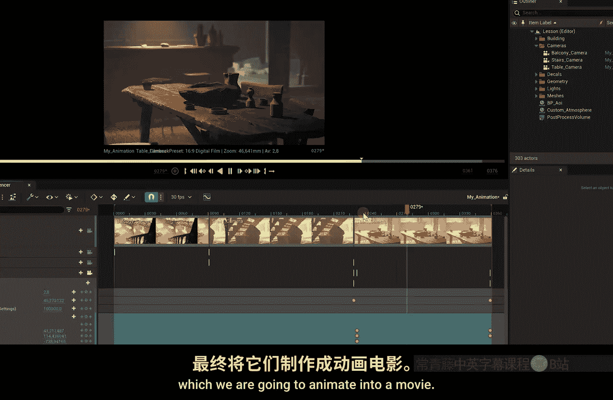

# 001：课程介绍 🎬

在本节课中，我们将一起了解这门虚幻引擎5入门课程的整体内容、目标以及你将学习到的核心技能。

大家好，我是Jodi，是虚幻引擎5的主管工程师。我身后的就是虚幻引擎5，这非常酷。你们中的大多数人可能通过YouTube频道“Cnicom”认识我，我们在那里为超过200万订阅者提供关于VFX、电影制作等内容的教程视频。

在过去的一年里，我一直在使用虚幻引擎作为创意工作的工具。请注意，我并非用它来制作游戏，而这实际上是该引擎最初被创造出来的主要目的。近年来，我们看到虚幻引擎增加了越来越多适用于内容创作者、视觉特效艺术家和电影制作人的功能。

正因如此，我决定为初学者开设这门虚幻引擎5课程，并探索一些虚拟制片工具。在本课程结束时，你将能够创建美丽的户外景观，完全控制大气和阳光，并创作出令人惊叹的美丽镜头。

我们还将创建一个完整的室内场景，设置室内照明，营造特定氛围，并设置不同的虚拟摄像机，我们将把这些摄像机动画化，制作成一段电影。

在本课程的最后几节课中，我们将进行实时抠像，使用运动追踪器（更具体地说，是我们的iPhone）来控制虚拟摄像机。我们甚至将探索一些DMX功能，使我们不仅能控制现实世界中的灯光，还能控制虚幻引擎内部的灯光。

我非常兴奋能在这个入门课程中向你介绍虚幻引擎的世界。这将是有趣且互动的，但最重要的是，你将学到关于这个美妙程序的许多新知识。

请戴好你的安全帽，跟随我一起进入最精彩的虚幻引擎5入门课堂吧。我们开始。