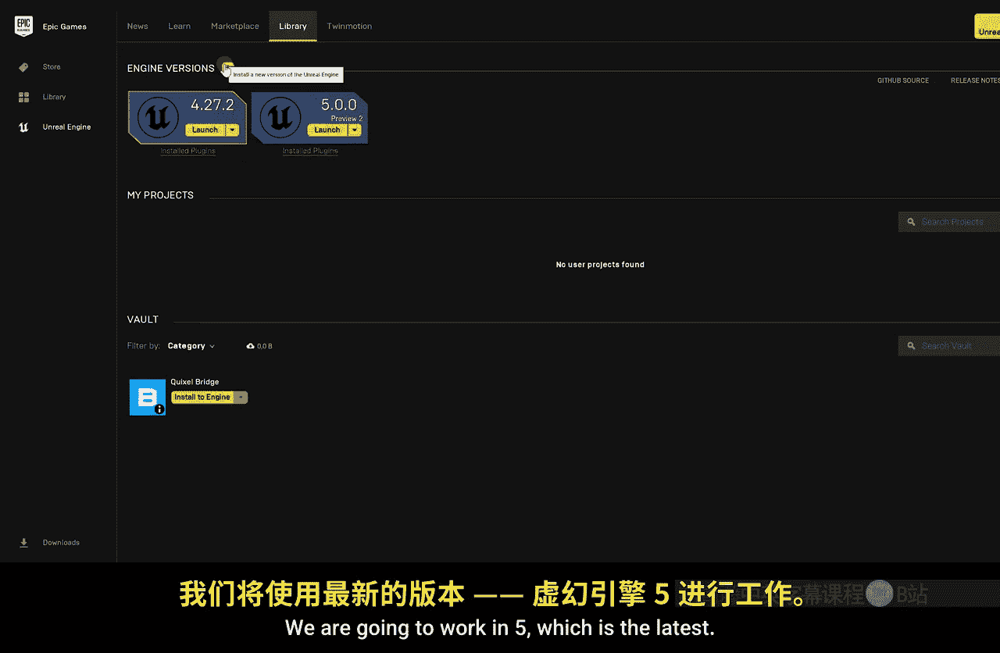
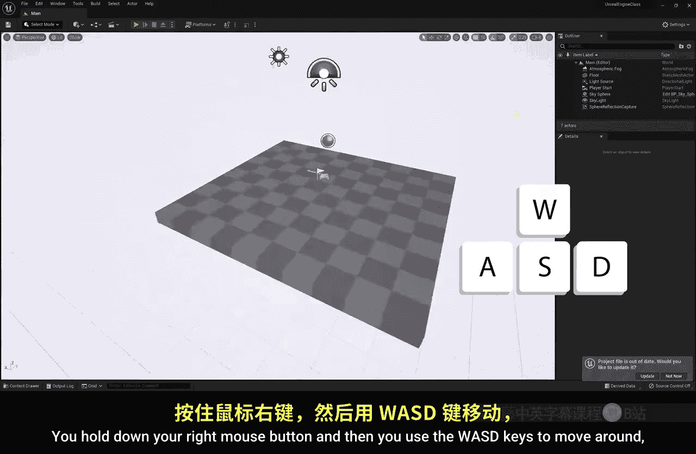
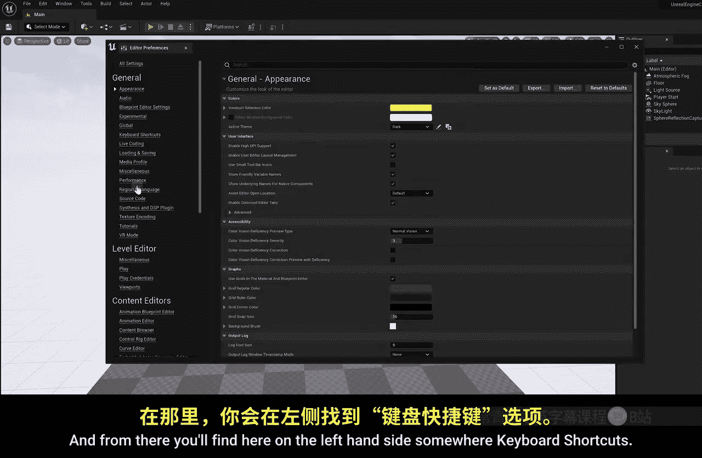
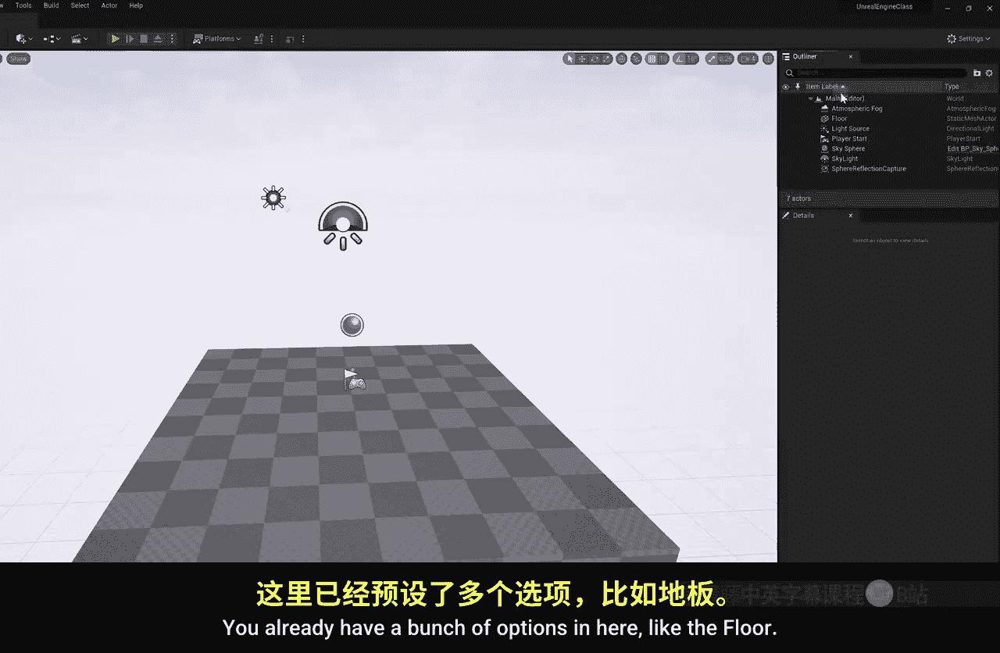
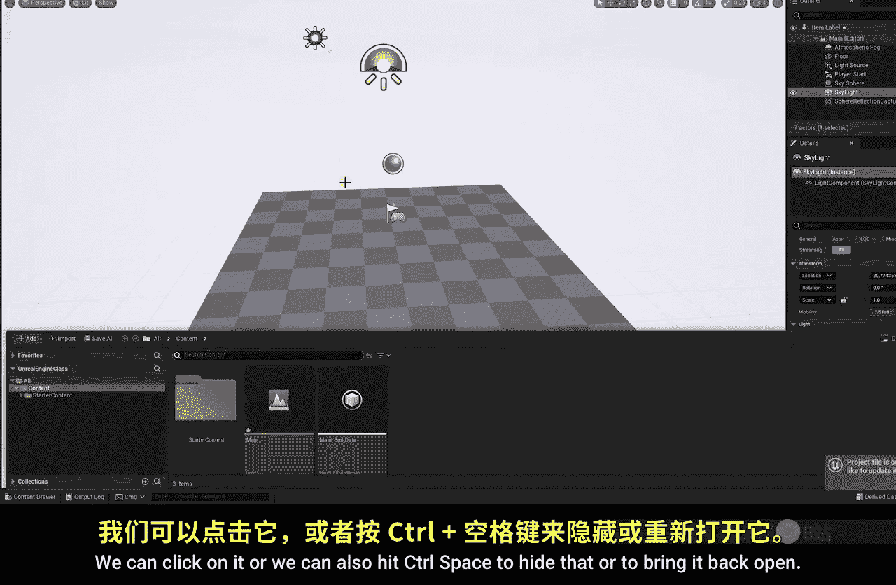

# 002：用户界面

在本节课中，我们将学习虚幻引擎5的基本用户界面，包括如何启动项目、导航3D空间以及操作场景中的物体。

## 项目创建与启动

上一节我们介绍了课程概述，本节中我们来看看如何启动虚幻引擎并创建第一个项目。

虚幻引擎可以通过Epic Games启动器找到。打开启动器后，进入“库”选项卡。在这里，我们可以安装不同版本的虚幻引擎。本课程将使用最新的虚幻引擎5进行工作。点击“启动”即可打开虚幻引擎5。

启动后，系统会提示你开始一个新项目。

在左侧，我们有几种项目类型选项。我们可以创建一个新的游戏项目，或者创建一个用于影视与视频的项目。本课程主要面向希望将虚幻引擎用于虚拟制片、电影制作或3D动画等内容创作者，因此请选择“影视与视频”下的空白项目。

你可能会好奇游戏项目和影视项目有何区别。虚幻引擎功能繁多，为了简化，游戏空白项目会默认启用某些针对游戏开发的功能，而这些功能在影视项目中是禁用的，反之亦然。因此，请确保选择正确的项目类型。

在右侧，你会看到“初学者内容包”选项。请确保勾选此选项。这会导入一些我们可以直接使用的资源，例如3D模型，方便我们进行实验和操作。

接下来，我们可以选择项目的保存位置。我将它保存在桌面，并命名为“UnrealEngine_Class”，然后点击“创建”。首次打开新项目时，需要一些时间来编译所有着色器，但这通常只发生在第一次。等待项目加载完成，我们就可以开始了。

## 界面导航与基本操作

现在项目已经打开，让我们熟悉一下操作环境。

在虚幻引擎中导航3D空间类似于玩一款游戏：按住鼠标右键，然后使用 **W、A、S、D** 键进行移动。如果你不习惯这种操作方式，可以随时进入菜单栏的“编辑” -> “编辑器偏好设置”，在左侧找到“键盘快捷键”，并根据你的喜好修改所有快捷键。

如果你从未玩过游戏，控制3D环境可能有些奇怪。你也可以仅使用鼠标：滚动滚轮可以缩放视图；按住鼠标右键可以环视四周；按住鼠标左键可以前后移动视角，尽管这种方式可能不太方便。

## 核心面板介绍

在界面右侧，有两个非常重要的面板：“大纲视图”和“细节”面板。

“大纲视图”可以看作是你在Photoshop或After Effects中的图层面板。这里已经有一些默认项目，例如地板。当我们选中地板时，它会在场景中被高亮显示。同时，下方的“细节”面板会变为活动状态，显示该地板图层的所有属性选项，例如位置、旋转和缩放。这些是基本属性，如果你使用过Premiere等软件，应该会感到熟悉。

要撤销任何操作，和大多数程序一样，使用 **Ctrl + Z**。我们也可以在“细节”面板的右侧找到“重置”按钮，将属性恢复为默认设置。

并非“大纲视图”中的所有图层都是实际的物理或数字对象，有些可能是像“天光”这样的光源。这些光源的具体作用，我们将在后续课程中详细讲解。

## 内容浏览器与资源管理

在界面底部，你可以找到“内容抽屉”。点击它或按 **Ctrl + 空格键** 可以显示或隐藏它。如果你不喜欢这个面板自动隐藏，可以点击其右侧的选项，选择“停靠于布局”，它就会永久固定在那里。

“内容浏览器”是你存放所有工作资源的地方。你导入的每一个3D模型都会存放在这里。这并不意味着你必须立即在场景中使用它，你可以将其视为Premiere或After Effects中的项目面板，只是在这里收集所有资源。

我们可以在这里找到“初学者内容包”文件夹，这是在创建项目时勾选选项后自动导入的。双击打开它，可以找到许多资源。例如，向下滚动，我们可以找到“Props”文件夹，里面包含许多3D模型，比如椅子、长凳和桌子。

要将这些模型放入场景，只需将它们拖拽进去即可。例如，将椅子模型拖入场景，引擎需要一点时间来渲染其纹理和材质。完成后，你就能在场景中看到这把椅子了。

## 物体变换工具

现在让我们聚焦于这把椅子。选中椅子后，它在“大纲视图”中的对应图层也会被选中。虽然可以通过“细节”面板中的数值来改变其位置，但这并不方便。你应该使用工具栏上的变换工具。

选中物体后，你会看到一个小控件（Gizmo）。使用**移动工具**（快捷键：W），可以沿X、Y、Z轴精确移动物体。使用**旋转工具**（快捷键：E），控件会变化，允许你旋转物体。使用**缩放工具**（快捷键：R），可以缩放物体。你可以沿单个轴缩放，也可以拖动中心方块进行**uniform scaling**（统一缩放）。

我强烈建议为这些常用工具设置快捷键，以便快速切换。

你可能注意到物体移动时会吸附到某种网格上。这是由右侧的“吸附”选项控制的。以下是相关设置：
*   **位置吸附网格**：控制移动时的吸附步长。
*   **旋转吸附网格**：控制旋转时的吸附角度。
*   **缩放吸附网格**：控制缩放时的吸附比例。

例如，将位置网格大小设置为50，物体移动时会以较大步长吸附。将其设置为1，则吸附步长非常小。你也可以通过禁用网格吸附选项，让物体自由移动。旋转和缩放的吸附设置同理。

## 复制与场景布置

我们有一把椅子了，接下来做什么？我们可以复制它。缩放视图以便观察。虽然可以复制粘贴，但有一个更简单的方法：按住键盘上的 **Alt** 键，同时移动椅子，看，这样就复制出了一个新椅子。非常简单。

现在，我建议你练习一下：移动几把椅子，复制一些，调整它们的缩放和旋转。用桌子和椅子布置一个舒适的场景，好好练习这些操作。

本节课中我们一起学习了虚幻引擎5用户界面的核心部分：如何创建并启动影视项目、在3D视口中导航、使用大纲视图和细节面板管理场景元素、通过内容浏览器管理资源，以及使用变换工具来移动、旋转和缩放物体。掌握这些基础是后续所有创作的第一步。