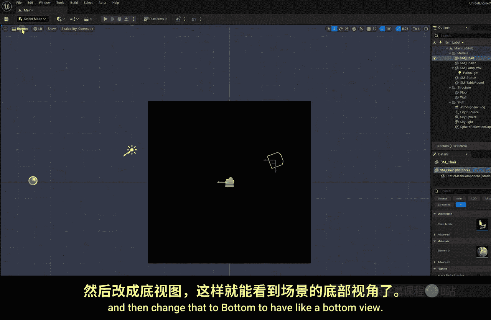
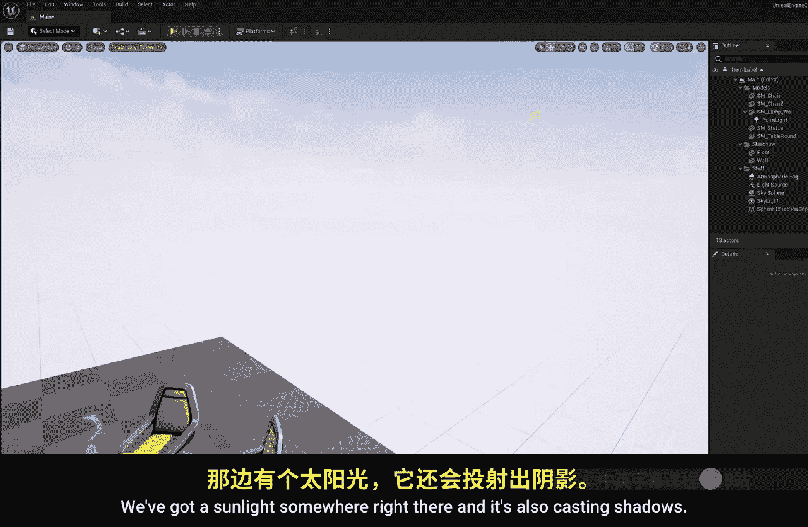

# 003：材料与灯光

在本节课中，我们将学习如何在虚幻引擎中创建基本几何体、应用材质、添加灯光以及组织场景。这些是构建任何3D场景的基础技能。

上一节我们介绍了如何导入和放置资产，本节中我们来看看如何从零开始创建物体并为其赋予外观。

## 创建墙体

首先，我们需要在场景中添加一堵墙。由于初学者内容包中没有现成的墙体，我们将使用基本几何体自行创建。

以下是创建墙体的步骤：
1.  点击编辑器右上角的“添加”按钮。
2.  从形状选项中选择“立方体”。
3.  将立方体拖入场景视口。
4.  使用**缩放工具**将立方体压扁并拉长，使其成为一面墙的形状。
5.  使用**移动工具**将其放置到合适的位置。

## 应用材质

现在墙体是纯白色的，我们需要为其添加纹理。在虚幻引擎中，我们使用“材质”来定义物体的表面外观。材质可以由一个或多个纹理组合而成，并包含各种物理属性。

以下是应用材质的步骤：
1.  打开“内容浏览器”。
2.  导航至“初学者内容包” > “材质”文件夹。
3.  找到“砖块”材质。
4.  将其拖放到场景中的墙体上。

## 添加灯光

接下来，我们为这面墙添加一个壁灯。灯光是营造场景氛围和真实感的关键。

以下是添加灯光的步骤：
1.  从“内容浏览器”的“道具”文件夹中，找到壁灯模型并拖入场景。
2.  使用移动和旋转工具，将壁灯对齐到墙面上。你可能需要暂时关闭吸附网格以进行微调。
3.  壁灯模型本身不会发光。点击“添加”按钮，选择“灯光”类别下的“点光源”。
4.  将点光源拖入场景，并放置到壁灯模型内部。
5.  选中点光源，在“细节”面板中可以调整其属性，例如：
    *   **光源颜色**：`LightColor = (R, G, B, A)`
    *   **强度**：`Intensity = 5000.0`

你可以尝试调整其他参数，如衰减半径，来改变灯光的效果。我们将在后续创建室内场景时更深入地探讨灯光设置。

## 组织场景

随着场景元素增多，保持整洁至关重要。我们可以使用大纲视图来管理所有对象。

以下是组织场景的步骤：
1.  在大纲视图中，选中桌子、椅子、雕像和墙体。
2.  右键点击并选择“分组” > “新建文件夹”。
3.  将文件夹命名为“模型”。
4.  将天空球、大气雾、天空光等系统组件放入另一个文件夹，可命名为“环境”。
5.  将地面和墙体重命名为有意义的名称（如“Floor”、“Wall”）。
6.  将点光源拖放到壁灯模型的层级下，使其成为壁灯的子物体。这样移动壁灯时，灯光会随之移动。

## 视图与性能

在构建场景时，切换不同的视图模式有助于精确放置物体。此外，根据电脑性能调整画质可以保证编辑流畅。

以下是相关操作：
*   **切换视图**：点击视口左上角的“透视”，可以切换到顶视图、前视图等正交视图，便于对齐。
*   **切换显示模式**：在视口顶部，可以将“光照”模式切换为“无光照”模式。无光照模式不计算光影，视图更简洁，编辑更流畅。
*   **调整画质**：如果编辑器运行不流畅，可以点击视口右下角的“可伸缩性”设置（默认为“电影级”），将其调整为“高”、“中”或“低”，以提升运行速度。

本节课中我们一起学习了创建几何体、应用材质、布置灯光以及管理场景层级的基础操作。你已经掌握了在虚幻引擎中搭建一个简单静态场景的核心工作流程。下一节课，我们将开始学习如何创建和塑造地形。