# 004：创建场景氛围 🌅

在本节课中，我们将学习如何在虚幻引擎中创建一个完整的、可自定义的户外场景氛围。这包括设置太阳、天空、大气、云层和雾效，并将它们打包成一个可重复使用的预设。

---

## 概述

引擎运行顺畅，这很好，因为我们将要进入更高级的内容。我们将创建一个地形场景。在此之前，我们需要先为场景建立一个基础氛围。这意味着我们需要设置户外自然光照系统，包括太阳、天空大气和天光。

---

## 创建新关卡

首先，我们需要创建一个新的关卡来专门构建我们的场景氛围。

以下是创建新关卡的步骤：
1.  打开内容浏览器。
2.  在内容区域右键点击，选择“关卡”。
3.  也可以点击左上角的“添加”按钮，然后选择“关卡”。
4.  将新关卡命名为 `Lesson4`，以对应我们正在学习的第四课。
5.  打开 `Lesson4` 关卡，系统会提示保存，请确认保存。

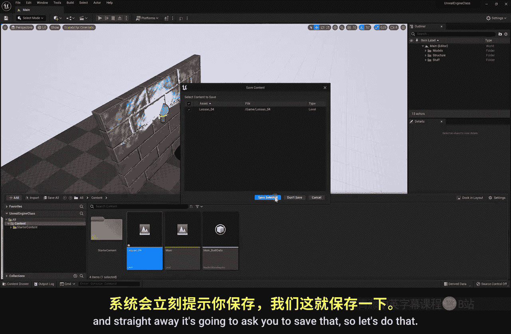

现在，我们有了一个完全空白的关卡。大纲视图里空无一物，视口也是一片漆黑。接下来，我们需要创建新的氛围。

---

## 构建基础光照系统

要创建一个自然的户外光照氛围，我们需要三个核心元素：定向光源（作为太阳）、天空大气和天光。

上一节我们创建了新的关卡，本节中我们来看看如何为它添加光照。

### 1. 添加定向光源（太阳）

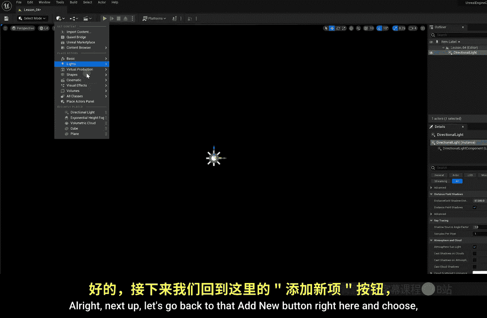

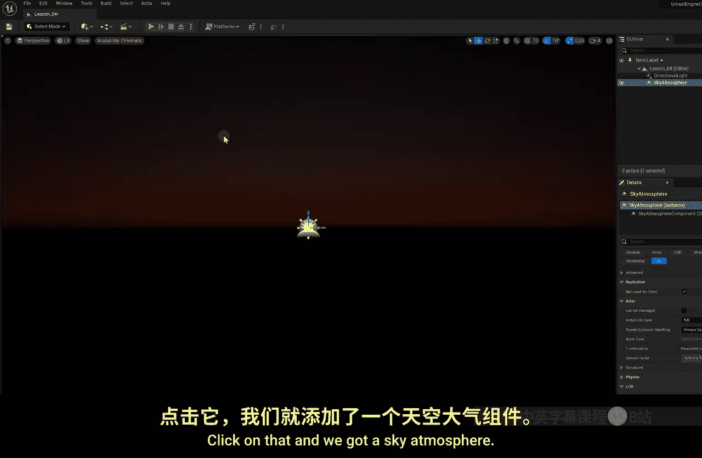

定向光源可以模拟太阳光的方向性照射。

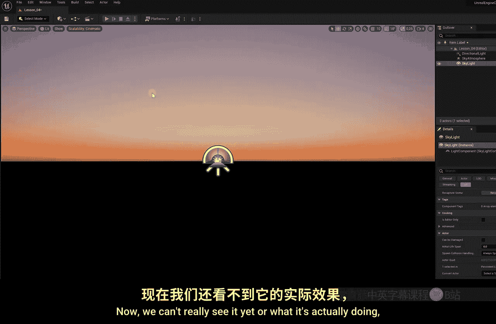

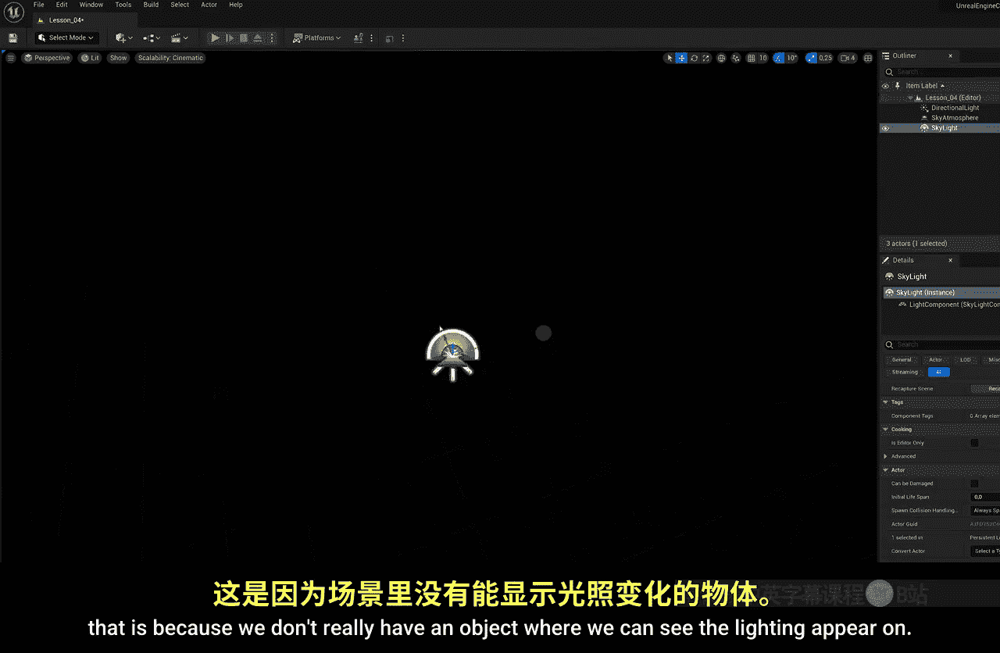

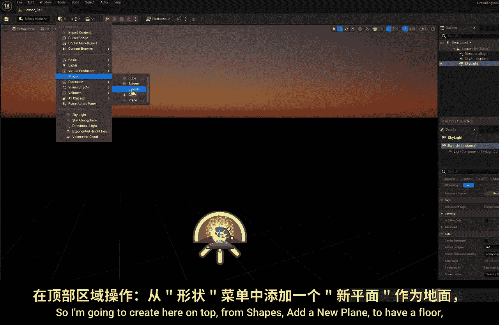

*   **操作**：点击“添加”按钮，选择“光源” -> “定向光源”。
*   **设置**：在选中光源的“细节”面板中，确保“大气太阳光”选项已启用（默认通常是启用的）。这个设置允许光源与大气系统互动。

### 2. 添加天空大气

天空大气组件负责模拟地球大气层的散射效果，创造出天空的颜色和光照。

*   **操作**：点击“添加”按钮，选择“视觉效果” -> “天空大气”。
*   **效果**：添加后，你会立刻看到场景中出现了类似“黄金时刻”的天空效果。

### 3. 添加天光

天光用于捕捉来自天空和大气的反射光照，照亮物体的阴影部分，使光照更自然。

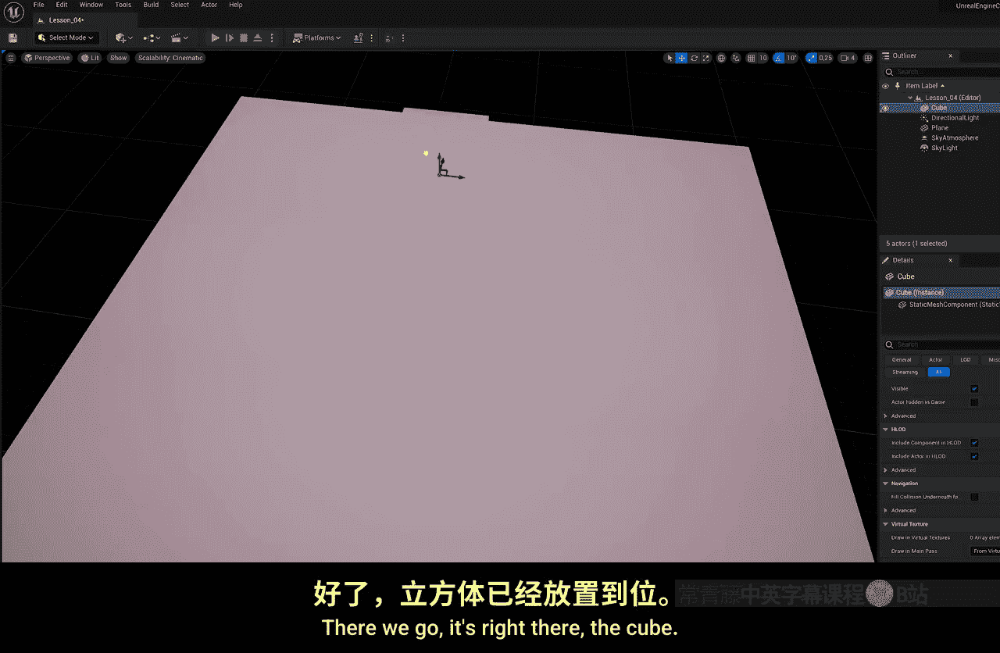

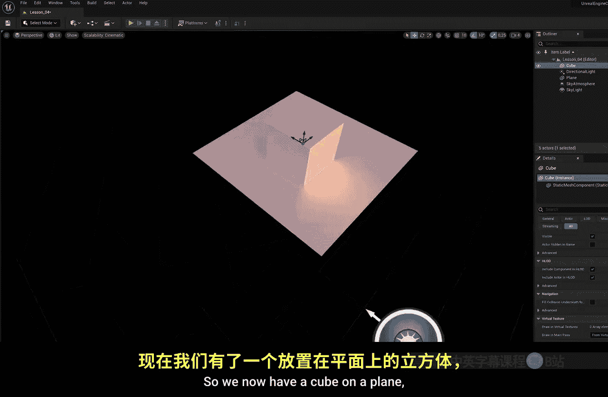

*   **操作**：点击“添加”按钮，选择“光源” -> “天光”。

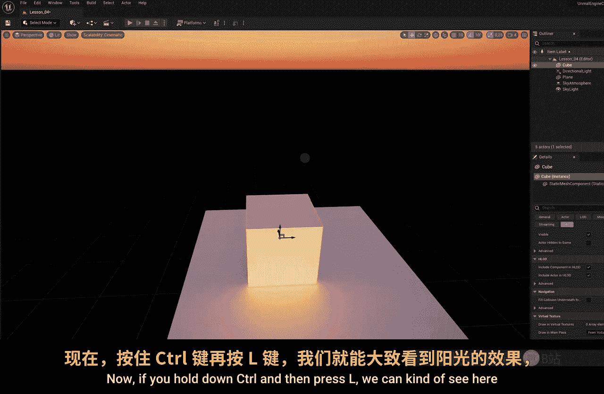

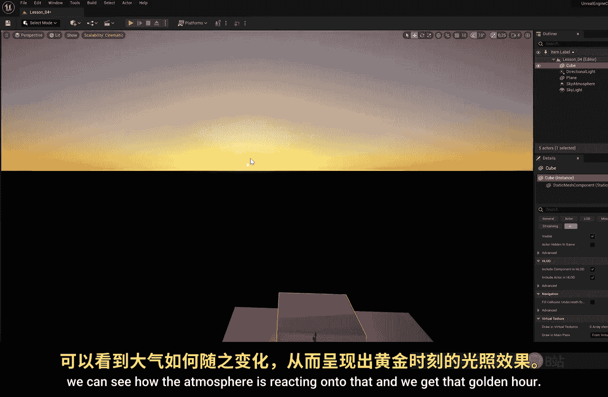

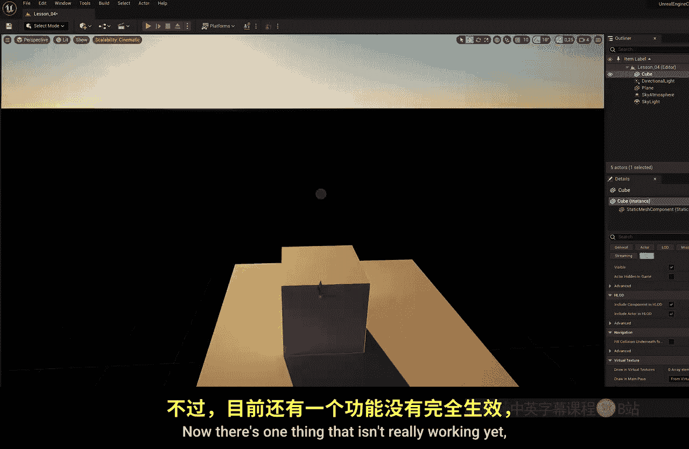

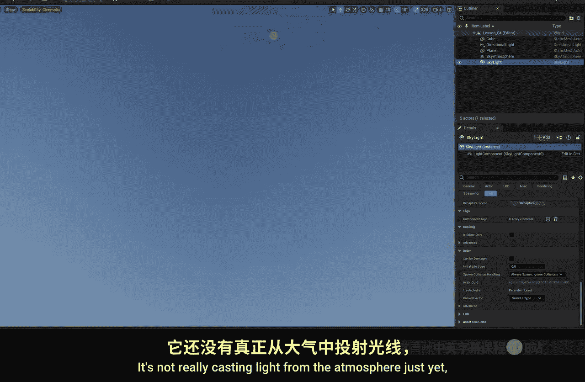

---

## 创建测试物体

目前我们还看不到天光的效果，因为场景中没有物体来接收和显示光照。

以下是创建测试物体的步骤：
1.  点击“添加”按钮，选择“形状” -> “平面”，创建一个地面。
2.  使用缩放工具（快捷键 **R**）将平面放大。
3.  再次点击“添加”按钮，选择“形状” -> “立方体”，创建一个立方体。
4.  使用移动工具（快捷键 **W**）将立方体放置在平面上方。

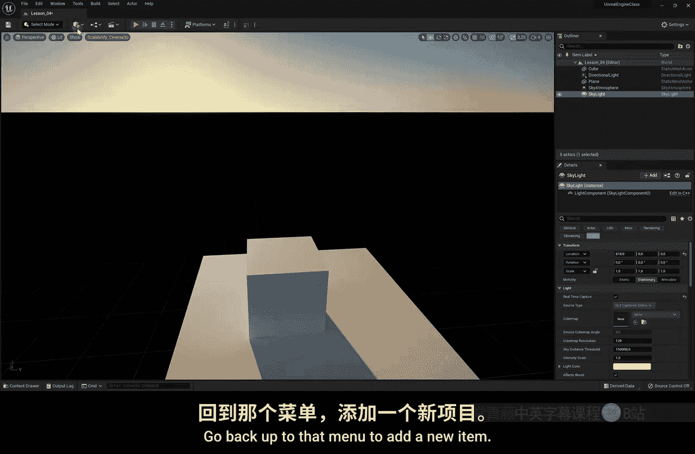

现在，场景中有了一个立方体和一个平面。按住 **Ctrl + L** 并移动鼠标，可以实时调整太阳（定向光源）的位置，观察阴影和大气光照的变化。

---

## 启用天光实时捕获

天光可能还没有开始工作，因为它需要设置为实时捕获天空状态。

*   **操作**：在大纲视图中选中“天光”，在“细节”面板中找到“实时捕获”选项并启用它。
*   **效果**：启用后，你会立刻看到物体的阴影部分被来自天空的反射光照亮，阴影不再死黑。

至此，基础的氛围已经搭建完成。但为了追求更高的真实感，我们还可以添加两个可选但强烈推荐的元素。

---

## 添加增强元素（可选但推荐）

基础氛围看起来不错，但我们可以通过添加云和雾来大幅提升场景的真实感和深度。

### 1. 添加体积云

体积云可以为天空添加动态的、具有体积感的云层。

*   **操作**：点击“添加”按钮，选择“视觉效果” -> “体积云”。

### 2. 添加指数高度雾

指数高度雾可以根据高度模拟自然的雾效，增加场景的层次感和空气透视感。

*   **操作**：点击“添加”按钮，选择“视觉效果” -> “指数高度雾”。
*   **重要设置**：选中雾效组件，在“细节”面板中启用“体积雾”选项。这会使雾与太阳光产生更真实的体积交互。

---

## 整理场景大纲

现在我们的场景中有多个组件。为了保持整洁，可以将它们组织到一个文件夹中。

*   **操作**：在大纲视图中，按住 **Ctrl** 键并点击选中所有氛围相关的组件（定向光源、天空大气、天光、体积云、指数高度雾）。然后点击文件夹图标（或右键选择“分组到文件夹中”），创建一个名为“Atmosphere”的文件夹。

---

## 自定义氛围参数

目前场景模拟的是地球的常态，但我们可以通过调整参数来创造独特的世界。

### 调整天空大气

天空大气组件提供了丰富的参数来改变大气的物理属性。

以下是可调整的主要参数及其效果：
*   **米氏散射**：控制大气中粒子对光的散射程度，影响天空的亮度和颜色。
*   **大气高度**：改变大气层的虚拟高度，影响光照的衰减和天空的渐变。
*   **地面半径**：模拟星球的曲率半径。减小这个值会让你感觉站在一个更小的星球上，地平线会更近。
*   **吸收比例**：控制大气粒子对光的吸收量，可以改变大气的整体色调和密度。

### 调整指数高度雾

雾效参数可以极大地改变场景的情绪和能见度。

以下是可调整的主要参数：
*   **雾密度**：控制雾的浓淡。
*   **雾高度衰减**：控制雾随高度增加而变淡的速度。
*   **雾不透明度**：控制雾的整体透明度。
*   **雾颜色**：改变雾的颜色，可以创造寒冷、温暖或异域的感觉。

### 调整体积云

云层参数允许你控制云的外观和位置。

*   **云层高度**：可以调整云层距离地面的高低。

**动手实践建议**：在进入下一课之前，请花时间调整天空大气、雾和云的各项设置，尝试创造出酷炫的异星景观或独特的艺术风格。

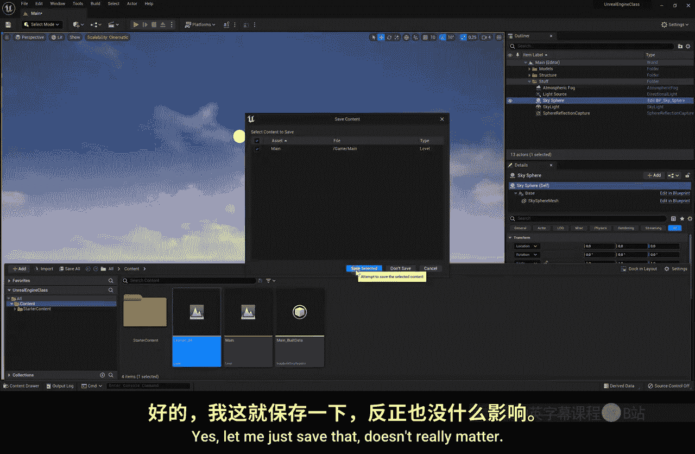

---

## 创建可重复使用的氛围预设

我们已经为这个关卡投入了大量工作。如果每次创建新关卡都要重复这些步骤，会非常耗时。因此，我们需要创建一个预设。

你可能会问：虚幻引擎的默认空白项目里不是已经有天空和光照了吗？为什么还要自己创建？这是因为默认场景的光照是由一个蓝图控制的，它自动化了许多功能，但也限制了我们的一些自定义控制（比如自由移动太阳）。为了获得完全的控制权和可移植性，创建自己的预设是更好的选择。

### 什么是蓝图？

蓝图是虚幻引擎中的可视化脚本系统。它允许开发者通过连接节点来创建游戏逻辑和功能，而无需编写传统代码。对于我们现在来说，可以简单地将蓝图理解为一个能包含多个组件的“容器”或“预制件”。

### 创建自定义氛围蓝图

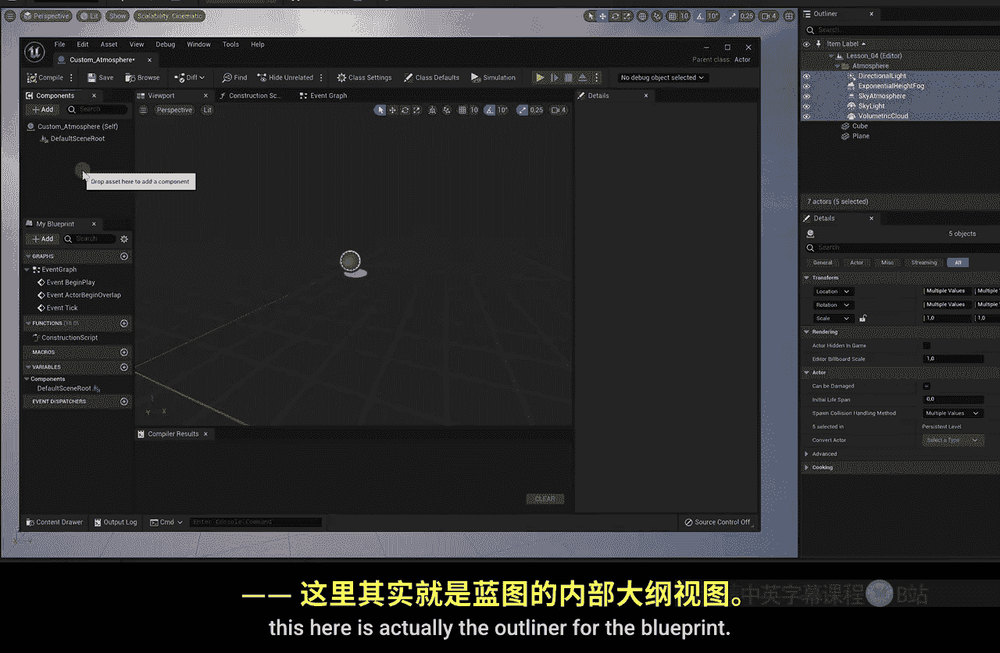

我们将把所有氛围组件打包到一个蓝图演员中。

以下是创建蓝图的步骤：
1.  在内容浏览器中右键点击，选择“蓝图类”。
2.  在弹出窗口中，选择“Actor”作为父类，然后点击“选择”。
3.  将新蓝图命名为 `BP_CustomAtmosphere` 并双击打开它。
4.  蓝图编辑器会打开。保持这个窗口打开，回到主编辑器窗口。
5.  在大纲视图中，选中“Atmosphere”文件夹（或其中所有组件），按 **Ctrl + C** 复制。
6.  切换回蓝图编辑器窗口。在左侧的“组件”面板中点击，然后按 **Ctrl + V** 粘贴。所有氛围组件现在都成为了这个蓝图的一部分。
7.  点击蓝图编辑器顶部的“编译”按钮，然后点击“保存”。

### 使用蓝图预设

现在，我们可以在场景中删除原来的那些分散的组件，转而使用我们刚刚创建的蓝图。

1.  关闭蓝图编辑器。
2.  在主编辑器的大纲视图中，删除原来的“Atmosphere”文件夹及其所有内容。
3.  从内容浏览器中，将 `BP_CustomAtmosphere` 蓝图资产拖拽到视口中。
4.  蓝图实例被放置到场景中，所有的氛围效果立刻恢复。你仍然可以按住 **Ctrl + L** 来移动太阳。

### 蓝图的优势与移植

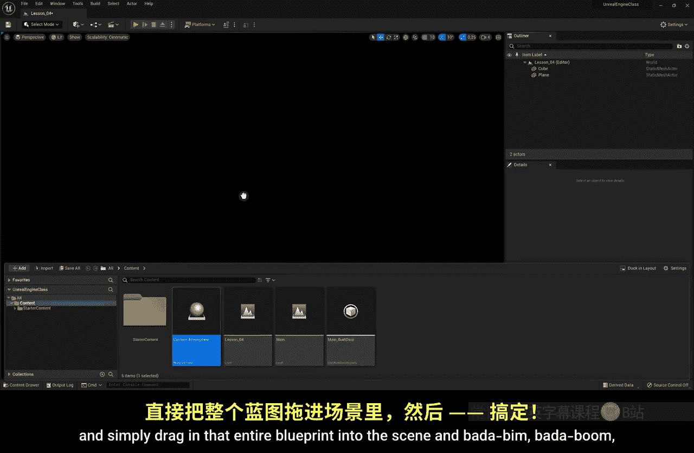

选中场景中的这个蓝图实例，你可以在“细节”面板中展开其组件列表，并单独修改每个组件（如天空大气、雾）的参数。

最大的好处在于可移植性。这个 `BP_CustomAtmosphere.uasset` 文件保存在你的项目 `Content` 文件夹下。未来创建新项目时，你只需将这个文件复制到新项目的 `Content` 文件夹中，就可以在新项目中直接使用这个完整的自定义氛围预设了。

---

## 总结

本节课中我们一起学习了如何在虚幻引擎中从零开始构建一个完整的户外场景氛围。我们逐步添加了**定向光源**、**天空大气**、**天光**、**体积云**和**指数高度雾**，并了解了如何调整它们的参数来创造不同的视觉风格。最后，我们通过**蓝图**系统将所有组件打包成一个可重复使用的预设 `BP_CustomAtmosphere`，极大地提高了工作效率和资产的可移植性。在下一课中，我们将利用这个创建好的氛围，开始构建真正的地形景观。