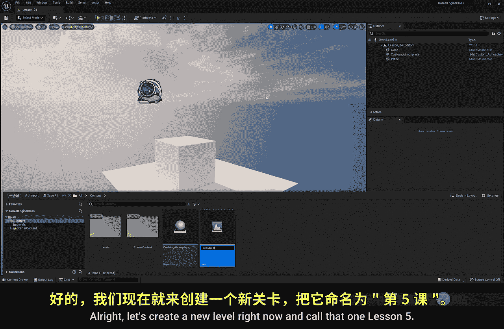
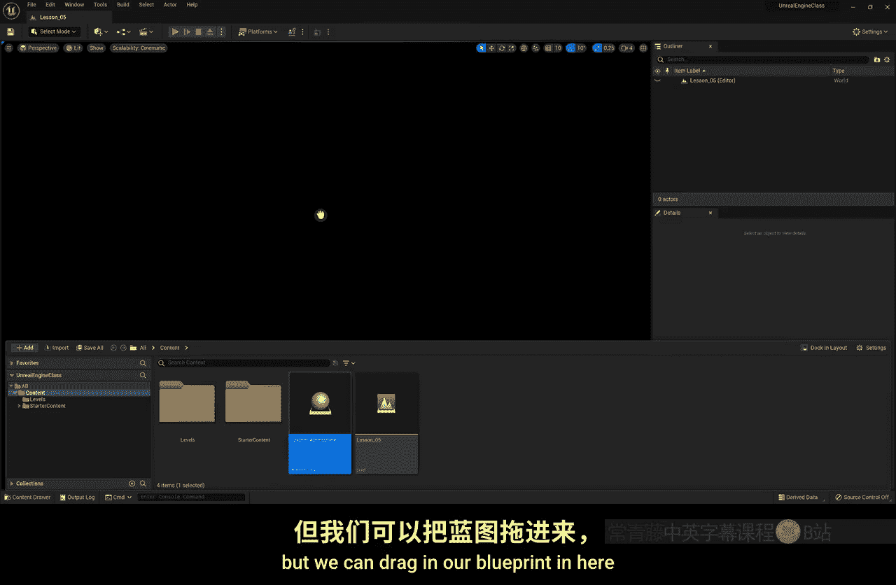
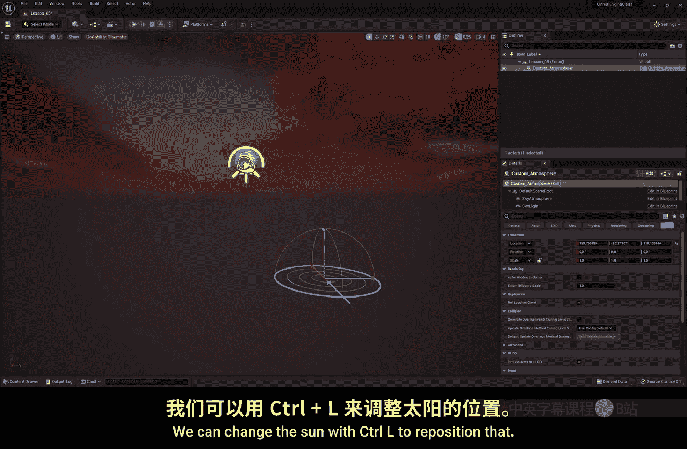
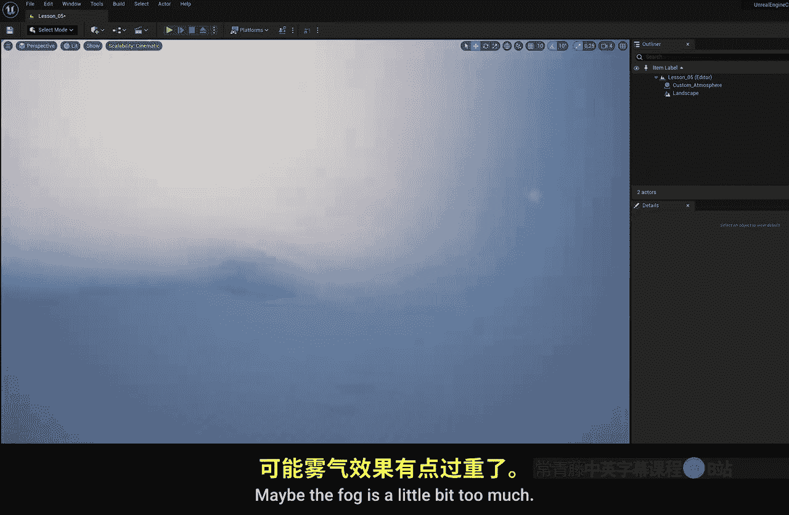

# 005：创建景观 🏔️

在本节课中，我们将学习如何在虚幻引擎中创建和塑造景观。我们将从创建一个空白的平坦地形开始，学习使用雕刻工具手动塑造山脉与山谷，并了解如何通过导入高度图来快速生成复杂且逼真的地形。最后，我们会为景观应用材质，使其看起来像草地或岩石。

## 整理项目文件

在开始创建景观之前，我们先整理一下项目文件。这有助于保持工作区的整洁和有序。

以下是整理步骤：

1.  在内容浏览器中右键点击，选择“新建文件夹”。
2.  将新文件夹命名为“Levels”。
3.  将之前创建的所有关卡文件拖入这个新文件夹中。
4.  当系统询问时，选择“移动”文件。

完成这些操作后，你会发现项目文件夹中的内容与虚幻引擎编辑器内的结构是同步的。

## 创建新关卡与景观

现在，让我们创建一个专门用于学习景观的新关卡。

1.  在内容浏览器中，右键点击并选择“新建关卡”。
2.  将新关卡命名为“Lesson5”并打开它。
3.  这是一个空关卡，我们可以将之前创建的“蓝图”拖入场景，以恢复大气和阳光效果。
4.  按 `Ctrl + L` 可以重新定位太阳光源。

要创建景观，我们需要切换到景观模式。

1.  点击编辑器顶部模式下拉菜单（默认是“选择”模式）。
2.  从列表中选择“景观”模式。
3.  切换后，界面左侧会出现新的面板，视口中也会显示一个代表景观大小的网格。

## 手动雕刻景观

在景观模式的面板中，我们可以设置地形的大小，然后开始手动雕刻。

1.  在左侧面板中，选择你想要的景观尺寸。尺寸越大，场景性能负担越重。你可以随时在编辑器顶部调整“可伸缩性”设置以适应电脑性能。
2.  点击“创建”按钮，生成一个平坦的地形。
3.  此时地形没有材质，显示为灰色网格。

接下来，使用顶部的雕刻工具来塑造地形。

*   **地形塑造工具**：默认选中的工具。点击并拖拽可以隆起形成山丘；按住 `Shift` 键点击并拖拽则可以凹陷形成坑洞。
*   **笔刷大小与强度**：在工具下方可以调整笔刷的“大小”和“强度”。强度越高，地形变化越快。
*   **平滑工具**：用于柔化尖锐的山脊和边缘，使地形看起来更自然。
*   **侵蚀与水力侵蚀工具**：模拟自然侵蚀效果，为山脉增加更真实的细节。
*   **斜坡工具**：可以快速创建斜坡。点击设定起点，拖拽设定终点和高度，然后点击“创建斜坡”即可。

通过组合使用这些工具，你可以创造出具有层次感和深度的山地景观。通常，将远景的山塑造得更高大，近景的山塑造得较矮小，可以增强距离感。

## 导入高度图创建景观

手动雕刻需要一定的艺术技巧。更常用的方法是使用“高度图”。高度图是一种图像文件，用黑白灰的亮度信息来表示地形的高低（黑色为低处，白色为高处）。

以下是导入高度图的步骤：

1.  首先，切换回“选择”模式，选中并删除刚才手动创建的景观。
2.  再次切换到“景观”模式。
3.  在内容浏览器中，将准备好的高度图文件（通常是PNG格式）拖入项目文件夹（例如新建的“Assets”文件夹）。
4.  在景观模式的左侧面板中，选择“从文件导入”。
5.  点击“...”按钮，找到并选择你刚导入的高度图文件。
6.  虚幻引擎会自动根据图像生成地形，点击“导入”即可。

导入后，你会立即获得一个细节丰富、造型逼真的山地景观。你可以调整场景中的“指数高度雾”组件，降低雾的密度，以便更清晰地观察山脉。

## 为景观应用材质

创建好地形后，我们需要为其添加表面材质，比如草地或岩石。

为景观应用材质的方法与普通模型略有不同：

1.  在“大纲视图”或场景中选中你的景观。
2.  在右侧的“细节”面板中，找到“景观材质”属性。
3.  点击下拉菜单，可以从项目已有的材质库中选择一个（例如Starter Content中的“M_Grass”材质）。
4.  或者，你也可以直接从内容浏览器中将材质球拖拽到“细节”面板的“景观材质”属性栏上。

应用材质后，你的景观就会呈现出草地、沙石等不同的表面效果。使用相同的方法，你也可以为场景中的其他模型（如球体、立方体）更换材质。

本节课中，我们一起学习了在虚幻引擎中创建景观的完整流程：从整理项目、创建基础地形，到使用工具手动雕刻或导入高度图快速生成复杂地形，最后为地形赋予合适的材质。掌握这些基础操作后，你就可以开始构建属于自己的游戏世界了。在下一课，我们将学习如何为景观添加植物和 foliage（植被），让它变得更加生动。