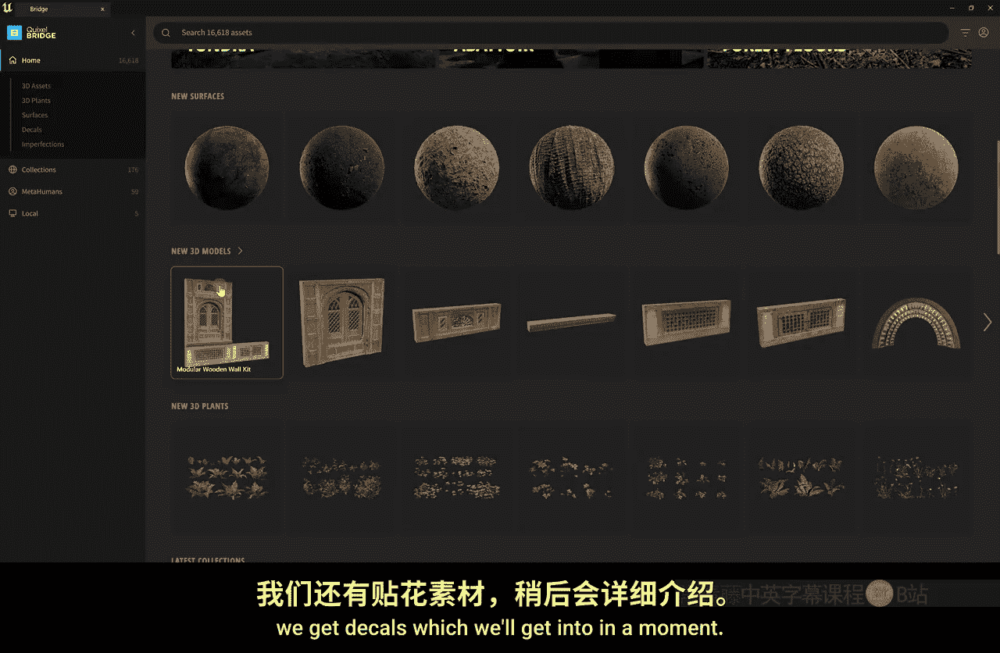
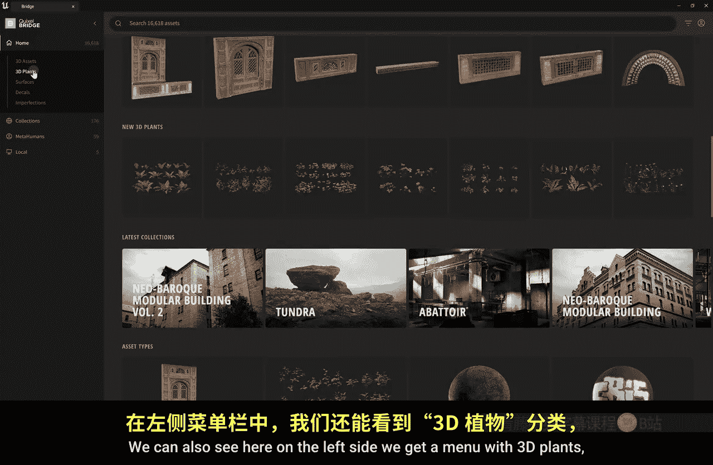
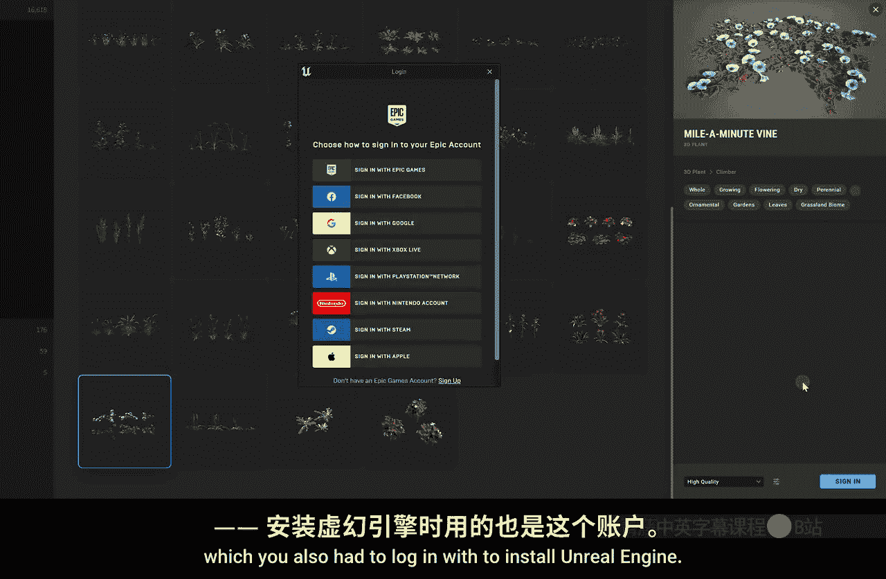
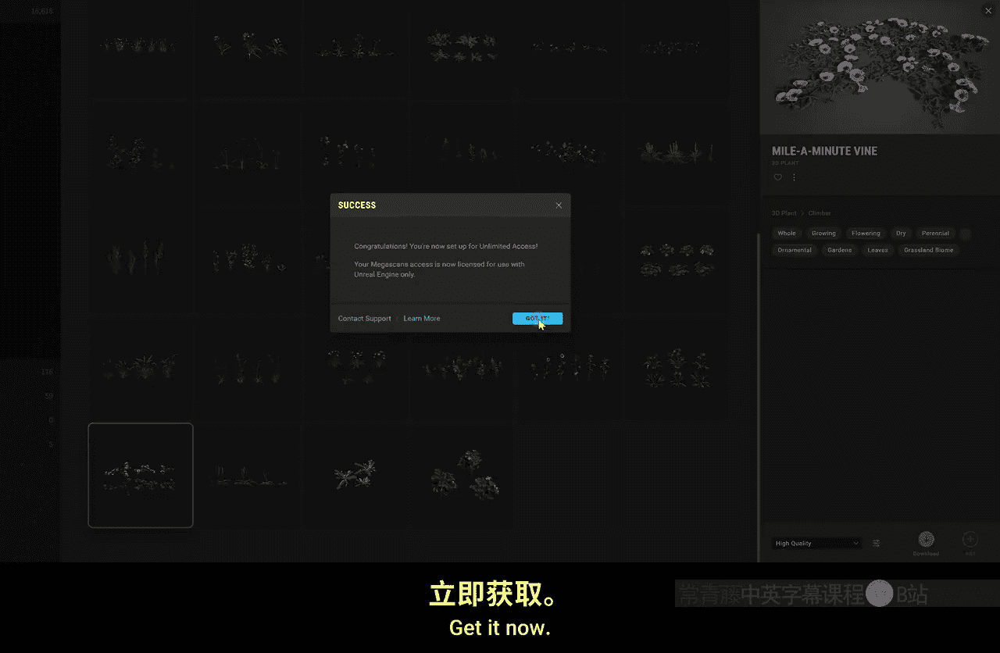
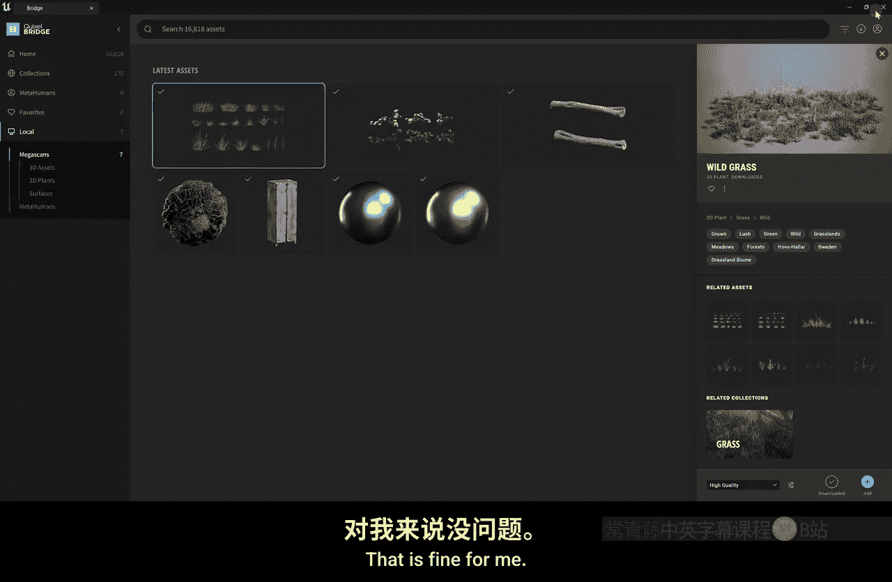

# 006：植物与花朵 🌿🌸

在本节课中，我们将学习如何为之前创建的地形添加植物和花朵等植被，使场景变得更加生动和真实。我们将从获取资源开始，逐步完成植被的绘制、调整以及添加风效。

## 概述

上一节我们完成了地形的塑造。本节中，我们来看看如何为这片地形增添生机，通过绘制植被来丰富场景细节。整个过程包括启用植被工具、从外部库获取免费植物资源、将资源导入项目、使用绘制工具放置植被，以及最后为植物添加动态风效。

## 启用植被绘制模式

在开始绘制之前，首先需要确保引擎的植被绘制功能已启用。在虚幻引擎界面左上角找到“模式”选择面板，点击并选择“植被”模式。选择后，界面左侧会出现一个新的植被绘制工具面板。

## 从Quixel Bridge获取植物资源

植被资源并不包含在引擎的初学者内容包中。因此，我们需要从外部获取。虚幻引擎与Quixel合作，内置了一个名为“Quixel Bridge”的免费资源库。

以下是获取资源的步骤：
1.  点击界面左上角的“添加”按钮，在下拉菜单中选择“Quixel内容”。
2.  这将打开Quixel Bridge窗口，这是一个免费的素材市场。
3.  在左侧菜单中找到“3D植物”分类，浏览并选择你喜欢的植物。例如，我们可以选择一些花朵和草。
4.  点击选中的植物，在右侧详情面板中选择高质量版本，并使用你的Epic账户登录以下载。
5.  下载完成后，点击“添加到项目”按钮，资源便会导入到你的虚幻引擎项目中。

导入的资源会出现在内容浏览器的“Megascans 3D Plants”文件夹中。

## 绘制植被到地形

资源准备就绪后，就可以开始绘制了。

1.  确保你处于“植被”绘制模式，左侧面板会列出所有已导入的植物资源。
2.  你可以按住 `Ctrl + A` 全选所有植物，或者单独勾选你想要绘制的种类。
3.  使用画笔在地形上点击并拖动，植被便会自动混合并随机分布到画笔经过的区域。
4.  你可以调整画笔大小，以适应大面积填充或精细绘制。

如果你只想放置单一类型的植物，例如特定的一种花，你需要先取消勾选其他所有植物，只保留目标植物被选中，然后进行绘制。

## 调整植被属性

在植被绘制面板底部，可以找到更多控制选项，例如缩放。

*   **缩放随机化**：通过设置“最小缩放”和“最大缩放”值（例如0.5和2.0），可以让绘制的植物在尺寸上产生随机变化，增加自然感。

如果绘制了错误的植被，可以使用“擦除”工具进行清除，其使用方式与绘制工具相同。

## 为植物添加风效

静态的植物看起来不够生动。在现实世界中，植物会随风摆动。我们可以为植物材质启用风效。

以下是添加风效的步骤：
1.  在内容浏览器中，找到你导入的植物资源。每种植物通常包含两个材质：一个用于近景高清显示，另一个用于远景（称为“广告牌”材质）。
2.  双击打开近景材质实例。
3.  在右侧的材质属性中，找到“风”的设置区域，勾选“启用风”选项。
4.  你可以进一步调整风的强度、速度等参数。
5.  关闭窗口，对同种植物的“广告牌”材质实例进行相同的操作（启用风）。
6.  为你导入的每一种植物材质重复此过程。

完成以上步骤后，场景中的植物就会随风轻轻摆动，看起来更加鲜活和真实。

## 总结

本节课中我们一起学习了如何为虚幻引擎中的地形添加植被。我们从启用植被工具开始，通过Quixel Bridge免费获取了高质量的植物模型，并将它们导入项目。接着，我们使用植被绘制工具将植物随机分布到地形上，并学会了调整大小和擦除错误。最后，我们通过启用植物材质的风效设置，为整个场景增添了动态的生命力。现在，你的地形已经从一个简单的模型变成了一个充满生机的自然环境。下一节课，我们将探讨如何向场景中添加更多的3D模型。