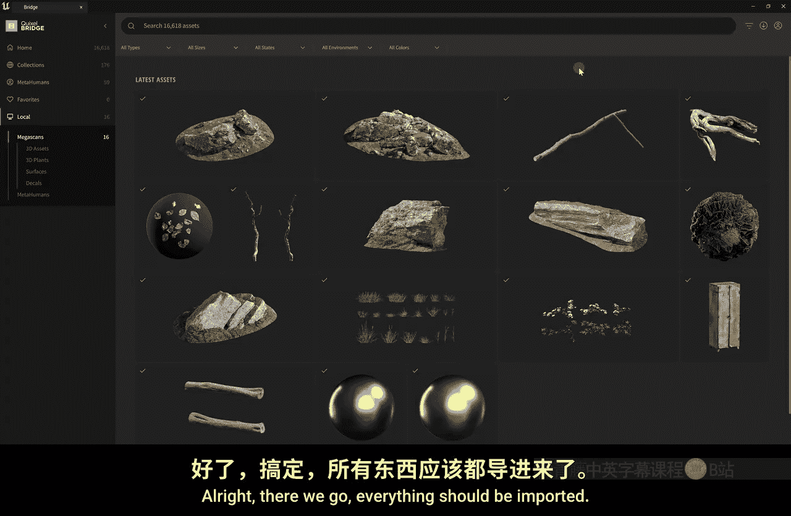
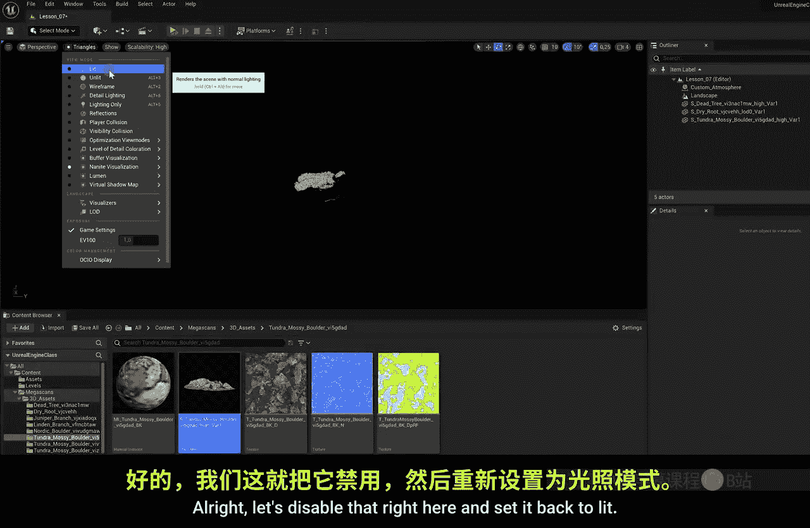
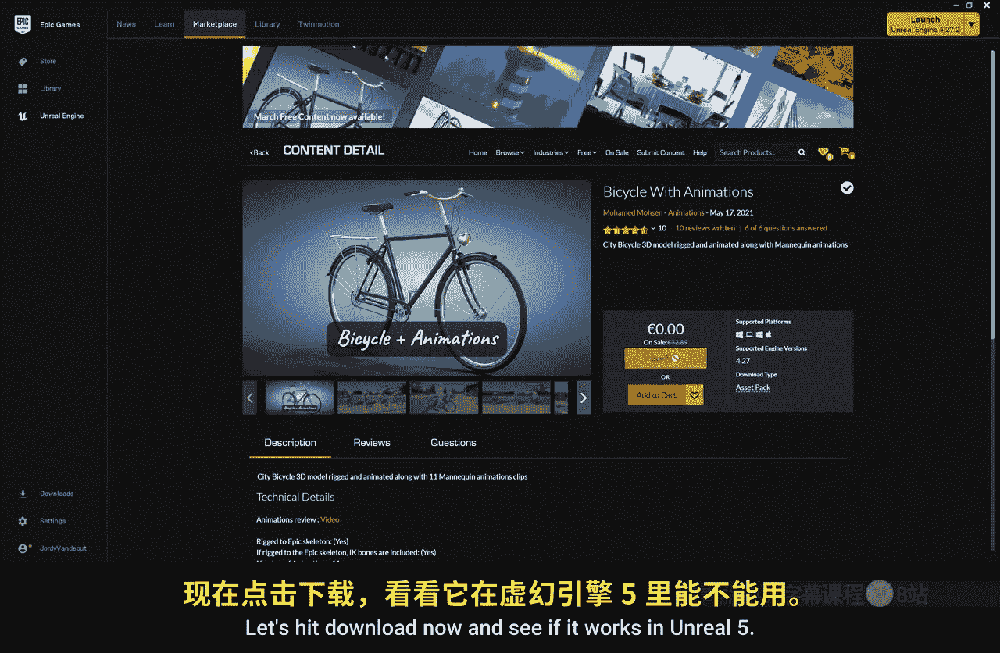
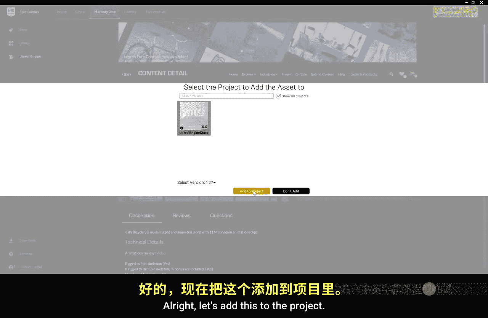
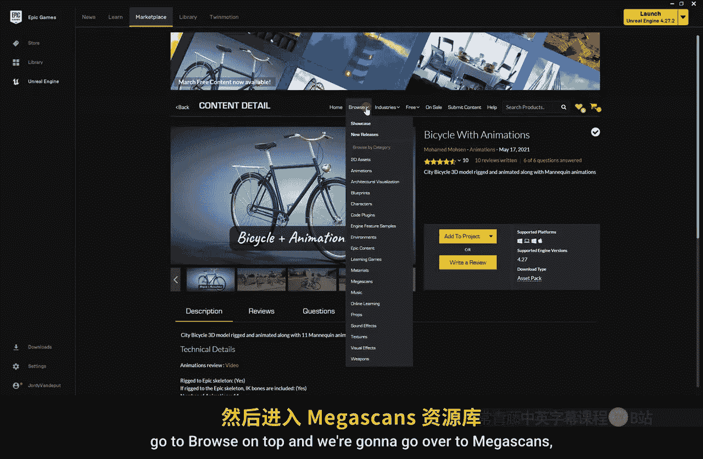
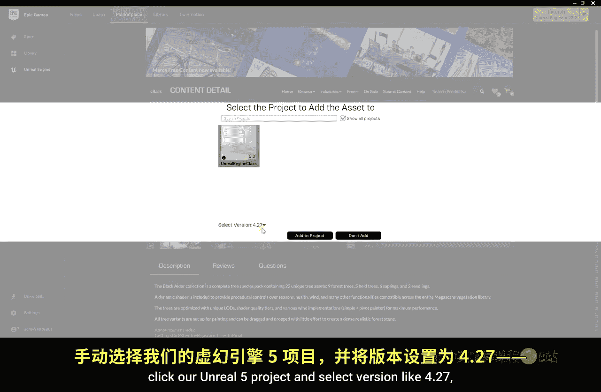

# 007：导入3D模型 🎮

在本节课中，我们将学习如何在虚幻引擎中导入和使用3D模型。我们将从Quixel Bridge获取免费的高质量资产，了解Nanite技术，并学习如何从市场导入模型，从而为你的场景增添细节和真实感。

---

## 从Quixel Bridge导入模型

上一节我们介绍了如何创建基础地形，本节中我们来看看如何用3D模型来装饰它。虚幻引擎本身并非3D建模软件，因此我们需要从外部获取模型。Quixel Bridge是一个内置的庞大免费资源库。

首先，回到“添加”菜单，点击“Quixel内容”以打开Quixel Bridge。在左侧菜单中，你可以找到各种资产类别。对于我们的景观示例，我们点击“自然”类别。

以下是寻找和下载模型的步骤：
1.  浏览并选择一个你喜欢的模型，例如一块岩石。
2.  在右侧详情面板中，将质量设置为“**Nanite**”。这是虚幻引擎5的一项革命性功能，它能根据观察距离动态调整模型细节，在保证最高视觉质量的同时优化性能。
3.  点击“下载”按钮。选择Nanite后，后续模型会默认使用此设置，你可以直接点击缩略图上的“快速下载”按钮。
4.  重复此过程，下载一些岩石、树枝等模型来丰富场景。

下载完成后，点击左侧的“本地”选项卡，这里会显示所有已下载到电脑的资产。将鼠标悬停在模型上，点击“导出到项目”按钮，即可将其导入当前工程。

---

## 理解模型结构与Nanite技术

所有模型导入后，都会整理在“Megascans”文件夹内。打开一个模型文件夹，你会看到它包含多个文件：
*   **静态网格体**：这是3D模型本身。
*   **材质实例**：这是应用到模型上的表面效果。
*   **纹理**（如法线贴图、基础颜色贴图）：这些图像在材质中被混合，共同决定模型的最终外观。

将模型拖入场景后，你可以在“细节”面板中看到其应用的材质。

现在，让我们看看Nanite的实际效果。在视口上方的模式工具栏中，将“光照”视图模式切换为“**Nanite可视化** -> **三角形**”。启用此模式后，支持Nanite的模型会显示出许多三角形。当你远离模型时，这些三角形会变大，这意味着模型细节在动态降低，但肉眼难以察觉，从而实现了性能与画质的完美平衡。

完成后，记得将视图模式切换回“光照”。

---

## 使用贴花添加细节

除了3D模型，Quixel Bridge还提供“贴花”。贴花是2D材质，可以投影到其他物体表面，用于添加污渍、落叶、弹孔等细节。

在“Megascans”文件夹中找到“贴花”类别，将其中的材质（例如落叶）直接拖入场景。你会看到一个带绿色箭头的方框，箭头方向代表投影方向。你可以移动、旋转和缩放这个方框来控制贴花的位置和大小。

有时，你可能不希望贴花出现在某些物体上（例如落叶不应包裹住树枝）。此时，只需选中该物体（如树枝），在“细节”面板中搜索“**接收贴花**”选项，并将其禁用即可。

---

## 从外部源与市场导入模型

如果你想使用自己制作或从其他网站下载的模型，可以直接将模型文件（如`.fbx`）拖入内容浏览器。导入时可能会遇到问题，例如模型缺少材质或纹理，这需要你手动创建材质并关联纹理，这对初学者可能有些复杂。

更可靠的方法是使用虚幻引擎市场。打开Epic Games启动器，进入“市场”板块。这里有大量为虚幻引擎特制的模型、蓝图等资源，许多是免费的。虽然大部分资产是为虚幻引擎4制作的，但绝大多数都能在虚幻引擎5中完美运行。

下载市场资产后，可以将其添加到项目中，它会自动导入并组织好所有材质和纹理，开箱即用。这是一个为项目寻找高质量资源的绝佳途径。

---

## 为场景添加植被与树木

树木是场景的关键。你可以在市场中搜索“Megascans Trees”等免费资源包。导入后，你可以在内容浏览器中找到树木模型，并将其拖入场景。

这些高级树木模型通常自带丰富的控制选项。例如，选中树木，双击其树叶材质，在材质编辑器中，你可能会找到“**季节**”控制参数。启用“冬季”选项，树叶会消失，模拟出冬天的效果，这大大增强了场景的动态性和真实感。

通过组合使用岩石、树木、贴花等元素，你可以快速构建出一个生动、逼真的自然环境。

---

本节课中我们一起学习了在虚幻引擎中获取和导入3D模型的核心方法：利用Quixel Bridge获取免费Nanite资产、理解模型构成、使用贴花增添细节，以及通过市场导入优化好的模型。掌握这些技能，你就能有效地用各种资产填充和美化你的虚拟世界。下一节，我们将学习如何布局这些元素，打造一个视觉上引人入胜的景观。