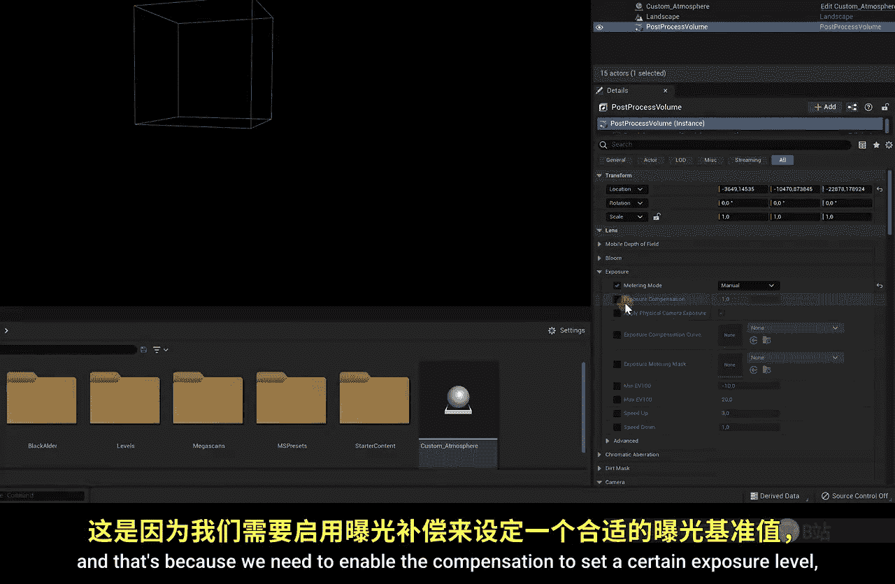

# 009：后期处理 🎨

在本节课中，我们将学习如何通过后期处理为你的场景赋予独特的视觉效果。我们将从调整大气元素开始，然后深入探索后期处理体积的强大功能，最终让你的场景从“真实”变得“惊艳”。

## 概述：什么是后期处理？

上一节我们学习了如何构建地形和放置资产。本节中，我们来看看如何通过后期处理来定义场景的整体“观感”。后期处理是一个广义概念，它涵盖了在场景渲染完成后，用于调整和增强最终图像的所有技术。这包括调整大气、光线以及应用全局色彩效果。

## 调整大气元素 🌤️

我们已经创建了包含天空、云朵和雾气的户外场景。这些大气元素本身就是一种强大的后期处理工具。以下是构成我们场景大气的主要蓝图元素：

*   **Sky Atmosphere**：模拟真实的大气散射。
*   **Skylight**：捕捉从大气反弹回来的环境光。
*   **Volumetric Clouds**：体积云，构成天空中的云层。
*   **Exponential Height Fog**：指数高度雾，为场景添加深度和氛围。
*   **Directional Light**：定向光，即我们的太阳光。

在这些元素中，**指数高度雾**对场景观感的影响尤为显著，值得我们重点关注。

### 启用体积雾

体积雾能让雾效从2D平面变为真实的3D体积，使阳光能与雾粒子产生交互，创造出更逼真的光线效果。以下是启用步骤：

1.  在场景中选择 **Exponential Height Fog** 组件。
2.  在细节面板中，找到 **Fog** 分类。
3.  勾选 **Volumetric Fog** 选项。

启用后，你会立刻看到阳光开始与雾气相互作用，形成体积光效果。

### 调整雾效参数

启用体积雾后，我们可以通过一系列参数来精细控制雾的外观：

*   **Density（密度）**：控制雾的浓淡程度。公式可简化为：`最终雾浓度 = 基础密度 * 高度衰减`。
*   **Scattering（散射）**：调整雾粒子对光线的散射强度。这不会改变雾的浓度，但会极大地改变光在雾中的“感觉”。
*   **Fog Color（雾颜色）**：为雾气着色。例如，可以设置为绿色模拟毒气，或蓝色模拟清冷空气。
*   **View Distance（能见距离）**：控制视线能穿透雾气的距离。
*   **Directional Inscattering（方向性内散射）**：这是阳光接触雾气的“第一印象”。你可以调整其颜色和强度来创造特殊效果，例如金色的晨曦或诡异的彩霞。

```cpp
// 示例：在蓝图中调整雾参数（概念代码）
ExponentialHeightFogComponent->SetFogDensity(0.05);
ExponentialHeightFogComponent->SetVolumetricFog(true);
ExponentialHeightFogComponent->SetDirectionalInscatteringColor(FLinearColor::Red);
```

## 创造上帝之光 ✨

另一个能瞬间提升场景氛围的效果是“上帝之光”（Light Shafts 或 God Rays）。这通常通过调整阳光（Directional Light）来实现。

1.  在场景中选择 **Directional Light**（太阳光）。
2.  在细节面板中，找到 **Light Shafts** 分类下的 **Bloom** 选项。
3.  勾选 **Light Shaft Bloom** 并调整其强度。

> **注意**：当相机直接看向太阳时，光线可能会出现闪烁。最佳实践是将太阳置于物体（如树木、山峦）后方，让光线从缝隙中透出，这样能产生最自然、最漂亮的上帝之光效果。这个技巧在我们后续创建室内场景（阳光透过窗户）时也会用到。

## 使用后期处理体积 🧊

除了调整场景中的现有元素，我们还可以添加一个专门的 **后期处理体积（Post Process Volume）** 来应用全局的屏幕空间效果。

### 创建与全局应用

1.  在放置面板中，进入 **视觉效果（Visual Effects）** -> **后期处理体积（Post Process Volume）**，将其拖入场景。
2.  默认情况下，效果只作用于体积框内部。若要应用于整个场景，需在体积的细节面板中：
    *   找到 **Post Process Volume Settings**。
    *   勾选 **Infinite Extent（无限范围）**。

### 核心效果详解



以下是后期处理体积中一些常用且效果显著的功能：

**1. 泛光（Bloom）**
模拟高光区域光线溢出的效果，让发光物体看起来更真实。调整 `Intensity` 控制强度。

**2. 曝光（Exposure）**
控制场景整体亮度。
*   **自动曝光（Auto Exposure）**：相机会根据画面内容自动调整亮度，模拟人眼适应过程。
*   **手动曝光（Manual Exposure）**：固定亮度值，适合需要严格控光的场景。

**3. 色差（Chromatic Aberration）**
模拟相机镜头边缘出现的色彩分离现象，轻微使用可以增加真实感。

**4. 色彩分级（Color Grading）**
这是调色的核心区域，可以全局性地改变场景色彩风格。
*   **白平衡（White Balance）**：调整画面色温（偏蓝或偏黄）。
*   **饱和度（Saturation）**：增加或减少色彩鲜艳度。
*   **对比度（Contrast）**：调整明暗对比。
*   **全局/阴影/中间调/高光（Global/Shadows/Midtones/Highlights）**：可以分别对不同亮度区域进行独立的色彩调整。

**5. 胶片颗粒（Film Grain）**
添加微妙的胶片颗粒纹理，能为数字渲染的图像增加一些有机感和电影质感。

```cpp
// 示例：在后期处理体积中设置色彩分级（概念代码）
PostProcessSettings->ColorGradingGlobal.Saturation = 1.5; // 提高饱和度
PostProcessSettings->FilmGrainIntensity = 0.2; // 添加轻微胶片颗粒
```

## 总结与展望 🚀

本节课中，我们一起学习了虚幻引擎后期处理的核心技巧。我们首先通过调整**指数高度雾**和**阳光**来塑造基础的场景氛围，创造了体积雾和上帝之光。接着，我们引入了功能强大的**后期处理体积**，用它来全局控制泛光、曝光、色彩分级和胶片颗粒等效果，从而为整个场景定下最终的视觉基调。

记住，后期处理的目的是服务于你的艺术表达。多尝试不同的参数组合，直到找到最适合你场景故事的独特“观感”。

> 至此，我们已经掌握了虚幻引擎的大部分基础操作。在下一节课中，我们将进入更进阶的内容：**创建一个完整的室内场景**。我们将学习室内布光、反射捕捉等更多高级功能，敬请期待！在进入下一课之前，请务必在当前的户外场景中充分练习本节课学到的所有后期处理技巧。