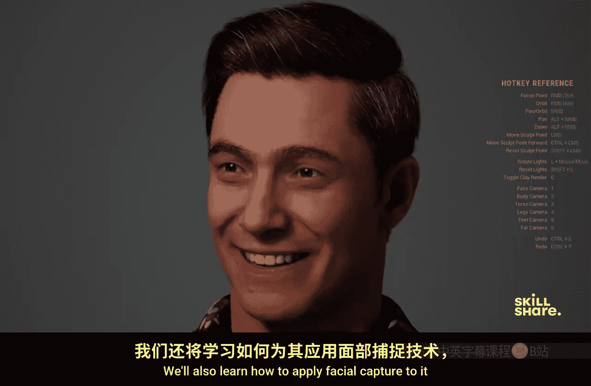

# 010：简介

在本节课中，我们将学习如何首次使用虚幻引擎，并创建一个自定义的MetaHuman角色。我们还将学习如何为其应用面部捕捉，并将此角色用作引擎中的可玩角色。

我的角色创作中最喜欢的部分，是从零开始，并通过我们在艺术和创意上做出的决定，看着一个角色逐渐变得栩栩如生。

大家好，我是Lucas Fridley，一名专业的3D动画师和电影制作人。你可能在《最后生还者 第二部》等游戏或《复仇者联盟：无限战争》等电影中见过我的作品。

角色创作是电子游戏中非常重要的一部分，因为这是观众产生连接的对象，并且他们实际上是在扮演这个角色。因此，以能够留下你自己印记的方式来创造角色非常重要，这能为角色赋予人性化的触感，让观众能够与之产生共鸣。

如果你没有经验，但对创作自己的短片或视频游戏感兴趣，那么你应该学习这门课程。在本课程结束时，我希望你能意识到，虚幻引擎并不像它表面上看起来那么令人生畏。

要学习本课程，你需要一台电脑和一个三键鼠标。虚幻引擎是免费的，你可以从Epic Games官网下载。

准备好赋予一个新角色生命了吗？让我们开始吧。

---

## 课程总结

本节课我们一起学习了课程的整体介绍和目标。我们了解到，本课程将引导初学者使用虚幻引擎，从零开始创建一个自定义的MetaHuman角色，并为其添加面部捕捉功能，最终使其成为游戏中的可玩角色。同时，我们明确了学习本课程所需的软硬件准备。