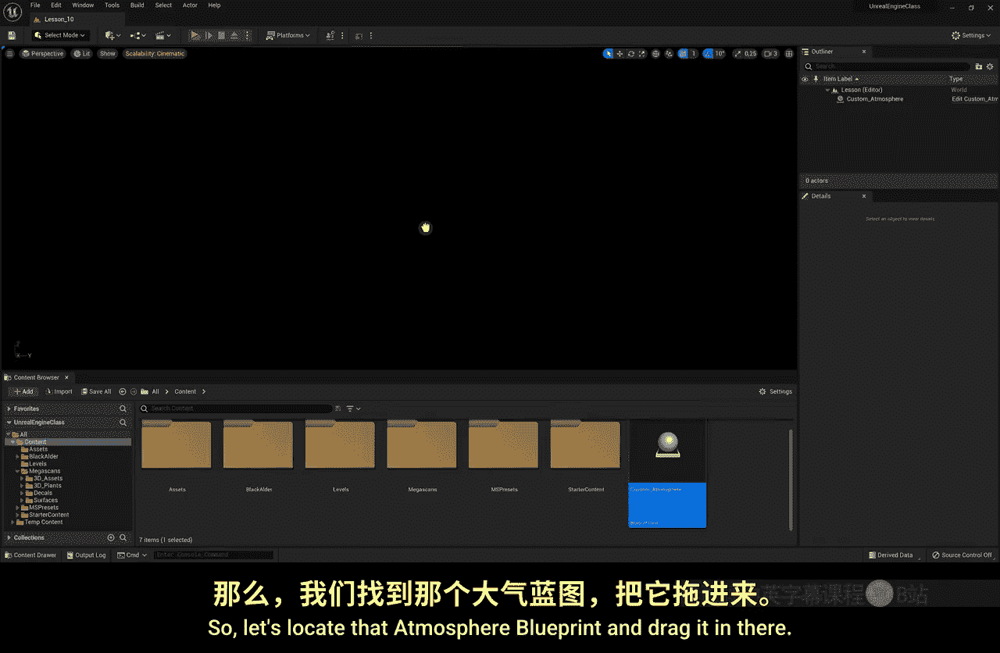
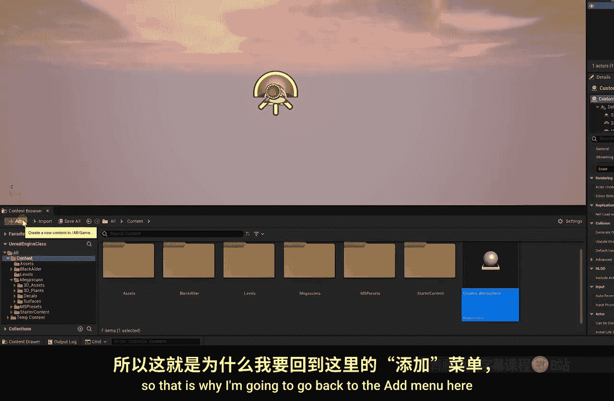
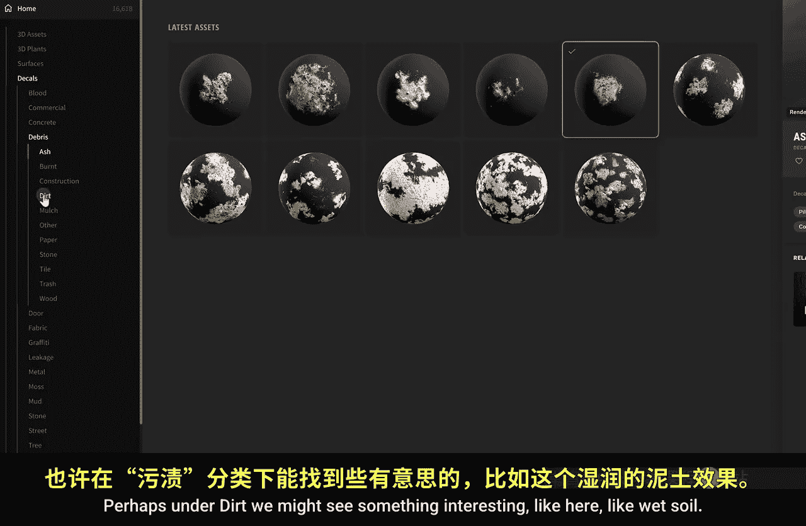
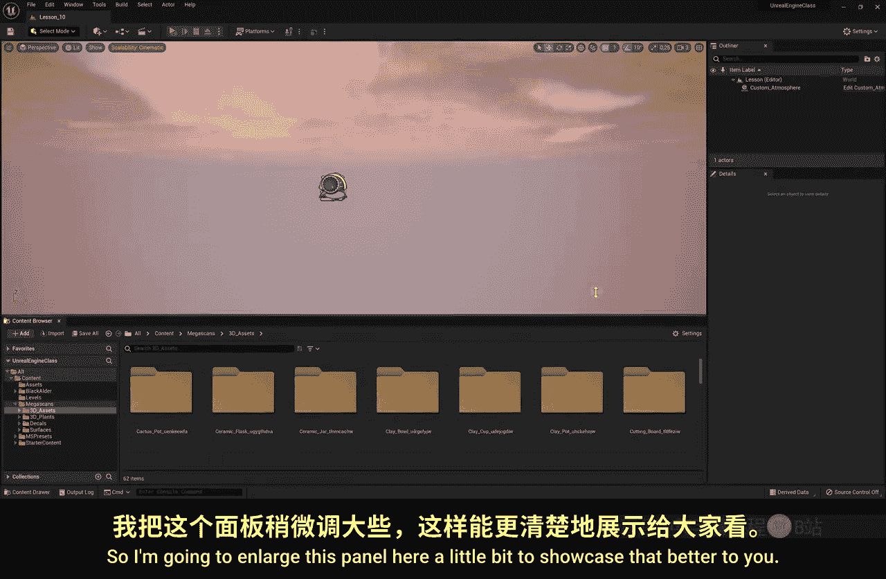
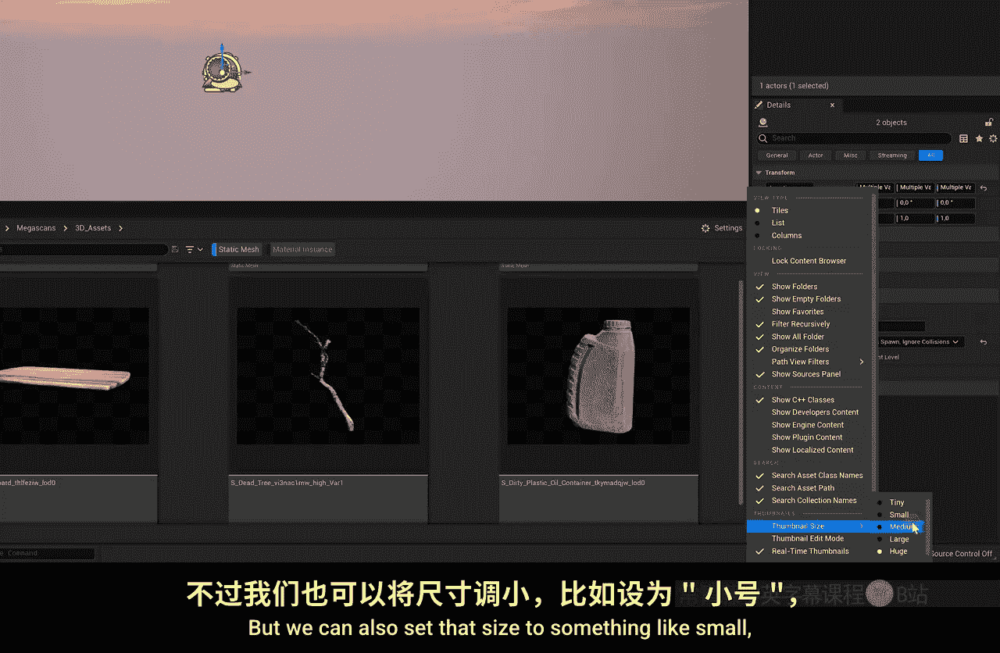

# 011：创建虚拟工作室 🏠

在本节课中，我们将从户外场景转向室内，学习如何创建一个基础的虚拟工作室。我们将使用几何体笔刷来构建房间结构，并介绍如何高效地管理从Quixel库下载的资产。

## 概述

上一节我们完成了户外景观的创建。本节中，我们将进入室内场景设计。首先，我们会创建一个新的空白关卡，然后学习使用几何体笔刷来构建一个带有窗户的封闭房间，以解决光线穿透模型的问题。同时，我们还将探讨如何利用Quixel库的资产，并通过内容浏览器的过滤器功能来高效地组织项目资源。

## 创建新关卡与基础设置

首先，我们需要创建一个新的关卡来开始我们的室内设计。

1.  在“内容浏览器”的关卡文件夹中右键点击。
2.  选择“新建关卡”。
3.  打开新建的空白关卡。
4.  从“内容浏览器”中找到大气蓝图（Atmosphere Blueprint），将其拖入场景。对于室内场景，虽然不一定需要阳光和大气，但如果建筑有窗户，保留它们会很有用。即使是没有窗户的场景（如地铁站），保留天空球也能提供一个基础的照明和反射环境。

## 获取与导入资产

由于无法直接在虚幻引擎内建模，我们将使用Quixel库中的预制模型和材质。

1.  打开“Quixel内容库”（可通过“添加”菜单或“窗口”菜单访问）。
2.  在库中，可以利用左侧的“收藏集”功能寻找主题资产包（例如“旧沙龙”风格），也可以直接浏览“3D资产”下的“室内”分类。
3.  选择需要的资产（如墙壁、椅子、酒瓶等装饰物）并下载。为了营造陈旧感，还可以下载一些杂草、污渍贴花和灰尘等细节资产。
4.  下载的资产会出现在“本地”文件夹中，需要将其导入到当前项目。

## 高效管理资产：内容浏览器过滤器

导入大量资产后，内容浏览器会变得杂乱。使用过滤器可以快速定位特定类型的资产。

以下是创建过滤器的步骤：

1.  在内容浏览器顶部点击“创建资产过滤器”按钮。
2.  选择需要过滤的类型，例如“静态网格体”（3D模型）。
3.  过滤器将只显示当前所选文件夹内的该类型资产。
4.  可以创建多个过滤器，如“材质实例”（用于Quixel的材质和贴花）。

**注意**：Quixel库提供的材质通常是“材质实例”，它为用户提供了更友好的参数调整界面（如平铺、粗糙度），这与基础的“材质”资产不同。

此外，可以通过内容浏览器右上角的“设置”菜单，调整缩略图大小和视图模式（如列表、平铺），以便更高效地浏览资产。

## 构建工作室结构

现在开始构建房间。直接使用下载的墙壁模型可能会遇到模型面不封闭、光线穿透的问题。

1.  将下载的墙壁模型拖入场景。
2.  按 `End` 键可以快速将选中的物体对齐到下方表面。
3.  旋转阳光方向，会发现光线穿透了墙壁，这在封闭室内是不合理的。

**解决方法**：使用几何体笔刷构建一个实体的房间外壳。

1.  通过菜单栏的“窗口”->“放置Actor”打开面板，找到“几何体”分类。
2.  将一个“盒体”笔刷拖入场景。
3.  在细节面板中调整其尺寸（例如X:2000, Y:2000, Z:1000）。
4.  勾选“空心”选项，并设置“壁厚”（如10）。这样就创建了一个空心的盒子，可以作为房间。
5.  此时光线可能仍会轻微穿透，我们需要将其转换为静态网格体。点击细节面板底部的“创建静态网格体”按钮，命名并保存。转换后，光线将被正确阻挡。

## 添加窗户

在将笔刷转换为静态网格体之前，我们需要先挖出窗户。

1.  确保房间的盒体笔刷仍是“几何体”状态（未转换）。
2.  拖入第二个盒体笔刷，将其移动到墙壁位置。
3.  在细节面板中，将其“笔刷类型”从“添加”改为“减去”。
4.  这个“减去”笔刷会从第一个笔刷中挖去其体积，从而形成窗户。调整其大小和位置以定义窗户的形态。
5.  调整阳光方向，让光线从窗户射入。

**重要工作流程**：在场景大纲视图中，将构成房间外壳（墙体和窗户挖洞体）的所有几何体笔刷选中，并放入一个单独的文件夹（例如命名为“Studio”）中进行管理。最后，选中该文件夹内的所有笔刷，点击“创建静态网格体”，将它们合并为一个完整的房间模型。

## 总结

本节课中我们一起学习了如何创建室内虚拟工作室。我们掌握了从新建关卡、导入Quixel资产，到使用内容浏览器过滤器管理资源的方法。核心部分是利用几何体笔刷构建封闭空间，并通过“添加”和“减去”笔刷的类型配合来创建窗户等开口。最后，我们强调了将相关笔刷组织到文件夹中并合并为静态网格体的重要性。现在，你可以尝试构建自己的工作室基础结构，并下载一些家具资产，为下一节课布置室内场景做好准备。