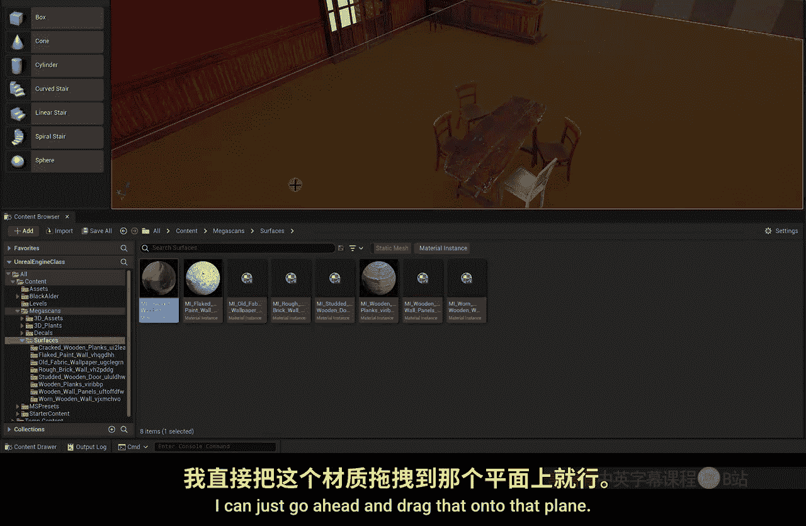
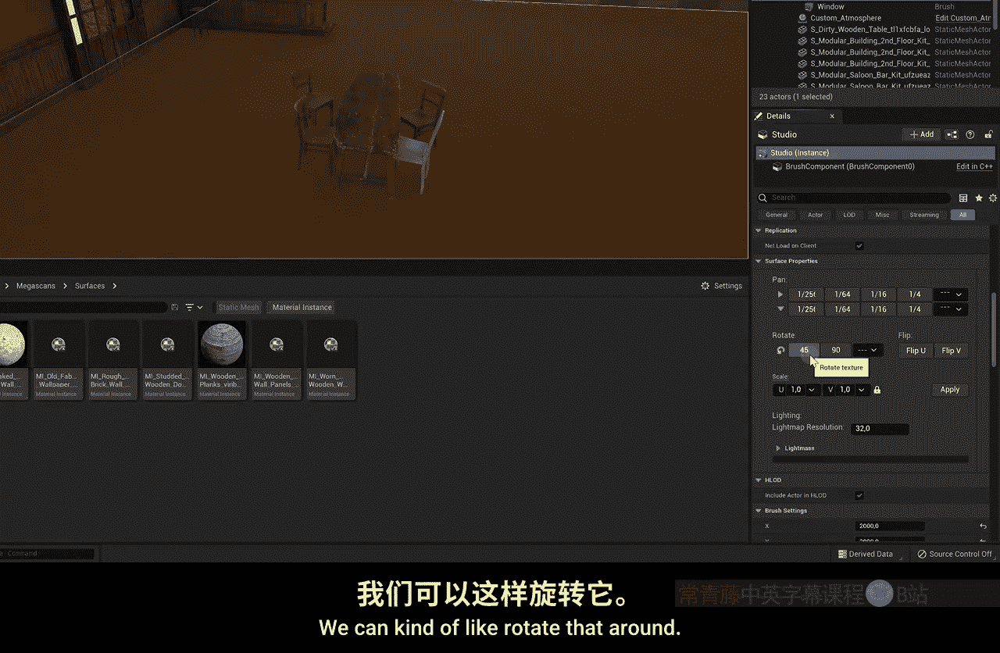
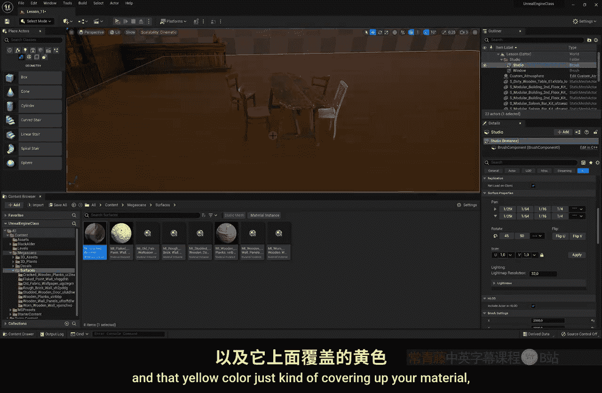
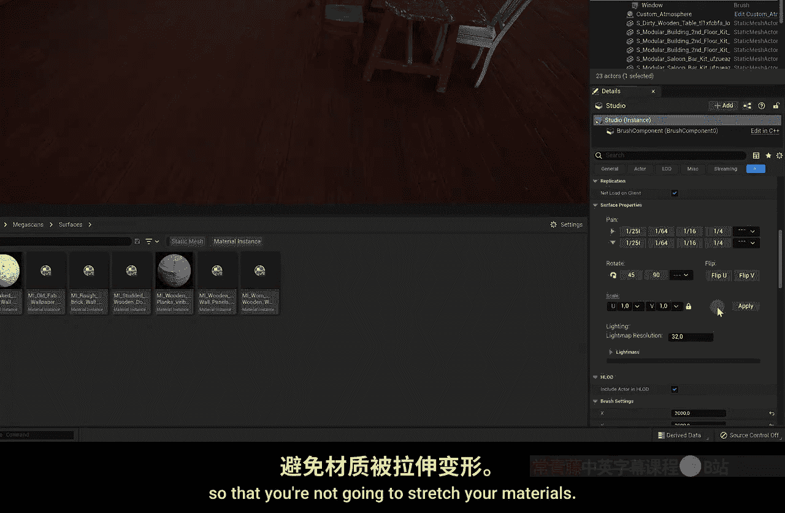
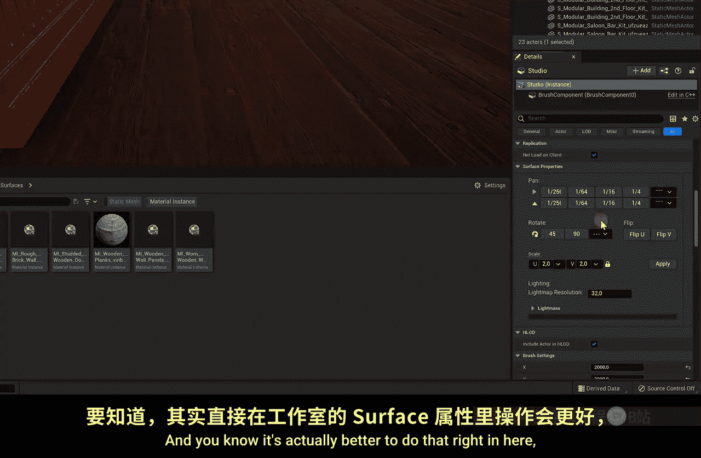
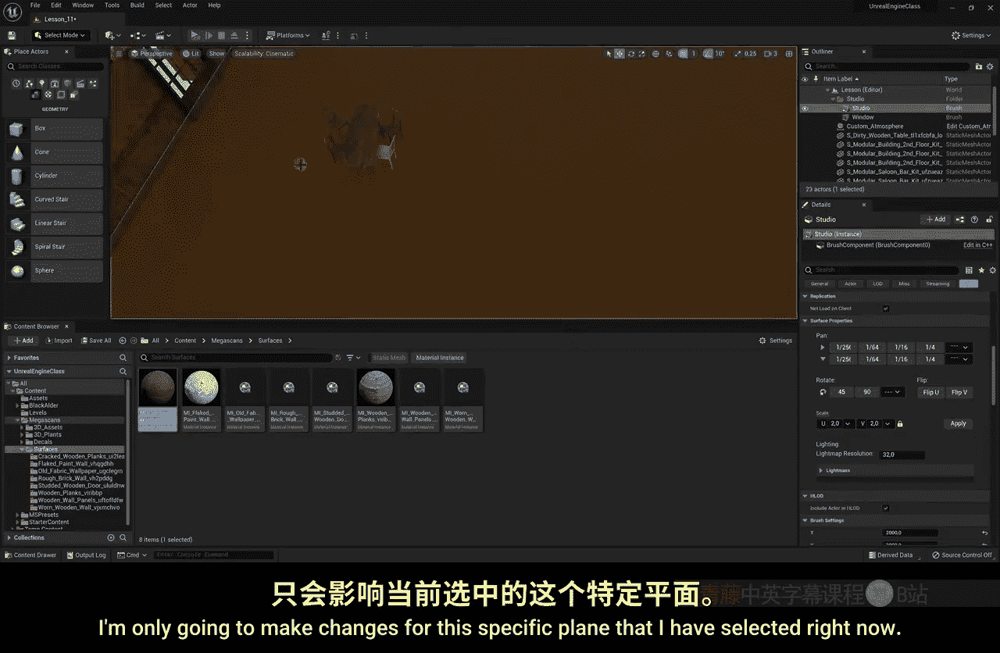
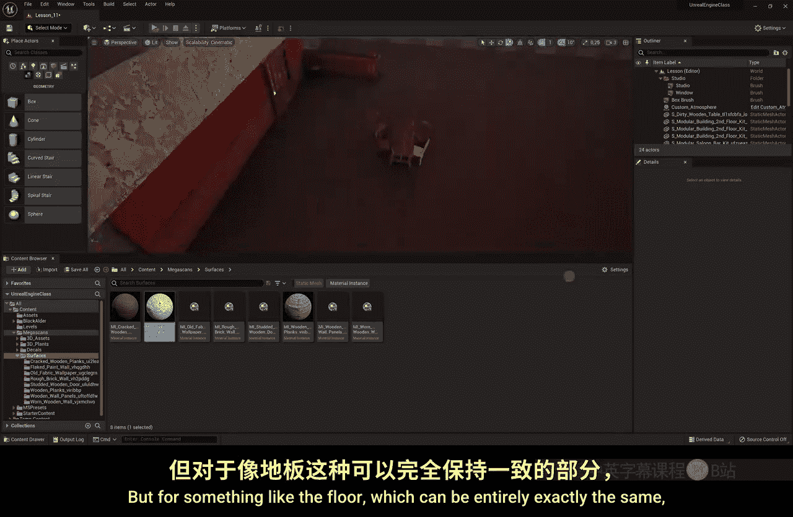

# 012：室内设计 🏠

在本节课中，我们将学习如何在虚幻引擎中构建一个室内场景。我们将从创建墙壁开始，逐步添加窗户、家具和地板纹理，最终完成一个老式沙龙风格的室内设计。过程中会涉及对象操作、材质应用和场景布局等核心技巧。

## 构建基础结构

上一节我们介绍了基本概念，本节中我们来看看如何搭建场景的基础结构。创建室内场景非常直接，我们将从墙壁开始。

*   将墙壁模型拖入场景。
*   使用旋转工具调整其方向。
*   使用移动工具将其放置到理想位置。

以下是复制和排列墙壁的步骤：

*   按住键盘上的 **Alt** 键，同时拖动墙壁，可以复制出一个新的墙壁。
*   按住 **Shift** 键可以选择多个对象，然后同样使用 **Alt** + 拖动来复制选中的一组墙壁。
*   重复此过程，构建出房间的基本框架。

构建室内场景就是不断拖放不同的3D模型，并尝试组合出美观的布局。你可以参考现实生活中的照片来获取灵感。

## 创建窗户与开口

基础结构完成后，我们来为场景添加一些特定元素，例如窗户。首先，为窗户腾出空间，调整墙壁位置。

在移动对象时，除了使用三个坐标轴（X, Y, Z），还可以将鼠标悬停在两个坐标轴之间，实现在两个平面（如XY平面或XZ平面）上同时移动对象。

按下键盘上的 **N** 键，可以让选中的对象快速吸附到世界坐标的底部平面上。

现在放置窗户模型。为了让光线透入，我们需要在墙上“挖”出一个窗洞。

*   在组件面板中创建一个新的 **Box**（立方体）。
*   在细节面板中，将其 **Brush Type**（笔刷类型）设置为 **Subtractive**（减去）。
*   将这个立方体移动到墙壁中，它就会从墙壁上减去对应的体积，形成一个窗洞。

完成后，请为这个“窗洞”立方体命名（例如“Window”），并将其放入你的场景文件夹中，方便后续管理。

## 完善场景与细节

透过窗户，我们能看到外部。为了更真实，需要在窗外放置外墙模型，模拟建筑的外部结构。

不必担心外墙模型可能会穿入室内，因为室内的墙壁面板会将其遮挡。同样，你也可以复制墙壁来创建天花板，以完善场景。

接下来是布置家具。例如，可以拖入一个模块化的吧台模型，并通过复制和旋转来扩展它。这个过程类似于在《模拟人生》游戏中建造房屋，充满乐趣。

以下是布置物品时提升真实感的要点：

*   **避免重复**：即使创建像沙龙这样的场景，也不要只使用一种瓶子或椅子并大量复制。寻找外观相似但有细微差别的模型（如瓶塞不同），这能增加场景的真实感。
*   **布局自然**：摆放桌椅时，不要过于整齐。让椅子与桌子的距离略有不同，甚至混入一两把完全不同风格的椅子，模拟真实的使用痕迹。
*   **符合主题**：对于现代场景，可以使用完全相同的整洁椅子；但对于老旧的沙龙，杂乱和差异才是合理的。

## 应用地板材质

现在开始铺设地板。我们可以直接对工作室几何体（Studio）的不同面应用材质。

*   选中工作室几何体的地板平面。
*   在内容浏览器中，筛选 **Material Instance**（材质实例）。
*   找到合适的地板材质（例如“Cracked Wooden Floor”），将其拖放到选中的地板平面上。

材质会仅应用于选中的那个平面，这意味着我们可以为工作室的每个面指定不同的纹理。

选中地板平面后，可以在细节面板的 **Surface Properties**（表面属性）中调整材质。

*   **旋转**：可以改变木板的方向。
*   **缩放**：调整纹理的大小。可以锁定比例，防止纹理被拉伸。例如，将缩放值设置为 `2`。
*   **平移**：移动纹理的起始位置，让木板的边缘与墙壁对齐。

按下键盘上的 **G** 键可以隐藏所有控件和图标，让你更清晰地查看材质效果。

**重要提示**：在此处（表面属性）调整材质参数，只会影响当前选中的这个平面。如果进入材质资产内部进行修改，则会改变材质本身，所有使用该材质的地方都会同步变化。

## 创建自定义墙体与调整布局

有时我们需要创建特定形状的墙体。例如，要创建一个上层的阳台矮墙，可以：

*   拖入一个新的 **Box** 几何体。
*   在细节面板中直接修改其尺寸（例如，将Y值设为 `10`），而不是使用缩放工具。因为缩放工具会拉伸贴图，而直接修改尺寸则不会。
*   为其赋予一个墙面材质，并调整材质的缩放和平移以获得理想效果。

如果需要修改布局，例如在后方增加一个走廊，有两种方法：

1.  选中所有室内摆设模型，整体移动。
2.  选中整个工作室几何体进行移动。**这是虚拟世界的巨大优势**——你可以随意移动“建筑”本身。

移动工作室时，之前创建的窗洞（Subtractive Box）会保持在原位，因为它是独立的对象。这样你就可以自由调整建筑结构，而无需重新制作开口。当然，你也可以同时选中工作室和窗洞一起移动。

## 控制对象的轴心点

在布置场景时，控制对象的轴心点（Pivot Point）非常重要。默认情况下，轴心点通常在物体底部中心。

*   使用旋转工具时，物体会围绕其轴心点旋转。
*   若要临时改变轴心点：按住 **Alt** 键，同时用鼠标中键（滚轮键）拖动轴心点到新位置。之后使用旋转工具，物体会围绕这个临时轴心点旋转。
*   若要永久设置轴心点：先通过上述方法（Alt + 鼠标中键拖动）将轴心点移动到目标位置。然后右键点击轴心点，选择 **Pivot（轴心） -> Set as Pivot Offset（设置为轴心偏移）**。这样即使取消再重新选择该物体，轴心点也会保持在设置的位置。

掌握这个技巧后，你可以更灵活地旋转和摆放物体，例如让桌子围绕其角落旋转。

## 总结与练习

本节课中我们一起学习了在虚幻引擎中构建室内场景的全过程。从搭建墙壁框架、创建门窗开口，到布置家具、应用并调整材质，最后还学习了如何调整布局和控制对象轴心点。

现在，轮到你运用这些技巧来创建自己的沙龙场景或其他任何室内设计了。记住，虽然看起来只是将3D模型拖入场景，但要布置得真实、美观，需要花费大量时间仔细调整每个物体的位置和朝向。使用参考图会非常有帮助。完成后，我们将在下一节课一起欣赏彼此的成果，并做进一步探讨。