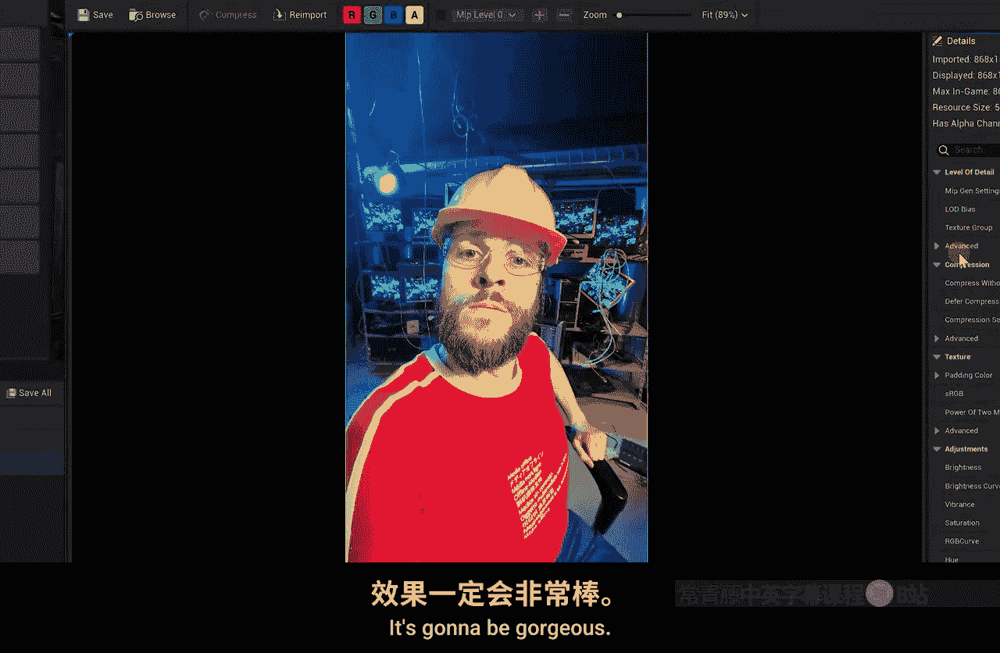

# 013：室内场景搭建与细节处理

在本节课中，我们将学习如何搭建一个充满细节的室内场景，并掌握使用贴花（Decal）和自定义纹理来增强场景真实感的核心技巧。

## 场景概览与核心思路

上一节我们介绍了场景搭建的基础。本节中，我们来看看如何通过细节处理让一个简单的室内场景变得生动真实。

我花费了数小时搭建了这个酒馆内部场景。你可能会觉得这个场景看起来很简单，但实际上其中包含了许多细致的工作。让我们放大细节，看看具体做了哪些工作。

## 营造不完美与真实感

以下是营造真实环境的关键点，核心在于避免完美的对称和排列。

*   **桌椅布置**：中间的桌子和周围的椅子并未严格对齐。我特意旋转了它们，使其看起来更随机。
*   **物品复用与变化**：我重复使用了场景中的模型，但通过旋转来制造差异。例如，复制一张桌子并旋转180度，它们看起来就成了两张不同的桌子。
*   **桶的摆放**：后面走廊里的桶，我确保没有任何两个是完全对齐的。它们之间的缝隙各不相同，堆叠时也并非精确居中，总是稍微偏左或偏右。
*   **杯子堆叠**：堆叠的杯子如果完全对齐会显得不自然。我像现实中橱柜里的杯子一样，将它们稍微旋转，使其看起来有些倾斜，这样真实感大大增强。

寻找并创造这些“不一致性”，是让一个世界或环境显得更真实的关键。

## 贴花（Decal）的运用

为了增加场景的年代感和污渍，我大量使用了贴花。场景中这些带有小部件的浮动物体就是贴花指示器（Billboard）。

贴花本质上是一种将特定纹理投射到其他材质或网格体上的技术。让我演示一下如何使用。

首先，从资源库中拖拽一个贴花（例如“污垢堆”）到场景中。注意，最好将其直接拖放到一个网格体（如楼梯柱子）上，这样它会正常工作。

放置后，你会看到一个箭头，它代表了贴花的投射方向。这个贴花本身是一个平面材质。我们可以旋转它，让箭头指向我们希望投射的表面，比如墙壁。

调整贴花周围的方框大小可以控制投射区域。通过缩放（Scale）选项缩小这个方框，投射区域也会相应变小，然后将其靠近墙壁，纹理就会显现出来。

初次使用贴花可能会有些挫折，但多练习就会掌握。本质上，我就是通过大量放置贴花来丰富场景细节的。

## 控制贴花的投射

有时，你不想让贴花投射到某些物体上。例如，我不希望楼梯柱子上出现污渍贴花，因为那会导致纹理拉伸，效果不佳。

解决方法是：选中不希望接收贴花的物体（如柱子），在“细节”（Details）面板中搜索“Decal”，取消勾选“接收贴花”（Receive Decals）选项。这样，贴花就不会影响到该物体了。

在这个场景中，我在角落和边缘大量使用了污渍贴花，因为现实中灰尘和污垢总是容易积聚在这些地方。例如吧台角落和柱子底部的碎石，都使用了贴花来增强真实感。

## 3D模型与贴花的对比

你也可以使用3D模型来充当细节，比如我在地上放置的一些砖块，它们作为碎石增加了体积感。

与贴花相比，3D模型的优势在于它们具有真实的体积，从侧面看更有立体感。而贴花（如地上的树叶）则相对扁平。

我不太喜欢使用贴花来做门，因为从侧面看它们非常扁平。但由于这些门位于背景的阳台上，所以可以接受。使用3D模型创建复杂细节（如一堆杂物）会耗费大量时间，你需要权衡这些细节在最终画面中的可见度。

## 添加自定义纹理与图片

我找到了一些画框，但里面没有画。我们可以添加自己的图片。

将图片文件（如.jpg或.png）直接拖入项目文件夹的“Content”目录下。如果引擎没有自动提示导入，可以通过顶部菜单的“添加”（Add）->“导入到游戏”（Import to Game）来手动导入。这些图片会被当作纹理（Texture）处理。

接下来，我们可以创建一个几何体（Geometry）方块，调整其大小和厚度，使其匹配画框。

然后，直接将我们导入的图片纹理拖放到这个几何体表面上。虚幻引擎会自动为其创建一个材质并应用。

为了使画作成为画框的一部分，我们需要将这个几何体转换为静态网格体（Static Mesh）。选中几何体，在选项中选择“创建静态网格体”（Create Static Mesh）。

转换为网格体后，我们也可以像之前一样，在细节面板中设置其“接收贴花”属性，确保污渍不会弄脏我们的画。

最后，将画作附着到画框上。选中画作网格体，右键选择“附着到”（Attach To），然后使用选择器点击画框。这样，两者就链接在一起，可以作为一个整体移动了。

## 总结与下节预告

本节课中，我们一起学习了如何通过摆放技巧、使用贴花和添加自定义资源来丰富和细化一个室内场景。关键在于利用“不完美”创造真实感，并灵活运用贴花来添加环境细节。

下一节课，我们将创建一个MetaHuman数字人类，这非常有趣。之后，我们将为这个室内场景打光。先创建一个人物的原因是，这样能更直观地设计和调整室内照明效果。

我们下节课再见。