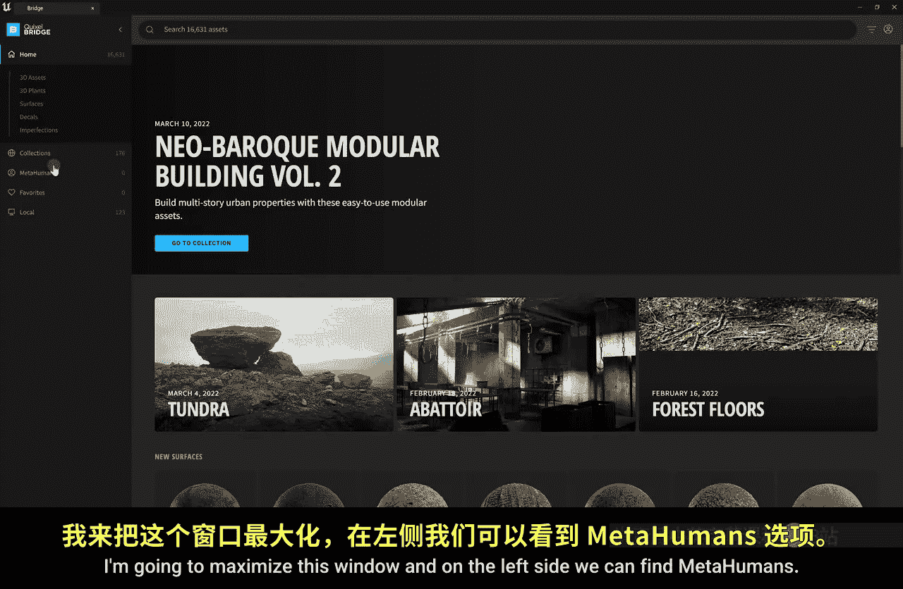
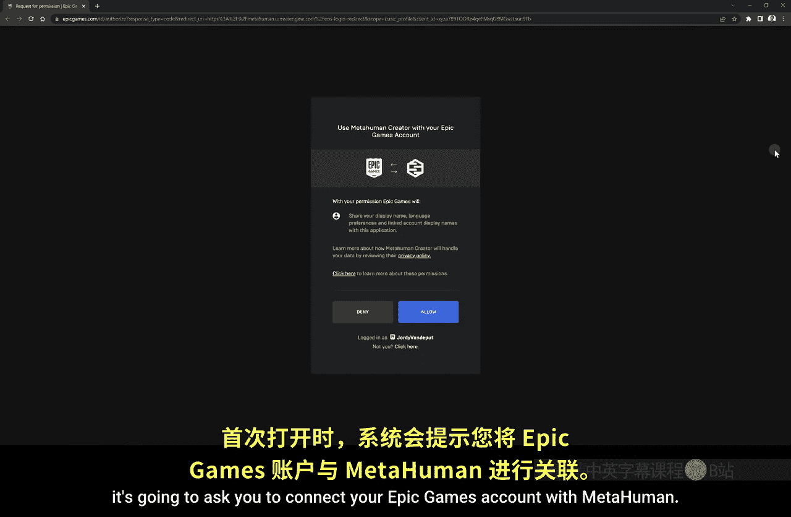
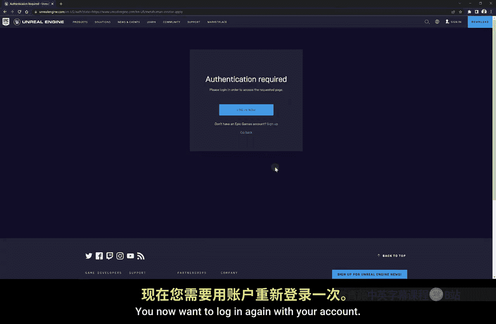
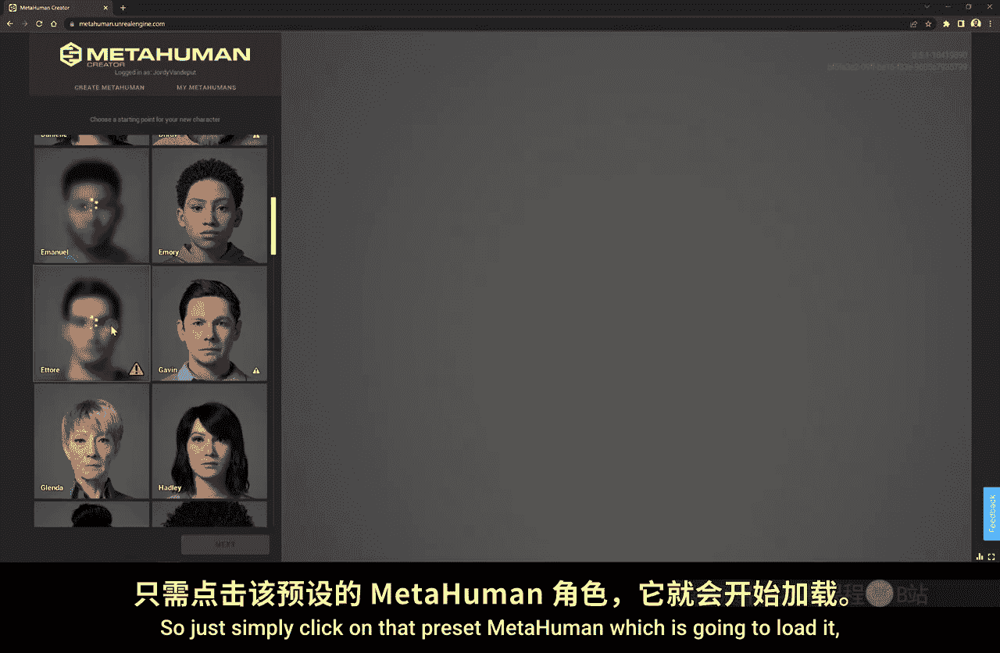
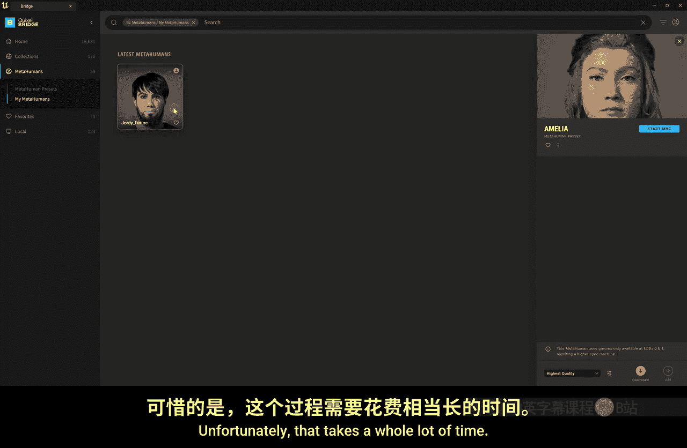

# 014：创建MetaHuman角色 🧑‍🎨

在本节课中，我们将学习如何在虚幻引擎中创建和使用MetaHuman角色。MetaHuman是虚幻引擎用于创建高保真3D数字人类的新工具。虽然它目前仍处于早期阶段，对电脑性能要求较高，但代表了未来角色创建的发展方向。

## 概述

上一节我们学习了如何导入和使用3D资产来布置场景。本节中，我们将重点介绍MetaHuman系统，学习如何从预设创建角色，以及如何通过在线编辑器进行深度自定义。

## 访问MetaHuman内容

首先，我们需要找到MetaHuman内容。在虚幻引擎编辑器中，点击顶部菜单栏的“窗口”，然后选择“Quixel Bridge”。这将打开Bridge应用程序窗口。

在Bridge窗口的左侧导航栏中，可以找到“MetaHumans”分类。这里提供了许多预设角色模型。

以下是导入预设角色的步骤：
1.  在Bridge的“MetaHumans”分类下，浏览并选择一个你喜欢的预设角色。
2.  选中角色后，点击右下角的“下载”按钮。
3.  下载完成后，点击“添加到项目”，即可将角色导入你的虚幻引擎项目中。

## 使用MetaHuman Creator自定义角色

除了使用预设，我们还可以创建完全自定义的角色。这需要通过MetaHuman Creator在线工具来完成。

以下是启动并登录MetaHuman Creator的流程：
1.  在Bridge的“MetaHumans”页面顶部，点击“启动MHC”（MetaHuman Creator）。
2.  首次使用会要求你关联Epic Games账户，请点击“允许”。
3.  由于MetaHuman仍处于早期体验阶段，你可能需要填写一份访问申请表格。提交后即可使用。

> **注意**：MetaHuman Creator对电脑性能要求很高，加载和操作可能会比较缓慢。如果你的电脑运行困难，可以暂时跳过实践，仅通过本教程了解其概念和流程。

进入MetaHuman Creator后，界面左侧是预设角色库。你可以选择一个与你目标形象相近的预设作为起点。

选择预设后，会进入自定义界面。你可以将其视为一个高级的角色创建游戏。

在编辑器底部，点击“开始雕刻”会显示许多控制点。**通过拖拽这些点，可以改变角色面部骨骼的形状**，使其更接近特定人物的特征。

编辑器顶部可以调整预览质量（如中等、史诗级）。质量越高，对性能的压力越大。

以下是主要的自定义选项类别：
*   **皮肤**：调整年龄、肤色、添加雀斑等。
*   **面部特征**：细致调整脸颊、眼睛等部位的颜色和细节。例如，可以改变虹膜颜色。
*   **妆容**：为角色添加眼影、唇彩等化妆效果。
*   **毛发**：选择发型、发色、眉毛、睫毛和胡须的样式。

此外，点击顶部的“工作室”选项卡，可以更换灯光和环境（如“城市夜景”），以便在不同光照条件下查看你的角色。

完成自定义后，记得点击左上角的铅笔图标为角色命名，例如 `Jo_Future`。

## 导入自定义角色到项目

自定义完成后，关闭浏览器，回到Bridge应用程序。

在Bridge中，进入“本地”>“MetaHumans”>“我的MetaHuman”，你应该能看到刚刚创建的角色。选中它，然后点击“下载”并“添加到项目”。

> **重要提示**：下载和导入MetaHuman角色到虚幻引擎项目是一个非常耗时的过程，可能需要半小时或更久。

导入后，项目内容浏览器中会生成一个名为“MetaHumans”的文件夹，里面包含你的角色。

## 在场景中使用MetaHuman角色

MetaHuman角色以**蓝图类**的形式存在。蓝图是虚幻引擎中用于添加交互逻辑和功能的系统。

要将角色放入场景，只需从内容浏览器中将角色的蓝图类拖拽到视口中。

首次放置时，引擎可能会提示启用一些插件（如用于动作捕捉的“Live Link”）。如果你暂时不需要相关功能，可以跳过。

角色放入场景后，你可能会注意到一个现象：当镜头拉远时，角色的头发等细节会消失；拉近镜头时，它们又会出现。这与**LOD（细节层次）** 系统有关。

## 理解LOD（细节层次）

LOD是一种优化技术。对于非Nanite的传统模型，引擎会根据模型与摄像机的距离，自动切换不同细节程度的模型版本，以平衡画质和性能。

MetaHuman模型拥有多个LOD级别（如LOD0、LOD1等）。目前，像头发这样的复杂资产可能只支持到较近的LOD级别（如LOD1），这就是为什么拉远后头发会消失。

你可以查看模型的LOD：在角色蓝图中找到面部网格体，双击打开。在网格体编辑器顶部，将“LOD选取”从“自动”改为特定数字（如0或7），即可查看不同细节层次下的模型状态。

## MetaHuman角色的应用

将MetaHuman角色放入场景中非常有用，它可以作为灯光和构图的比例参考。特别是如果你创建了一个与自己相似的角色，这将为后续学习绿幕抠像和合成技术提供极大的便利。

## 总结

本节课我们一起学习了MetaHuman系统的基础知识。我们了解了如何从Bridge获取预设角色，如何使用MetaHuman Creator在线工具进行深度自定义，以及如何将创建好的角色导入虚幻引擎项目并在场景中使用。我们还解释了与MetaHuman相关的LOD优化概念。虽然该工具目前对硬件要求较高，但它展示了创建高保真数字人类的强大潜力。

在下一节课中，我们将探索更有趣的内容：如何使用iPhone进行面部动作捕捉，并让我们的MetaHuman角色开口说话。