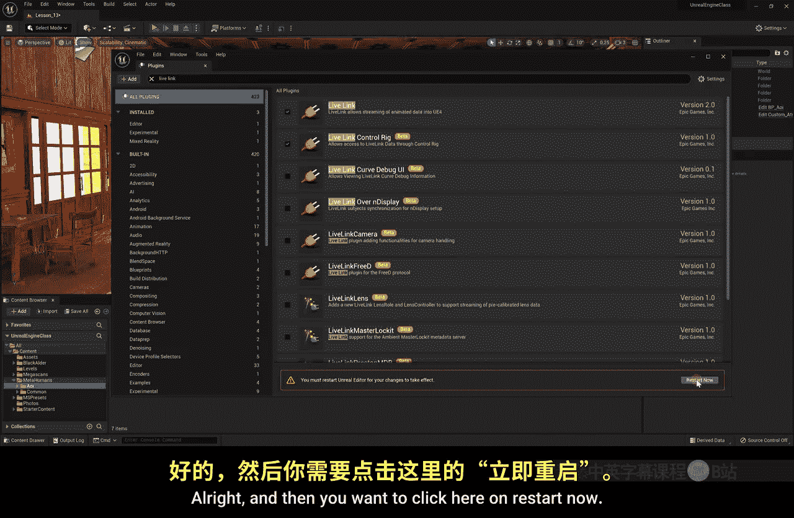
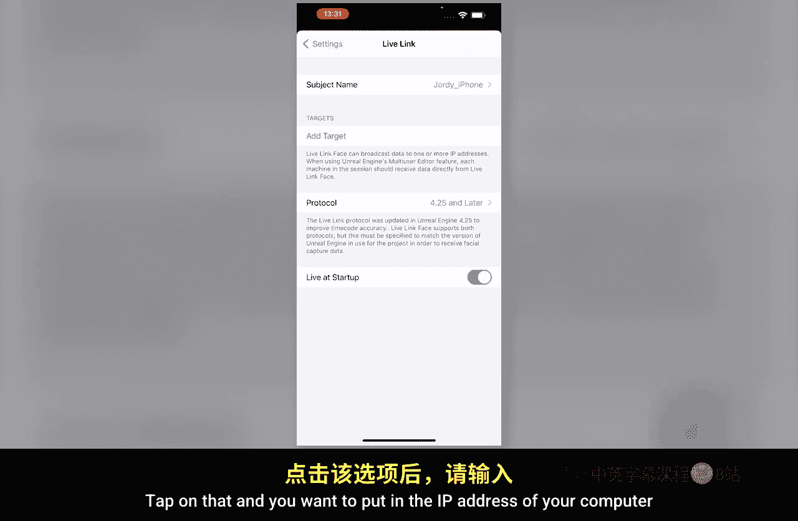
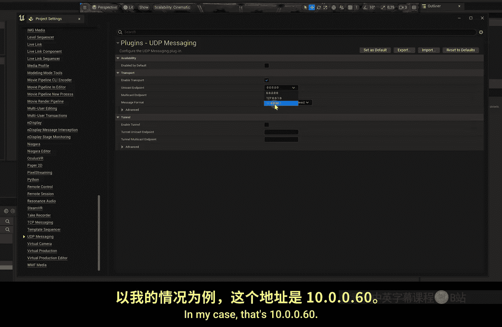
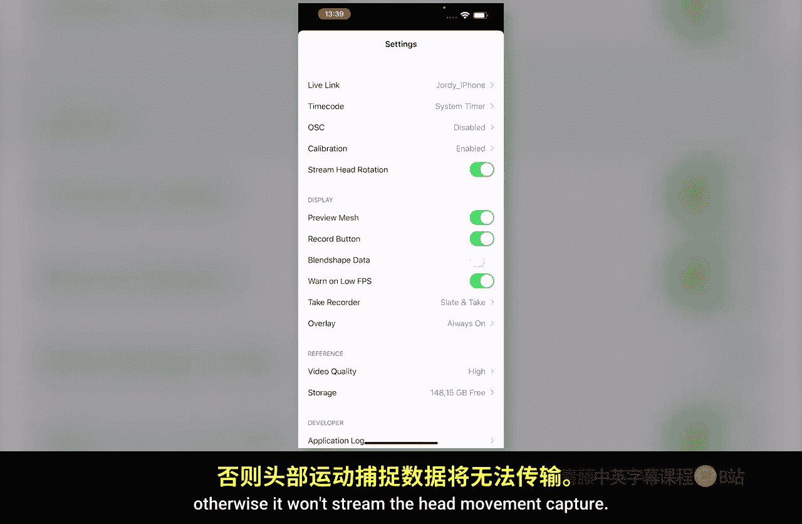

# 015：面部动作捕捉 🎭

在本节课中，我们将学习如何通过iPhone进行面部动作捕捉，并将捕捉到的数据实时应用到MetaHuman角色上。我们还将了解虚幻引擎的编辑器模式与模拟模式之间的区别。

## 启用必要插件

上一节我们导入了MetaHuman角色。在导入时，系统可能提示需要启用一些插件。如果当时没有启用，我们需要手动在插件库中启用它们。

在编辑器顶部菜单栏，点击“设置”，然后选择“插件”。这将打开插件库窗口。默认情况下，由于我们创建的是视频制作项目，许多插件已自动启用。但面部动作捕捉所需的插件默认未启用。

以下是需要启用的插件：
*   **Live Link**：这是核心的动作捕捉插件。
*   **Live Link Control**：此插件通常已启用。

启用插件后，需要点击“立即重启”按钮来重启引擎。重启完成后，即可关闭插件库窗口。

## 设置Live Link与iPhone连接

插件启用后，我们就可以设置动作捕捉设备了。本节中，我们将使用iPhone作为捕捉设备。

首先，在顶部菜单栏点击“窗口”，选择“虚拟制片”，然后找到并点击“Live Link”。这将打开一个新的Live Link面板。

在Live Link面板中，我们需要选择捕捉设备。在本例中，设备是Apple iPhone。目前此功能仅支持iPhone，因为我们将使用虚幻引擎官方开发的“Live Link Face”应用程序，它简化了整个流程。当然，你也可以通过编写蓝图脚本让其他品牌的动捕设备与MetaHuman协同工作，但这需要掌握蓝图知识。

打开手机上的“Live Link Face”应用，你应该会立即看到一个代表面部捕捉数据的网格。接下来需要进行连接设置。

在应用内点击顶部的“设置”按钮。在设置中找到“Live Link”选项并点击，你会看到设备名（例如“Jo的iPhone”）。点击它，然后找到“目标”设置项。这里需要输入运行虚幻引擎的电脑的IP地址。

如果你不知道电脑的IP地址，可以通过以下方法在虚幻引擎内查找：
1.  返回编辑器，进入“编辑”菜单下的“项目设置”。
2.  向下滚动，找到“UDP消息传递”设置项。
3.  确保“启用UDP消息传递”已勾选（默认通常是启用的）。
4.  在“单播端点”列表中，除了`0.0.0.0`和`127.0.0.1`，另一个就是你的电脑IP地址（例如`10.0.0.60`）。

将查到的IP地址输入到手机应用的“目标”栏中（例如`10.0.0.60`）。点击连接后，你的iPhone设备应该会出现在虚幻引擎的Live Link窗口列表中。如果未出现，可能是防火墙或网络设置问题，请检查相关设置。

## 将动捕数据绑定到MetaHuman

设备连接成功后，就可以将捕捉到的数据驱动MetaHuman角色了。

在场景中选中你的MetaHuman角色。在右侧的“细节”面板中，找到“Live Link Face Subject”设置项。点击下拉菜单，你应该能看到你的iPhone设备名称，选择它。

接着，还需要设置“Live Link Face Head”选项。这两个设置分别对应面部表情捕捉和头部运动捕捉。

同时，请确保手机应用“设置”中的“流式传输头部旋转”选项已启用，否则头部运动数据将不会被传输。

## 进入模拟模式并测试

所有设置完成后，我们就可以进入模拟模式查看效果了。目前我们处于编辑器模式，用于构建场景。要测试动捕，需要切换到模拟模式。

在编辑器视口上方，点击播放按钮旁边的下拉箭头。虽然这里有多个选项（如“新建编辑器视口播放”、“独立游戏”等，主要用于游戏开发），但对于我们的视频制作目的，通常选择“模拟”即可。

点击“模拟”后，我们就进入了模拟模式。现在，对着手机做出表情或转动头部，场景中的MetaHuman角色就会实时复现你的动作。这个过程非常直观且有趣。

要退出模拟模式，可以按下键盘上的`Esc`键，或点击视口上方的“停止模拟”按钮。

## 理解编辑器模式与模拟模式

让我们进一步探讨一下编辑器模式和模拟模式的区别。为了更清楚地说明，我们以给一个物体添加物理模拟为例。

假设我们想让场景后方的一把椅子掉落在地上。如果在编辑器模式下物体就受重力影响，我们将无法正常搭建场景，因为所有东西都会不断下落。

默认情况下，即使进入模拟模式，椅子也不会掉落，因为我们还没有为它赋予物理属性。

退出模拟模式，选中椅子。在“细节”面板中找到“物理”部分。这里有一个“模拟物理”的选项，但目前无法勾选，原因是该模型还没有碰撞体。碰撞体用于定义物体的物理边界，防止它与其他模型相互穿透。

我们可以为模型添加简单的碰撞体：
1.  在“细节”面板的“静态网格体”处，双击椅子模型将其在静态网格体编辑器中打开。
2.  在编辑器顶部，点击“碰撞”按钮，选择“添加盒体简化碰撞”。这会在椅子外围生成一个立方体碰撞框。
3.  你可以添加多个碰撞盒来更精确地匹配复杂形状，但请注意，碰撞体越复杂，对计算机的性能消耗也越大。
4.  保存并关闭静态网格体编辑器。

现在回到主编辑器，可以勾选“模拟物理”选项了。你还可以设置“质量”来定义物体的重量。进入模拟模式，椅子就会因重力掉落在地板上。

这就是我们需要模拟模式的原因：它允许我们在一个受控的环境中测试物理、动画和像Live Link这样的实时数据流，而不会干扰编辑工作。需要记住的是，当你最终渲染输出视频序列时，引擎实际上是在模拟模式下运行并捕获画面的。

## 总结

本节课中，我们一起学习了如何设置并使用Live Link进行iPhone面部动作捕捉，将数据实时绑定到MetaHuman角色上。我们还深入了解了虚幻引擎中编辑器模式与模拟模式的核心区别及其应用场景：编辑器模式用于构建和编辑，而模拟模式用于测试物理、动画等实时交互效果。在下一课，我们将为这个室内场景添加灯光，因为目前看起来效果还不理想。