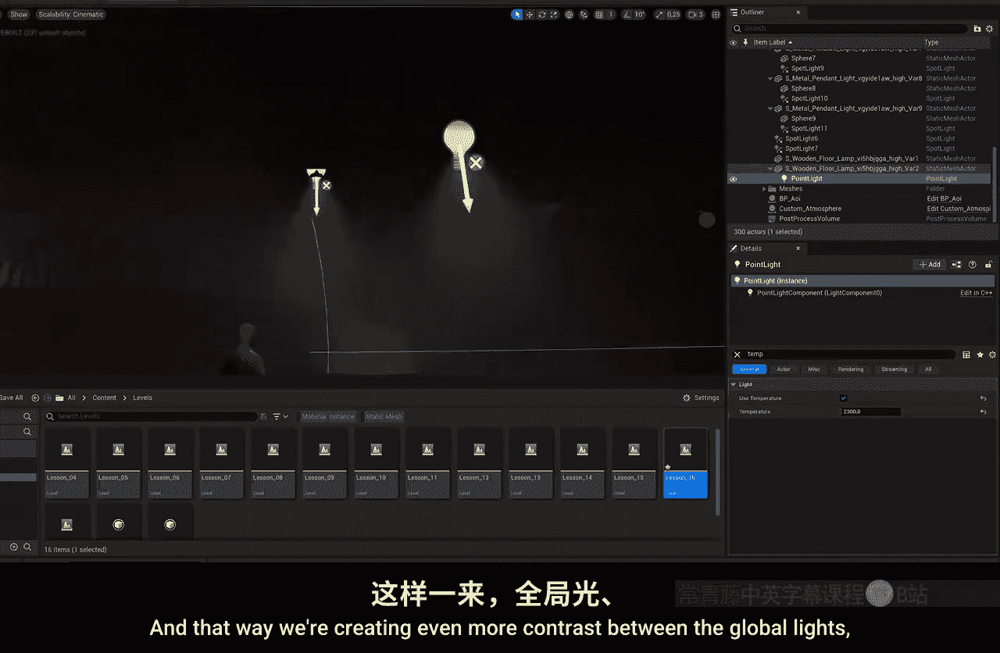
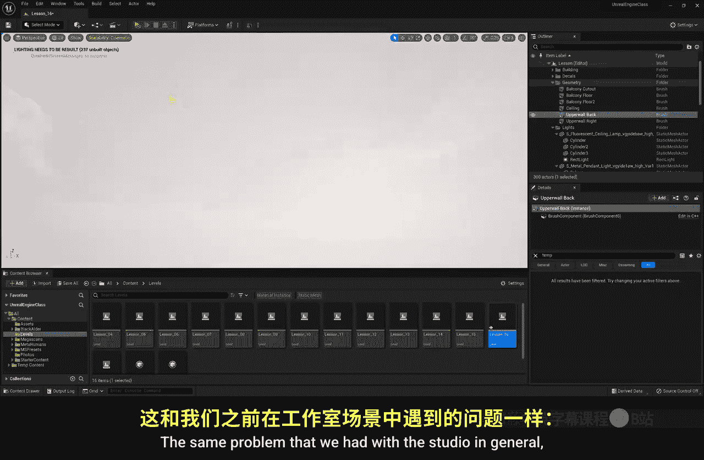

# 017：真实光照

在本节课中，我们将学习如何为室内场景设置真实的光照效果。我们将从调整大气雾效开始，到软化阴影，再到处理光照颜色对比，最后解决常见的光照问题，如光线泄漏和Lumen引擎的优化。

---

## 调整大气雾效

上一节我们介绍了基础光照的布置。本节中，我们来看看如何通过调整大气雾效来增强场景的氛围和深度。

我们之前创建的“自定义大气”蓝图中包含一个“指数高度雾”组件。调整其参数可以显著改变室内场景的观感。

以下是两个关键设置：

*   **消光比例**：此参数控制光线与雾气的交互强度。增加此值会使整个房间的照明更加均匀，光线在雾气中形成可见的体积光效果。
    *   **公式/代码表示**：在细节面板中找到 `Extinction Scale` 并提高其数值，例如从 `1.0` 调整到 `10.0`。
*   **发射颜色**：此参数控制雾气的颜色。通常建议保持接近白色，仅微调色温和亮度，以轻微提亮场景的暗部，而不会使画面显得过于艺术化。

通过调整这两个参数，我们可以为场景（例如一个老酒馆）增添合适的氛围感，使光照更加自然。

---

## 软化阴影

调整雾效后，场景的整体基调已经确立。然而，我们注意到场景中的阴影边缘非常锐利，这看起来不够真实。本节我们将学习如何软化这些阴影。

对于人造光源（如聚光灯），我们通过调整光源半径来软化阴影。

以下是操作步骤：

1.  在“大纲视图”中搜索并选中所有聚光灯。
2.  在“细节”面板中找到 **`Source Radius`** 参数。
3.  增加此值（例如调整到 `30`），阴影的边缘会立刻变得柔和自然。

对于自然光源（如模拟阳光的定向光），软化阴影的参数略有不同。

操作步骤如下：

1.  选中场景中的“定向光”（阳光）。
2.  在“细节”面板中寻找 **`Source Angle`** 和 **`Source Soft Angle`** 参数。
3.  适当增加这两个值（例如分别设为 `10`），可以软化阳光产生的阴影及其在物体表面的反射高光。

通过这些调整，场景中的阴影过渡会更加平滑，更符合真实世界中有大气介质时光线的表现。

---

## 创造颜色对比

阴影问题解决后，场景的光影结构已经完善。接下来，我们将通过颜色为场景增添层次感和视觉趣味。本节将介绍如何利用不同色温的光源创造对比。

一个有效的技巧是创建不同的光照层次，利用冷暖对比来丰富画面。

以下是构建颜色对比的方法：

*   **主体基调**：确定场景的整体色调。例如，一个老酒馆可以使用温暖的色温（如 `2800K`）作为基础。
*   **背景对比**：在背景区域（如二楼阳台）使用稍冷的光源（如 `3800K`），与前景的暖光形成对比，增加空间深度。
*   **点缀光源**：使用“道具光源”（即场景中可见的灯具，如台灯）。为其设置更极端的色温（如 `2300K`），使其在环境中脱颖而出，成为视觉焦点。
*   **特殊区域**：对于需要区别对待的区域（如后方的储藏室），可以使用风格化的颜色（如肮脏的荧光绿色）来进一步强化对比和叙事。

核心原则是保持色调的统一性，避免使用过多杂乱的颜色。在选定的主色调（如暖色调）框架内，通过冷暖、明暗的变化来创造丰富的层次，而不是制造“马戏团”般的效果。

---

## 解决光照问题

在完善了光照的艺术效果后，我们还需要解决一些技术性问题，以确保场景的正确渲染和良好性能。本节我们将处理两个常见问题：光线泄漏和Lumen引擎的优化警告。

第一个问题是**光线泄漏**，即光线穿透了本应不透明的几何体墙壁。

解决方法如下：

1.  选中发生泄漏的几何体墙壁。
2.  在“细节”面板中，点击 **`Create Static Mesh`** 按钮。
3.  这将把基础几何体转换为静态网格体，从而被引擎正确识别为实体，阻挡光线。

第二个问题是聚光灯上出现的**红色叉号警告**。这源于Unreal Engine 5的Lumen实时全局光照系统。

以下是关于此警告的说明和解决方案：

*   **问题根源**：Lumen系统能计算实时反射和间接光照，但当过多光源（通常超过3个）的光锥相互重叠时，系统会因计算负荷过大而标记警告，并可能影响反射精度和运行性能。
*   **方法一：调整光源**：可以逐一调整每个光源的衰减半径和光锥角度，确保它们互不重叠。但这可能改变既定的光照效果，并非理想方案。
*   **方法二：优化Lumen计算**：更实用的方法是改变光源的“移动性”。
    *   选中所有需要固定的光源。
    *   在“细节”面板中，将 **`Mobility`** 从 `Stationary` 改为 `Static`。
    *   这意味着告知引擎这些光源的位置和属性在整个场景中都不会改变。红色警告会立即消失。
    *   随后，点击顶部菜单栏的 **`构建` -> `构建光照`**。引擎将预计算这些静态光源的光照信息，从而大幅减轻实时计算负担，提升性能。

需要注意的是，如果场景中需要有动态变化（如闪烁、移动）的光源，则需将其保持为 `Movable` 或 `Stationary`。只需确保这类动态光源的数量不要过多，且避免它们的光锥大量重叠即可。对于静态布光场景，将主要光源设为 `Static` 是推荐的优化手段。

---

本节课中我们一起学习了打造真实室内光照的全流程：从利用大气雾效营造氛围，到软化阴影增强真实感，再到运用色彩对比提升画面艺术性，最后解决了光线泄漏和Lumen引擎性能优化这两个关键技术问题。掌握这些技巧，你将能够为你的虚幻引擎场景创建出既美观又高效的光照效果。