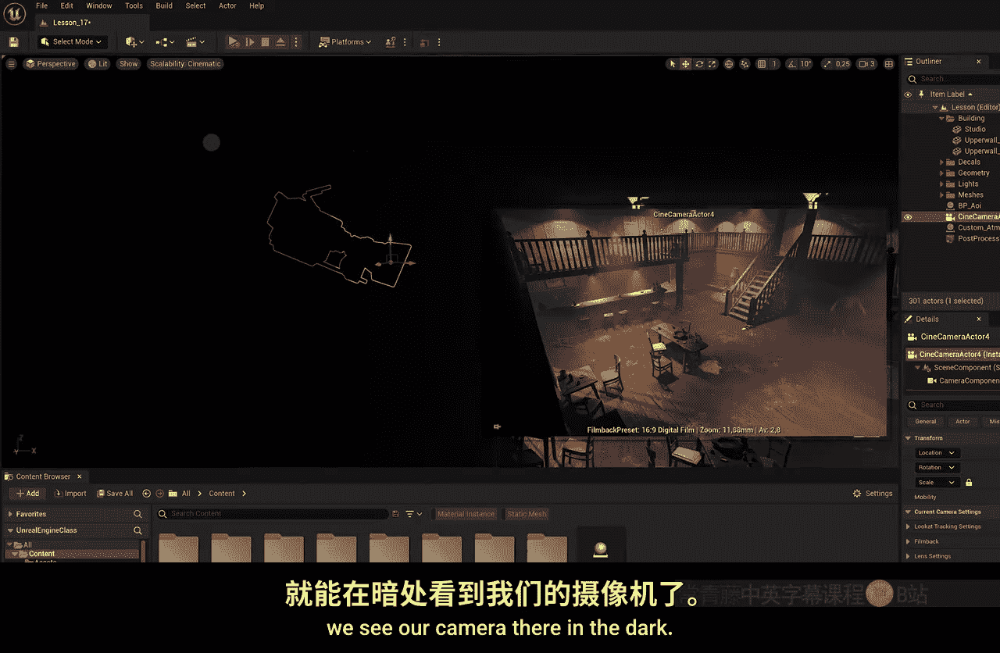
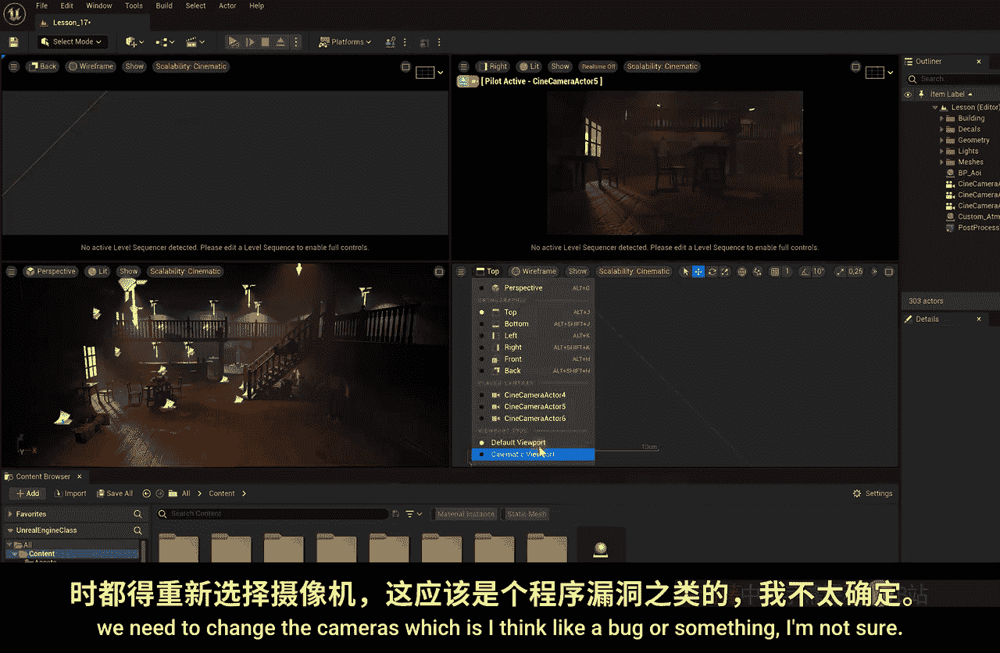
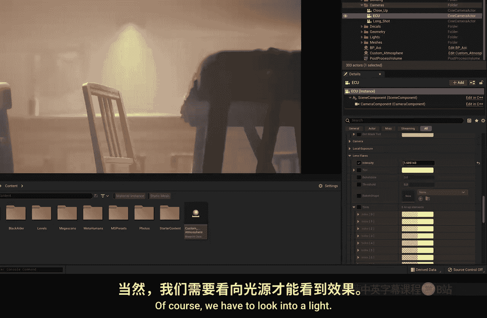
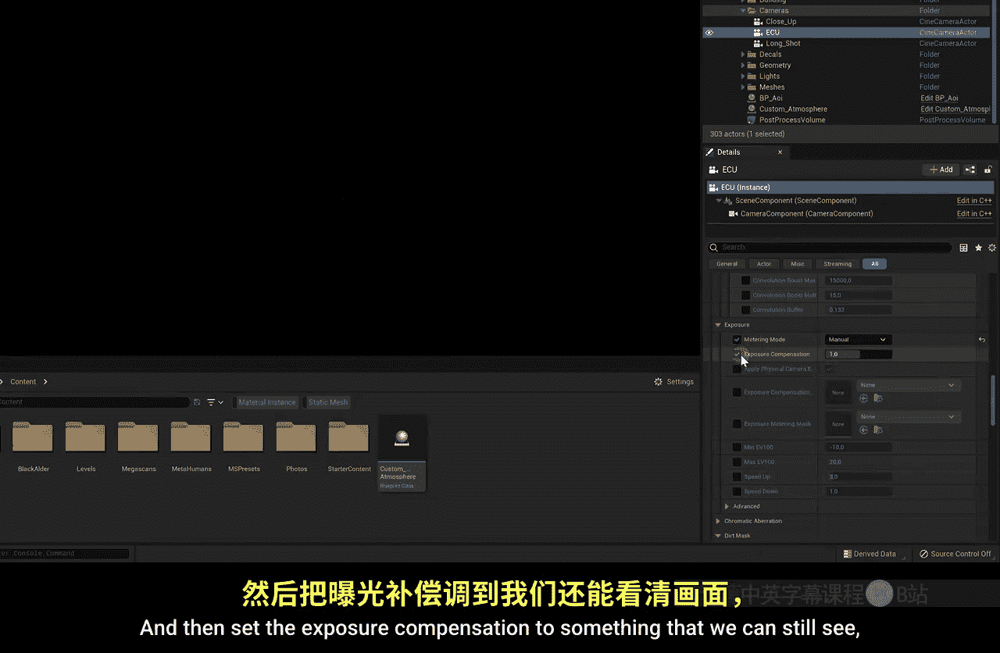

# 018：虚拟摄像机 🎥

在本节课中，我们将学习如何在虚幻引擎场景中创建和使用虚拟摄像机。这是将我们构建的场景转化为电影的关键一步。

## 概述

到目前为止，我们已经构建了一些非常酷的场景。但如何将其真正转化为电影呢？这正是我们使用虚幻引擎的核心目的。为此，我们需要虚拟摄像机来捕捉场景，这就是本节课的主题。

## 创建摄像机

在场景中创建摄像机有几种方法。

第一种方法是点击顶部的“添加”菜单，选择“电影”，然后选择“电影摄像机Actor”。这是你始终需要的一种摄像机，将其拖入场景即可。

电影摄像机提供了许多选项，可以调整诸如光圈、对焦或曝光等设置，这些都与物理摄像机的功能类似。

那么，第二种创建摄像机的方法是什么呢？让我们先删除刚才创建的摄像机，因为第二种方法更好。

第二种方法是：首先将你的常规视图（即你正在查看场景的视角）移动到你希望摄像机放置的角度。例如，从上方这里可能是一个不错的镜头角度。

然后，点击视图左上角的小菜单，你应该能找到“在此处创建摄像机”的选项。当然，我们再次选择“电影摄像机Actor”。顺便提一下，普通摄像机是电影摄像机的一个非常基础的版本，但我们希望有更多选项。

点击创建后，如果我们从角落缩回视图，就能在暗处看到我们的摄像机。或许将视图切换回“无光照”模式，以便更清楚地观察。很好，也许可以把摄像机从墙里稍微推出来一点。

## 查看摄像机视图

你可能会注意到，一旦选中摄像机，我们就能看到摄像机视角的预览。但每当我们选择其他物体时，这个预览就会消失。

为了让预览窗口保持显示，请选中你的摄像机，并确保点击下方这个小按钮来“固定”预览。

现在，我实际上可以选中场景中的一把椅子并移动它，同时仍然通过摄像机的视角看到调整效果，这非常方便。

不过，这个预览窗口很小，每次我想调整构图时，都需要选中摄像机并使用这里的锚点来移动或旋转它，这并不十分用户友好。

因此，我们还可以选择直接通过摄像机的视角来观察，而不是使用这个小预览窗口。我们可以通过更改这里的“透视”视图来实现：点击它，你应该能在列表中找到已放置的摄像机，例如“电影摄像机Actor”。点击后，你的视图就会切换到摄像机所看到的画面。

现在，我可以像在场景中自由移动一样，通过鼠标右键和键盘的WASD键来控制摄像机的移动，但实际上我是在控制摄像机本身。例如，我可以将摄像机放置到另一个位置，然后点击顶部的“弹出”按钮退出摄像机视图。现在，如果你移动回场景视图，就能看到摄像机已经站在新的位置了。

这是一种通过摄像机视角观察的好方法。你还可以随时将视图切换为“光照”模式，以便更好地观察摄像机看到的内容。

我们甚至还有一个选项：在退出摄像机视图后，不选择默认的视口，而是将其更改为“电影视口”。让我们看看通过摄像机视角的“电影视口”是什么样子。回到菜单，选择“电影摄像机Actor”。现在，我们处于电影视口中，可以看到摄像机实际记录的画面。这很好。

让我先退出这里，并将视口改回默认视口。接下来，我将再创建几个摄像机。

## 管理多个摄像机

也许在近处创建一个特写镜头。回到菜单，选择“在此处创建摄像机”。很好，也许再创建一个，比如一个全景镜头。

回到菜单，选择“在此处创建摄像机”。我总是这样创建我的摄像机，这比将它们拖入场景要好得多。

现在，我们的场景中有了三个摄像机。你可能会想，如何同时查看这三个摄像机的画面呢？因为目前这样并不实用。

别担心，虚幻引擎为一切提供了解决方案。如果我们点击右上角这里，可以看到我们有更多的视图选项。点击后，你会看到四个不同的视口。

我可以设置每个视口都显示一个摄像机的视图。例如，这个视口默认使用的是“透视”视图，但如果我们点击它，可以将其更改为“摄像机Actor 4”。我们可以将这个改为“摄像机Actor 5”，最后一个改为“摄像机Actor 6”。

现在，我实际上可以同时查看所有这些摄像机的画面。同时，我还可以使用左下角的视口作为我的常规控制器，在场景中自由移动。这非常有用。

当然，我们也可以为每个摄像机设置电影视口。每次这样做时，都需要重新选择摄像机，因为切换视口类型会重置摄像机选择。所以，让我们先为所有视口设置为电影视口，然后再选择摄像机。

现在，我们得到了每个摄像机的电影视口视图，并且我们仍然拥有可以正常工作的场景视图。我们可以抓住任何一个摄像机移动它，可以看到这里会实时更新我选中的摄像机视图。

## 使用多显示器布局

也许你有一个第二显示器，你可能会想：我能不能把我的主要工作区放在这里，然后把所有摄像机的不同视口放在第二显示器上？当然可以，正如我之前所说，虚幻引擎考虑到了所有需求。

我们可以最大化这些视口框架中的一个。例如，我们选择正在工作的那个常规视口，点击这个“最大化”按钮。

然后，点击顶部菜单栏的“窗口”，从那里选择“视口”。我们可以打开另一个视口，比如“视口2”，这将打开第二个窗口，其功能与这里的视口完全相同。

例如，我们可以设置这个窗口显示摄像机4，那个显示摄像机5，另一个显示摄像机6。现在，我们可以将这个窗口拖到我的第二显示器上（如果你有的话）。当然，如果你只使用一个显示器，也可以最大化其中一个视口，这样就能全屏查看摄像机画面了。

以上就是关于摄像机控制、如何创建多个摄像机、如何移动它们以及如何正确查看它们的内容。

## 摄像机设置选项

接下来，让我们看看一些摄像机选项。选项并不多，我认为大多数都一目了然。

让我们以这个摄像机为例，或者这个更近的摄像机来演示，可能会更好一些。

选中这个摄像机后，你可以在大纲视图中看到我们现在有三个摄像机。顺便说一下，它们的编号很奇怪，从4开始。这是因为在我开始录制这节课之前，我进行了一些准备，已经创建了三个摄像机。但你的应该显示为1、2和3。

你可以重命名这些摄像机，例如“特写镜头”或“中景镜头”。让我快速操作一下：这个是“远景镜头”，这个是“极端特写”。我把它们都放到一个文件夹里，在下一节课这些名字更重要时，我会想一个更好的名字。

好了，摄像机都放在一起了。让我们继续处理那个“极端特写”摄像机，虽然它现在还不是真正的极端特写，但我们会确保它成为特写。

在该摄像机的“细节”面板中，我们可以找到几个选项。

*   **胶片背板**：这是胶片的尺寸，例如8毫米、60毫米，或者像APS-C、全画幅、微四三等，这取决于你的选择。
*   **镜头设置**：这个非常有趣。我们可以从预设中选择，比如是变焦镜头还是定焦镜头。例如，当我选择50毫米定焦时，我实际上不能再更改焦距了，你可以看到这里被锁定了。这是因为如果我们展开“镜头设置”属性，你可以看到这里设置了最小和最大焦距，两者都设为50。如果我将最小值设为10，最大值设为70，那么我现在就可以更改实际的焦距了，我可以调到最大值70或最小值10。光圈设置也是如此，我可以设置最小光圈值和最大光圈值，然后在这两者之间选择一个当前光圈值。例如，我可以将其设置为f/1.8，这样我们就能获得更浅的景深效果。如果我们再放大到50毫米，你肯定能在这里看到效果。

请记住，你需要设置镜头的基本属性，然后选择镜头当前的参数设置。

让我收起这个设置，再看看对焦设置。

## 对焦与特效

我们有几个对焦设置。目前设置为“手动”，这意味着如果我们更改这个值，可以选择对焦点在哪里。在我的视口中可以看到物体在变化，但这并不十分实用。我们也可以使用这里的“选取器”来实际选择场景中的一个物体，比如椅子，它会将对焦点设置到那把椅子上。

当然，如果我向后移动，它会保持在我选择的那个点的对焦距离上，所以在某个点上，那把椅子会失焦。我也可以将对焦方法更改为“追踪”。如果这样做，我也可以再次选择场景中的一个Actor，比如同一把椅子，现在它会追踪那把椅子。所以如果我向前移动，它会确保椅子保持对焦；同样，如果我向后移动，它也会保持对焦。非常酷。

以上就是摄像机本身的大部分设置。我们还有像曝光之类的设置，但你需要问自己一个问题：我是要通过摄像机来设置曝光，还是像之前看到的那样通过后期处理体积来设置？你必须将后期处理体积视为全局设置，这是为我所有摄像机提供的设置。如果你有某个特定摄像机需要特别设置的参数，那么你需要在摄像机内部进行设置。

因此，通常我不会去碰摄像机的曝光设置，而是使用后期处理体积。但我可能会在摄像机中设置其他东西，比如光晕。

我们可以在底部看到一个名为“泛光”的选项，需要将其打开以创建光晕效果。我们可以启用它。我们有几种不同的方法来指定我们想要哪种泛光效果，当然还有强度。我们可以增加强度来获得更多或更少的场景泛光。

启用泛光后，我们还可以转到“镜头光晕”设置。启用它并增加镜头光晕强度。当然，我们需要看向一个光源。这里有阳光，所以你可以看到我们得到了漂亮的镜头光晕。我增加这个值越多，得到的镜头光晕就越多。但这可能是我在某些摄像机中不想要或不希望那么突出的效果，所以这就是在摄像机本身设置而不是在后期处理体积中设置的原因。

我们还可以更改镜头光晕的颜色。也许可以添加一个蓝色调，这非常酷，可以尝试一下。

当然，曝光设置也很重要，因为一旦你开始使用像泛光和镜头光晕这样的效果，你的画面也会变得更亮。所以，这又是一个理由来覆盖后期处理体积的曝光设置。

让我在这里启用它，将测光模式设置为“手动”（顺便说一下，你总是希望选择手动），然后将曝光补偿设置为一个我们仍然能看到东西但保持黑暗的值。你可以在这里看到这些镜头光晕如何漂亮地跟随你摄像机的运动。

虚幻引擎总是先查看摄像机的设置，然后再查看后期处理体积。所以，你不能用后期处理体积覆盖摄像机的设置，但你可以用摄像机覆盖后期处理体积的设置。如果这说得通的话。

## 总结

总而言之，这就是摄像机。没有更多内容了。你可以浏览所有这些设置，我们还有像“色差”这样的设置，但我们在后期处理体积中已经见过这些东西，它们大多相同，只是在这里为每个摄像机单独设置。

好了，本节课的内容就到这里。在下一节课中，我们将开始为这些摄像机制作动画。那才是真正有趣的地方。我们将设置关键帧，移动它们来制作非常酷的轨道镜头等等，非常棒。我们下节课见。