# 019：摄像机动画与序列器使用

在本节课中，我们将学习如何在虚幻引擎中使用**序列器**来创建摄像机动画和物体动画。我们将从创建序列器开始，逐步学习如何添加摄像机、设置镜头切换、以及为摄像机和场景物体添加关键帧动画。

---

## 概述

上一节我们学习了如何放置和设置摄像机。本节中，我们将利用**序列器**工具，将这些静态摄像机连接起来，制作成一段动态的影片。我们会学习如何添加摄像机到时间线、设置镜头切换点，以及如何为摄像机和场景中的物体（如烟灰缸）创建位置和旋转动画。

---

## 创建并设置序列器

首先，我们需要创建一个**序列器**来管理我们的动画时间线。

1.  在**内容浏览器**中右键点击，选择 **动画 > 关卡序列**。
2.  将新创建的文件命名为 `MyAnimation` 并双击打开。

打开序列器后，你会看到一个空的时间线。与Premiere或After Effects类似，你可以在这里编排动画。默认情况下，序列器是空的，因为你需要手动添加想要动画化的**演员**。

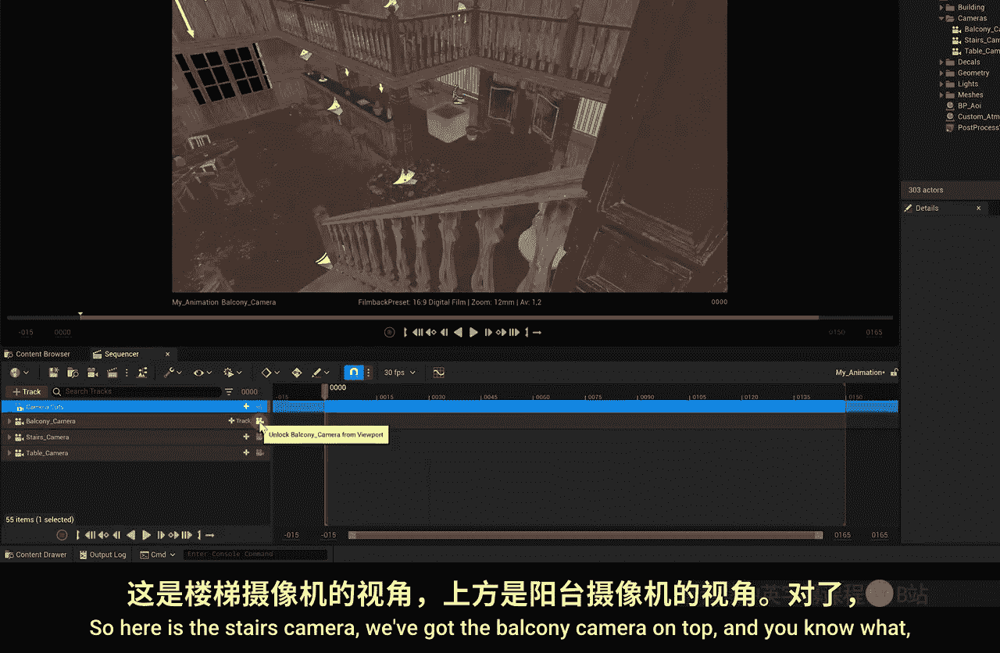

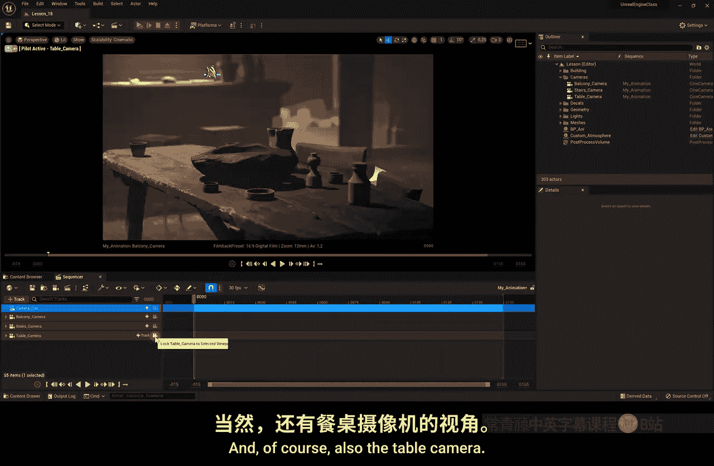

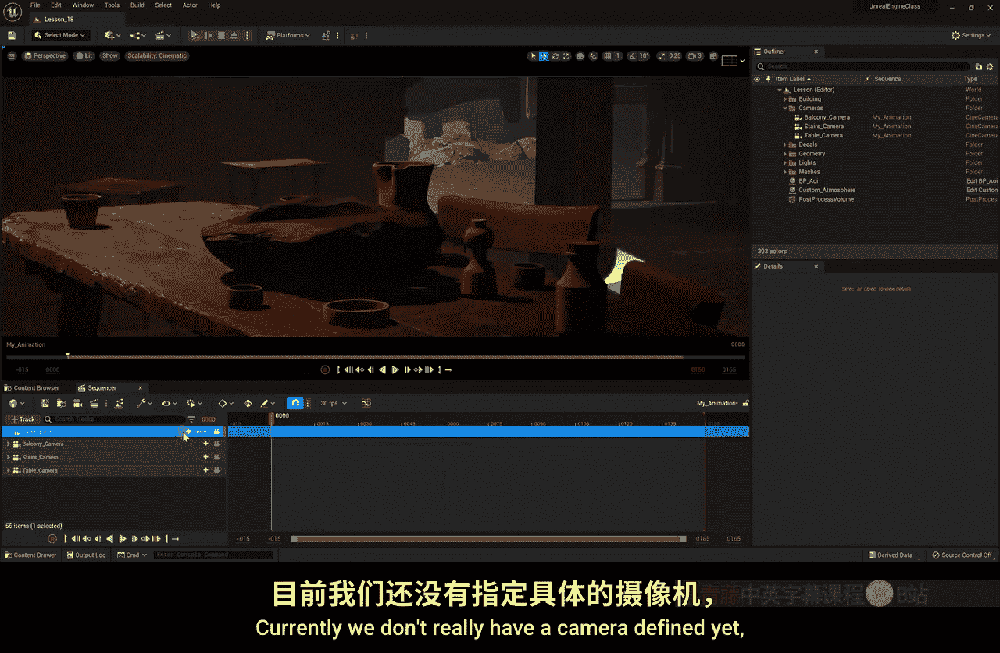

以下是向序列器添加演员的两种方法：
*   点击轨道按钮，选择 **演员到序列器**，然后从下拉菜单（即大纲视图列表）中选择要添加的物体。
*   更简单的方法是：直接从**大纲视图**中选中你的三个摄像机，然后将它们拖拽到序列器窗口中。

添加后，序列器中会出现三个摄像机轨道以及一个额外的**摄像机切换**轨道。如果误删了摄像机切换轨道，可以通过点击 **轨道 > 摄像机切换轨道** 重新添加。

通过点击每个摄像机轨道旁边的摄像机图标，你可以在视口中查看该摄像机的视角。

---

## 设置摄像机镜头切换

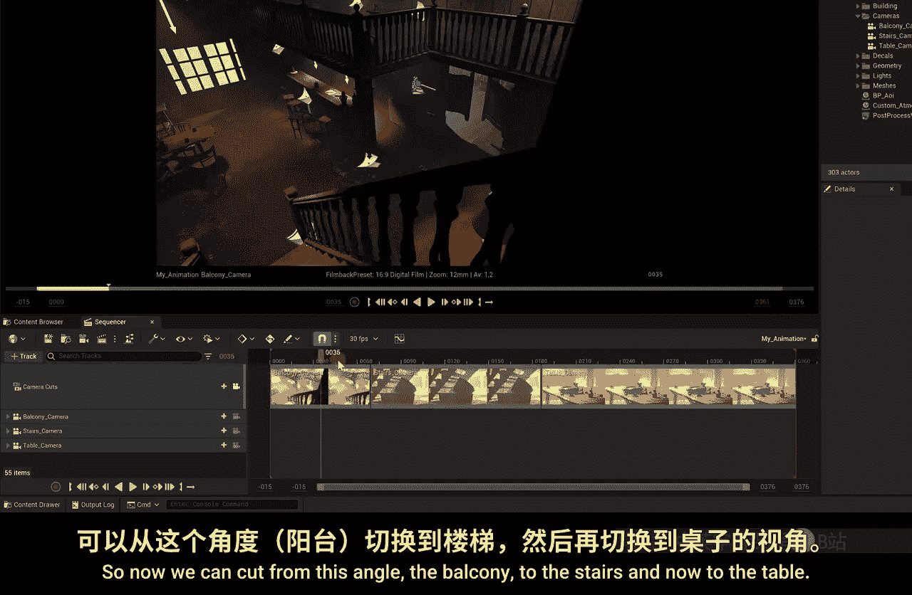

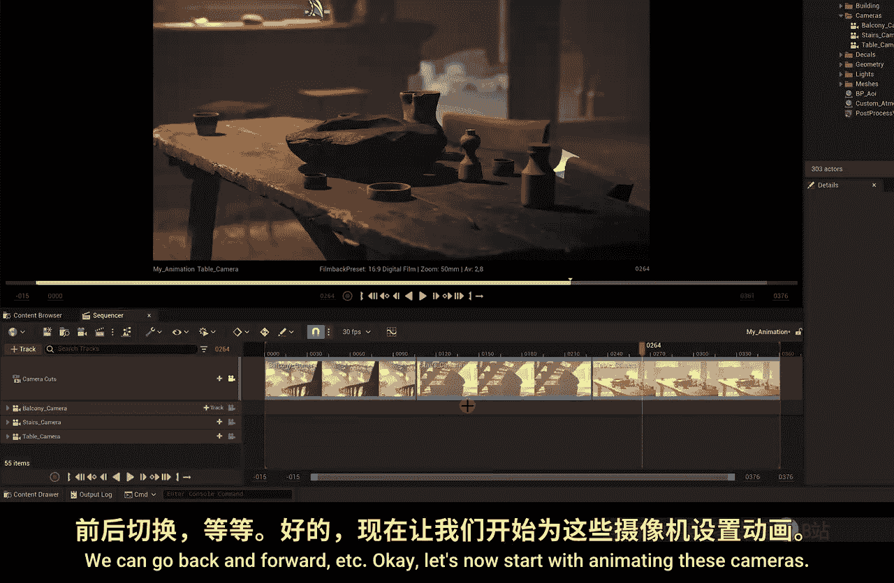

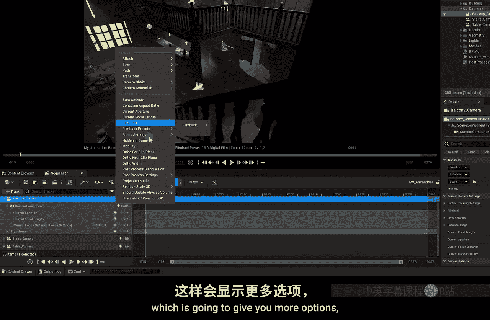

现在，我们来安排镜头的切换顺序。

1.  在**摄像机切换**轨道上，点击 **+摄像机** 按钮。
2.  从下拉列表中选择一个摄像机，例如 `BalconyCamera`。此时，视口会切换到这个摄像机的视角。
3.  将时间轴播放头移动到你想切换镜头的位置。
4.  再次点击 **+摄像机** 按钮，选择下一个摄像机，例如 `StairsCamera`。

序列器会自动在时间线上创建一个**剪切点**。你可以左右拖动这个剪切点来调整每个镜头的时长。

如果需要延长整个时间线的长度，可以拖动时间线右上角的端点，或者缩放时间线显示范围。

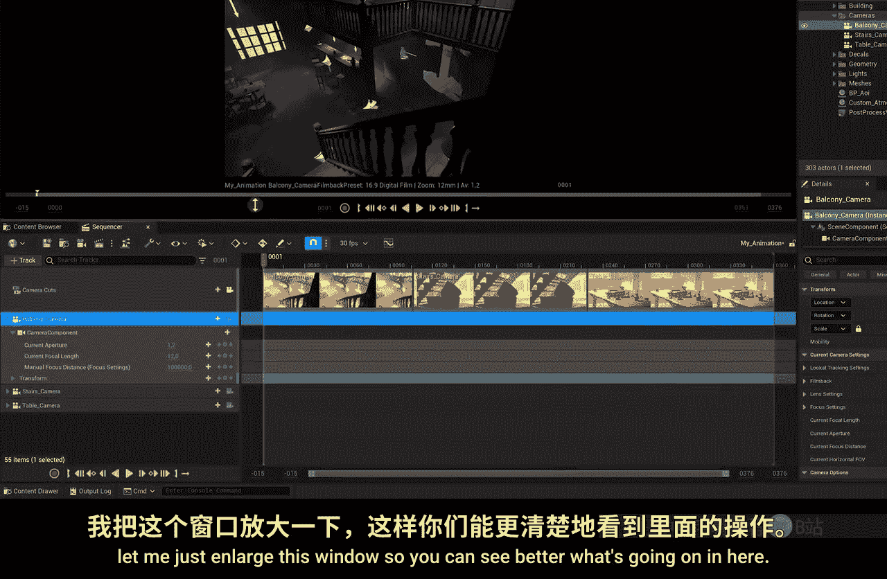

---

## 为摄像机添加动画

接下来，我们让摄像机动起来。我们将为每个摄像机的位置和旋转添加关键帧动画。

以第一个镜头（阳台摄像机）为例：
1.  在序列器中展开 `BalconyCamera` 轨道。
2.  展开其**变换**属性，你会看到**位置**和**旋转**参数。
3.  将播放头移动到镜头起始位置，点击位置和旋转参数旁边的**菱形按钮**（或按`S`键）设置初始关键帧。
4.  将播放头移动到镜头结束位置。
5.  在视口中移动或旋转摄像机，或者直接在序列器中修改**位置**（X, Y, Z）和**旋转**（Pitch, Yaw, Roll）的数值。

修改数值后，序列器会自动在当前位置创建新的关键帧。点击播放，即可预览摄像机的运动。

对 `StairsCamera` 和 `TableCamera` 重复此过程，为它们也创建简单的移动或旋转动画。

**注意**：如果你想制作变焦动画，需要先检查摄像机的设置。确保在摄像机细节面板的**镜头设置**中，焦距不是固定值，而是有一个范围（例如40-60mm）。这样你才能在序列器中通过关键帧改变 `Current Focal Length` 的值来实现推拉镜头效果。

---

## 为场景物体添加动画

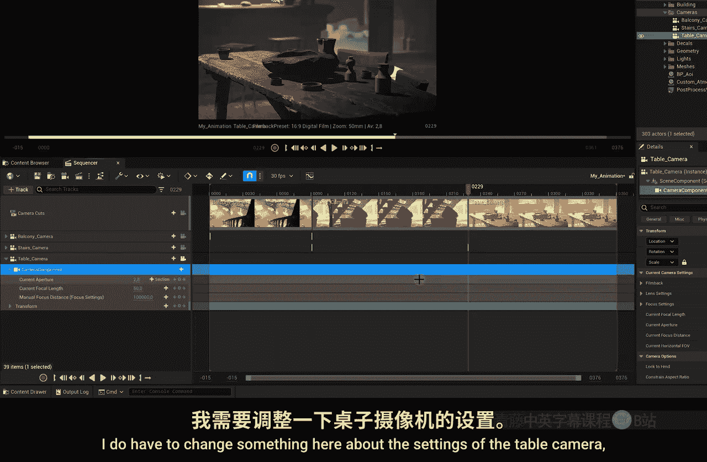

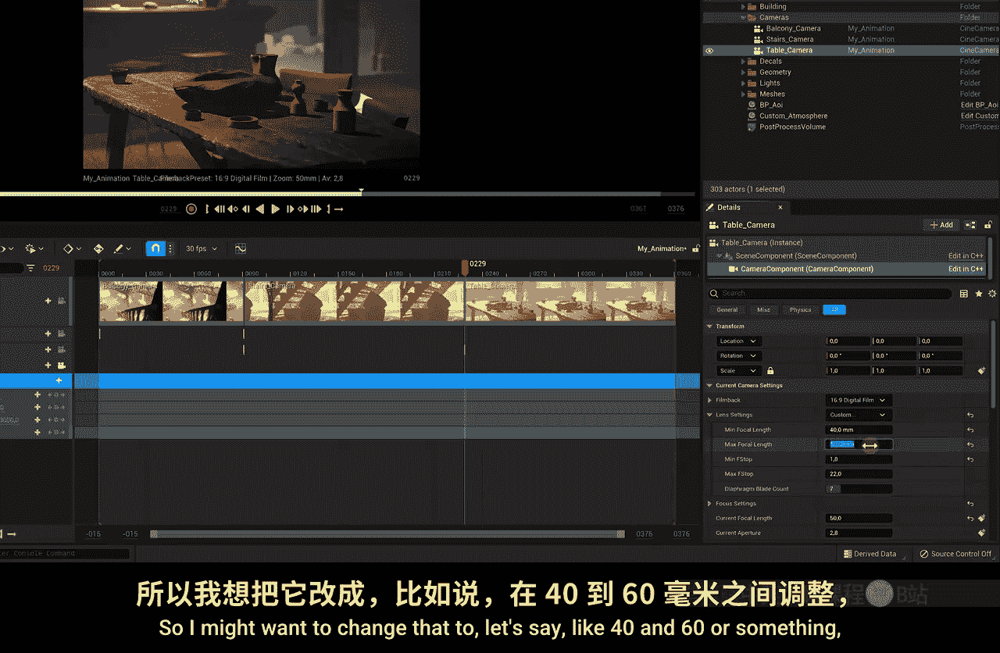

除了摄像机，你还可以动画化场景中的任何物体。

1.  从大纲视图中将一个物体（例如 `Ashtray`）拖入序列器。
2.  展开其轨道，找到**变换**属性。
3.  同样地，在时间线上设置起始和结束关键帧，并改变物体的位置或旋转值。

例如，你可以让烟灰缸从桌面缓缓升起并旋转，营造出漂浮的魔幻效果。如果关键帧放错了位置，只需选中它们并拖动到正确的时间点即可。

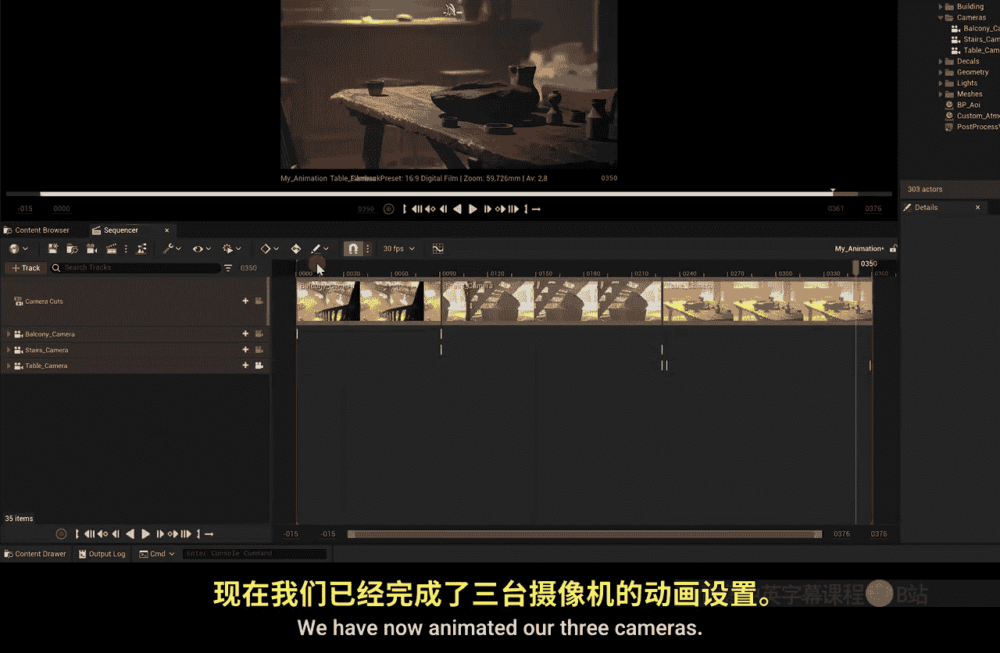

---

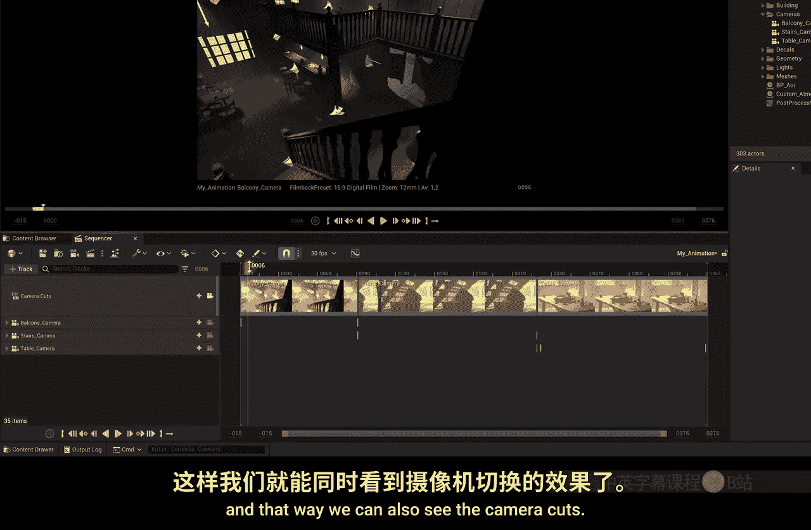

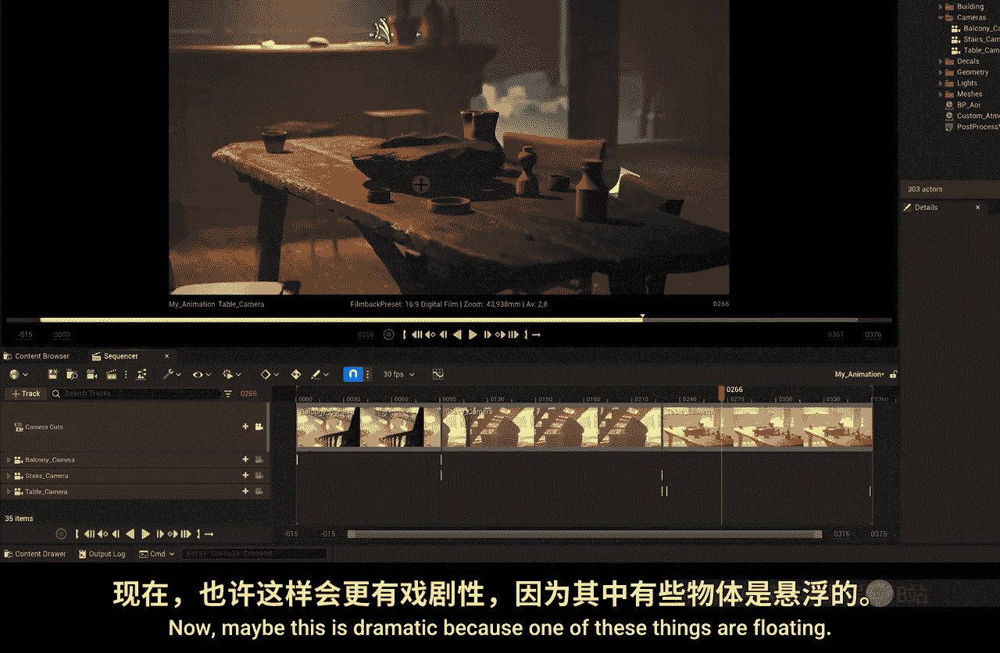

## 预览最终序列

完成所有动画后，确保**摄像机切换**轨道覆盖了整个时间线，并且切换点与你的镜头设计相符。

点击序列器上的播放按钮，即可预览整个动画序列：从阳台镜头快速切换到楼梯下的镜头，最后以一个带有希区柯克式变焦的戏剧性桌面镜头结束，期间还有一个漂浮的烟灰缸作为点缀。

---

## 总结

本节课中，我们一起学习了虚幻引擎**序列器**的核心工作流程：
1.  创建**关卡序列**并添加需要动画的演员。
2.  使用**摄像机切换**轨道编排镜头顺序。
3.  通过为**变换**属性（位置、旋转）设置关键帧，为摄像机和物体创建动画。
4.  调整关键帧位置和镜头剪切点以控制动画节奏。

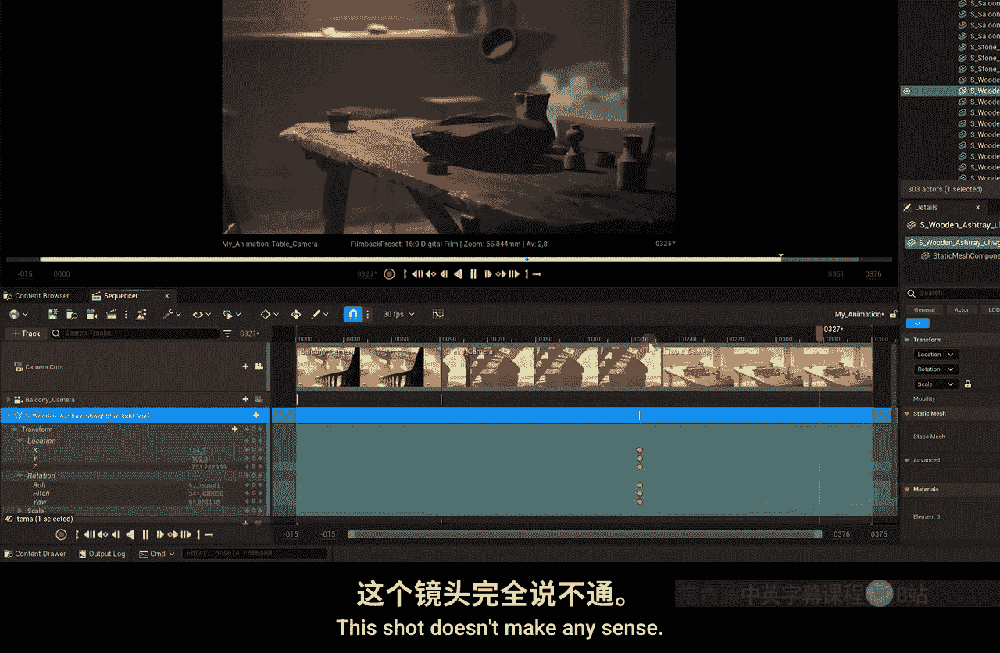

请尝试放置多个摄像机，为它们设计运动路径，并动画化一个场景物体，以熟悉序列器的操作。在下一课，我们将探索更高级的功能，例如如何将真实世界的动作捕捉数据应用到虚幻引擎的摄像机中。