# 020：摄像机跟踪 📱

在本节课中，我们将学习如何使用iPhone作为虚拟摄像机控制器，通过其陀螺仪和屏幕控件来实时操控虚幻引擎内的摄像机，并录制带有手持感的镜头动画。虽然这个功能很酷，但因为是新技术，过程中可能会遇到一些“小麻烦”，我们会一起解决它们。

## 概述

我们将通过虚幻引擎的Live Link和虚拟摄像机系统，将iPhone变成一台虚拟摄像机。目标是让摄像机跟随一个烟灰缸的动画上升，同时模拟真实的手持摄像机运动感。

---

## 设置Live Link与iPhone连接

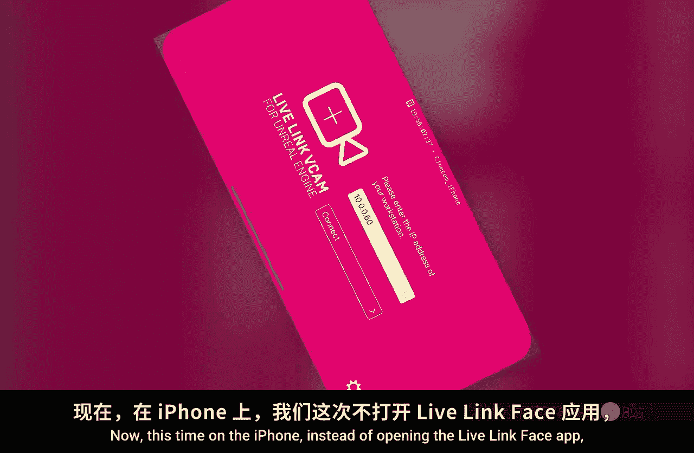

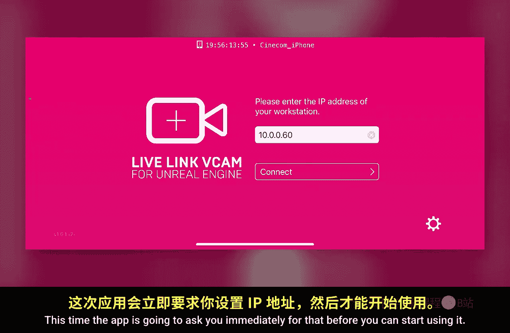

上一节我们介绍了如何在场景中制作动画。本节中，我们来看看如何将外部设备连接到虚幻引擎。

首先，我们需要设置iPhone与虚幻引擎之间的连接。

1.  在虚幻引擎中，打开 **窗口(Window)** 菜单。
2.  导航到 **虚拟制片(Virtual Production)**，然后点击 **Live Link** 打开面板。
3.  在iPhone上，这次需要打开 **Live Link Vcam** 应用（可在App Store免费下载），而不是Face应用。
4.  在Vcam应用中，输入电脑的IP地址。**注意：** 此时不要点击“连接(Connect)”，仅设置IP地址即可。

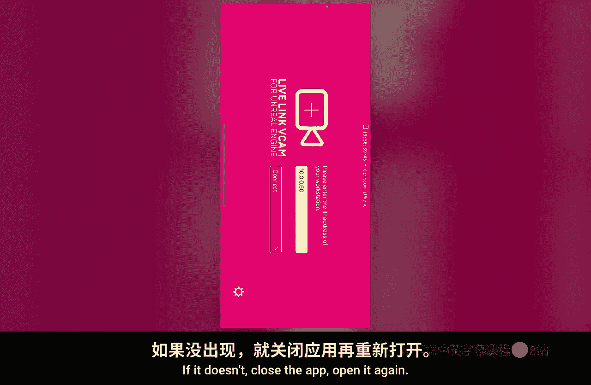

以下是连接步骤的要点列表：
*   在引擎中打开Live Link面板。
*   在iPhone上打开Live Link Vcam应用并设置IP地址。
*   回到引擎的Live Link面板，在“源(Source)”下选择“消息总线源(Message Bus Source)”。
*   你的iPhone设备应该会出现在列表中。如果未出现，请尝试关闭并重新打开iPhone上的应用几次。
*   点击列表中的iPhone设备，将其添加到Live Link。

连接成功后，可以暂时关闭Live Link面板。**切记仍不要点击iPhone应用上的“连接”按钮。**

---

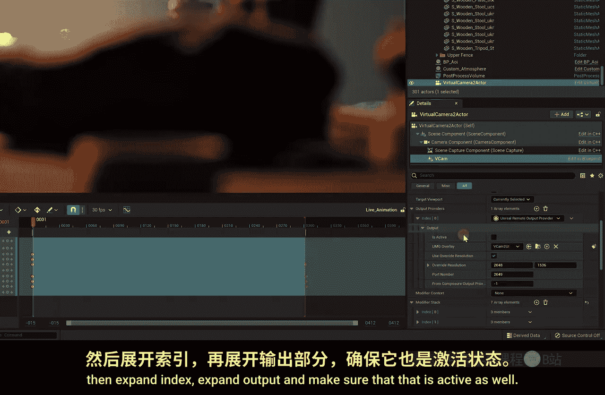

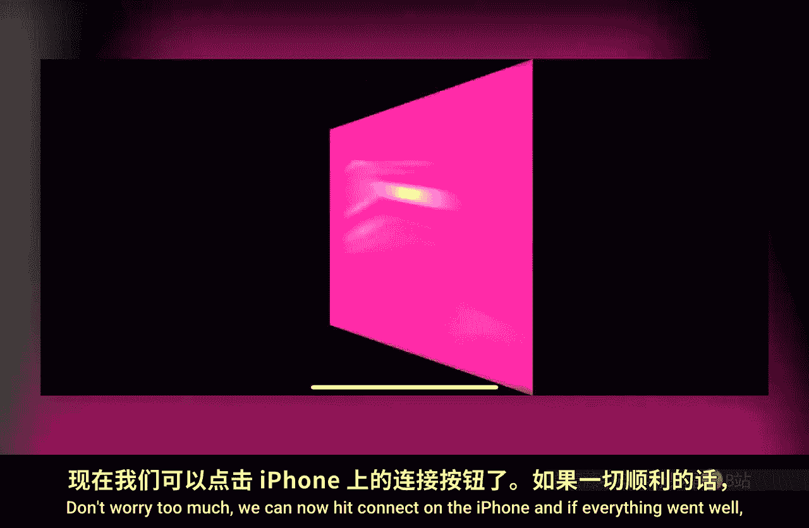

## 创建并配置虚拟摄像机

现在，我们需要在场景中放置一个特殊的摄像机。

1.  在顶部“放置Actor(Place Actors)”面板中，找到 **虚拟制片(Virtual Production)** 分类。
2.  从中拖拽 **虚拟摄像机(Virtual Camera)** Actor到场景中。
3.  选中这个新创建的虚拟摄像机Actor，在“细节(Details)”面板中找到其组件下的 **Vcam** 组件并选中它。
4.  将 **虚拟摄像机(Virtual Camera)** 属性设置为 **启用(Enabled)**。
5.  将 **LiveLink主题(LiveLink Subject)** 设置为你的iPhone设备。

接下来是关键设置，以避免错误：

1.  在Vcam组件的细节面板中向下滚动，找到 **输出(Output)** 属性。
2.  展开 **输出(Output)** 和 **索引0(Index 0)**，确保 **激活(Active)** 选项被勾选。

完成以上设置后，现在可以点击iPhone Vcam应用上的 **连接(Connect)** 按钮了。如果一切顺利，你将能通过移动手机来控制场景中的摄像机视角。

---

## 使用iPhone控制摄像机

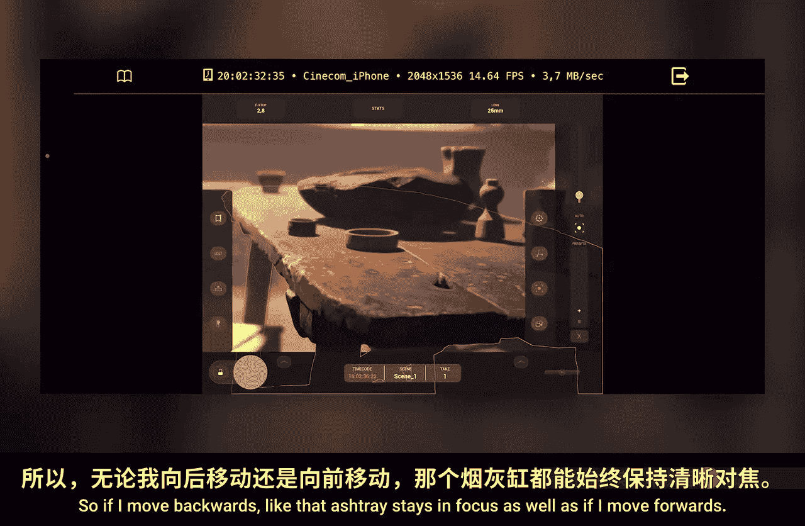

连接成功后，你可以在iPhone屏幕上看到控制界面。

以下是界面上的主要控制功能：
*   **镜头设置(Lens Settings)**：点击顶部按钮可以调整焦距（变焦）。
*   **摇杆控制(Joystick Controls)**：点击底部按钮可调出虚拟摇杆，用于在场景中前后左右移动摄像机。
*   **对焦设置(Focus Settings)**：屏幕右侧提供对焦选项。
    *   **手动对焦(Manual Focus)**：可以手动调整焦点，营造景深效果。
    *   **自动对焦(Autofocus)**：启用后，屏幕中心的小矩形框会自动对焦于其覆盖的物体。

你可以使用摇杆调整摄像机位置，找到一个合适的构图。对焦功能可以帮助你让画面主体更突出。

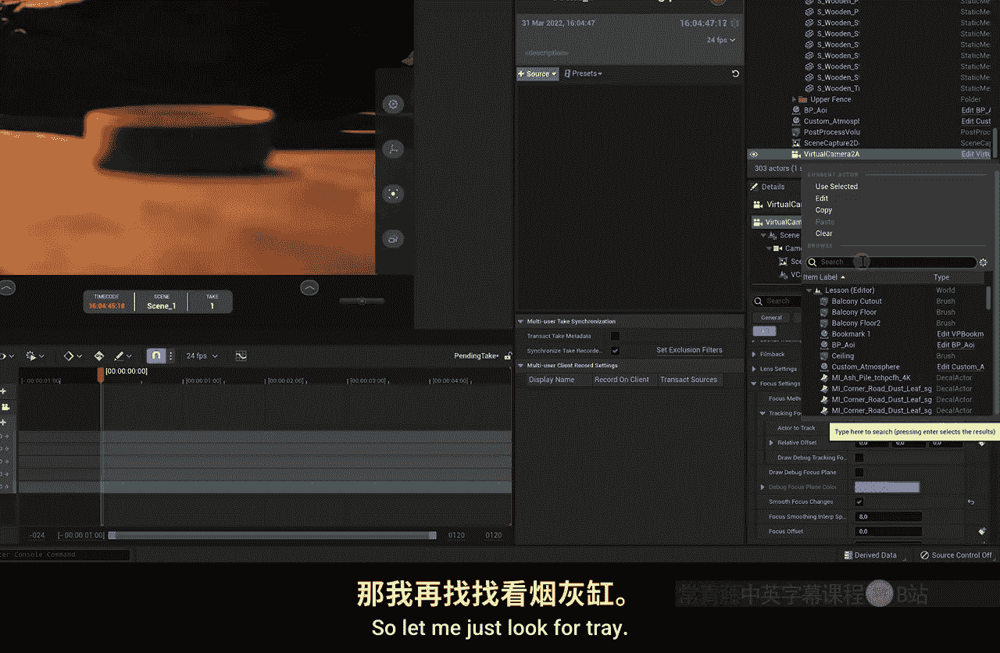

---

## 设置摄像机跟踪特定物体

我们希望摄像机在移动时，能始终对焦在烟灰缸上，而不仅仅是使用手动或中心点自动对焦。

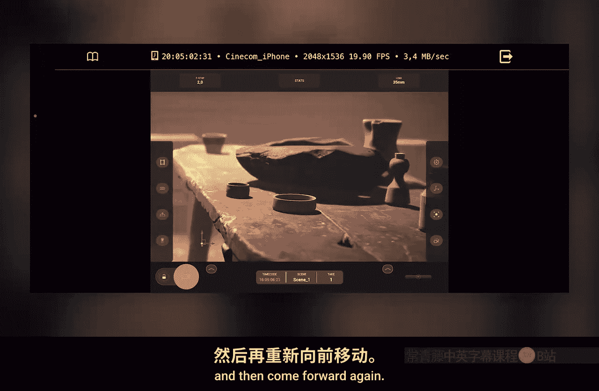

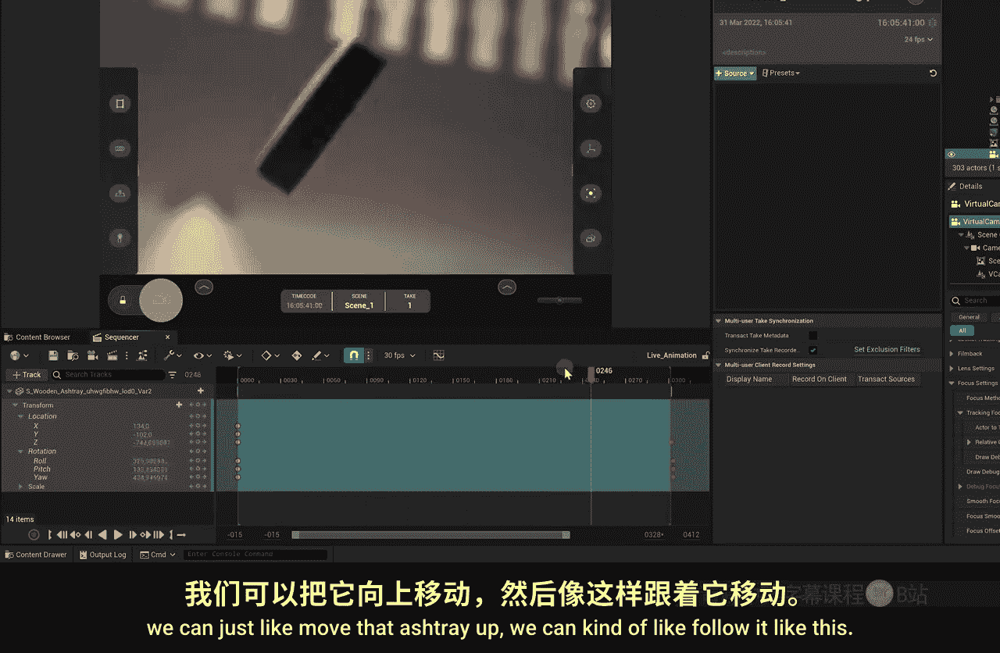

但通过iPhone应用无法直接设置物体跟踪，需要在虚幻引擎内部完成，并防止手机设置覆盖它。

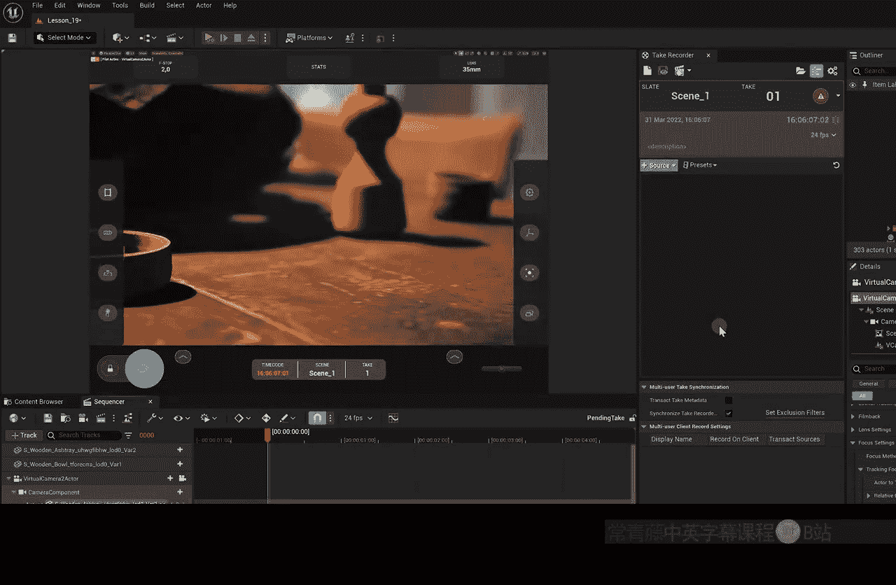

1.  在场景中选中 **虚拟摄像机(Virtual Camera)** Actor（不是Vcam组件）。
2.  在细节面板中找到 **摄像机设置(Camera Settings)** 下的 **对焦(Focus)** 设置。
3.  你会发现，如果将 **对焦方法(Focus Method)** 从“手动(Manual)”改为“跟踪(Tracking)”，它会自动重置。这是因为iPhone的Vcam设置覆盖了它。
4.  要解决此问题，先选中虚拟摄像机的 **Vcam组件**。
5.  向下滚动找到 **修改器堆栈(Modifier Stack)**，其中应有一个名为 **镜头(Lens)** 的修改器。这个修改器控制着所有镜头相关设置。
6.  **禁用(Disable)** 这个“镜头(Lens)”修改器。这将阻止iPhone覆盖对焦设置。
7.  再次选中虚拟摄像机Actor的根节点，回到 **对焦(Focus)** 设置。
8.  现在可以将 **对焦方法(Focus Method)** 设置为 **跟踪(Tracking)**。
9.  点击 **拾取跟踪的Actor(Pick Actor to Track)** 按钮，然后在场景中点击烟灰缸物体。

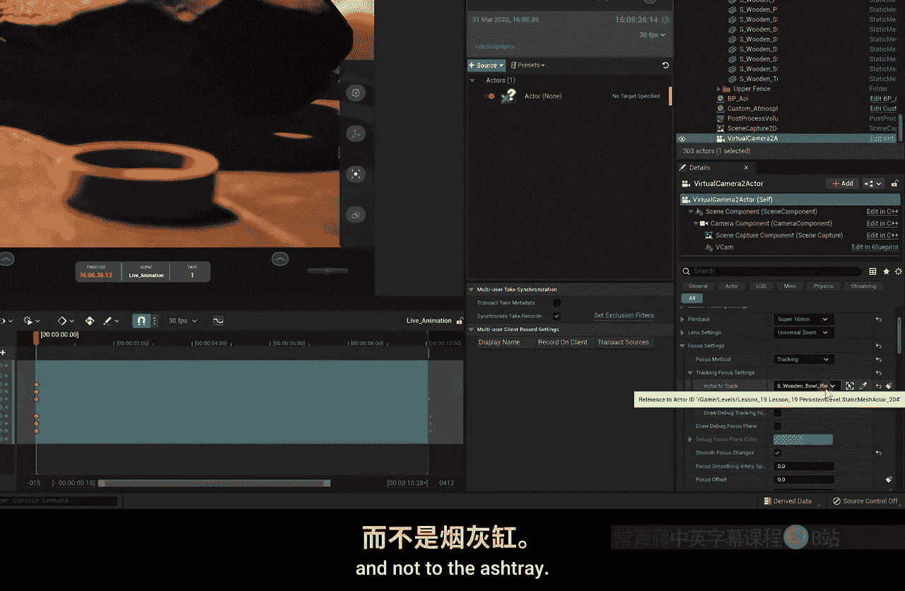

现在，无论你如何移动iPhone，摄像机都会保持对烟灰缸的对焦。

---

## 录制摄像机动画到序列器

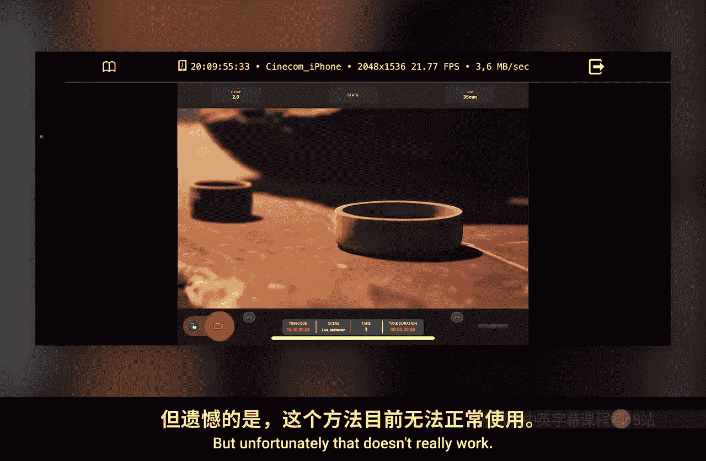

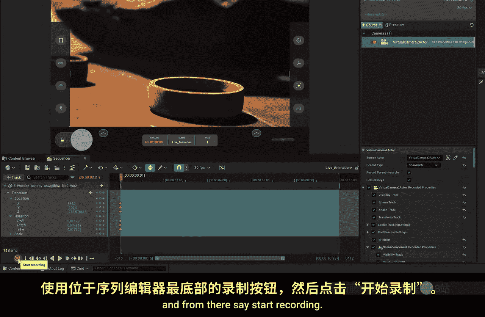

我们想将iPhone的摄像机运动录制到已有的动画序列中。

1.  确保 **Take Recorder** 窗口是打开的（连接iPhone后通常会自动打开）。
2.  在Take Recorder顶部的下拉菜单中，选择你预先创建好的动画序列（例如“LiveAnimationSequence”）。
3.  在Take Recorder中，点击 **源(Source)**，然后选择你要录制的Actor（即虚拟摄像机）。你也可以直接从“世界大纲视图(Outliner)”中将虚拟摄像机拖入Take Recorder窗口。
4.  **注意：** 虽然iPhone应用有录制按钮，但为了确保与序列同步，我们使用引擎内的录制按钮。
5.  在 **Level Sequence** 窗口（或Take Recorder）底部，点击 **开始录制(Start Recording)** 按钮。
6.  确认提示后，会出现倒计时。在倒计时期间，让烟灰缸开始动画（上升），同时用iPhone摄像机跟随它。
7.  录制完成后，点击停止按钮。

**常见问题解决：** 录制后，可能会失去与摄像机的连接或控制。
*   每次录制都会生成一个新的摄像机Actor。选中任意一个虚拟摄像机Actor。
*   在其Vcam组件设置中，将 **输出 > 索引0 > 激活(Output > Index 0 > Active)** 先取消勾选，再重新勾选。这通常能恢复连接和控制。

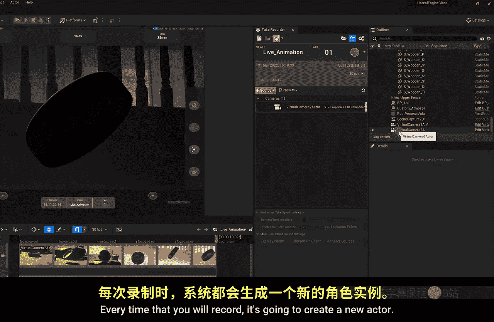

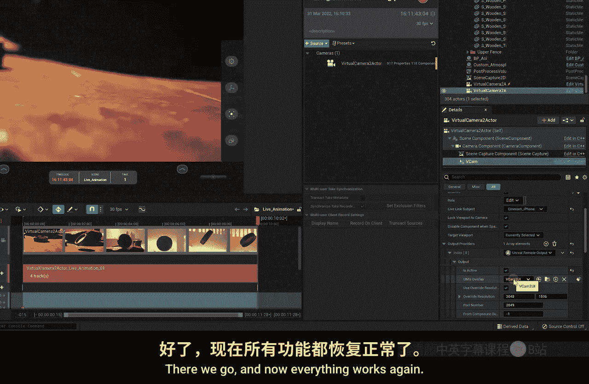

---

## 最终调整与渲染

录制完成后，预览序列时可能会发现iPhone的控制界面也显示在画面中。

1.  在场景中选中**原始的**虚拟摄像机Actor（不是序列中生成的那个带闪电图标的）。
2.  在其Vcam组件设置中，找到 **输出 > 索引0 > 激活(Output > Index 0 > Active)**。
3.  在进行最终渲染前，**取消勾选“激活(Active)”**。这样，控制界面就会从视口中消失，但所有摄像机运动数据都会保留。
4.  将视口视角设置为“电影视口(Cinematic Viewport)”，然后播放序列，检查最终效果。

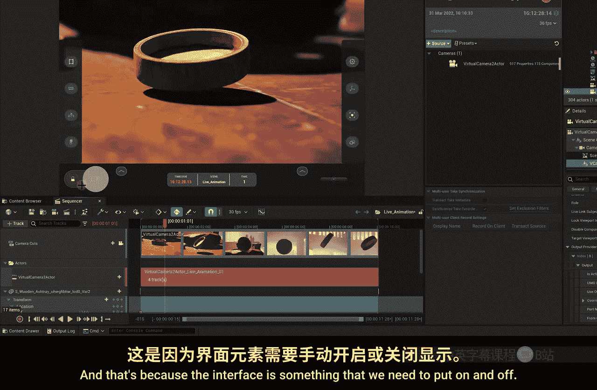

---

## 总结

本节课中，我们一起学习了如何利用iPhone和虚幻引擎的虚拟制片工具进行实时摄像机跟踪与录制。我们完成了从设备连接、虚拟摄像机创建、对焦跟踪设置，到最终动画录制的完整流程。虽然这项技术目前可能存在一些延迟和不稳定性，非常适合用于学习、预演或创作网络视频，让你无需昂贵设备即可体验虚拟制片的基本流程。

在下一课，我们将进入虚拟制片的另一个有趣环节：实时绿幕抠像。