# 021：离线色键抠像

在本节课中，我们将学习如何在虚幻引擎5中实现离线色键抠像。我们将导入一段绿幕视频，使用Composure插件将其与3D场景合成，并移除绿色背景。虽然当前版本可能存在一些Bug，但掌握其工作流程对未来应用至关重要。

## 概述与准备工作

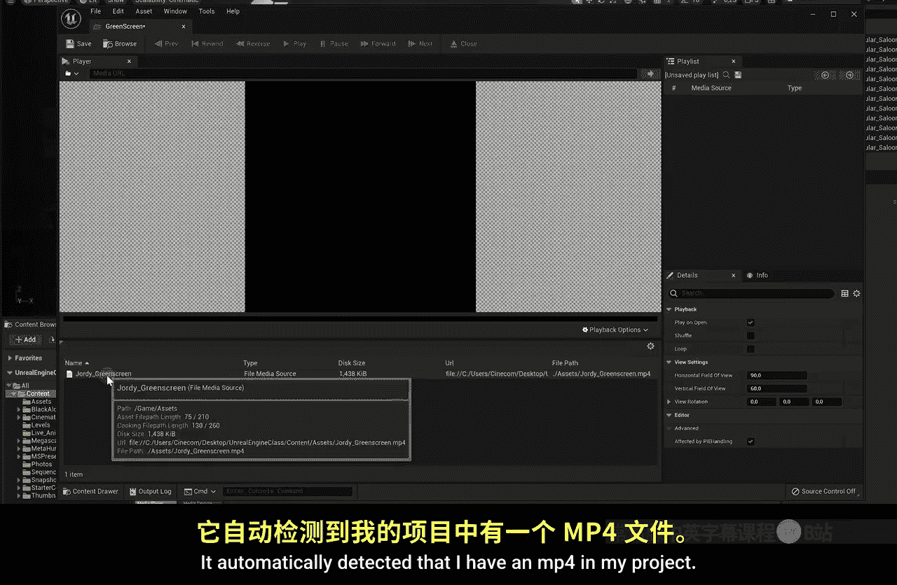

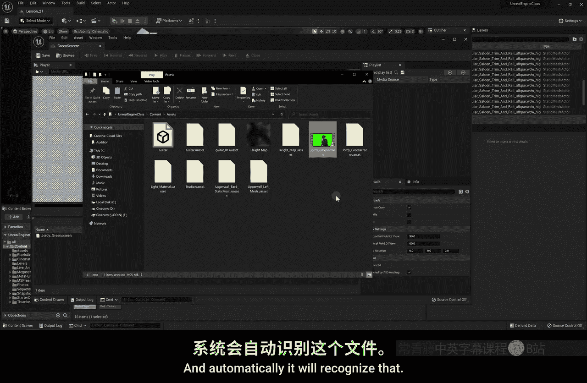

上一节我们学习了虚拟制片的基础。本节中，我们将进入一个更具挑战性的领域：在虚幻引擎内进行色键抠像。首先，我们需要准备绿幕素材和创建必要的媒体资产。

以下是创建媒体播放器和纹理的步骤：
1.  在内容浏览器中右键点击，选择 **媒体 > 媒体播放器**。
2.  在弹出的窗口中，选择同时创建媒体纹理。
3.  为媒体播放器命名，例如 `GreenScreen_MediaPlayer`。

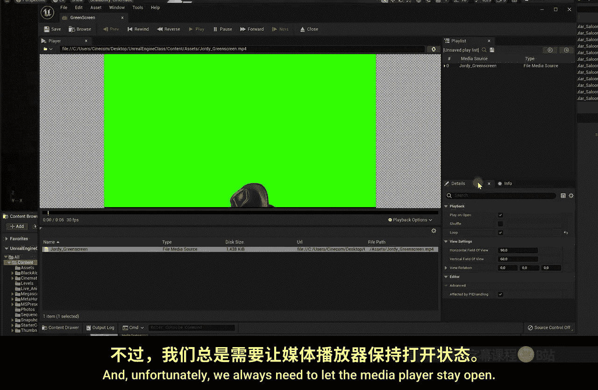

媒体播放器用于加载视频源（如MP4文件或实时摄像源），而媒体纹理则是将该视频图像转化为可在引擎中使用的纹理资源。

## 加载离线绿幕视频

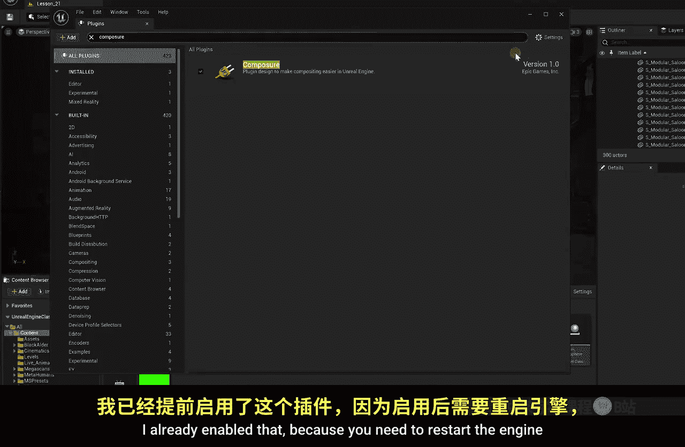

现在，让我们将绿幕视频加载到媒体播放器中。

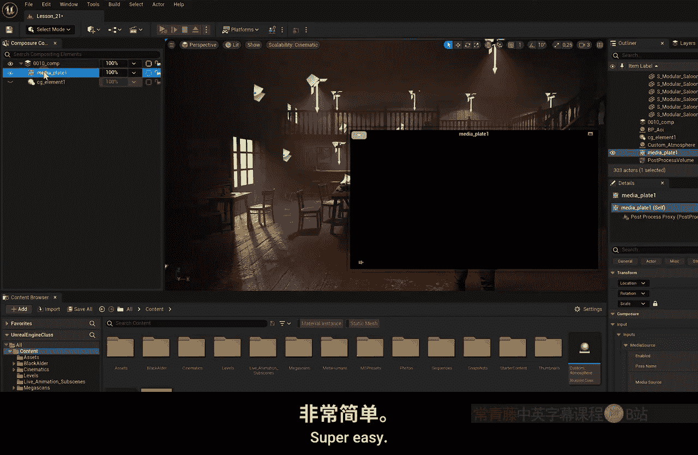

以下是加载和设置视频的步骤：
1.  双击打开新创建的媒体播放器资产。
2.  在媒体播放器窗口中，点击“打开文件”或“打开源”按钮，选择项目中的绿幕MP4文件。
3.  由于视频较短，勾选“循环”选项，确保视频持续播放。
4.  加载后，保持媒体播放器窗口打开（最小化即可），以便纹理能持续接收视频流。

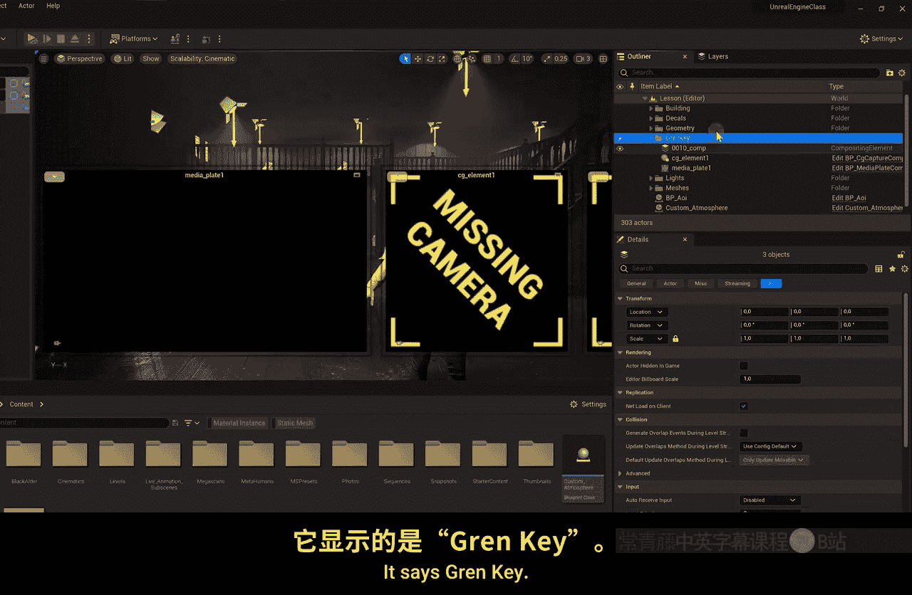

此时，对应的媒体纹理应已显示视频画面。

## 启用与设置Composure插件

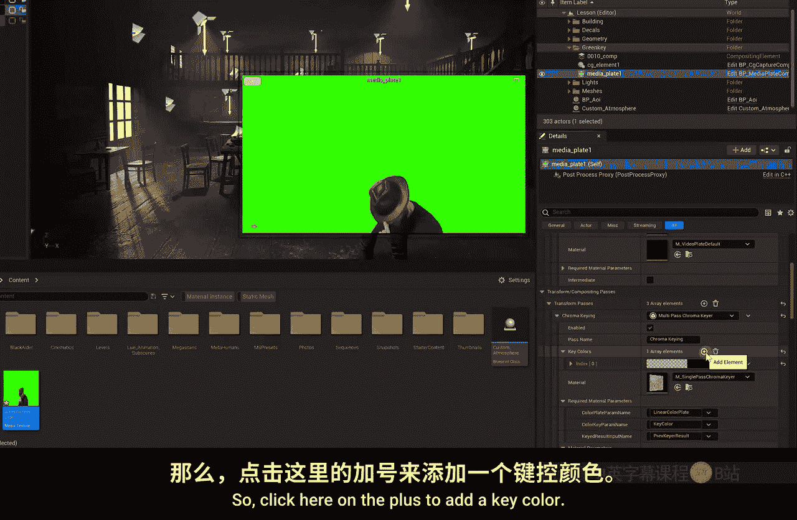

合成工作将通过Composure插件完成。该插件允许我们将多个图层（如背景场景和前景绿幕）组合在一起。

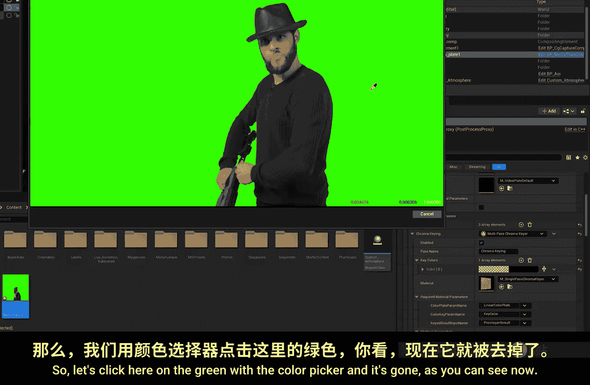

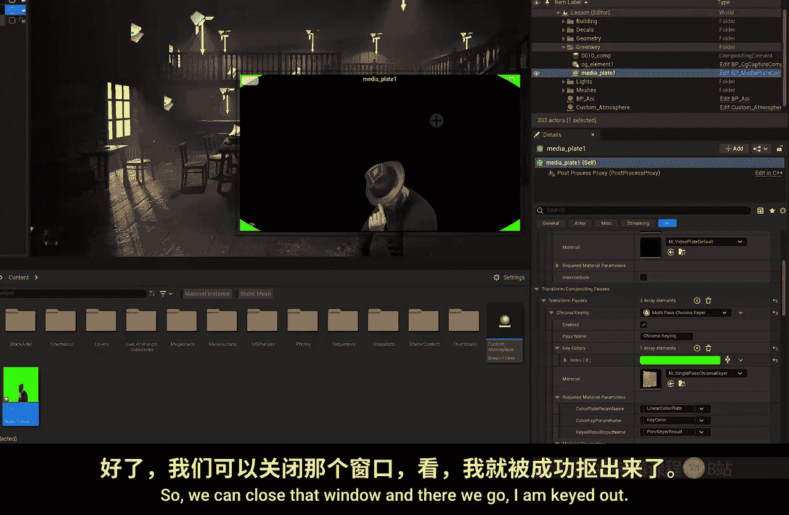

以下是启用和创建合成的步骤：
1.  点击编辑器顶部菜单的 **编辑 > 插件**。
2.  在插件搜索框中输入“Composure”，并确保其已启用（本教程已预先启用）。
3.  点击顶部菜单的 **窗口 > 虚拟制片 > Composure合成**，打开专用窗口。
4.  在Composure窗口中右键，选择 **创建新合成**。
5.  选择 **空合成镜头**，创建一个新的合成。

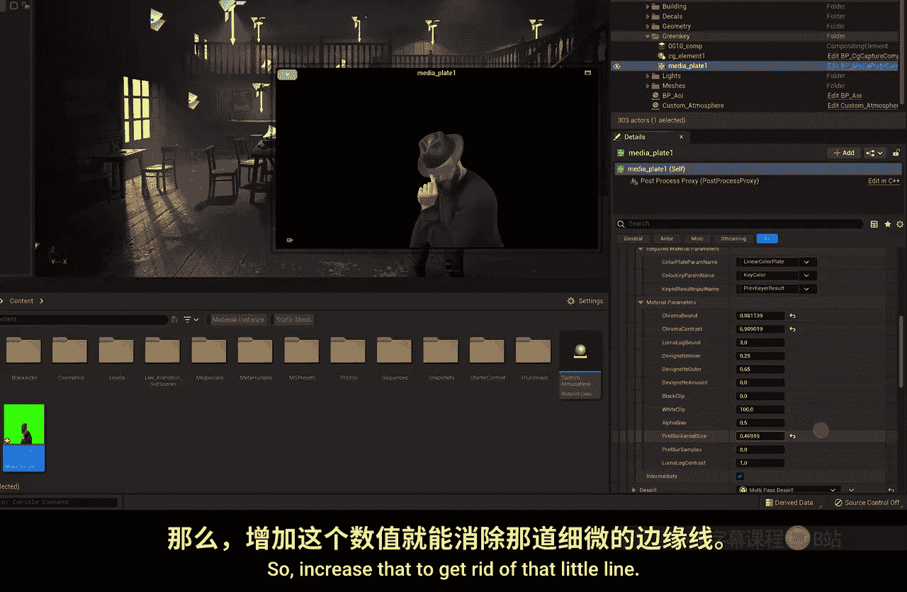

创建合成后，选中它可以在预览窗口中查看，目前它是空的，因为我们还未添加任何图层。

## 添加并抠除绿幕图层

接下来，我们需要将绿幕视频和3D场景作为图层添加到合成中。

以下是添加和设置图层的步骤：
1.  在Composure大纲中，右键点击合成，选择 **添加图层元素 > 媒体板**。这将是我们的绿幕视频层。
2.  再次右键点击合成，选择 **添加图层元素 > CG层**。这将是我们的3D背景场景层。
3.  为保持整洁，可以选中这三个新项（媒体板、CG层、合成），右键创建文件夹（如`GreenKey`）进行管理。

现在，我们来设置绿幕抠像：
1.  选中“媒体板”图层，在细节面板中找到 **媒体源** 属性。
2.  将之前创建的**媒体纹理**拖拽到该属性中。
3.  在细节面板中，找到 **变换通道** 并展开，点击 **色度键** 选项。
4.  在色度键设置中，点击 **关键色** 旁的“+”号添加一个颜色。
5.  点击颜色旁边的吸管按钮，在弹出的颜色选取器中，直接点击视频预览中的绿色背景。绿色背景应被立即抠除。
6.  如需微调，可在下方的 **材质参数** 中调整“色度键容差”和“预模糊内核大小”等参数，以优化抠像边缘。

## 设置3D场景（CG）图层

绿幕图层设置好后，我们需要告诉CG图层使用哪个摄像机视角作为背景。

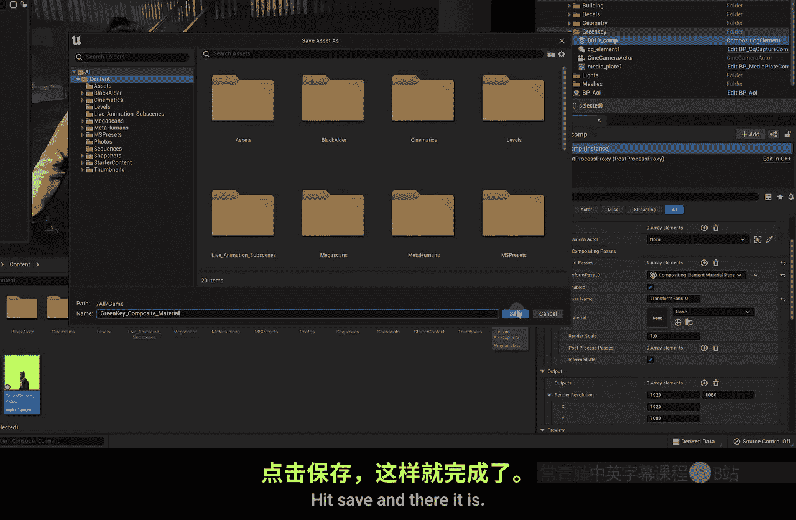

以下是设置CG图层摄像机的步骤：
1.  在场景中调整好摄像机角度（例如，对准你的MetaHuman角色）。可以通过顶部菜单 **过场动画 > 摄像机Actor** 创建一个新摄像机。
2.  调整摄像机位置和焦距，获得理想的构图。
3.  在Composure大纲中选中 **CG层**，在细节面板的 **Composure > 输入** 下，找到 **摄像机源**。
4.  将选项从“继承”改为“覆盖”，然后将场景中的摄像机Actor拖拽到该属性中。

现在，CG层应该显示你的3D场景画面了。请注意，由于引擎Bug，合成预览的颜色可能与实际场景略有差异，这通常与Lumen光照系统有关。

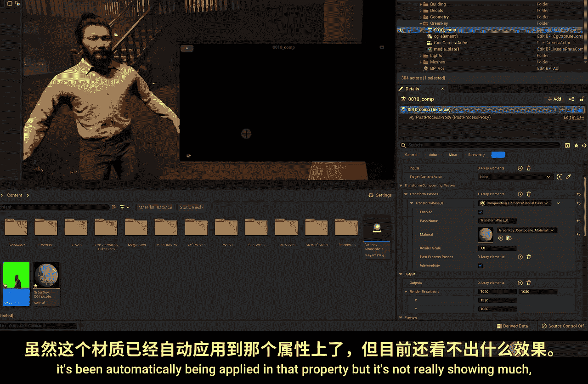

## 创建合成材质

目前两个图层还是独立的。我们需要创建一个材质来定义它们如何混合（例如，绿幕人物在前，3D场景在后）。

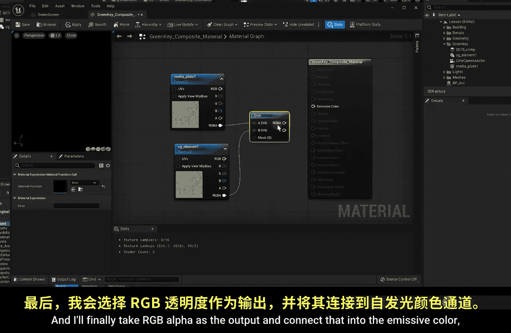

以下是创建合成材质的步骤：
1.  在Composure大纲中选中**合成**图层。
2.  在细节面板的 **变换合成通道** 下，点击“+”号添加一个元素。
3.  展开新添加的元素，在 **材质** 下拉菜单中选择 **创建新材质**，命名为 `GreenKeyComposite_Material`。
4.  双击打开这个新材质进行编辑。

在材质编辑器中：
1.  将材质域从“表面”改为 **后期处理**。这样我们只需处理自发光颜色。
2.  在图表中右键，搜索并添加两个 **纹理样本参数2D** 节点。
3.  **关键步骤**：将第一个节点命名为 `MediaPlate_1`，第二个节点命名为 `CG_Element_1`。这些名称必须与Composure中的图层名称严格对应。
4.  右键搜索并添加一个 **Over（曝光）** 节点。这个节点用于混合上下图层。
5.  进行连接：
    *   将 `MediaPlate_1` 的 **RGB Alpha** 输出引脚连接到 `Over` 节点的 **A** 输入引脚（顶层）。
    *   将 `CG_Element_1` 的 **RGB Alpha** 输出引脚连接到 `Over` 节点的 **B** 输入引脚（底层）。
    *   将 `Over` 节点的 **RGB Alpha** 输出引脚连接到材质主节点的 **自发光颜色** 输入引脚。
6.  点击保存。

返回Composure窗口，现在应该能在预览中看到绿幕人物与3D场景合成在一起了。

## 微调与总结

如果觉得背景（CG层）曝光或颜色不匹配，可以在合成材质中进行快速调整。

以下是微调曝光的示例：
1.  在材质图表中，在 `CG_Element_1` 和 `Over` 节点的B输入之间插入一个 **乘法** 节点。
2.  添加一个 **常量** 节点，将其值设为1（默认值不影响结果）。
3.  将 `CG_Element_1` 的RGB输出连接到乘法节点的A，常量节点连接到B，再将乘法结果连接到Over节点的B。
4.  调整常量节点的值（如0.7），可以降低背景图层的亮度，使其更好地与前景融合。这只是一种临时修正。

本节课中我们一起学习了在虚幻引擎5中进行离线色键抠像的完整流程。我们掌握了如何导入绿幕视频、使用Composure插件创建合成、通过色度键功能抠除背景，以及编写简单的后期处理材质来合成图层。虽然当前工具在实时抠像质量上可能不如专业软件，但这项技术为虚拟制片和实时合成提供了强大的可能性。下一节，我们将探讨如何接入实时摄像源，进行实时的直播绿幕抠像。