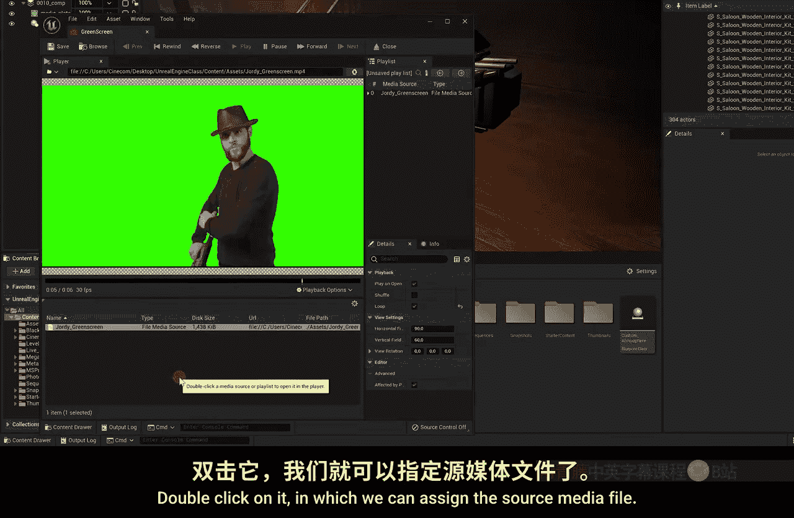
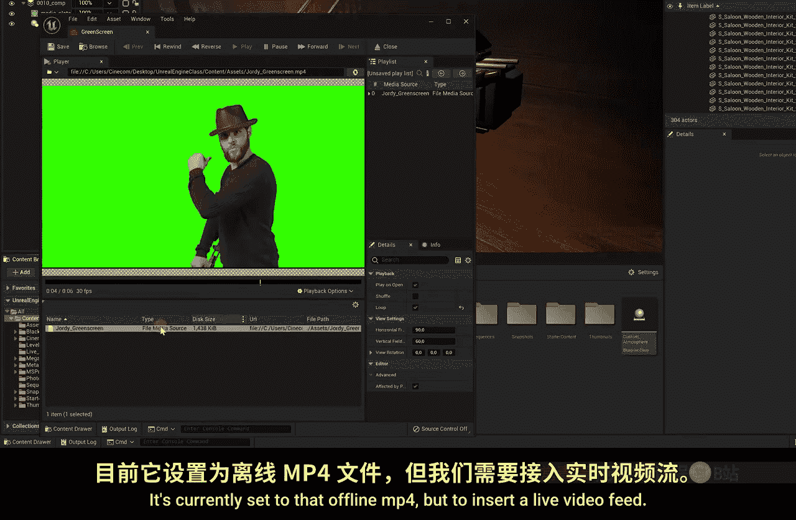
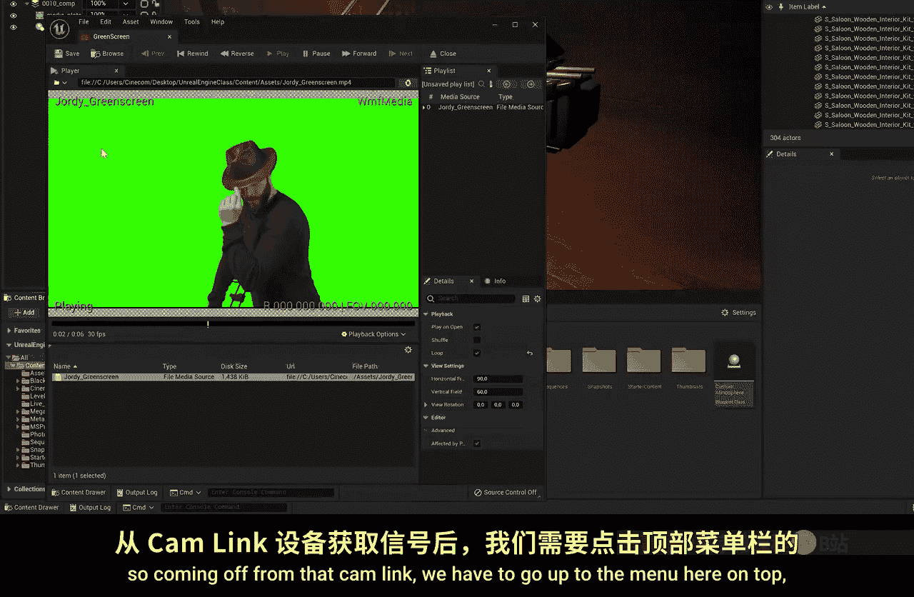
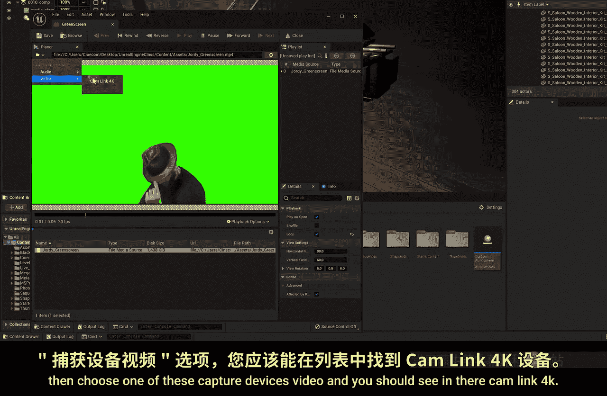

# 022：实时色键技术 🎬

在本节课中，我们将学习如何在虚幻引擎中实现实时色键抠像，将绿幕前的真人实时合成到虚拟场景中。

上一节我们介绍了使用离线视频文件进行色键抠像。本节中，我们来看看如何接入实时摄像机信号，实现动态抠像。

## 接入实时摄像机信号

为了将摄像机信号接入电脑，我们需要一个视频采集设备。以下是一种常见的方法：

*   **使用采集卡**：例如 Cam Link 这类设备。它是一个小型转换器，输入端为 HDMI 接口，可以连接摄像机的输出；输出端为 USB 接口，可以连接到电脑。这样就能将摄像机的视频信号传输到计算机中。
*   **连接方式**：将摄像机的 HDMI 输出线（或通过无线图传接收器）连接到采集卡的 HDMI 输入口，然后将采集卡的 USB 口插入电脑。市面上有许多不同品牌的采集设备，Cam Link 是其中较流行的一款。

## 在虚幻引擎中设置实时源

现在，我们需要在引擎内将视频源从离线文件切换为实时信号。

1.  找到上一课创建的媒体播放器资产。
2.  选中它，在细节面板中找到“源媒体文件”属性。目前它指向一个离线 MP4 文件。
3.  点击属性旁的文件夹图标，在打开的菜单中选择“捕获设备”下的“视频”。
4.  在设备列表中，你应该能看到已连接的采集设备（例如“Cam Link 4K”）。选中它。
5.  如果一切连接正确，预览窗口将立即显示来自摄像机的实时画面。

## 优化实时色键效果

接入实时信号后，你可能会发现抠像效果不如离线视频完美。以下是调整方法：

1.  在场景大纲中，找到包含色键节点的媒体板图层。
2.  在其细节设置中，找到“色度键”属性组。
3.  点击“关键色”旁的吸管工具，在实时画面的绿色背景上重新采样颜色。
4.  根据需要，微调“色度容差”、“亮度容差”等参数，以优化边缘细节，减少人物主体（如毛衣）被误抠除的情况。

## 应用场景与工作流程建议

将真人实时合成到虚拟场景中后，我们自然会问：这在实际应用中是否可行？

*   **核心优势：灯光匹配** 🎨
    此技术一个极佳的应用场景是**匹配灯光**。你可以让演员站在绿幕前，根据虚拟场景（如旁边的 MetaHuman）的光照情况，实时调整绿幕影棚的灯光，使其与虚拟环境完美融合。

*   **推荐工作流程**：
    *   对于追求最高质量的成品视频，建议在完成灯光匹配后，直接录制摄像机原始信号（无绿幕抠像）。
    *   同时，在相同的灯光设置下，录制一段纯绿幕背景的视频。
    *   将这两段素材导入 After Effects、Premiere 等专业视频软件中进行后期抠像合成。这样可以获得更好的抠像质量和渲染性能。

*   **实时流媒体应用** 📡
    如果你需要进行实时直播或流媒体输出，虚幻引擎内的实时合成可以直接使用。
    1.  在大纲中选中你的合成图层。
    2.  在预览窗口的右上角，点击“最大化”按钮。
    3.  这个全屏的合成画面可以输出到第二个显示器，或者作为直播推流软件（如 OBS）的视频采集源。

本节课中我们一起学习了如何将实时摄像机信号接入虚幻引擎，并进行实时色键抠像合成。我们探讨了其用于灯光匹配的核心价值，并分析了适用于后期制作与实时流媒体的不同工作流程。下一课，我们将探索与 DMX 灯光控制相关的内容。