# 023：DMX设置 🎛️

在本节课中，我们将学习如何在虚幻引擎中设置DMX系统，以连接和控制虚拟灯光，甚至与真实的物理灯光设备进行联动。

---

## 概述

DMX不仅指代一位90年代的歌手，更是一种用于控制舞台灯光设备的网络协议。在虚幻引擎中集成DMX，可以让你同步控制虚拟场景和现实世界中的灯光。如果你对DMX完全陌生，不必担心，本节课会简要介绍其核心概念和设置流程。

---

## DMX简介

上一节我们确认了引擎系统运行正常。本节中我们来看看DMX。

DMX是一个用于控制灯光的网络协议。例如，我可以通过连接在DMX网络上的iPad控制灯光。滑动滑块可以调节亮度，我还可以使用预设，比如将灯光调暗、设置为红色表示引擎错误，或设置为绿色表示错误已修复。

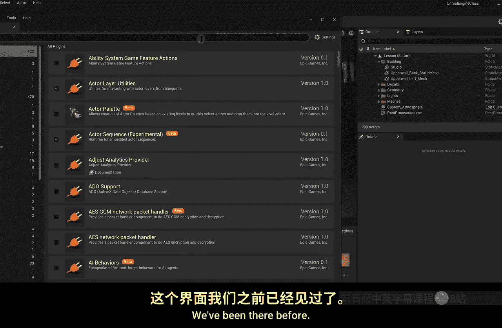

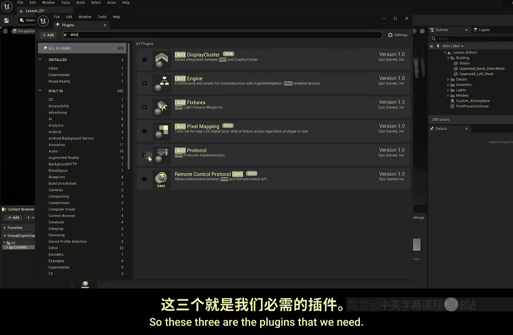

通过DMX，我可以制作灯光动画场景，实现淡入淡出效果，甚至控制可以平移和倾斜的摇头灯。这在音乐会等场合很常见。

---

## 启用DMX插件

首先，我们需要启用必要的DMX插件。

以下是操作步骤：

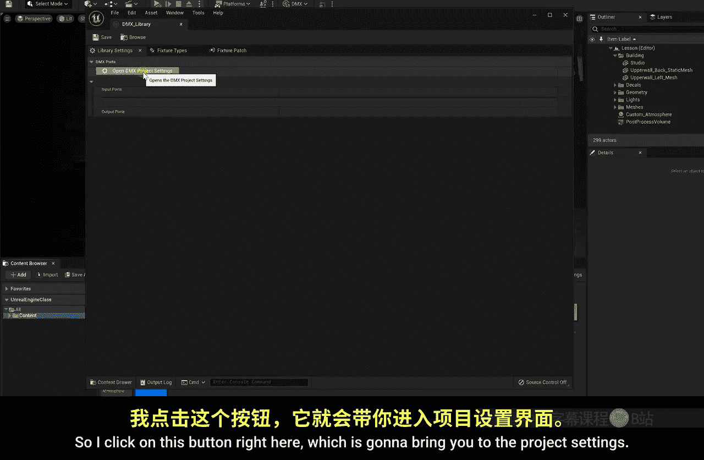

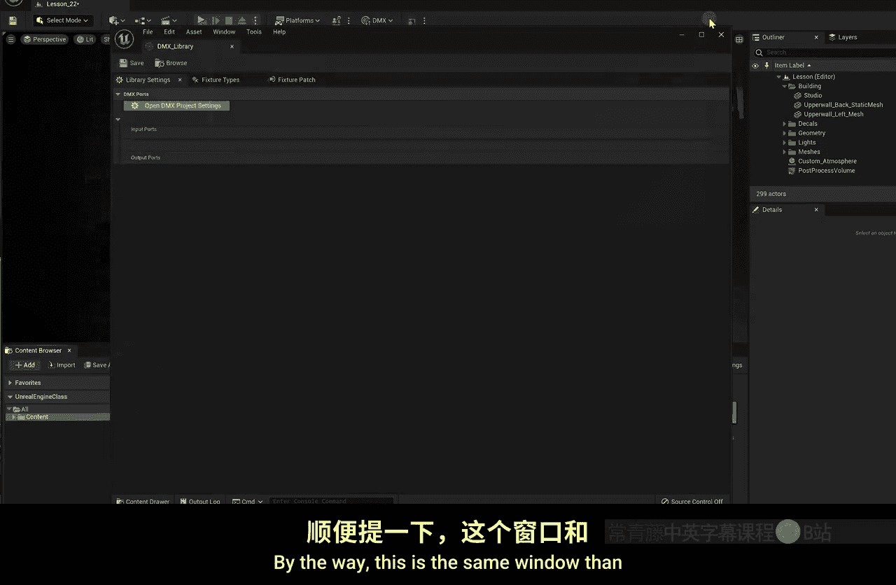

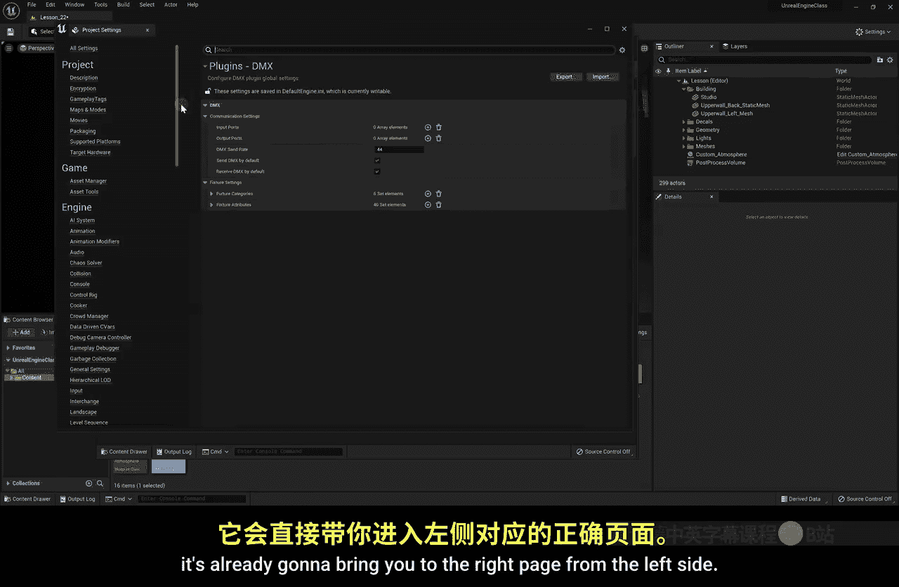

1.  点击顶部菜单的 **设置** -> **插件**。
2.  在搜索框中查找 **DMX**。
3.  启用 **DMX引擎** 插件。启用后，**DMX协议** 插件通常会自动启用。
4.  同时启用 **DMX灯具** 插件。

启用这三个插件后，重启虚幻引擎并重新打开你的项目。

---

## 创建DMX库

重启后，我们可以在内容浏览器中创建DMX库。

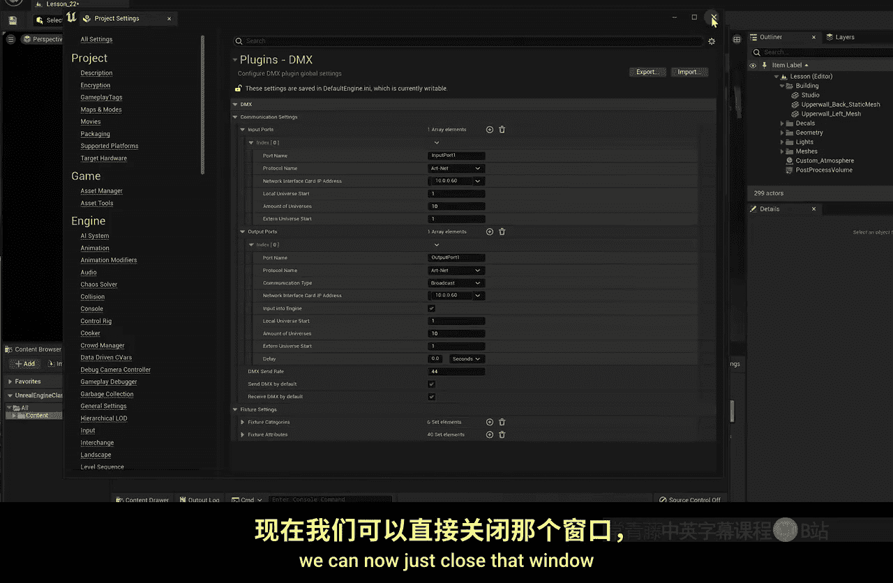

操作步骤如下：

1.  在内容浏览器中右键点击。
2.  选择 **DMX** -> **DMX库**。
3.  为库命名，例如 `DMX_Library`。
4.  双击打开这个库文件。

---

## 配置项目设置

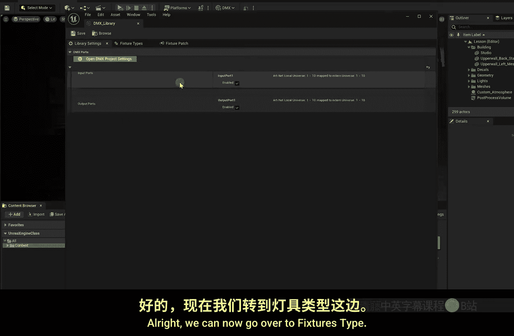

打开DMX库后，我们需要配置项目设置以建立输入和输出连接。

以下是具体配置方法：

1.  在DMX库编辑器中，点击绿色的 **项目设置** 按钮。你也可以通过顶部菜单的 **设置** -> **项目设置** 进入同一窗口。
2.  在项目设置的DMX部分，为 **输入** 和 **输出** 都点击 **+** 号添加一个配置。
3.  展开新添加的输入和输出索引。
4.  在 **协议** 下拉菜单中，选择你的设备使用的协议（例如 Art-Net 或 sACN）。
5.  在 **网络接口** 中，选择你电脑的本地IP地址（例如 `192.168.1.100`）。选择 `localhost` 地址有时可能无法正常工作。
6.  设置 **Universe**（域）。注意：虚幻引擎5的Universe编号从1开始，如果你的设备设置为0，需要在这里改为1。
7.  对输出配置重复以上步骤，确保设置一致。

配置完成后关闭项目设置窗口，你会在DMX库的“库设置”选项卡中看到这些配置。

---

## 定义灯具类型

接下来，我们需要在DMX库中定义具体的灯具类型，就像在iPad控制软件中添加灯具一样。

操作流程如下：

1.  在DMX库编辑器中，切换到 **灯具类型** 选项卡。
2.  点击 **+ 灯具类型** 按钮。
3.  为灯具命名，例如 `Aperture_600D`。
4.  在下方选择灯具种类，例如 **静态灯**。
5.  点击 **添加模式**。
6.  在模式中，点击 **添加功能**。
7.  为第一个功能命名，例如 `Dimmer`（调光）。如果你使用RGB灯，则需要为红、绿、蓝分别添加功能。
8.  你可以让 **自动通道跨度** 保持启用，它会根据功能数量自动分配通道。

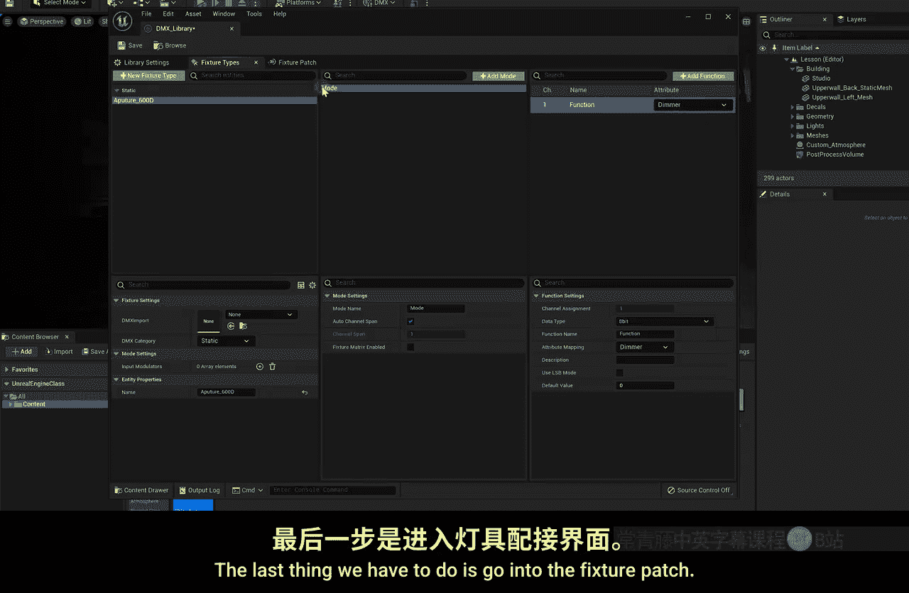

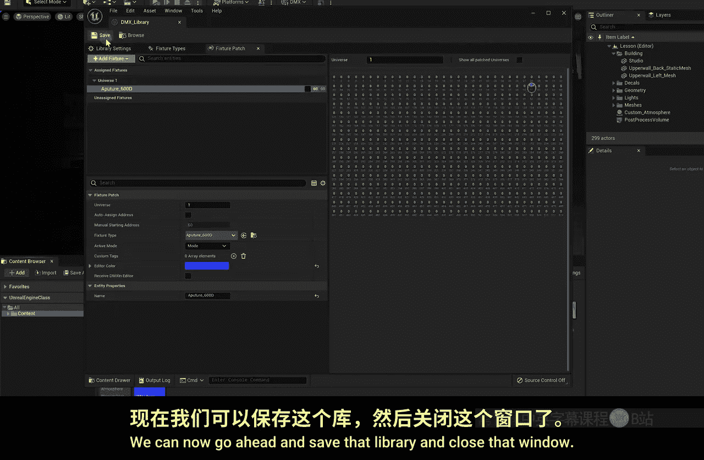

---

## 配置灯具配接

定义好灯具类型后，需要将它“配接”到具体的DMX通道上。

配置步骤如下：

1.  切换到 **灯具配接** 选项卡。
2.  在左侧的“可用灯具”列表中，找到你刚创建的灯具（如 `Aperture_600D`）。
3.  将其拖拽到右侧的配接网格中。
4.  默认它可能从通道1开始。你需要根据实际硬件设置调整起始通道。例如，如果你的实际灯光调光功能设置在通道60，就将这个配接块的起始通道拖到60。
5.  保存DMX库。

---

## 监控与测试

设置完成后，我们可以测试DMX信号是否正常。

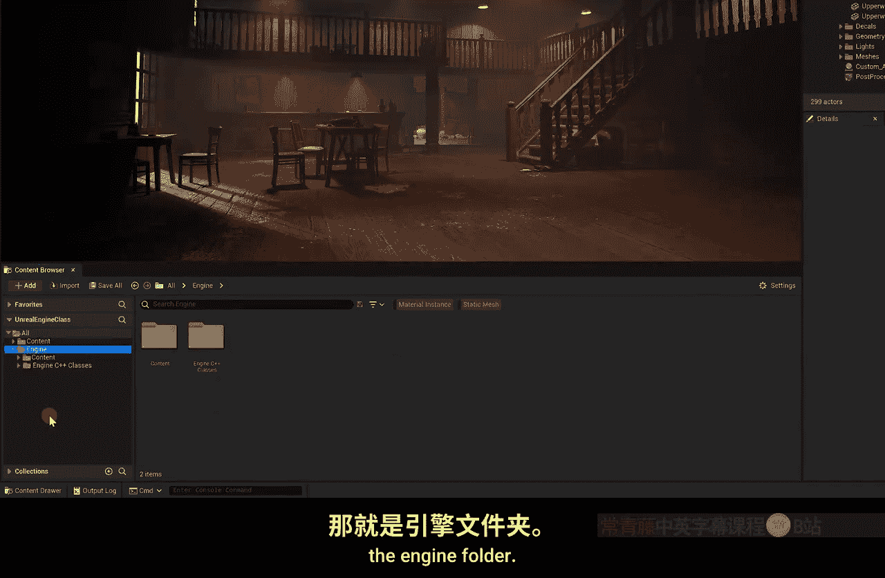

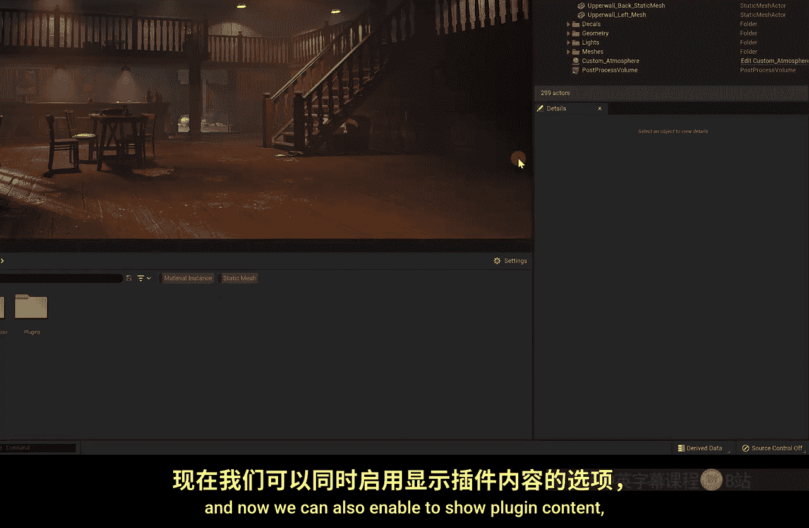

测试方法如下：

1.  点击编辑器顶部的 **DMX** 按钮，打开 **通道监视器**。
2.  在这个窗口中，你可以看到各个通道的活动数值。
3.  尝试改变实际灯光控制软件（如iPad上的App）中对应通道的值，观察通道监视器中的数值是否同步变化。如果变化，说明DMX输入读取正常。

---

## 在场景中使用DMX灯光

虚幻引擎中的默认灯光不能直接受DMX控制，我们需要使用引擎自带的DMX灯具蓝图。

添加DMX灯具到场景的步骤如下：

1.  在内容浏览器中，点击 **设置** 图标，启用 **显示引擎内容** 和 **显示插件内容**。
2.  导航至 `Engine -> Plugins -> DMXFixtures -> Content -> LightFixtures`。
3.  你会看到多种灯具蓝图，如摇头灯、矩阵灯、静态灯等。
4.  根据需求，将一个灯具（例如 `Static_Spot`）拖入场景中。
5.  选中场景中的这个DMX灯光蓝图，在细节面板中找到 **DMX** 部分。
6.  将之前创建的 **DMX库** 资产指定给 **DMX库** 属性。
7.  在 **父灯具类型** 下拉菜单中，选择你在库中定义的灯具类型（如 `Aperture_600D`）。

至此，这个虚拟灯光就与你的DMX系统关联起来了。

---

## 最终联动测试

现在，我们可以进行最终的联动测试。

1.  点击编辑器工具栏的 **运行** 按钮旁边的下拉箭头，选择 **模拟** 模式。
2.  在模拟模式下，使用你的外部控制软件（如iPad）改变对应通道的灯光亮度或颜色。
3.  观察场景中的虚拟灯光是否与现实中的灯光同步变化。

如果一切设置正确，你将看到虚拟灯光与现实灯光完美联动。你甚至可以在控制软件中创建不存在的“虚拟通道”来控制只在虚幻引擎中存在的灯光，而不会影响现实设备。

---

## 总结

本节课我们一起学习了如何在虚幻引擎5中设置DMX系统。我们涵盖了从启用插件、创建库、配置项目设置、定义灯具类型，到最终在场景中放置并控制DMX灯光的完整流程。核心在于理解 **DMX库** 作为灯具定义的集合，以及通过 **通道配接** 将虚拟灯具映射到真实的DMX控制信号上。

对于熟悉DMX的用户，这打开了一扇连接虚拟制作与现实控制的大门。对于初学者，你至少了解了这套系统的工作流程。下节课，我们将把学到的所有知识——包括实时摄像机跟踪、绿幕抠像以及DMX灯光控制——整合到一个最终的场景中，并进行录制与输出。