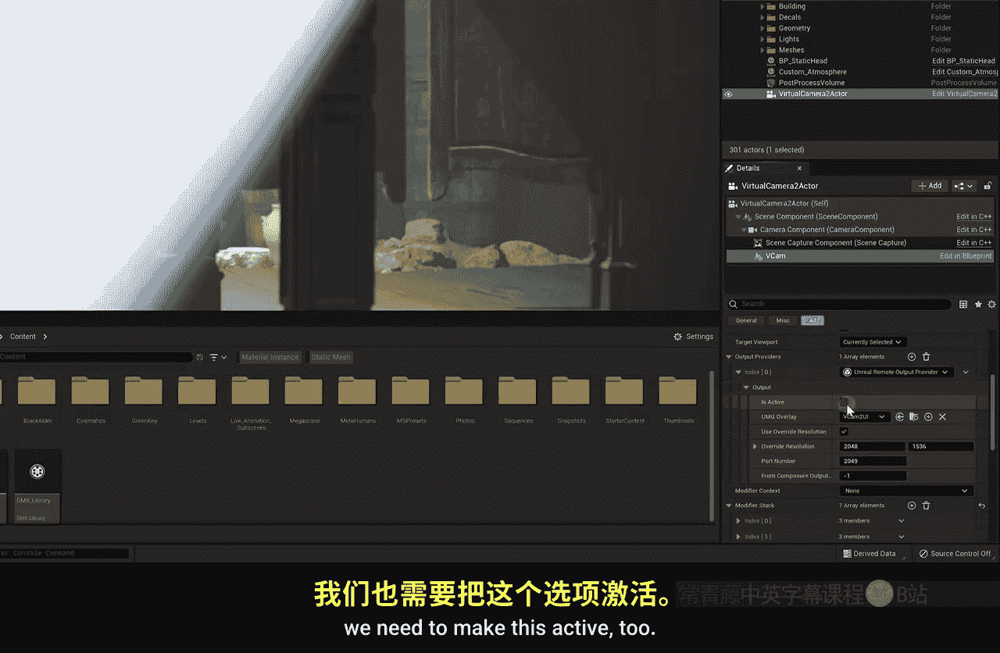
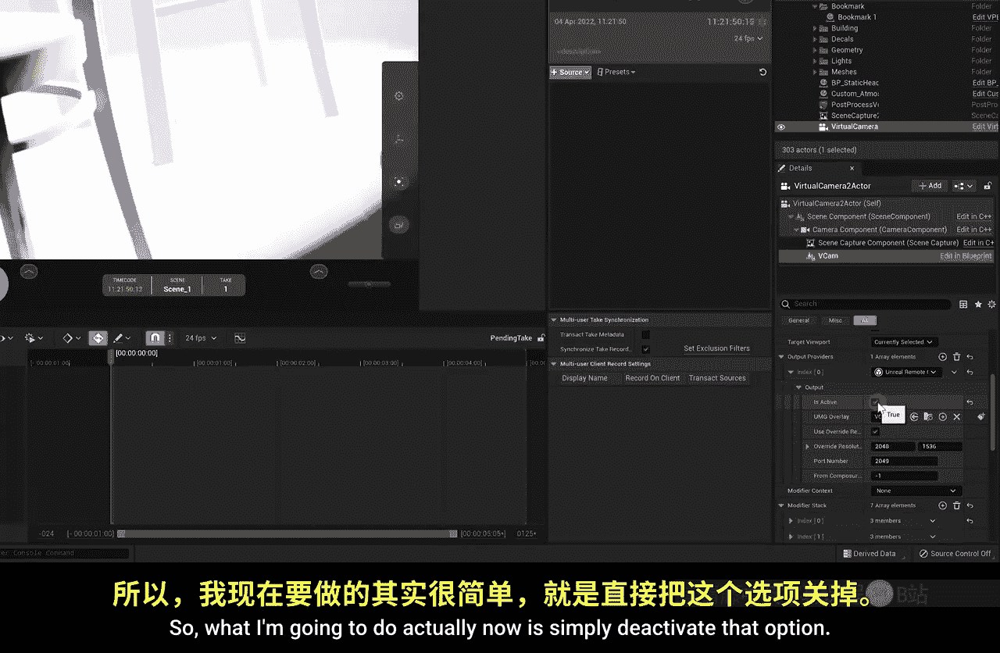
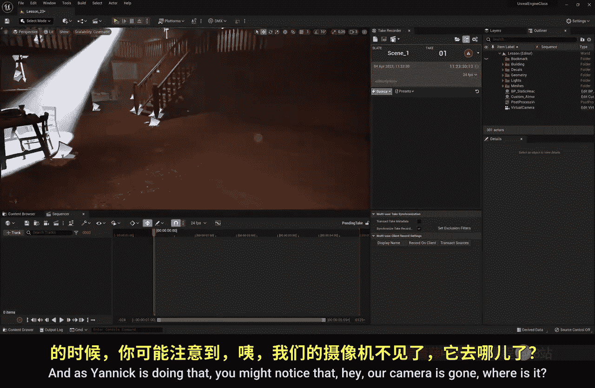
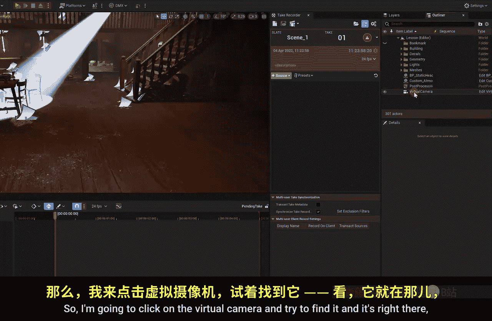
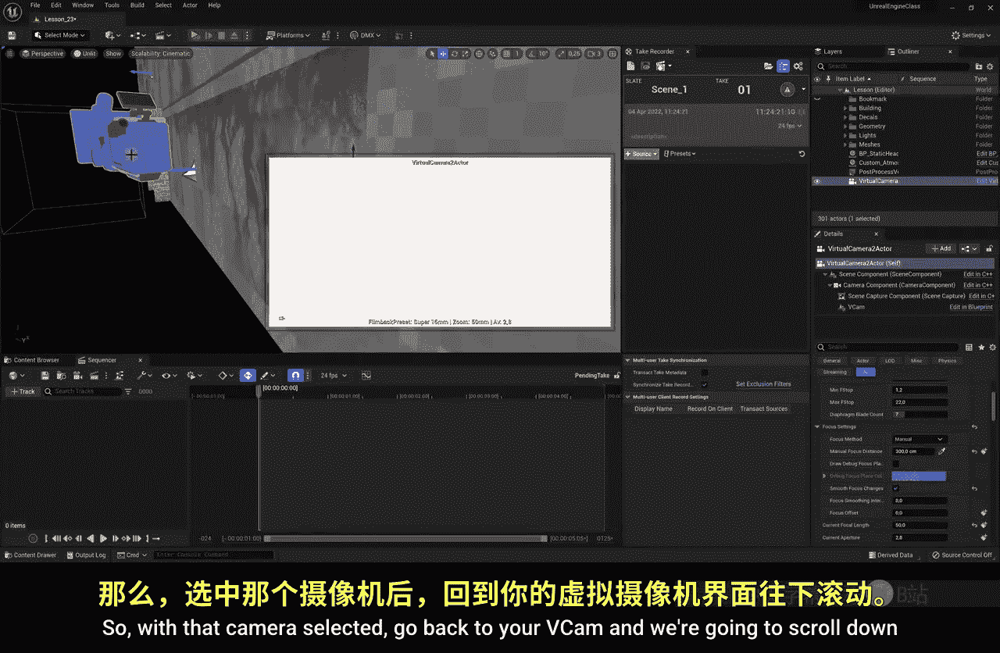
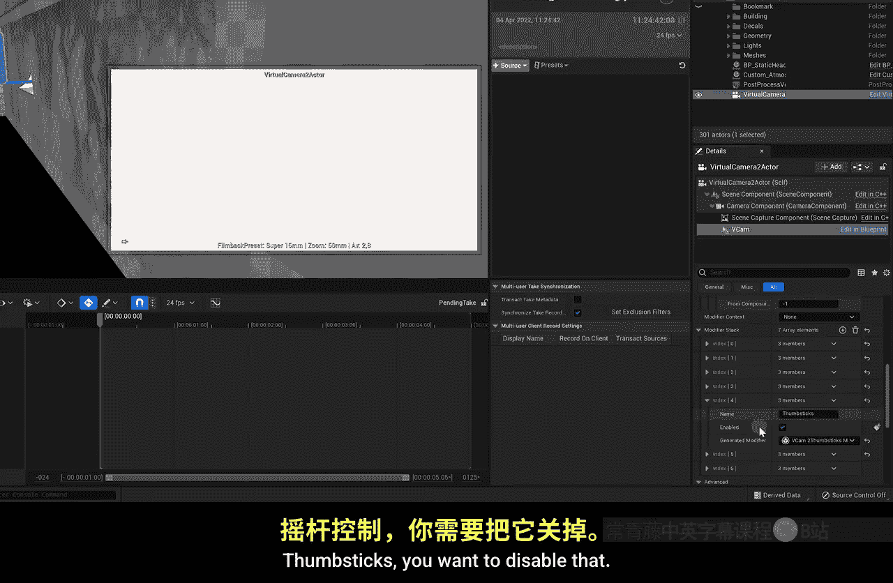
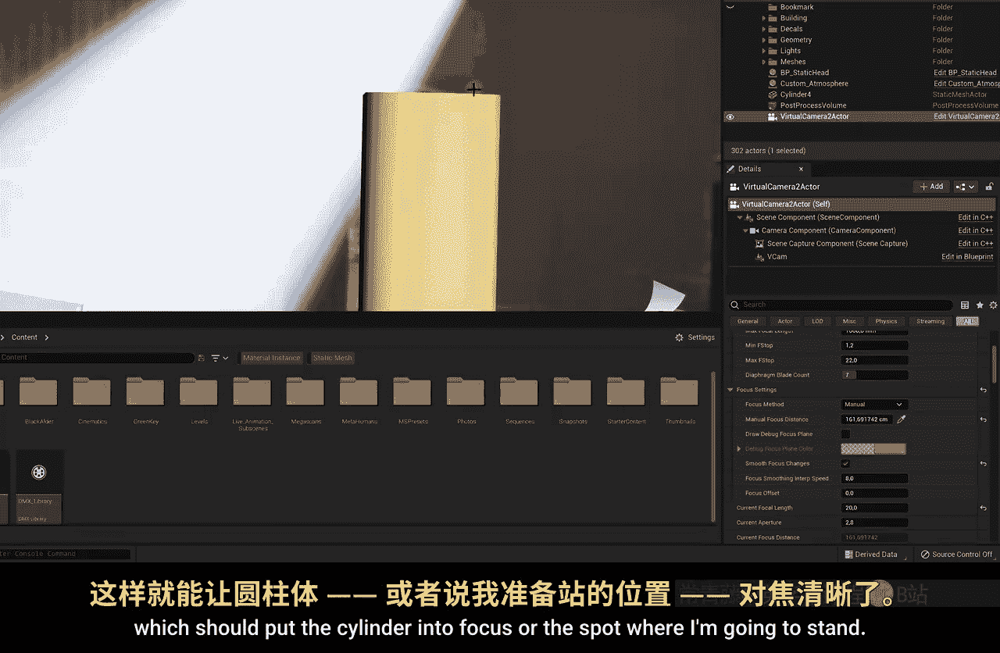
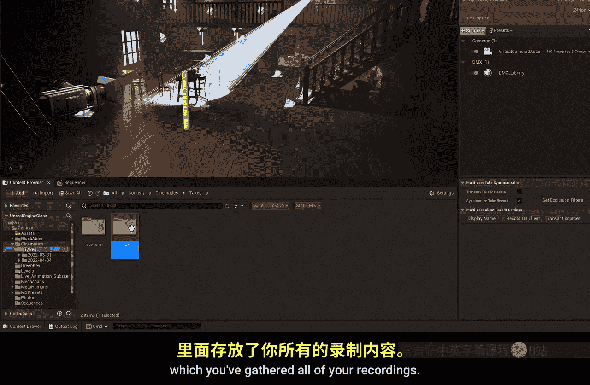

# 024：虚拟制作示例 🎬

在本节课中，我们将综合运用之前学到的知识，完成一个虚拟制作示例。我们将使用iPhone作为摄像机追踪器，同时控制DMX灯光，在绿幕前进行实拍，并将虚幻引擎中的虚拟场景与实拍画面进行合成。

---

## 连接iPhone与虚拟摄像机

上一节我们介绍了DMX灯光控制，本节中我们来看看如何将iPhone与虚幻引擎连接，实现摄像机运动追踪。

首先，我们需要将iPhone通过Live Link连接到虚幻引擎。

1.  在顶部菜单栏，点击 **窗口** -> **虚拟制作** -> **Live Link**。
2.  在Live Link窗口的顶部，点击 **源** -> **消息总线源**。
3.  此时，你的iPhone设备应该出现在列表中。如果没有，请确保你已在iPhone上打开 **Live Link VCam** 应用程序。
4.  在列表中点击你的iPhone设备名称以建立连接。

连接建立后，可以关闭Live Link窗口。

---

## 创建并配置虚拟摄像机

接下来，我们需要在场景中创建一个虚拟摄像机，并将其与iPhone的追踪数据绑定。

以下是具体步骤：
1.  在顶部菜单栏，点击 **窗口** -> **虚拟制作** -> **将虚拟摄像机放入关卡**。
2.  将生成的虚拟摄像机Actor拖入场景，并适当调整其初始位置。
3.  在场景中选中该虚拟摄像机，在 **细节** 面板中找到 **VCam** 组件。
4.  启用 **虚拟摄像机** 选项。
5.  在 **链接的VCam设备** 下拉菜单中，选择你的iPhone设备。
6.  向下滚动到 **输出** 部分，确保 **输出到引擎** 选项已启用。
7.  点击 **连接** 按钮。

此时，移动iPhone，虚拟摄像机应随之运动。由于我们仅将iPhone用作追踪器，可以禁用其屏幕控制功能以简化操作。在VCam组件的 **修改器堆栈** 中，禁用 **拇指摇杆** 和 **镜头** 等控制选项。

---

## 设置摄像机构图与焦点

现在，我们可以手动控制虚拟摄像机，为绿幕前的演员设置构图和焦点。

首先，我们需要暂时接管摄像机控制：
1.  在 **世界大纲视图** 中选中虚拟摄像机。
2.  在VCam组件中，禁用iPhone的 **拇指摇杆** 和 **镜头** 控制选项。
3.  选中虚拟摄像机的根组件，你可以在 **细节** 面板中手动设置焦距，例如：`焦距 = 20`。
4.  点击 **视口** 左上角的 **驾驶** 按钮，或按快捷键进入驾驶模式，使用WASD键和鼠标手动移动摄像机，找到理想的构图。

为了标记演员的站立位置以设置焦点，可以使用一个小技巧：
1.  请助手将iPhone从摄像机支架上取下，放在演员即将站立的位置。
2.  在虚幻引擎中，虚拟摄像机会跟随iPhone移动到这个位置。
3.  从顶部菜单栏点击 **添加** -> **形状** -> **圆柱体**，将其拖入场景，放置在这个虚拟摄像机所在的位置。
4.  调整圆柱体的大小和高度，使其能清晰标记站位。
5.  助手将iPhone放回摄像机支架。

设置焦点：
1.  选中虚拟摄像机，在 **细节** 面板中找到 **聚焦** 设置。
2.  将 **聚焦方法** 设置为 **手动**。
3.  使用 **手动聚焦距离** 旁的吸管工具，点击场景中标记站位的圆柱体。

为了在最终渲染时隐藏这个标记圆柱体，需要设置其可见性：
1.  选中圆柱体，在 **细节** 面板中搜索“hidden”。
2.  勾选 **渲染** 下的 **在游戏中隐藏Actor** 选项。
3.  在编辑器视口中，按 **G** 键可以切换显示/隐藏所有标识（包括此圆柱体），方便预览最终画面。

---

## 使用Take Recorder进行录制

一切准备就绪后，我们将使用Take Recorder同时录制摄像机动画和DMX灯光变化。

以下是录制流程：
1.  打开 **Take Recorder**：点击顶部菜单栏的 **窗口** -> **电影拍摄** -> **Take Recorder**。
2.  添加录制对象：
    *   从 **世界大纲视图** 中将 **虚拟摄像机** 拖入Take Recorder窗口。
    *   将 **DMX库** 也拖入Take Recorder窗口。
3.  在Take Recorder中选中DMX库条目，在 **细节** 面板中指定要使用的DMX库（我们之前创建的库），并添加库中定义的所有灯具（如Aperture 120）。
4.  开始录制：
    *   在虚幻引擎中点击Take Recorder的 **录制** 按钮。
    *   同时，助手在绿幕摄影棚用真实摄像机开始录制。
    *   为了后期同步方便，助手可以轻微晃动一下摄像机，这样在虚幻引擎和实拍画面中都会产生一个同步的“抖动”标记点。
5.  演员进入绿幕区域进行表演，助手同时操作DMX灯光控制器（如调整聚光灯）。
6.  表演结束后，分别停止虚幻引擎和真实摄像机的录制。

---

## 查看与验证录制结果

录制完成后，我们可以查看生成的序列，验证摄像机运动和灯光效果。

操作步骤如下：
1.  录制文件自动保存。你可以在 **内容浏览器** 中导航至 `Content/Cinematics/Takes/[日期]/` 文件夹下找到生成的关卡序列文件（例如：`shot_01`）。
2.  双击打开该序列文件。
3.  在序列编辑器的时间轴上，拖动播放头可以预览录制的摄像机运动。
4.  要查看DMX灯光效果，需确保编辑器处于 **模拟** 模式（点击编辑器右上角的 **模拟** 按钮）。
5.  播放序列，检查摄像机动画与灯光变化是否与表演同步。

---

## 总结

本节课中我们一起学习了如何完成一个完整的虚拟制作流程。我们连接iPhone进行摄像机追踪，设置了虚拟场景的构图与焦点，并使用Take Recorder同步录制了摄像机动画和DMX灯光控制数据。至此，我们已经得到了包含虚拟场景和所有动态数据的序列文件，为下一节课的渲染与最终合成做好了准备。