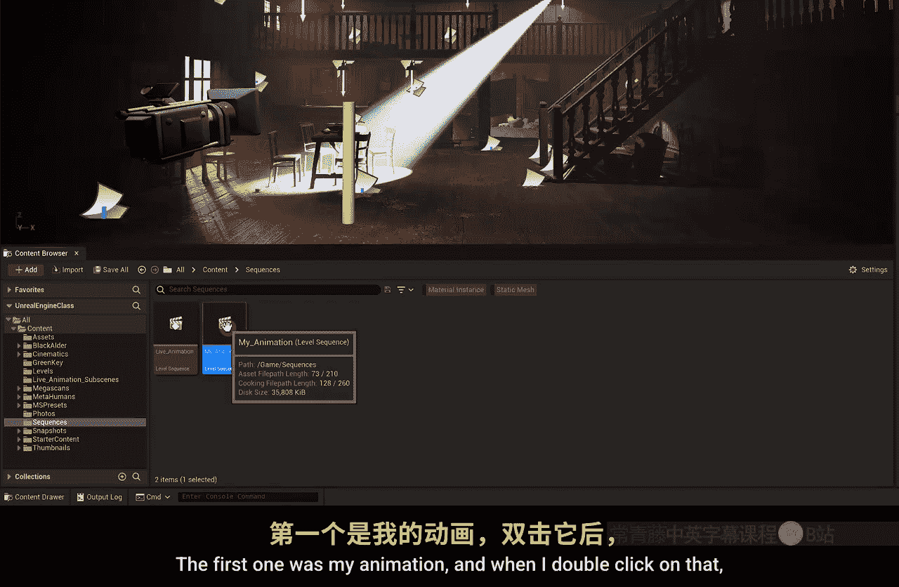
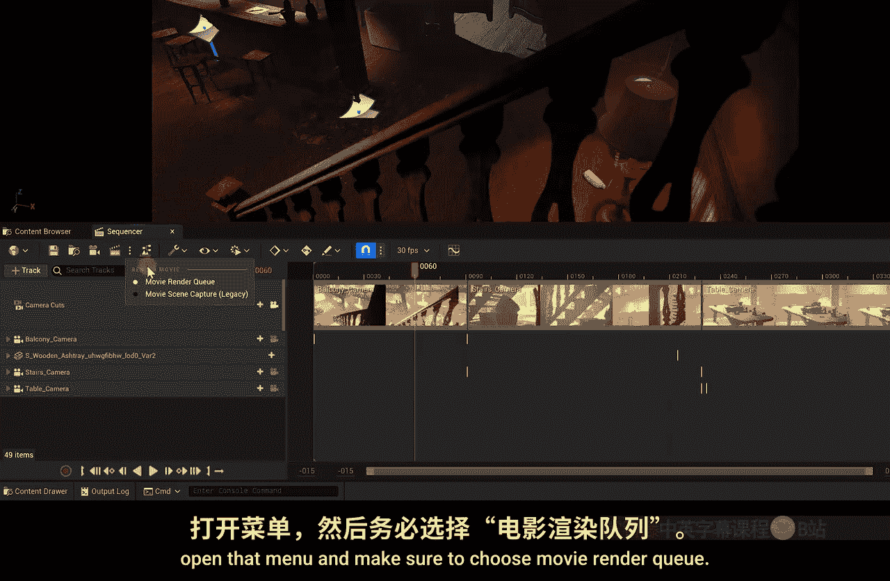
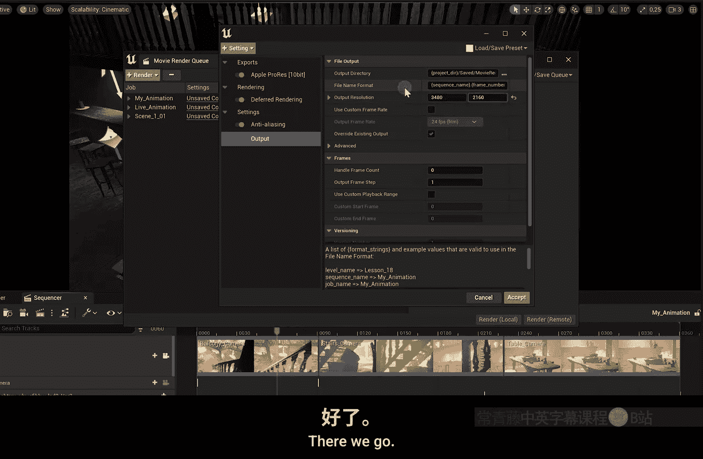
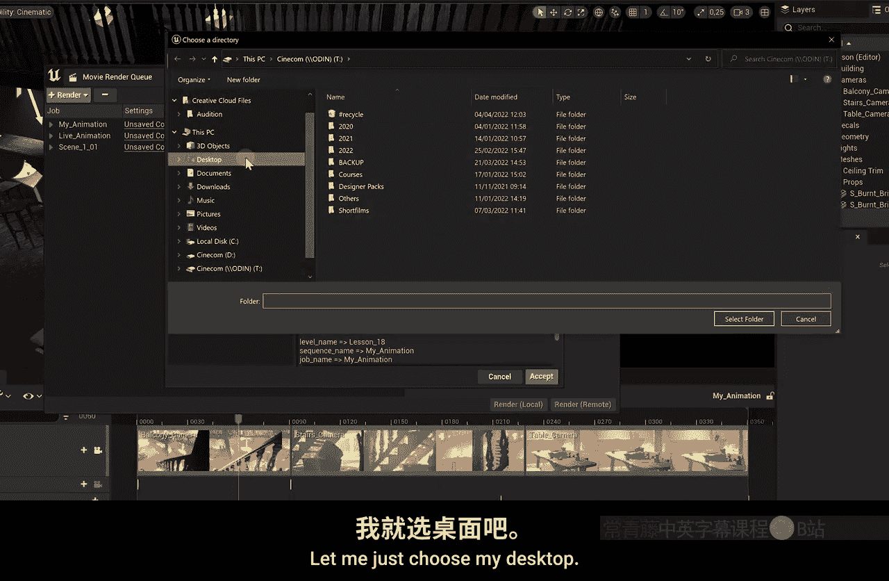
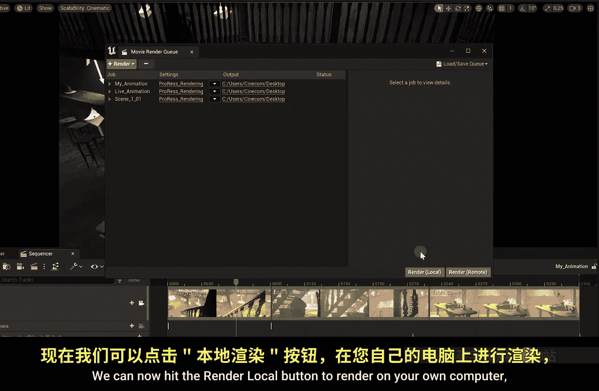
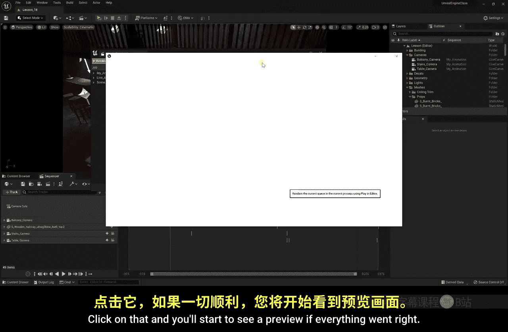
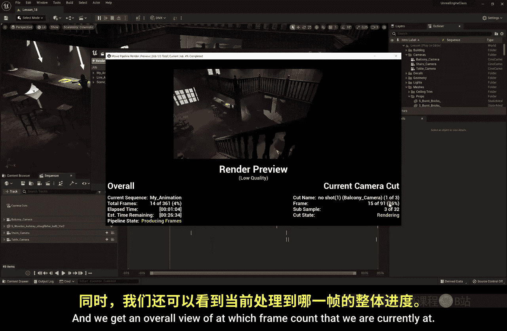

# 025：电影渲染 🎬

在本节课中，我们将学习虚幻引擎创作流程的最后一步：渲染。我们将把之前创建的动画序列导出为实际的视频文件，以便分享或上传到网络。

渲染是引擎处理流程的最终环节，也是你创意过程的最后一步。通过本课，你将掌握如何将虚幻引擎中的动画内容输出为高质量的视频文件。



## 准备工作

上一节我们介绍了动画序列的创建，本节中我们来看看如何将它们渲染成视频。首先，我们需要确保打开了正确的关卡。

在内容浏览器中，我们有几个序列。`Sequences`文件夹里存放着我们之前课程中创建的`Life Animation`和`My Animation`两个关卡序列。需要注意的是，每个序列都绑定在创建它的特定关卡上。如果打开序列时发现轨道显示为红色，通常意味着当前打开的关卡不正确。



以下是解决此问题的步骤：
1.  在内容浏览器中，导航到`Levels`文件夹。
2.  根据序列创建的课程编号（例如第18课），打开对应的关卡。
3.  重新打开序列，此时所有轨道应恢复正常。

打开正确的关卡后，我们可以在Sequencer中启用摄像机切换的视口，并播放之前创建的动画。

## 使用电影渲染队列

我们有两种方法可以启动渲染。第一种是在Sequencer窗口顶部找到“渲染影片”按钮。点击前，请确保通过旁边的三个点菜单启用了“电影渲染队列”选项。未来版本可能会移除旧的“电影场景捕捉”方法，因为它无法提供高质量的渲染输出。

第二种方法是点击顶部菜单栏的`窗口 -> 电影 -> 电影渲染队列`。

如果通过Sequencer的按钮打开队列，当前序列会自动添加到队列中。若想添加更多序列，可以点击队列窗口顶部的“渲染”按钮进行选择。例如，我们可以将`Life Animation`和通过Take Recorder创建的`Scene1_Take1`序列都加入队列。

**重要提示**：每个序列都链接到特定的关卡。在渲染前，务必在队列中为每个序列条目设置正确的`地图/关卡`。

## 配置渲染设置

添加序列后，我们需要配置渲染设置。点击“未保存的配置”开始设置。

首先需要选择输出格式。默认格式是`JPEG序列`。我们可以通过顶部的“设置”按钮来更改或添加设置。主要有两类格式需要考虑：

1.  **EXR序列**：这是一种原始的图像序列格式，能提供最高质量。导出为图像序列（如PNG或EXR）的一大优势是，如果渲染在某一帧崩溃，你可以从该帧重新开始，无需重渲之前的帧。这对于长达数小时或数天的渲染非常有用。
    *代码示例：输出为EXR序列*
    ```python
    # 渲染设置中选择输出格式为 EXR Sequence
    Output Format = EXR
    ```

2.  **Apple ProRes**：这是一种高质量的视频编码格式。如果你的渲染只需5-10分钟，这是一个方便的选择。但请注意，如果渲染中途崩溃，你需要重新渲染整个视频文件，因为它输出的是单个文件。

你可以禁用JPEG序列，启用Apple ProRes，或者同时启用两者进行双重输出。接下来，我们需要添加一些关键设置。

## 关键渲染设置

首先，添加**抗锯齿**设置。这对于提升画面质量至关重要。
1.  点击“+设置”，选择“抗锯齿”。
2.  勾选“覆盖抗锯齿方法”。
3.  将方法设置为“无”，然后自定义“时间采样数”。常用值为64，它能提供优秀的画质。如果渲染时间过长，可以降至32，画质依然良好。
    *公式：采样数与质量/时间的关系*
    ```
    图像质量 ∝ 时间采样数
    渲染时间 ∝ 时间采样数
    ```

其次，调整**渲染预热**设置。在“高级”选项下找到“渲染预热帧数”，默认是32。这意味着引擎会先渲染32帧但不导出，让Lumen全局光照等系统有足够时间稳定下来，避免画面闪烁或摄像机位置异常。建议保持此值。

最后，启用一个非常重要的选项：**为摄像机切换使用预热**。我们的序列中可能有多个摄像机镜头。启用此选项后，每次摄像机切换时，引擎都会为新镜头预热指定的帧数，从而避免切换瞬间可能出现的画面问题。

## 输出设置

输出设置部分相对直观：
1.  **分辨率**：可以设置为4K（3840x2160）或其他所需分辨率。
2.  **输出目录**：选择视频文件的保存位置。
3.  **文件名**：可以自定义，或默认使用序列名称。
4.  **帧率**：可以启用自定义帧率，例如设置为30 FPS。
5.  **渲染范围**：默认渲染整个序列。如果启用“使用自定义播放范围”，可以指定起始帧，这在从崩溃点继续渲染时很有用。

完成所有设置后，建议点击右上角的“保存预设”，为这套配置命名（如`ProRes_4K`）。这样，你可以轻松地将同一套设置应用到队列中的其他序列上。





## 开始渲染

一切就绪后，点击“渲染（本地）”按钮开始在你的计算机上渲染。渲染过程中会显示一个低质量的预览窗口，这是正常的。左下角会显示总体进度和当前帧的渲染状态（例如“子样本 12/32”，表示正在为抗锯齿进行32次采样中的第12次）。

现在，只需等待渲染完成。你可以借此时间休息一下。渲染是引擎计算密集型的部分，需要耐心。





## 总结



本节课中我们一起学习了虚幻引擎电影渲染的完整流程。我们回顾了如何确保序列与关卡正确关联，如何使用电影渲染队列添加多个序列，以及如何配置关键的渲染设置，包括输出格式、抗锯齿、预热帧等。最后，我们启动了渲染过程并了解了如何监控进度。掌握这些步骤，你就能将虚幻引擎中创作的动画内容高质量地输出为可分享的视频文件了。