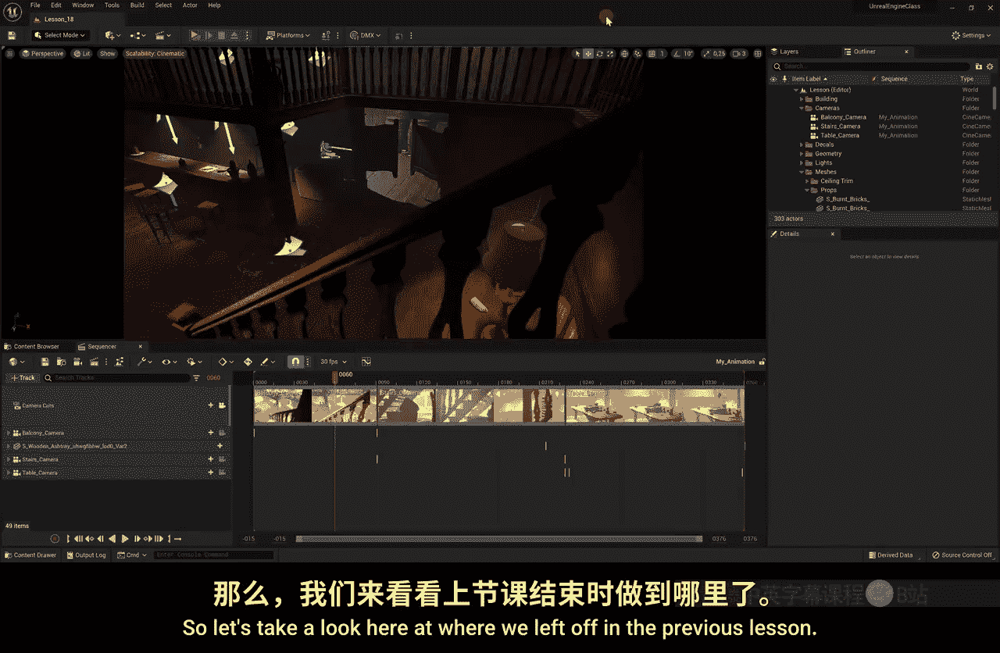
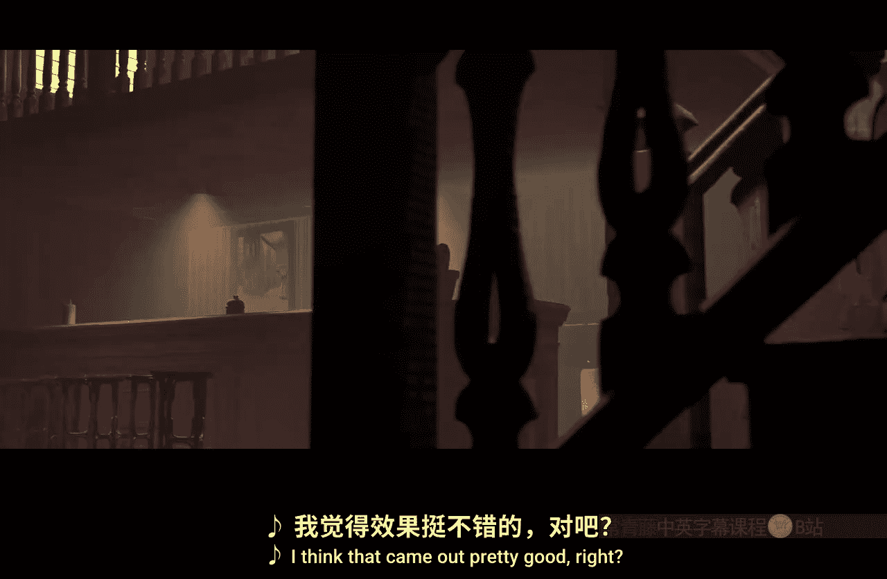

# 026：课程总结与创作挑战 🎬

在本节课中，我们将回顾整个课程的学习成果，并为你布置最终的创作挑战。我们将一起查看上节课的渲染成果，分析其优缺点，并明确你接下来可以独立完成的项目。

---

在上一节课程中，我们完成了三个不同镜头的序列渲染。现在，这些渲染好的视频文件已经保存在我们的电脑桌面上。让我们来播放这个包含三个镜头剪辑的动画，看看最终效果。

我认为这个成果相当不错。更重要的是，你现在已经掌握了完成这一切的技术。你在本课程中学到的所有技能，甚至可能为你未来的职业生涯奠定了基础。比如那个实时拍摄的饮酒镜头，它就在这里。没错，我现在正站在这个虚拟的酒馆里，希望吧台能提供好喝的饮料。

🎼哦，不，聚光灯！我可不想站在聚光灯下。面对聚光灯我有点害羞，所以请把它关掉。谢谢。说实话，我觉得在引擎界面里更有安全感，所以让我回到虚幻引擎的界面。

我必须诚实地说，这个跟踪镜头的效果并不完美。最主要的原因是我们使用的追踪设备——iPhone。请想一想，专业工作室使用的追踪设备仅硬件成本就可能超过一万美元。显然，我们的手机无法达到同等效果。但它是一个非常酷的工具，让我们能够极其轻松地开始尝试摄像机追踪，这也是学习虚幻引擎内摄像机系统的绝佳方式。

**核心概念**：`专业追踪设备 >> 手机追踪效果`，但手机是**入门学习**的优质工具。

因此，如果你有一部iPhone，一定要尝试用它作为摄像机追踪器。如果没有，也可以使用绿幕，并利用它为你镜头添加一些自然的手持运动感。

现在，轮到你了。请戴上你的“头盔”，因为你即将开始工作，开始创作。

以下是你的最终创作挑战步骤：

1.  **选择场景**：使用Quixel资源库中的3D资产，创建一个**户外景观**或一个**室内场景**。
2.  **设置摄像机**：在场景中添加一些虚拟摄像机。
3.  **制作动画**：为摄像机添加关键帧，制作大约三到四个镜头。
4.  **渲染输出**：创建一个完整的关卡序列，并将其渲染输出为电影文件。
5.  **提交作品**：将你的作品发布到Skillshare上，以便我能观看并给予反馈。

如果你敢于挑战一些更高级的技术，例如Live Link或DMX灯光控制，那么一定要去尝试。但在尝试之前，请务必戴上你的“护目镜”，这非常重要。引擎会变得相当“热”，所以你也一定要戴上“手套”，避免“烫伤”自己，这同样至关重要。

现在，你准备好了。你已准备好进入引擎——虚幻引擎5。跳进去，创造属于你的作品，并与世界分享。但最重要的是，享受这个过程。

非常感谢你的观看。一如既往，保持创造力。🎼

---

**本节课总结**：我们一起回顾了课程的核心成果，分析了手机追踪的优缺点，并明确了你的最终实践任务——运用所学知识，从场景搭建、摄像机设置到动画渲染，完成一个完整的短片项目。现在，是时候将知识转化为属于你自己的创作了。