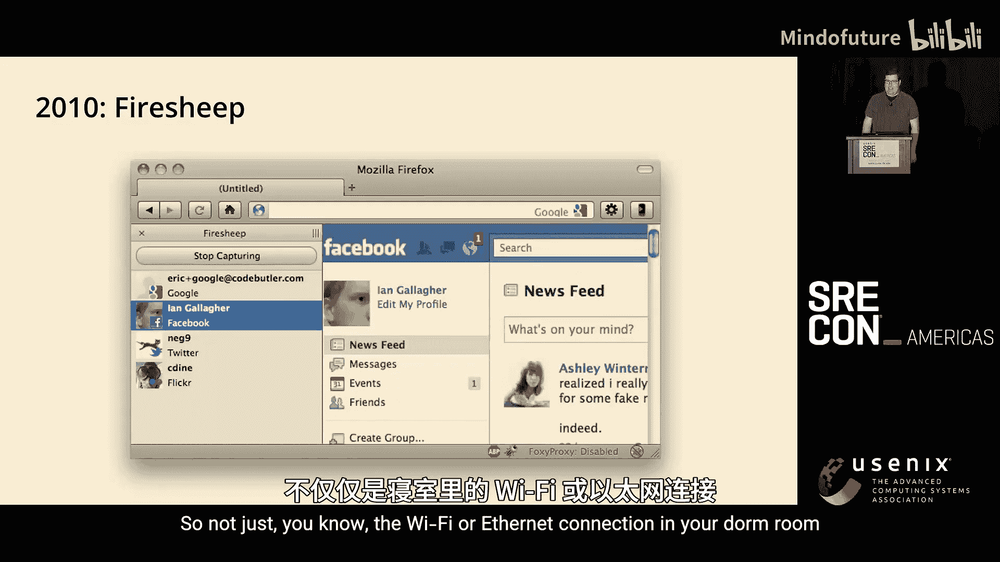
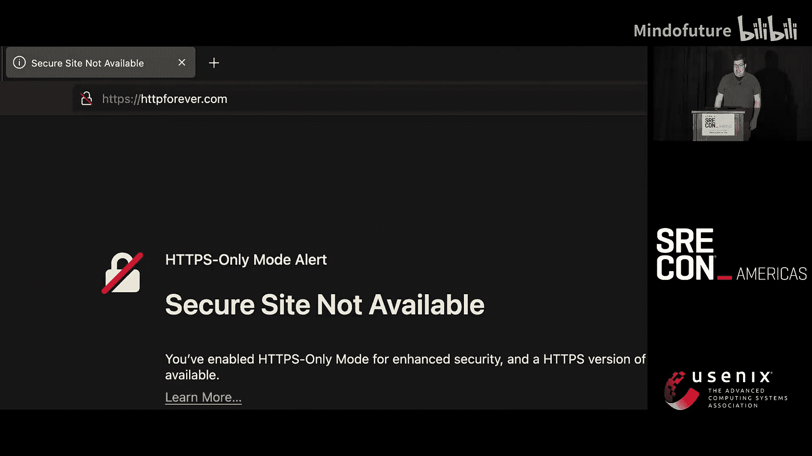
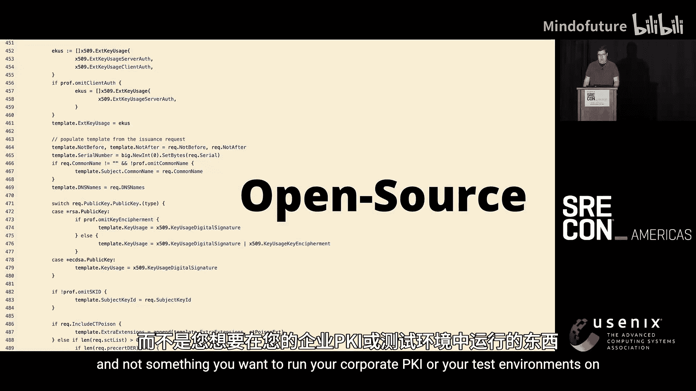
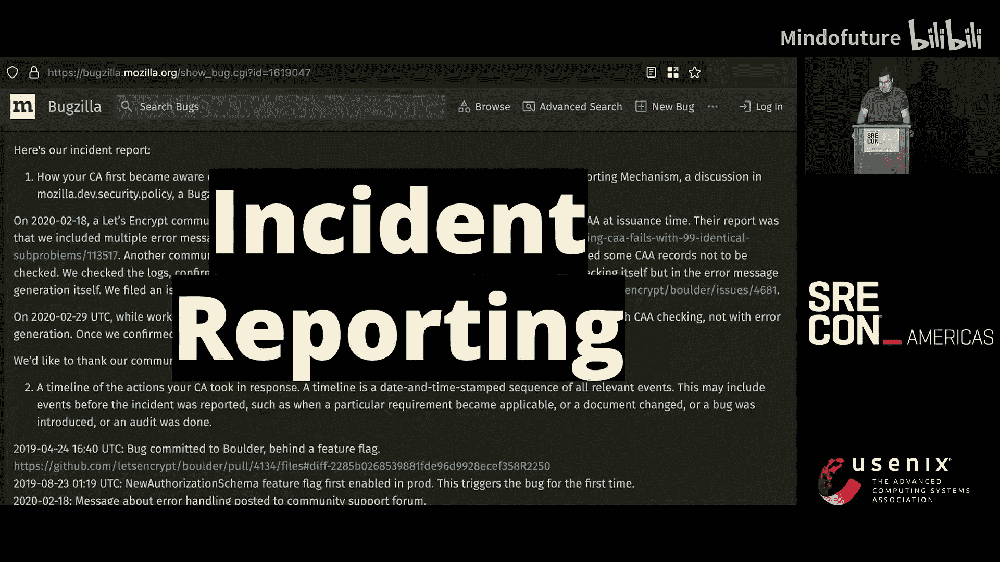
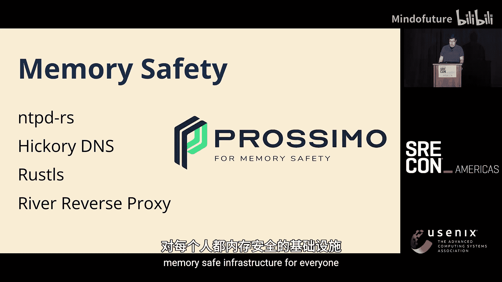
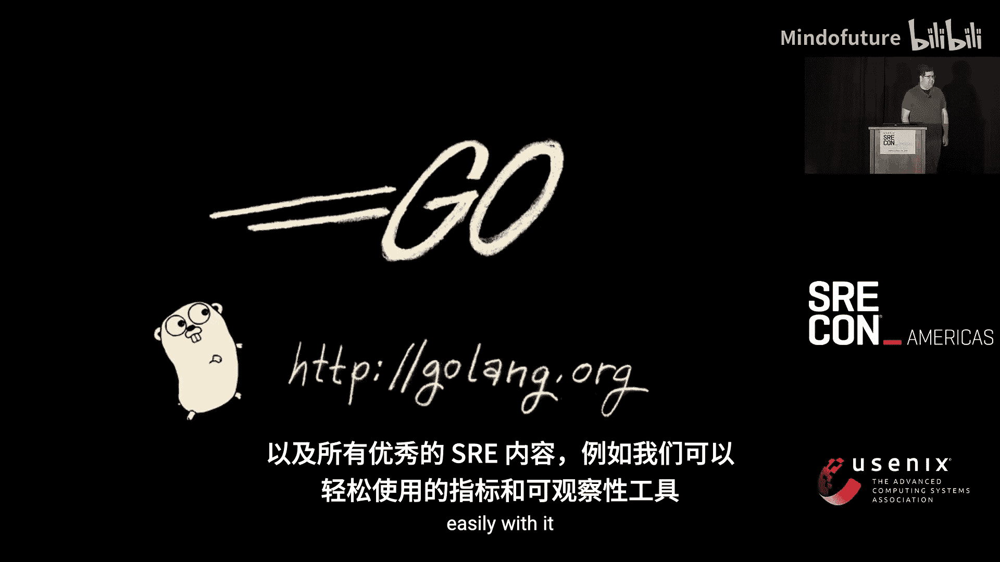
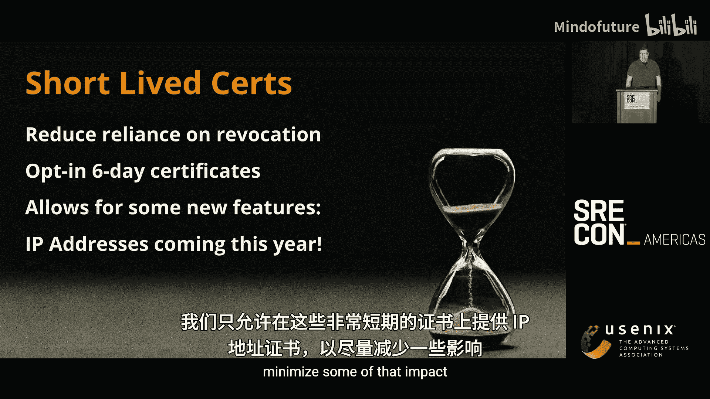
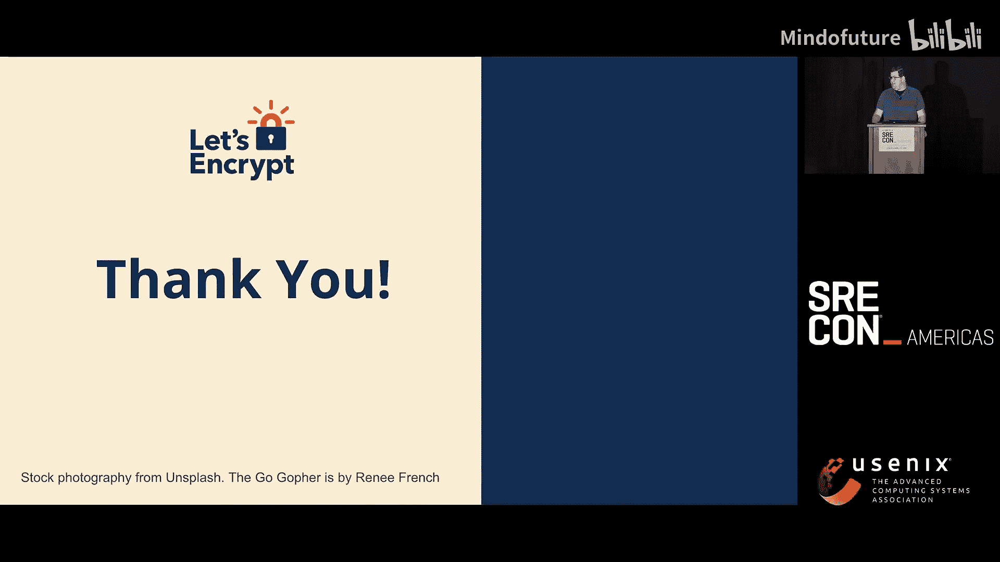
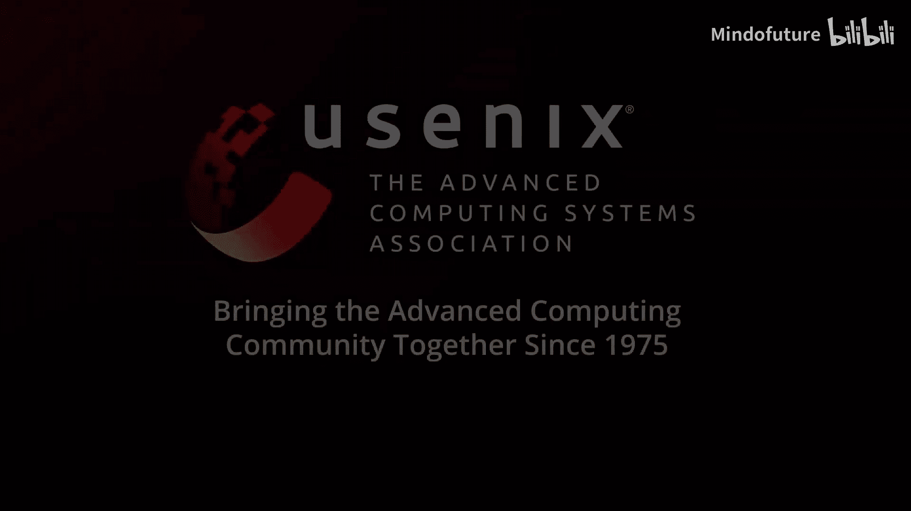
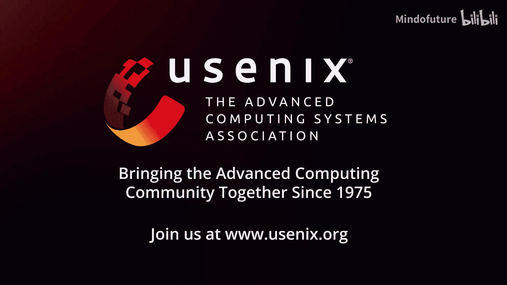

# 001：十年免费、开放与自动化之路——改善SRE体验

## 概述

在本节课中，我们将回顾Let's Encrypt项目过去十年的发展历程。我们将了解这个免费、开放、自动化的证书颁发机构（CA）是如何诞生的，它如何解决了早期互联网的安全难题，以及其背后的组织、技术架构和运维哲学。课程将涵盖其历史背景、建立信任的过程、技术栈选择、当前挑战与未来规划，旨在为SRE和开发者提供一个关于如何构建并运维大规模、关键性公共服务的一手案例。

---

## 历史背景：为何需要Let's Encrypt？

在Let's Encrypt出现之前，互联网的安全状况与今天截然不同。大约10到15年前，公共Wi-Fi网络极不安全。一个标志性事件是2010年发布的Firefox插件Firesheep，它能轻易窃取同一网络下其他用户的会话Cookie，让登录校园Wi-Fi下的Gmail或Facebook账户变得非常危险。

当时，许多大型网站可能只在登录页面使用HTTPS，但网站的其他部分以及会话Cookie仍以明文传输。人们虽然意识到这个问题，但TLS（传输层安全协议）的普及率远远不够。

TLS本身在当时也存在性能问题。不过，随着新版本TLS的发布、CPU指令集加速以及更高效的加密套件出现，浏览器和大型网站共同努力，性能问题逐渐得到解决。

然而，有一个巨大的障碍始终存在：**数字证书**。证书难以普及有几个原因。

---

## 早期障碍：成本与自动化难题

第一个障碍是**成本**。虽然单个证书费用不高，但对于需要管理大量证书的场景（例如大学社团为所有成员提供虚拟主机），购买和续费证书在经济和管理上都不现实。

第二个更关键的障碍是**自动化缺失**。获取和配置证书是一个高度手动的过程：需要邮件沟通、人工验证、手动配置Web服务器并确保证书格式正确。这与当今在托管平台上瞬间自动部署HTTPS网站的能力形成鲜明对比。

当时也有人研究替代Web公钥基础设施（PKI）的方案，例如使用DNSSEC来保护Web，但这些方案推进缓慢。因此，要真正实现全网加密，最可行的方案似乎是创建一个**全新的证书颁发机构**。

---

## 项目启动：目标与诞生

Let's Encrypt的目标由此确立：创建一个**免费**、**开放**、**完全自动化**的CA，以便能深度集成到所有需要证书的系统中。

规划始于2013年。2014年，非营利组织**互联网安全研究小组（ISRG）** 成立，并开始了软件和基础设施的开发。2015年，Let's Encrypt颁发了第一批证书。

项目初期得到了一批赞助商的支持，他们看到了项目的愿景并助力其启动。

项目启动后发展迅速。从2015年底至今，Let's Encrypt从最初每天颁发少量证书，发展到如今每天颁发**数百万张**证书。

---

## 建立信任：从基础设施到根证书植入

建立并运营一个CA，技术上的挑战只是其一。更重要的是如何成为互联网中**受信任的第三方**。

这个过程分为几个关键步骤：
1.  **初始建设**：搭建基础设施，包括服务器、硬件安全模块（HSM）、网络和代码。
2.  **通过审计**：遵循CA/浏览器论坛制定的基线要求，通过WebTrust审计，证明其流程和操作符合标准。
3.  **加入根证书计划**：说服主要的软件供应商将Let's Encrypt的根证书植入其产品。这包括：
    *   **Apple**（iOS/macOS）
    *   **Google Chrome**
    *   **Microsoft**（Windows）
    *   **Mozilla**（Firefox）
    Mozilla的根证书计划因其完全公开透明而尤为重要，常被其他系统（如Linux发行版）作为参考。
4.  **交叉签名（Cross-Signing）**：在新根证书被全球所有设备信任之前（这可能需要数年时间），可以通过一个已被广泛信任的CA对Let's Encrypt的中间证书进行“交叉签名”，从而快速获得信任。IdenTrust作为早期赞助商，提供了关键的初始交叉签名。

---

## 运营哲学：开放、透明与标准化

成为受信任的CA不仅需要技术，更需要正确的运营哲学。Let's Encrypt通过以下几种方式建立并维持信任：

### 开源
Let's Encrypt的CA软件**Boulder**是完全开源的。任何人都可以在GitHub上审查其每一行代码。这促进了与业界的合作，并增强了透明度。

### 公开事件报告
根据Mozilla根证书计划的要求，Let's Encrypt将所有事件报告公开在Bugzilla上。这种透明度不仅适用于CA生态，有时甚至能推动更广泛的改进（例如，Go语言曾因Let‘s Encrypt报告的一个bug而修改了语言设计）。

### 标准化协议（ACME）
Let's Encrypt没有仅仅提供一个私有API，而是通过IETF流程标准化了**ACME（自动证书管理环境）** 协议。这使得整个生态能够蓬勃发展，众多客户端、服务器和防火墙都内置了ACME支持，其他CA也广泛采用了该协议。

### 单一执行路径
在Let's Encrypt，**所有证书（包括测试和生产环境）都只能通过ACME协议颁发**。内部人员也没有“后门”命令行工具。这消除了特权路径，简化了合规性与正确性验证。

### 证书透明度（CT）日志
Let's Encrypt将所有颁发的证书记录到公共的**证书透明度（CT）** 日志中，并且自身也运营着CT日志。这对SRE和安全团队来说是宝贵的数据源，可用于监控自己基础设施的证书状态。

---

## 团队与规模：以小团队驱动大影响

ISRG目前有25名员工，涵盖工程、筹款、传播、财务和管理。其中，只有4名软件开发者全职维护Boulder，以及一个9人的**SRE团队**。

以这样的团队规模支撑每天数百万证书的签发，**效率**是重中之重。核心思路是：**通过自动化构建需要最少人工干预的服务，并严格控制功能范围**。

这意味着有时必须说“不”：
*   不支持SMIME或扩展验证（EV）证书。
*   不提供传统的客户支持。
*   不填写某些供应商特定的安全审计问卷。

Let's Encrypt的定位是**降低HTTPS的准入门槛**，而非追求利润或服务所有客户。如果有需求超出其核心使命，可以放心地引导用户使用其他商业CA。

目前，Let's Encrypt的年运营预算约为450万美元，相比初创时期有了显著增长，但服务规模的增长更为巨大。

---

## 技术架构揭秘：物理、垂直与内存安全

作为CA，其核心PKI材料受到严格的物理监管要求，因此**主要基础设施运行在自有的物理数据中心**，而非云端。

*   **基础设施规模**：在两个数据中心拥有约3个机架、24台服务器，以及网络、HSM等设备。
*   **云服务辅助**：将CRL分发、DDoS防护、日志和指标收集等非核心服务放在CDN和云提供商上。
*   **离线根**：根证书密钥存储在完全气隙隔离的离线环境中。

在运维中，一个重要的经验是：**硬件相对于人力是便宜的**。因此，团队倾向于垂直扩展而非过早进行复杂的水平扩展。例如，数据库使用一个强大的主节点（配备大内存和NVMe闪存）和多个副本，从而避免了管理分布式数据库的复杂性。

应用栈本身是无状态的，采用较为常规的技术组合：Linux、Nomad（编排）、Proxmox（虚拟化）、MariaDB、Salt Stack/Ansible（配置管理）、Prometheus（监控）和Redis（缓存）。

一个特别之处是对**内存安全**的投入。作为ISRG旗下的项目，Prossimo致力于为关键基础设施提供内存安全的实现。Let's Encrypt正在部署：
*   **NTP**：使用Rust编写的、内存安全的`ntpd-rs`替代传统NTP服务，因为时间戳对证书有效性至关重要。
*   **DNS**：计划用Rust编写的`Hickory DNS`替代现有解析器，因为域名验证是CA的核心操作之一。
*   **TLS/代理**：评估`Rustls`作为TLS库，并关注`River`（Rust反向代理）的未来发展。

这些投入旨在加固互联网基础设施的关键边界。

---

## 核心工具与开发

团队的大部分内部工具和Boulder CA本身都使用**Go语言**编写。Go在开发效率、性能、内存占用以及与监控、可观测性工具的集成方面取得了良好平衡。

---

## 未来规划：改进、简化与演进

上一节我们介绍了Let's Encrypt当前的技术栈，本节我们来看看团队正在着手进行的几项重要改进。

### 1. 撤销（Revocation）机制的变革
OCSP协议存在隐私和性能问题，且依赖在线查询，导致浏览器常需“失败开放”，使其效果大打折扣。现代浏览器已转向改进的CRL机制。因此，Let's Encrypt已开始**逐步取消对OCSP的支持**。这对SRE而言是个好消息，因为运维OCSP服务非常繁琐。

同时，为了更优雅地处理大规模证书撤销和续订，Let's Encrypt正在推广ACME协议的**续订信息端点（ARI）**。该端点能提前通知客户端证书需要续订的时间窗口，而非仅仅在撤销后通知。这既帮助网站管理员避免服务中断，也让CA能平滑管理因大规模撤销引发的续订流量高峰。

### 2. 停止发送到期提醒邮件
目前Let's Encrypt会在证书到期前30天发送提醒邮件。但这存在诸多问题：邮件可能发送给不再使用的网站；涉及额外的隐私数据管理；且它并非监控网站状态的可靠方式。未来，Let's Encrypt计划**减少或停止发送这类邮件**，将监控责任交还给网站所有者或更专业的监控服务。

### 3. 证书透明度（CT）日志的演进
随着证书签发量增长，CT日志服务的读取压力巨大。团队正在开发新的**StaCT API**，其设计极具SRE思维：可以从S3等静态存储直接提供API服务，读取路径无需自定义代码，且极易被CDN缓存。这将极大提升可扩展性和成本效益。新的实现`Sunlight`正在开发中。

### 4. 进一步缩短证书有效期
缩短证书寿命可以减小证书被滥用时的暴露窗口，减轻对撤销机制的依赖。Let's Encrypt计划在今年晚些时候提供**可选的有效期仅为6天的证书**。虽然这要求用户具备高度自动化和监控能力，但它也将解锁一些新功能，例如颁发**IP地址证书**，这在之前由于IP地址的易变性和所有权问题而未被允许。

---

## 总结与呼吁

本节课我们一起学习了Let's Encrypt如何通过免费、开放和自动化的理念，在过去十年中极大地推动了HTTPS的普及。我们回顾了其历史、建立信任的历程、高效的团队运作模式、独特的技术架构以及面向未来的规划。

作为非营利组织，Let's Encrypt的成功离不开社区的支持。你可以通过以下方式提供帮助：
1.  **推广HTTPS**：将你所能影响的非HTTPS网站切换到HTTPS。
2.  **贡献生态**：为你开发或维护的产品集成ACME客户端支持，实现自动证书管理。
3.  **财务支持**：个人捐赠或寻求企业赞助对项目的持续运营至关重要。

感谢所有让Let's Encrypt成为可能的贡献者、赞助商以及像SREcon这样的社区，它们为项目提供了宝贵的知识和经验。

