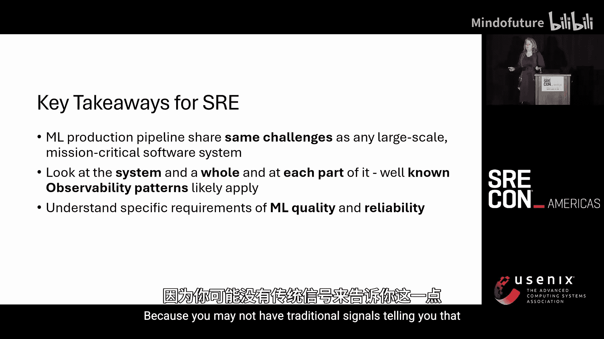
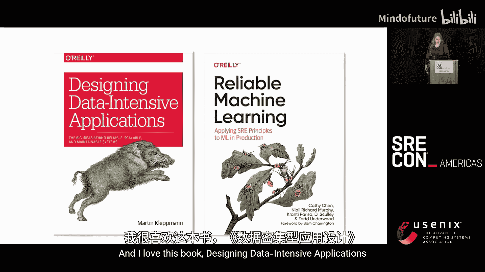
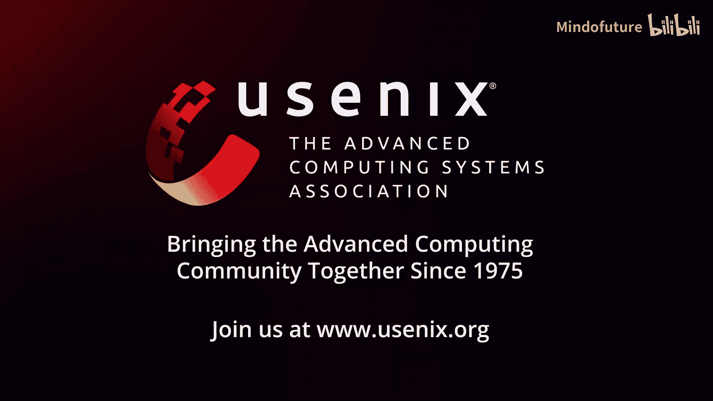

# 002：一种SRE的生产环境机器学习监控方法 🚀


## 概述

在本节课中，我们将探讨在生产环境中监控机器学习（ML）工作负载的必要方法。我们将了解为什么传统的监控手段不足以应对ML模型带来的独特挑战，并学习如何将SRE（站点可靠性工程）的实践与ML运维相结合，构建一个可靠、可观测的ML生产系统。

---

## 为什么需要监控机器学习？ 🤔

上一节我们介绍了课程主题，本节中我们来看看为什么监控机器学习如此重要。

首先，机器学习模型无法达到100%的准确。正如统计学家乔治·博克斯所言：“**所有模型都是错误的，但有些是有用的。**” 追求100%的准确度会导致过拟合，且不切实际。现实世界的数据复杂多变，即使今天模型是完美的，明天世界可能已经改变，模型就不再准确。

其次，机器学习模型不具备持久性。一项发表在《自然》杂志上的研究表明，**91%的机器学习模型会随着时间的推移而性能下降**。模型在部署后不会保持静态，即使初始性能很高，也可能因数据变化而退化。

最后，复杂系统不可能是完全确定性的。复杂系统始终运行在“永久降级模式”中，我们到处都在处理小的故障，通过深度防御来防止大的失败。

**总结来说：**
1.  100%准确的ML模型不存在。
2.  91%的ML模型会性能衰退。
3.  没有复杂系统是100%弹性的。

因此，我们需要一种专门针对ML的监控方法。

---

## SRE与ML实践者的差异与融合 🔄

上一节我们明确了监控ML的必要性，本节中我们来分析执行监控的两大关键角色：SRE和ML实践者。

SRE的日常工作包括：
*   深刻理解大规模分布式系统。
*   构建可扩展、可观测、安全、合规且能抵御流量波动的系统。
*   系统始终运行在故障模式中，需要处理事故以防止更大问题。

ML实践者的日常工作包括：
*   深刻理解数学、统计和概率。
*   开发、评估和优化复杂的算法与模型。
*   模型从数据中学习，以做出预测和决策，并集成到产品或流程中。

两者都需要与不同团队协作，但存在一个根本差异：**SRE的影响是随时间扩散的**，其价值体现在长期没有坏事发生；而**ML实践者的评估是时间点式的**，价值体现在交付一个具体的模型。这种评估方式的差异需要调和，以确保模型在生产中的质量也能持续。

---

### 词汇与挑战的鸿沟

两者的日常词汇也存在差异。ML领域关注建模、精确度、回归、训练、测试、噪声、公平性等。虽然有些词（如“性能”）是共通的，但含义可能不同。这种语言上的脱节长期来看代价高昂，我们需要统一语言，确保能相互理解并优先处理相同的事务。

我们面临的共同挑战包括：
*   **规模**：一切都在增长（摩尔定律）。
*   **资源短缺**：业务快速增长，对资源的需求也飞速增长（霍夫施塔特定律）。
*   **事故与故障模式**：双方都要处理，但事故的表现形式可能不同。
*   **跨领域专业教育的缺乏**：目前鲜有大学课程同时深入教授SRE和生产级ML运维。
*   **系统可理解性**：现代系统（无论是分布式系统还是复杂ML模型）都过于庞大，无法装入一个人脑中（康威定律）。
*   **沟通**：沟通中最大的问题是“以为沟通已经发生了”（萧伯纳）。词汇差异会阻碍有效沟通。

因此，我们必须将这两个学科紧密结合起来。

---

## 机器学习基础与生产现实 🧠

在深入架构之前，我们先快速回顾机器学习基础及其生产环境下的现实。

机器学习主要分为：
*   **监督学习**：使用带标签的数据集作为输入，模型基于数据中的分类进行预测。例如：神经网络、线性回归、决策树。
*   **非监督学习**：数据没有标签，首先在数据中寻找模式以形成类别，然后将新数据归类。例如：K均值聚类、主成分分析、层次聚类。

根据伦理AI与机器学习研究所的研究，2024年最流行的ML应用是**时间序列预测**，其次是大语言模型（LLM）、推荐系统、自然语言处理等。

**关键认知是：构建模型只是开始。** 模型需要被集成到解决实际问题的复杂分布式系统中。你的故障将不仅是ML故障，也包括所有分布式系统常见的故障。客户不关心你的模型准确率多高，他们关心端到端系统是否工作。因此，你需要监控整个系统。

---

## SRE需求层次在ML中的扩展 🏗️

上一节我们了解了ML的基础，本节我们看看如何将经典的SRE需求层次（金字塔）扩展，以适应ML工作负载。

我们需要一个“ML风味”的金字塔：
1.  **数据管理与质量监控**：这是ML监控的基础。数据是模型的燃料，必须监控其收集、质量和统计特征。
2.  **容量规划**
3.  **测试与发布流程**
4.  **学习与反馈循环**
5.  **事故响应**：准备好应对ML特有的挑战。
6.  **ML监控**：监控模型本身。
7.  **所有传统监控层**（监控、自动化等）

一个ML项目的生命周期通常包括：定义任务 -> 寻找与探索数据 -> 训练与验证模型 -> 部署 -> 运维（MLOps）。在运维阶段，你需要监控：
*   **业务KPI**：传统遥测无法告诉你模型给出的答案是否正确。
*   **数据分布**：输入模型的数据、模型输出的数据，以及可能的情况下，客户反馈的真实数据（Actuals）。
*   **部署流程**：为ML模型实现有效的CI/CD。

---

## 监控复杂数据处理管道 📊

ML系统本质上是复杂的数据处理管道。在构建具体架构前，我们先看看如何监控这类管道。

一个典型管道包括：数据输入（Ingress） -> 转换（可能是ML推理） -> 数据输出（Egress） -> 数据存储。

以下是监控此类管道的要点：
*   **避免孤立视角**：不要只查看单个处理环节的原始或处理后的数据，这会失去端到端的可见性。
*   **关注长期趋势**：查看绝对和相对性能，单一时点的数据可能无法揭示系统正在缓慢退化。
*   **全面审视数据**：除了关注最旧和最新数据，还需注意不同数据类型的处理成本差异，避免误导。
*   **测量端到端延迟**
*   **为可理解性添加遥测**：系统会不断增长，确保你的监控工具能帮助未来的你理解和解释系统。
*   **理解系统权衡**：你的系统是为**低延迟**还是为**数据完整性**而优化？例如，交通预测系统可能牺牲完整性以获取最新数据；而金融交易系统则必须保证完整性。

---

## 训练阶段的监控 🏋️

模型训练本身也是一个需要投入生产、持续运行的数据管道。

训练流程通常为：数据注入 -> 特征提取 -> 模型训练与验证 -> （循环）。整个过程在一个编排器（Orchestrator）中运行，并保存模型元数据（如训练者、时间、预测快照、模型架构等），以便未来进行模型回滚等决策。

在训练阶段，你需要监控：
*   **数据存储**：数据新鲜度、可用性、容量、数据丢失/损坏、模式不匹配。
*   **注入阶段**：注入速率、端到端延迟、管道持续时间、丢弃率。
*   **编排器**：作业执行、失败与重试、执行时间。
*   **ML数据集质量**：完整性、正确性、新鲜度、是否存在偏差。
*   **训练过程**：训练时长、失败率、训练误差与验证误差、计算资源消耗、生成的模型大小。
*   **模型性能**：精确度、召回率、准确率等统计指标，以及模型的计算性能（推理速度）。

---

## 设计生产架构与监控策略 🏗️

在开始构建架构前，必须进行设计决策：
*   **明确系统目标**：期望的延迟、流量负载。系统是为延迟还是完整性优化？
*   **了解合规要求**：隐私、安全、合规与治理要求，进行责任与偏见审查。
*   **决定托管方式**：
    *   如果需要**在边缘设备运行**，则托管在客户端。
    *   如果**延迟至关重要**，可考虑离线或内存托管（模型需较小）。
    *   否则，运行**模型即服务**。

以下是一个参考公式：
```text
if (need_to_run_on_edge):
    host_on_client
elif (latency_is_critical):
    host_offline_or_in_memory  # 模型需小巧
else:
    host_model_as_service
```

---

### 生产架构模式

常见的生产架构模式包括：
1.  **数据库预计算**：将预测结果批量计算后存入生产数据库，应用直接查询。适用于数据量不大、变化不极快的场景。
2.  **内存驻留**：将模型编译后加载到应用服务器内存，实现极快推理。适用于推理简单、内存充足的情况。
3.  **模型即服务**：这是SRE更熟悉的模式。部署一个模型服务，可以同时运行多个模型版本（实验版、生产版），并通过流量路由进行A/B测试和灰度发布，最终将流量导向性能最佳的模型。
4.  **客户端托管**：在终端设备上运行模型，更新频率较低。

---

### 生产环境监控的四支柱

在生产环境中，监控应围绕四个支柱展开：
1.  **基础设施**：如果你拥有底层设施，需监控CPU、内存、磁盘、网络等。
2.  **服务**：监控事务率、响应时间、错误率等传统指标。
3.  **数据**：除了数据新鲜度和容量，还需监控**数据噪声、可变性和分布漂移**。
4.  **模型**：监控其准确率、精确度、召回率，以及**预测漂移和不确定性估计**。同时，确保为ML模型构建了CI/CD流程，支持实验、测试和生产环境的模型部署与流量管理。

---

## 核心挑战：数据分布漂移 📉

分布漂移是ML生命周期中极其重要的一环。你不能脱离数据分布来谈模型准确率。当输入数据的统计分布发生变化时，模型的性能就会下降。

**什么是漂移？** 它是输入数据行为的改变。例如，一个销售万圣节产品的商店，其数据中“橙色”商品很多；但当圣诞节来临，“金色”和“红色”商品的数据会变多，分布就发生了漂移。

**如何工作？** 你基于训练数据得到一个分布，并训练模型。在生产中，你持续收集数据，并计算相同特征的分布。将生产数据分布与训练数据分布重叠比较，如果差异显著，就发生了漂移。

**如何测量？** 可以使用统计方法（如科尔莫戈罗夫-斯米尔诺夫检验、群体稳定性指数、卡方检验等）计算一个**漂移数值**。你需要为业务定义“差异显著”的阈值，一旦超过，就触发模型重训练。

**需要监控哪些数据的漂移？**
*   **训练数据**：用于训练模型的数据分布。
*   **输入数据**：生产环境中流入模型的数据分布。
*   **输出数据**：模型产生的预测结果的分布。
*   **实际数据**：如果可能，收集客户反馈的真实结果（Actuals），这是评估模型的最直接依据。但有些场景（如预测20年后的情况）可能无法获得实际数据，此时监控输入和输出的分布漂移就至关重要。

---

## 可观测性反模式与关键要点 🚫

在实施监控时，需警惕以下常见反模式：
*   **数据囤积**：认为收集更多遥测数据总是好的，从不删除旧数据，这反而会降低系统可理解性。
*   **监控与业务目标脱节**：只监控CPU使用率，而不监控端到端用户体验。
*   **永不关闭监控**：保留所有不再需要的监控和警报，增加噪音。
*   **仪表盘泛滥**：创建无数个仪表盘，但无人能全部查看。
*   **对故障模式缺乏共识**：过度依赖个别“专家”。
*   **反应式文化**：仅在有事故后才添加新监控。
*   **激励错位**：将可观测性工作视为“税费”，而非价值。
*   **可观测性英雄**：监控成为一个人的工作，知识没有共享。
*   **只见树木不见森林**：只监控独立组件，忽略端到端流程。

---

### 给SRE的关键要点
*   ML生产管道与任何大规模分布式系统面临相同的挑战，应以相同方式对待和监控。
*   既要将系统视为整体，也要关注各个部分。成熟的可观测性模式很可能适用。
*   必须理解ML质量的具体要求，因为传统信号可能无法告诉你模型的好坏。
*   **提升统计学和概率论知识**。
*   **设计易于理解的系统**，降低复杂性。

---




### 给ML实践者的关键要点
*   **设计模块化系统**，使其易于理解、监控和排查。
*   深入理解**可靠性、安全性、合规性、数据治理**等SRE高度关注的要求。
*   **不要将ML模型“扔过墙”**给运维团队，你需要成为系统持续运维的一部分。
*   前瞻性设计，构建能够扩展且不会过快过时的系统。可以通过重训练机制和多模型策略来增强模型的持久性。
*   **理解大规模分布式系统设计原则**。

**推荐阅读**：
*   《Reliable Machine Learning》 - Todd Underwood
*   《Designing Data-Intensive Applications》 - Martin Kleppmann

---

## 总结 🎯





本节课中，我们一起学习了如何将SRE的实践应用于生产环境的机器学习监控。我们认识到，由于ML模型无法100%准确、会随时间退化且身处复杂系统，因此必须对其进行专门监控。我们探讨了SRE与ML实践者在目标和语言上的差异，以及如何通过扩展SRE需求层次、监控数据管道和分布漂移来弥合这些差距。最后，我们强调了设计合适架构、避免监控反模式，以及两个团队紧密协作、共同负责的重要性。记住伯纳德·肖的话：“乐观者发明了飞机，悲观者发明了降落伞。” 在构建可靠的ML系统时，我们需要这两种思维。