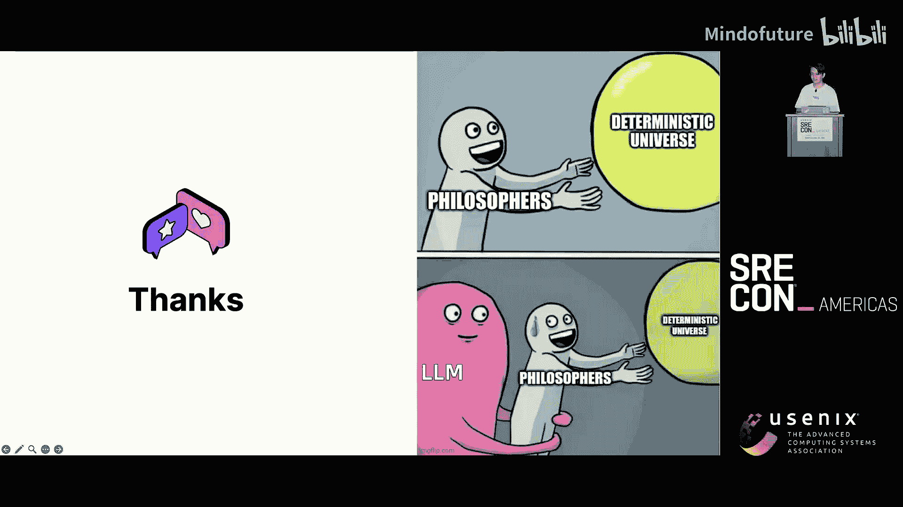
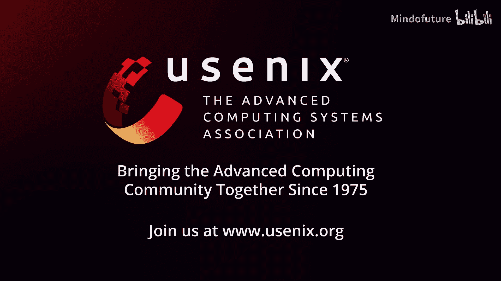

# 003：SRE领域的变革者——演进以管理AI基础设施

在本节课中，我们将探讨SRE（站点可靠性工程）原则如何应用于管理AI基础设施，特别是大规模语言模型训练场景。我们将了解AI工作负载与传统微服务的区别，并学习如何调整SRE的五大支柱（可靠性度量、自动化、可观测性、事件响应和容量管理）来应对新的挑战。

## 背景介绍与挑战

上一节我们介绍了课程概述，本节中我们来看看AI基础设施的具体定义和当前面临的挑战。

AI基础设施，特别是从模型训练的角度来看，其架构与传统分布式系统有显著不同。一个简化的大规模分布式训练架构包含多个计算节点，每个节点负责计算模型权重的一部分，并通过高速网络交换参数，进行前向和反向传播，最终收敛于损失函数。

从基础设施堆栈来看，我们需要管理模型框架以下的所有层面，包括数据中心、存储层（用于存储训练数据和模型数据）、GPU、网络以及运行这些基础设施所需的所有基础管理服务。当然，还有用于编排一切的Kubernetes。

当我们开始进行模型训练时，面临的最大问题之一是处理训练中断。在训练初期，每天甚至每几个小时就会遭遇多次模型训练中断，这迫使团队必须在凌晨起床以恢复训练。这种中断的代价高昂，因为大量昂贵的GPU资产会因此闲置，造成时间和金钱的浪费。

从工程调试的角度看，如今排查训练作业中断需要不同层次的知识。仅仅检查训练作业日志、系统日志或节点级指标已不足以定位问题。例如，在一个包含数千个GPU的训练作业中，GPU利用率曲线可能剧烈波动。通过深入排查，团队可能发现问题的根源仅是一个GPU芯片上的坏光模块，而这可能是由于安装时的灰尘导致的。这类硬件层面的细微问题，是我们以往在微服务领域难以想象的。

与传统微服务领域相比，AI训练领域存在以下关键差异：
*   在微服务领域，单点故障的影响通常不大，我们拥有成熟的工具（如踢出故障节点或进行流量切换）来应对，且通常对网络带宽要求较低。
*   在GPU训练领域，单个节点故障的影响范围（爆炸半径）极大，可能导致上千个GPU闲置。恢复或重新初始化的成本很高，加载大型模型可能需要10到15分钟。此外，GPU架构要求极高的网络通信带宽，所有参数交换都在毫秒级内完成。

## 可靠性度量的演进

上一节我们了解了AI基础设施的独特挑战，本节中我们来看看如何调整SRE的核心——可靠性度量。

在经典的SRE方法论中，我们有五大支柱。那么，在GPU训练领域，它们意味着什么？首先从度量开始。

在微服务中，我们常用服务等级目标（SLO）来度量可靠性。但在GPU训练中，经典的SLO方法论可能需要一些转变。例如，如何度量一个跨越100个节点的训练作业的服务可用性？99%的成功率有意义吗？如果99%的节点成功，但仅一个节点失败，整个作业就失败了。此外，GPU架构中没有RPC调用链，因此也没有成功率SLO或延迟SLO。

因此，我们更倾向于使用“可靠性度量”这个术语。我们提出了两个我们认为能有效指导工程工作的北极星指标：

1.  **训练时间效率**：定义为训练作业中有效训练时间与总运行时间的比率。这衡量了实际资源消耗的利用率。
    *   **公式**：`训练时间效率 = 有效训练时间 / 总运行时间`
2.  **资源供应可用性**：从供应链角度衡量资源供应的可用性，即在给定时间窗口内，总可用GPU时间与理论最大GPU时间的比率。
    *   **公式**：`资源供应可用性 = 总可用GPU时间 / 理论最大GPU时间`

有了这些目标，我们就可以开展SRE实践来改进这些数字。

## 可观测性：与数学和统计学为友

上一节我们讨论了新的可靠性度量指标，本节中我们将深入探讨可观测性，并看看如何利用数据和数学解决具体问题。

关键挑战在于如何利用海量监控数据快速识别出性能降级的GPU。我们面临三个主要挑战：

1.  **高基数性**：数千个GPU，每个GPU暴露数百个指标，数百个作业可能跨越多个集群，标签组合的数量巨大。
2.  **高分辨率**：在微服务领域，通常每30秒或每分钟抓取一次数据点可能就足够了。但在GPU领域，要发现GPU通信或传输速率中的突发问题，需要毫秒级的分辨率，这极大地增加了需要存储的监控数据总量。
3.  **粒度问题**：在进行任何形式的聚合之前，我们需要保留所有细节，因为你永远不知道需要深入到哪个层级（例如硬件层级）来定位问题。

高基数性和高分辨率导致指标对人类而言难以阅读。我们需要借助统计工具来自动化分析这些数据。

我们有两个假设：
1.  **行内一致性**：在训练步骤中，执行相同角色的多个节点应暴露相似的指标。
2.  **时间一致性**：跨训练步骤，无论是第一步还是第一千步，所有节点都应表现出相似的行为。

以下是两个用于自动化分析的“武器”：

**1. JS散度**
JS散度是一种统计差异方法，可以量化不同概率分布之间的相似性。我们将每个GPU的时间序列指标（如GPU利用率）转换为概率分布直方图，然后应用JS散度计算，生成热图。热图中，绿色表示行为相似，红色或黄色则表示可能存在异常。

**2. 傅里叶变换**
傅里叶变换是一种强大的技术，可以将数据从时域转换到频域。例如，将GPU卡在10毫秒分辨率下的NVLink传输速率时域图（难以阅读）转换到频域后，可以在频谱中看到一个明显的峰值。这个峰值对应的频率代表了训练步骤的正常节奏周期。一旦知道正常节奏，就可以轻松检测出节点何时失步（训练变慢会导致周期变长）。

## 可观测性：粒度与追踪

上一节我们介绍了用统计方法分析指标，本节中我们来看看当指标不够时，如何通过更细的粒度来定位问题。

有时我们需要更细的粒度。例如，通过可视化跨多个节点的不同操作的执行时间线，我们可以深入理解训练过程。在模型训练中，有两个主要操作需要关注：
1.  **矩阵乘法**：GPU擅长快速执行此类计算。
2.  **网络同步**：需要在不同GPU节点间广播权重和计算数据。

通过时间线图，我们可以发现计算瓶颈（某个操作持续时间过长）或异常节点（某个节点在每个操作上都延迟）。这种可视化对于确定优化方向至关重要。

如何获得这种粒度？这听起来很像分布式追踪。我们有一个概念验证实现，使用CUDA编程来检测这类操作，获取追踪数据，并将其转换为Chrome浏览器可读取和可视化的格式。这样，我们就能获得一个时间线视图，清晰地展示跨多个GPU同时发生的操作、它们的持续时间以及最重要的是它们如何随时间对齐。

## GPU资源管理

上一节我们探讨了如何检测GPU集群中的异常节点，本节中我们来看看如何管理这些昂贵的资源。

除了可用性度量，我们还需要向高层管理者（如CFO）报告GPU资源的利用情况。我们使用桑基图或瀑布图来追踪GPU资源在各种状态间的流转。这种细分至关重要，因为GPU是极其昂贵的资产，值得我们精心“照看”。

以下是GPU资源的典型流转状态：
1.  **总库存**：公司拥有的全部GPU。
2.  **已损坏/待维修**：部分GPU损坏，等待更换或维修。
3.  **进入Kubernetes集群**：剩余的GPU进入集群，但并非立即可调度（可能因驱动更新、负载测试等原因被封锁）。
4.  **可分配**：在所有可调度的GPU中，我们可以将训练作业分配其上，但仍存在因资源碎片化导致的闲置。
5.  **活跃使用**：在已分配的GPU中，部分正被积极用于GPU计算，部分可能因模型框架未优化而闲置（这是我们希望优化的部分）。

## GPU管理策略：驱动更新与基准测试

上一节我们了解了GPU资源的流转状态，本节中我们来看看具体的GPU管理策略，包括驱动更新和主动基准测试。

首先是一个基本问题：在Kubernetes集群中，更新成百上千个节点的GPU驱动，什么策略好？在微服务领域，我们可能采用渐进式滚动更新，先更新1%、5%，逐步增加到100%，并在每个阶段进行测试以确保一切正常。

但在GPU领域，驱动更新可能会中断训练作业。如果使用渐进式滚动更新，可能会在模型训练期间遭遇多次中断，效率低下。事实证明，与AI团队协调，安排一个维护时间窗口，停止训练，然后一次性完成所有驱动的更新，反而更高效。这表明，传统SRE认为对生产环境最佳的做法，在这种场景下可能并非最优。

除了检测和修复降级节点，我们还能做什么预防措施？我们提出了一个主动的节点基准测试协议，在基础设施管理的不同阶段运行不同级别的基准测试。

以下是不同级别的基准测试：
1.  **基础架构测试**：检查Pod能否在单个节点上调度，节点是否基本工作正常。
2.  **GPU基础测试**：测试硬件错误（如ECC错误、PCIe错误）。
3.  **性能测试**：测试计算能力（如使用压力测试查看GPU是否满负荷工作）。
4.  **多节点测试**：测试一批节点能否彼此高效通信，以在分布式训练策略中表现良好。
5.  **实际模型测试**：运行几个小模型训练步骤，查看节点是否已为下一次训练做好准备。

我们需要在以下五个阶段执行这些基准测试：
*   生产前验证（节点加入集群前）
*   大型模型训练开始前
*   维修后阶段
*   全面诊断阶段
*   节点空闲时

实现此类基准测试流程的架构并不复杂，基本上是云原生方法：运行一些Operator，设计自定义CRD，采用声明式驱动设计。编写针对不同GPU的基准测试CRD，与节点级Operator协调以选择正确的节点进行测试，并在测试完成后回收所有基准测试Pod。

## 总结与展望

本节课中我们一起学习了SRE原则在管理AI基础设施中的应用。

关键要点总结如下：
1.  **AI工作负载特性**：我们首先简要讨论了AI工作负载的特性，认识到其与传统微服务的显著差异，如高成本、持久性、单点故障影响大等。
2.  **可靠性度量**：我们重新思考了可靠性度量，发现传统SLO需要转变，并提出了“训练时间效率”和“资源供应可用性”作为北极星指标。
3.  **可观测性**：我们选取了可观测性主题，展示了如何借助数学和统计学工具（如JS散度和傅里叶变换）自动化分析海量监控数据，以及如何通过细粒度追踪可视化训练过程。
4.  **GPU管理**：我们探讨了GPU管理方法，包括资源状态追踪、高效的驱动更新策略以及主动的、多层次的节点基准测试协议。

关于技能组合，传统上我们是容器中心的SRE。但未来，一切将转向以模型为中心，我们将管理模型。SRE手册中的五大支柱仍然适用，但我们需要学习新的工具和知识，如TensorFlow、PyTorch等。对SRE而言，最有价值的技能不是掌握特定工具，而是我们适应并管理新基础设施的转型能力。

最后需要强调的是，尽管AI技术本身（如AIOps）可能在未来帮助我们，但目前我们仍在追求确定性的解决方案。AI领域发展迅速，我们需要保持开放心态，持续学习，以应对未来的新挑战。