# 004：慢查询的预防与纠正实战

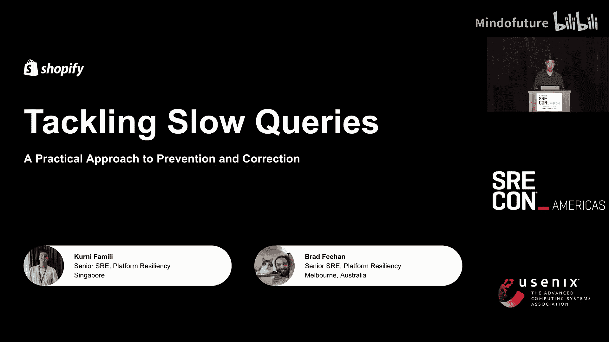

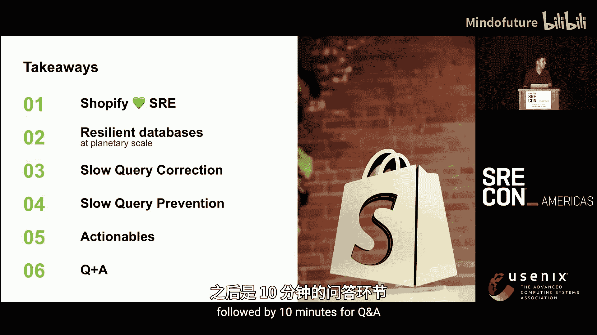

## 概述

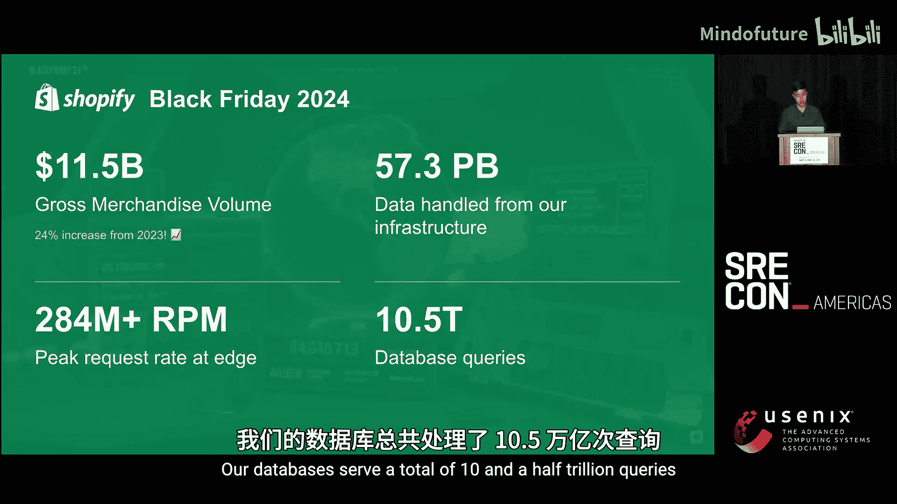

在本教程中，我们将学习如何在一个像Shopify这样高速发展的大型公司中，系统地预防和纠正数据库慢查询问题。我们将从Shopify的实践经验出发，探讨慢查询对系统稳定性的影响，并详细介绍一套结合了自动化监控、开发流程集成和组织保障的实战解决方案。

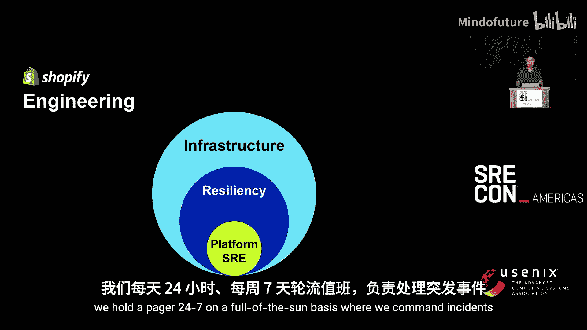

## 1：背景与挑战

大家好，我是Kearney，来自印度尼西亚，现居新加坡。这位是Brad，来自澳大利亚墨尔本。我们是Shopify平台SRE团队的一员，这是一个全球分布式团队。我们的工作是与其他工程团队协作，提升平台基础设施的可靠性、真实性和高效性。

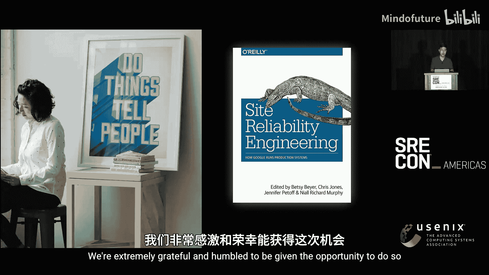

首先，我们将简要介绍Shopify及其与SRE工作的关联。我们会回顾在行星级规模下数据库弹性的基础知识。然后，你将了解到我们在像Shopify这样开发速度极快的大公司中，为纠正乃至预防慢查询所发现的机会和构建的解决方案。最后，我们将总结一些可供你实践的行动项。

Shopify的使命是让商业对每个人来说都更好。自2006年以来，全球数百万企业家信任我们来运营他们的业务。一年中最大的购物周末是黑色星期五网络星期一。去年，我们的商家销售额峰值达到每分钟460万美元。我们的商家实现了115亿美元的销售额，较前一年增长24%。我们的基础设施处理着57PB的数据。边缘层的请求速率峰值达到每分钟2.8亿次。我们的数据库总共服务了10.5万亿次查询。

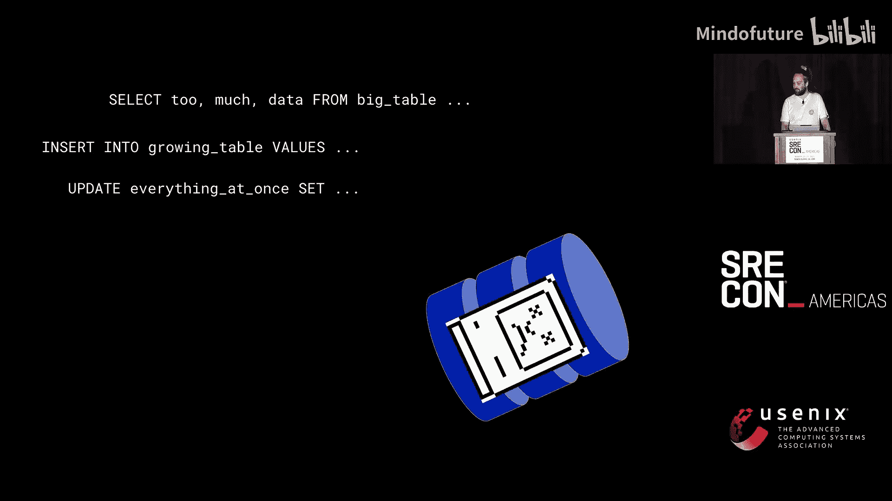

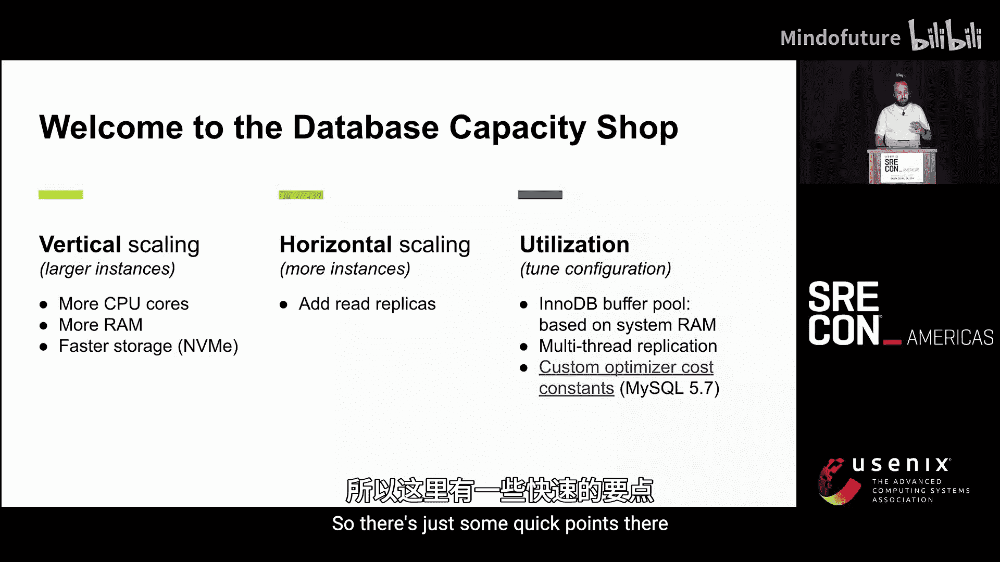

在Shopify内部，有一个名为“基础设施”的部门，其中包含一个我们所属的“弹性”组织。该组织专注于结账、店铺前台和商家管理后台。整个组织的使命是让开发者更容易地实现弹性，并将其作为我们文化的关键部分。我们的团队“平台SRE”就在这里，我们构建工具和流程来提高可靠性。最重要的是，我们遵循“太阳永不落”的原则，7x24小时轮值，负责指挥事故处理，即在“着火”或发生事故时保持冷静和专注。

作为平台出现问题时第一个被通知的团队，我们确保召集所有必要人员来缓解事故，引导讨论，收集相关上下文。事故缓解后，我们会跟进，解决根本原因并进行正式的复盘。我们相信分享经验、工作和想法，甚至记录项目成果（无论好坏）。这与最初的SRE手册强调故事讲述和学习的精神是一致的。这也是我们站在这里分享我们项目的原因。

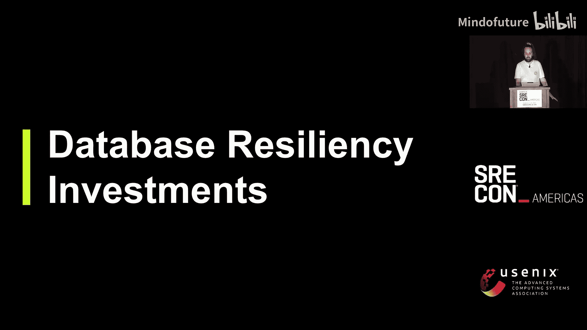

## 2：数据库弹性基础

上一节我们介绍了项目背景，本节中我们来看看Shopify为确保数据库弹性所做的历史性投资。当慢查询耗尽数据库容量时，首要想法通常是购买更多容量。以下是短期内扩展数据库的主要方式：

*   **垂直扩展**：使用更大的实例，升级存储等。
*   **水平扩展**：添加更多实例。例如，如果有只读副本，可以添加更多来分担负载。
*   **配置调优**：确保配置已优化以充分利用提供的资源。

然而，这只是短期扩展。除此之外，需要进行长期的弹性投资，因为单个数据库的扩展能力有限。以下是Shopify在过去10到15年间为提升MySQL弹性所做的最重要的六项投资：

1.  **水平分片**：将租户分区到不同的数据库实例中。这提供了故障隔离（舱壁模式）和隔离重度用户的能力。缺点是应用层更复杂，且可能需要平衡分片负载。
2.  **服务提取**：从核心单体应用中提取出自包含的服务。例如，Shopify将店铺前台渲染的只读部分提取为独立服务，以减轻核心系统负载。
3.  **快速失败机制**：使用超时和断路器。当检测到持续的错误条件时，快速失败并将压力返回给应用层。
4.  **使用ProxySQL**：作为数据库代理，用于复用连接、替换后端数据库服务器，并提供查询的聚合指标。
5.  **安全的模式迁移**：使用类似“LHM”的工具进行零停机、可扩展的模式变更。同时，通过功能标志和针对金丝雀集群的合成流量测试来快速回滚变更。
6.  **赋能开发者**：提供关于如何编写高效查询的文档和工具。例如，使用`EXPLAIN`命令理解数据库内部行为，并提供类似GitLab的交互式工具，让开发者能在生产数据集上实验新查询和索引。

这些构成了我们项目的起点。我们拥有非常坚实的设置，但它并非魔法，问题仍然会出现。这基本上是当今大规模部署数据库的“入场券”。然而，正如Kearney所说，我们仍然观察到大量由慢查询引发的事故。因此，我们项目初期的目标是减少由慢查询引起的事故频率和严重性。计划是通过检查我们的弹性设置，识别平台和流程中的任何缺口。

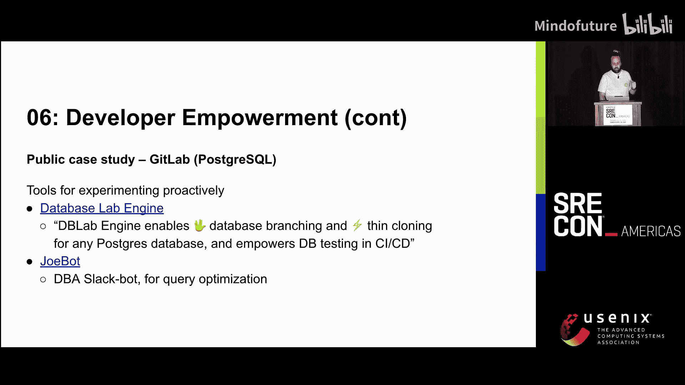

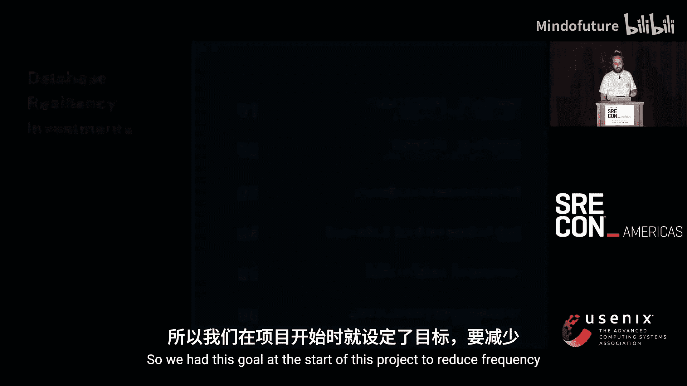

## 3：纠正策略：从监控到自动化

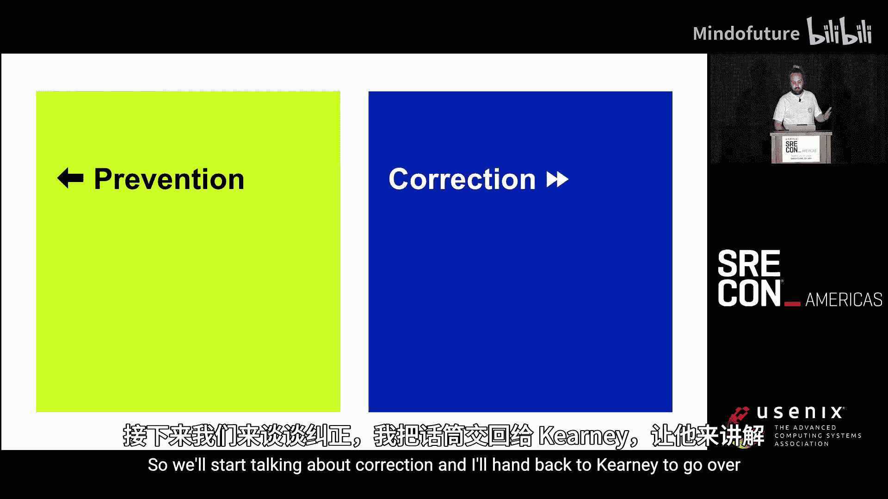

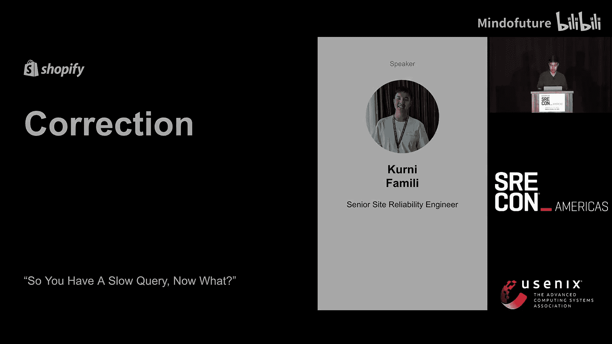

上一节我们回顾了数据库弹性的基础，本节中我们来看看当慢查询已经进入生产环境后，如何有效地纠正它。我们优先关注两个主要领域：**预防**（阻止慢查询被部署并首先引发问题）和**纠正**（防止其引发事故，即及时检测、缓解和修复生产中发现的问题）。我们先从纠正开始。

现在你遇到了一个慢查询，该怎么办？在深入探讨之前，我们先看一个典型的开发周期：编码、构建、测试、部署，然后进入监控阶段。在最坏的情况下，观察到系统状态降级，进而进入事故处理阶段。

对于一个慢查询事故，其生命周期通常如下：开始时数据库容量耗尽，开始调查负载来源，然后进入缓解阶段，通常需要通过应用防火墙规则、API限流等方式减少负载单位。最后是修复阶段，我们与开发团队合作，理解查询意图并找到性能更优的方案。这是我们处理所有防御措施都未能拦截的事故的通用流程。整个周期耗时很长，是一个刻意严谨的过程，旨在从独特故障中学习并确保不因同一原因失败两次。但当同一模式反复出现时，它的效用就会降低。

我们的目标是找到缩短反馈循环的机会，本质上是在这个图表上“左移”。我们观察到先前系统中的缺口或不足之处有以下几点：

1.  **对事故的依赖**：只有在产生影响后才发现问题。
2.  **缺乏所有权和问责制**：问题或行动项可能被无限期搁置。
3.  **开发者调试资源碎片化**：需要在不同系统间跳转。

接下来，我们看看构建的系统如何解决这些缺口。首先，从高层次概述我们构建了什么：

1.  **数据库层**：MySQL服务器会发出慢查询日志（当查询执行时间超过某个可配置阈值时）。
2.  **数据管道**：使用开源的Vector可观测性管道读取、预处理日志，并将其同步到内部的可观测性服务`Observe`。
3.  **监控与告警**：在`Observe`中配置监控规则，基于P99执行时间、获取数据大小等字段聚合日志数据。如果查询超过阈值（例如P99超过1秒），则会触发监控。
4.  **自动化处理**：触发后，除了向告警通道发送Slack消息，更重要的是会向“慢查询审计服务”发送Webhook。该服务会自动在行动项跟踪器中创建任务，并自动分配给相关团队。它还会存储查询元数据以防止为同一慢查询创建多个未解决的任务。

以下是我们的系统如何解决上述缺口：

*   **解决对事故的依赖**：自动化告警创建行动项，移除了团队先前的手动工作。由于我们聚合了每个查询的数据，可以在其演变成全面事故之前捕获慢查询，并优先修复最严重的违规者。
*   **解决缺乏所有权和问责制**：自动化分配流程（基于已明确定义且易于检索的表和查询所有权）。工程领导层支持将慢查询修复作为公司重点。如果行动项逾期未处理，作为最后手段，相关团队或组件的代码合并（PR）会被阻止，以此鼓励问责。
*   **解决资源碎片化**：构建了一个统一的Grafana仪表板，集中展示重要信息（如统计信息、日志和追踪链接）。在行动项描述中直接提供上下文洞察（如查询来源、控制器名称）。提供关于常见不良模式及解决方法的建议。目标是改善开发者体验。

总结一下纠正措施解决的缺口：对于事故依赖，我们主动检测慢查询并通过自动化扩展纠正流程；对于所有权缺失，我们自动创建并分配行动项，必要时阻止部署；对于资源碎片化，我们提供了统一的上下文信息展示系统。这些纠正措施位于“监控”阶段，我们成功实现了左移。但我们能否进一步左移，在开发周期更早的阶段做些什么呢？接下来，Brad将介绍预防方面。

## 4：预防策略：在开发流程中左移

上一节我们探讨了如何纠正已出现的慢查询，本节我们来看看如何在问题发生之前进行预防。预防工作的核心是关于部署前的开发者工作流程。我们希望持续在更早的阶段发现问题并左移，减少反馈循环。另一个好处是，这将工作分配回开发者，并保留在开发过程中可能丢失的上下文（等到事故或监控发现问题时，上下文往往已丢失）。

我们构建了一个系统，用于在持续集成（CI）环节捕获慢查询，防止其被部署。它检测测试过程中遇到的新查询（使用Active Record订阅者），保存它们，并自动对新查询运行`EXPLAIN`分析。目前，我们主要检测**全表扫描**，这在我们这样的规模下是不可持续的操作。

例如，几周前，一位开发者正在开发一个新的维护任务。代码中有一行类似`Location.where(deleted: true).map(&:trusted_id)`，这会生成一个需要全表扫描的查询。我们如何在开发者合并代码前提醒他们呢？

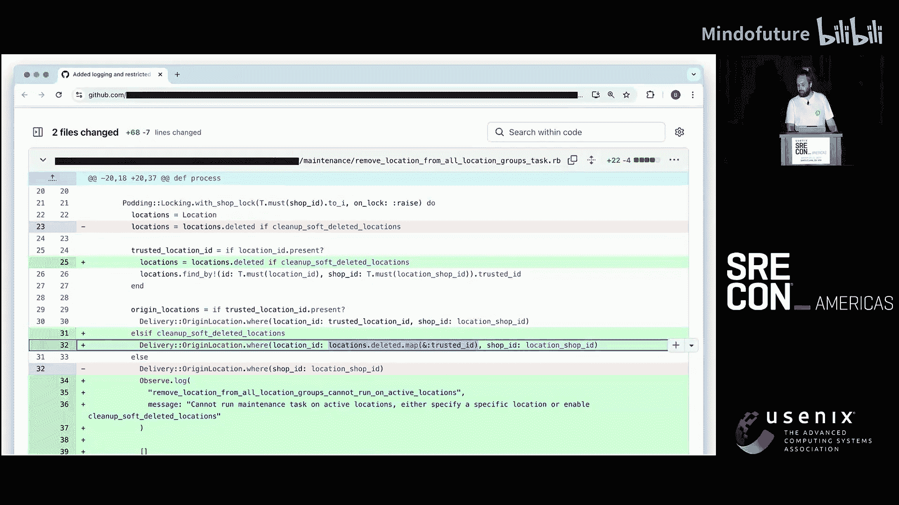

我们的工作流程如下：

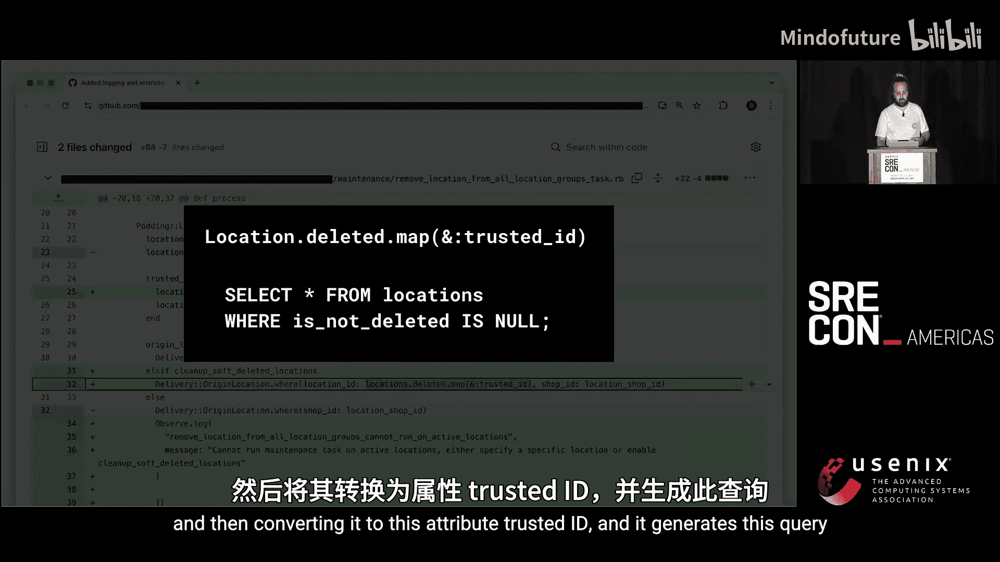

1.  使用GitHub托管代码。当分支合并到主分支时，我们会运行完整的测试套件。
2.  将测试运行期间捕获的所有查询提交到我们称为“查询追踪器”的系统。
3.  下次有新的拉取请求（PR）打开时，在测试PR变更之前，我们会获取主分支中当前已有的所有查询（这些已知查询会被忽略）。
4.  设置订阅者来捕获所有SQL查询，在测试套件结束时，对未曾见过的新查询运行`EXPLAIN`。
5.  如果发现任何全表扫描，会再次通过查询追踪器确认是否为全新查询。如果是，系统将在PR上发布评论告警。

告警评论会解释情况，包含我们捕获的堆栈跟踪（以便开发者定位是哪个测试、代码何处调用的），并链接到需要检查的工具。我们的团队也会在Slack上收到通知，以便监控系统性能和误报情况。

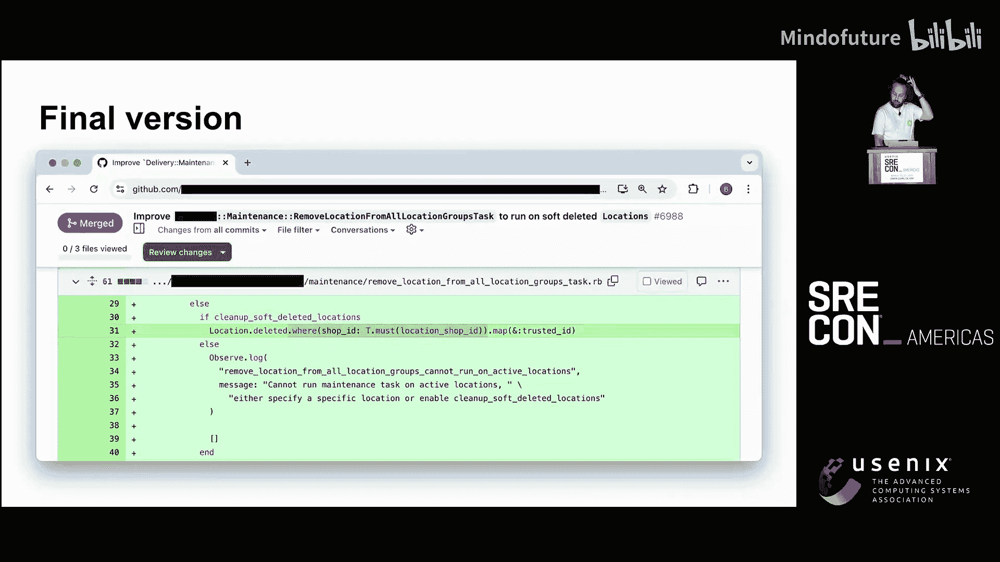

那么开发者是如何处理这个通知的呢？最终的代码版本添加了一个`WHERE shop_id = ?`子句。在Shopify，所有分片表都有`shop_id`属性，大多数查询都应包含此条件。添加WHERE条件意味着可以使用索引来选取特定行，而无需扫描整个表。此外，查询中使用了`SELECT *`，但实际只需要`trusted_id`，通过使用更高效的Rails方法（如`pluck`）可以避免获取不必要的数据。

这就是我们将慢查询预防集成到开发流程测试阶段的方式。我们还在考虑进一步左移，例如在开发者编写代码时就能检测查询，或者开发IDE插件，在代码提交前就能检查查询。

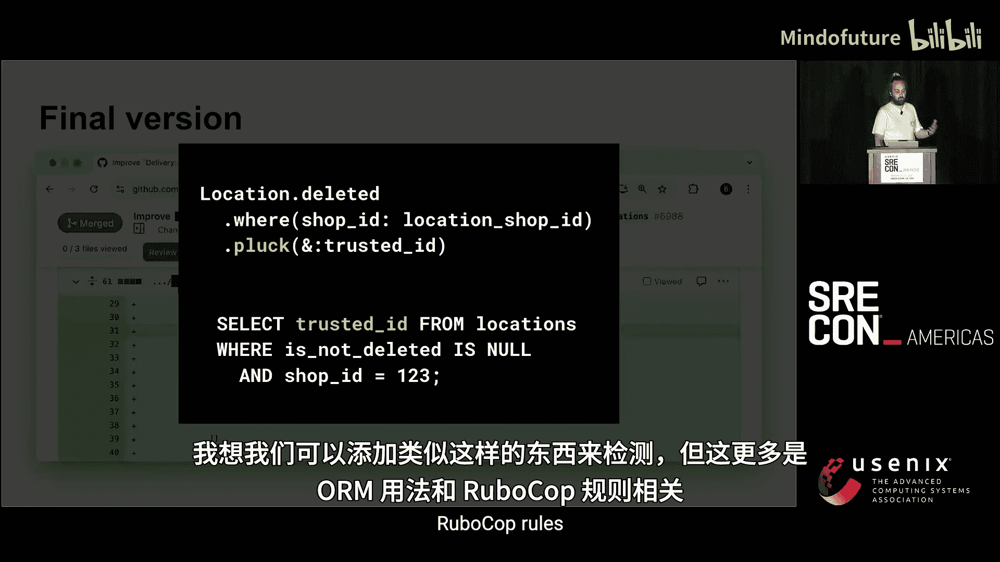

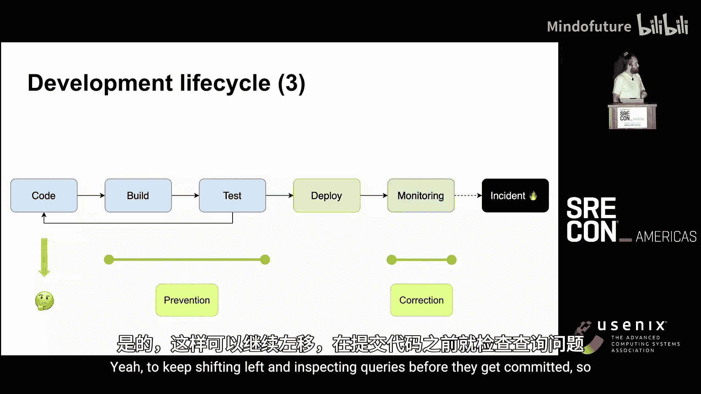

## 5：关键要点与行动建议

在上一节中，我们介绍了预防慢查询的具体实践，本节我们将总结从整个项目中提炼出的关键要点和可供你带回团队的行动建议。

以下是一些要点和“家庭作业”，其中一些可能不那么具体，更多是哲学层面的思考和需要牢记的事项：

1.  **减少反馈循环与左移**：考虑如何在你的组织中最好地实践这一理念。这能减少浪费的精力（事故停机时间、调查时间、重新收集丢失上下文的时间）。评估在开发生命周期每个阶段的平台和流程弹性。
2.  **构建轻量级工具与自动化**：尝试构建轻量级工具和自动化流程，以呈现系统底层正在发生的情况。它甚至可以基于你已经收集的指标（就像我们的慢查询日志早已被收集但未被有效利用）。你可能会对表面之下的发现感到惊讶。
3.  **在自动化的警告与强制执行方面发挥创意**：如何让开发者更容易在一开始就做对事情？**让做正确的事变得容易，让做错误的事变得困难**。因为人为错误不可避免。例如，高亮低效资源使用的可见性，或者像我们那样在必要时阻止部署。这显然需要获得支持以及健康的组织结构，以便能将问题向上推送，并由决策者权衡可靠性与功能工作孰轻孰重。
4.  **通过自动化减少琐碎工作**：在这方面保持务实。优先考虑能带来快速胜利的事情。例如，如果还没有为数据库查询设置超时，就设置合理的超时。
5.  **从消耗最多容量的查询入手**：使用数据驱动决策。我们实际上会根据读取的行数计算所需的I/O量，如果超过阈值，从第一性原理可知数据库将难以服务该负载。
6.  **专注于不可扩展的解决方案和可持续性**：将工作委托和分配回仍保有上下文的开发者，这将减少反馈循环。保留上下文并持续自动化。这是我们主要的收获：必须委托工作并将努力分配回合适的地方。

## 总结

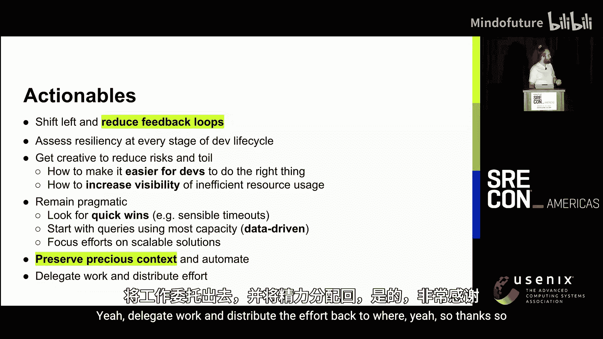

在本教程中，我们一起学习了Shopify平台SRE团队应对慢查询的实战方法。我们从数据库弹性基础入手，了解了水平分片、服务提取、快速失败等核心概念。接着，深入探讨了**纠正策略**，即通过自动化监控、告警和行动项管理，在慢查询引发事故前进行干预和修复。然后，我们学习了**预防策略**，通过将慢查询检测（如全表扫描）集成到CI流程中，在代码合并前就发现问题并反馈给开发者，实现了进一步的“左移”。最后，我们总结了减少反馈循环、构建自动化工具、发挥创意执行、数据驱动决策等关键要点。这套结合了技术方案、流程优化和组织保障的体系，为处理大规模、高速度开发环境下的慢查询问题提供了宝贵的实践蓝图。