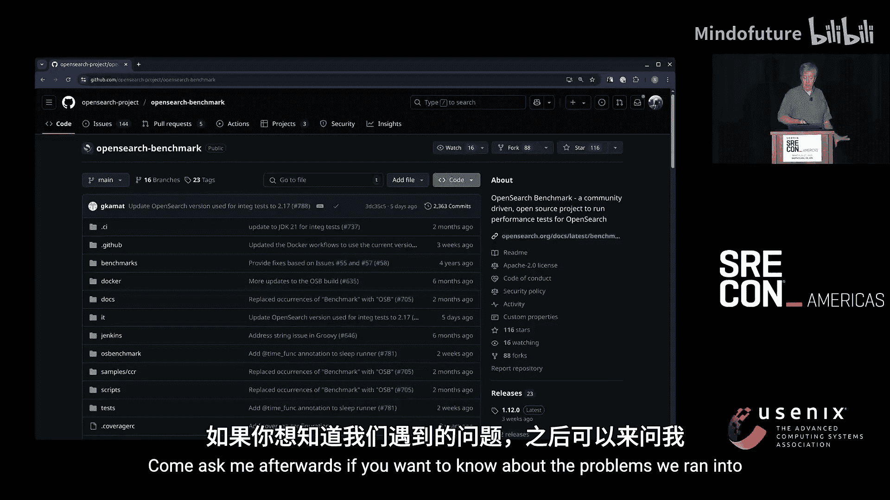

# 005：速度优化之旅 🚀

在本节课中，我们将跟随一位SRE专家，学习如何系统性地诊断和优化一个复杂、不透明且存在性能问题的分布式搜索服务。我们将从零开始，通过科学的方法、严谨的监控和反复的实验，最终显著提升服务性能并降低成本。

---

## 背景与挑战

上一节我们介绍了课程的整体目标，本节中我们来看看我们面临的初始状况。

我是Scott Lair。本次分享基于2024年在Figma公司进行的一系列工作。Figma是一家为设计师提供工具的公司。许多产品、网站，甚至我汽车仪表盘的初稿，都可能是在Figma中设计的。就像使用Google Docs一样，用户最终会积累大量草稿、一次性项目和草图，找到所需文件变得困难。因此，文档搜索对Figma用户至关重要。

2024年，我开始与Figma内部的文档搜索团队合作，以解决其延迟、扩展性和可靠性问题。团队对我的加入感到兴奋，因为在我加入Figma之前，我在谷歌担任了17年的SRE。他们理所当然地认为我精通搜索。

然而，事实并非如此。我对此一无所知，从未接触过搜索领域。团队最初的希望很快破灭了。Figma的搜索功能自公司早期就基于Elasticsearch构建，但多年来缺乏维护。它运行在AWS上一个三年旧版本的Elasticsearch上，内部以各种方式不稳定著称，无法为用户提供理想的体验。

公司最近开始为搜索团队增加人手，并计划大力改进。那么，问题具体是什么？通常的问题都有：服务经常很慢，用户有时会遇到数秒的搜索延迟；流量稍有变化，整个服务就可能陷入停滞；我们在搜索上花费了大量资金，但感觉物非所值。最糟糕的是，我们并不真正理解它为何慢、不稳定或昂贵。团队大多数人都是搜索领域的新手，仍在学习。

积极的一面是，我们有一个出色的团队，特别是在搜索相关性方面，这很不寻常。我们有数据科学家在分析一切。我们理解搜索结果一旦呈现，如何服务于用户。

幸运的是，修复工作已经启动。团队开始用AWS上托管的最新版OpenSearch实例替换我们古老的Elasticsearch。OpenSearch是Elasticsearch的一个分支，由亚马逊在Elastic更改许可证后创建。本次分享的内容基本同时适用于两者。

Figma正在引入人员提供帮助，我本应是专家之一。但我对Elasticsearch的了解，可能还不如他们对谷歌搜索的了解多。我对此毫无头绪。团队也明白我远非搜索专家。在最初的介绍之后，我们决定无论如何，有工作要做，开始着手修复。这触及了本次分享的核心：当你几乎不知从何开始时，作为一名SRE，你该如何处理问题？

我决定做一些感觉有点奇怪的事情，因为这类事情我们总认为应该做，但几乎从未真正实践。我最终运用了科学方法，而不是依赖直觉。

---

## 第一步：明确现状与科学方法

上一节我们了解了混乱的起点，本节中我们来看看如何用科学方法理清头绪。

这个过程的第一步是试图弄清楚我们知道什么，不知道什么。我们的起点在哪里？我们拥有大量的仪表盘， literally 数百张图表。有些图表有数百条线，因为“越多越好”。我们有告警系统。有客户向我们发送措辞礼貌、设计精良的“投诉邮件”。我们对问题有各种猜测，但没有任何确凿证据。

当然，我们可以直接投入更多的CPU、内存和服务器。也许这会有帮助。但我们甚至无法知道是否真的有效，甚至可能让问题变得更糟。

作为SRE，我们从监控开始。我们试图回答最基本、最核心的问题。当时，我不关心文档摄取延迟、JVM GC统计信息或发布延迟。我只想知道三件事：
1.  我们每秒处理多少客户搜索？
2.  搜索耗时多长？
3.  我们返回了多少错误？

这是任何服务最基本、不复杂的问题。我们在监控中拥有所有这些问题的答案，但它们分散在两个不同的仪表盘上。没有一个答案位于任一仪表盘的首屏，它们甚至在仪表盘上彼此远离。但最糟糕的是，它们都是错误的。

它们必须是错误的，因为我们有多个图表回答每个问题，而它们彼此矛盾，有时相差100倍甚至更多。这就是科学，对吧？

所以第一步是弄清楚这些指标的正确值是什么。我们可以查看所有不同的数据源，找出差异所在。检查我们的测量方法，看看我们实际知道什么。然后筛选出哪些数据最准确、最可能为真，并以此为基础开展工作。

此时，我只想收集一些数据，以了解情况到底有多糟糕。搜索在内部名声不佳，但对我来说大多时候还能工作。我只想了解发生了什么，而不是原因，仅仅是它被使用的频率有多高、速度有多慢、以及何时返回错误。

欢迎来到中学科学课堂和科学方法。我们将收集一些数据，形成一些假设，进行测试，发布一些结果，然后迭代。

---

## 数据收集与指标混乱

上一节我们确立了科学方法，本节中我们来看看在数据收集阶段遇到的第一个挑战：指标混乱。

首先，我们收集数据。从搜索速率开始，这似乎很简单：我们每秒进行多少次搜索？

我们拥有来自OpenSearch的数据，显示它为我们执行了多少次搜索。你可能会认为这很准确。难道我们会在它不知情的情况下执行搜索吗？我们还拥有前端的数据，显示有多少查询命中了我们的搜索API。我们控制着代码，这应该相当准确。我们应该能够理解它。

这两个数字相差了500倍。OpenSearch认为它执行的搜索量远高于我们的前端。

好吧，查询速率很难衡量。也许我们从其他地方开始。试试延迟。

OpenSearch说它的平均延迟是8毫秒。平均，真是看待延迟的一个有趣方式。我们拥有许多TB的数据，分布在数百个分片上。在8毫秒内得到答案似乎令人印象深刻且不太可能。但好吧，我们的前端声称P99延迟是一秒。

但我除了调用OpenSearch之外，还做了一堆额外的工作，比如消息检查。我们花了多少时间在那上面？我们没有相关指标。我们甚至不知道这些时间是花在处理上还是调用OpenSearch上。我们所知道的就是，一边是8毫秒，另一边是1000毫秒。科学，对吧？

所以当有疑问时，增加更多检测点。我们添加了一堆额外的跟踪跨度和指标。我们将对OpenSearch API的调用包装在直方图中。我们追踪了一切可能的内容。我们仔细检查了所有现有指标，确保它们确实测量了它们应该测量的东西。

大多数指标是准确的。我们还深入研究了AWS的CloudWatch。30分钟后，我们确定虽然我们的平均查询时间是8毫秒，但AWS实际上知道查询的P99。它是9毫秒，有时是10毫秒。

这并没有帮助我们。与此同时，通过我们的新代码，我们终于知道我们到OpenSearch的出站延迟是200到400毫秒，具体取决于一天中的时间和负载等因素。查看我们的跟踪记录，我们看到绝对最小值是40毫秒。所以OpenSearch最坏情况可能是10毫秒，而我们最好情况是40毫秒。我们是不是不小心在错误的大陆一侧调用了OpenSearch？

因此，我们继续为代码添加更多检测点，一些模式开始出现。我们在夜晚和周末速度很快，在高峰时段很慢。但当我们查看来自OpenSearch的数据时，它真的没有任何相关性。就好像我们测量的不是同一件事。

所以，你需要知道你测量的是什么。我确信此时人群中有一群人在摇头说：“他说得对，他真的不知道Elasticsearch是如何工作的。”但对于其他人，让我带你快速了解一个查询。

我注意到我是被雇来做SRE工作的，而不是图形设计。所以这里的“App”是我们的代码，其余部分是OpenSearch。

我们有一个协调节点，它充当API的前端。我们将发送给它一些东西，然后它会与一堆工作节点通信。每个工作节点在本地磁盘上拥有我们数据的若干分片。

我们的应用程序发送一个API请求，例如“搜索食物”，到协调节点。它进行一些检查和查询优化。然后，由于分片查询被发送到每个工作节点。需要明确的是，出站查询是发送到每个数据分片，而不仅仅是每个节点。如果我们有200个后端节点和200个分片，那么就有200个出站查询，而不是20个。分片以某种模式分布在节点上，并具有一定程度的冗余。

每个工作节点将执行一次搜索，并返回一个答案，例如“来自我的分片的前70个结果”。这些结果返回给协调节点。协调节点获取所有这些结果，对它们进行排序、合并，然后返回去请求关于得分最高的文档的更多信息，比如“是的，你给了我文档ID。现在，你能给我一个可以返回给用户的片段吗？”等等。

这些信息返回后，协调节点打包答案，将响应发送回你的应用程序。

我解释这一切的原因是，我们发现OpenSearch/Elasticsearch的所有指标都是“每个分片”的。我们拥有的来自OpenSearch端的每一个指标都测量的是每个分片的延迟、每个分片的错误、每个分片的查询速率。它不是每个API请求，也不是每个节点，而是每个分片。

协调节点合并部分结果花了多少时间？长尾延迟如何影响事情？是否存在排队延迟？不知道，它不测量这些。

我们肯定做错了。对于一个成熟的产品来说，这似乎令人惊讶。所以我们去阅读OpenSearch的文档。它们很糟糕，完全没有帮助。然后我们阅读了Elasticsearch的文档，好一些，但仍然没有帮助。

我们向AWS支持人员开了一些支持工单。只能说他们不是监控专家。然后我们与AWS的一些OpenSearch开发人员交谈，他们都显得有些躲闪和愧疚，并表示修复这个问题已经在他们的路线图上了。

好吧，既然我们不能真正信任OpenSearch的指标，我们决定必须专注于前端指标：从我们的站点看到了什么。所以我们编写了一些探针来与OpenSearch通信，添加了一些额外的跟踪数据，并积极地将每一个API调用包装在我们的监控中。

慢慢地，我们开始理解事情。我们开始获得自洽的数据，我们有理由相信它是真实的。也许事情没那么糟。哦，我们仍然有一秒的延迟。查询有时仍然会慢到爬行，我们仍然在支付高昂的费用。但这是关键的一点：我们终于可以进行更改，并知道它们是否有效。

---

## 建立假设与测试框架

上一节我们终于获得了可靠的数据，本节中我们来看看如何基于数据形成假设并进行测试。

现在我们可以开始修复问题了。是时候开始提问了。我们已经度过了数据收集阶段，开始朝着假设的方向前进。

我们能否优化查询使其运行更快？我们是否一直在做相当于全表扫描的操作，还是它们相对高效？如果我们的P99延迟是400毫秒，而搜索前端API延迟是一秒，其余时间花在哪里了？是否有OpenSearch配置标志和更改可以帮助我们？我们能否通过增加硬件来获益？更改AWS OpenSearch实例类型会有帮助吗？升级到新版本的OpenSearch会有帮助吗？

你会注意到，很多这些问题都是“如果我们改变X，会发生什么”。这有点棘手，因为我们没有一个好的方法来测试。所以问题来了：我们如何针对OpenSearch对一堆测试查询进行基准测试？肯定有工具可以做到这一点。我想知道它叫什么。

哦，看，OpenSearch Benchmark，OpenSearch项目的一部分。我大胆猜测，也许这就是我们正在寻找的，就在GitHub上。它是他们项目的一部分，已经存在很久了，是从一个功能相同但名称不那么明显的Elasticsearch工具分叉出来的。

我花了大约两周时间试图从中获得好的结果。不幸的是，它实际上是一个用于回归测试新OpenSearch构建的工具。对于我真正想用它做的事情来说，它的用途有限。如果你想知道我们遇到了什么问题，可以在之后问我。

在与这个工具半心半意地斗争了几周后，我终于感到非常沮丧，花了一个下午用Go语言写了一个替代品。这真的没那么难。它运行得很好，扩展性更高，给出了更好的结果，能够进行更多测试。它对于进行发布回归测试几乎肯定很糟糕，但对于我们想要的目的来说，它工作得很好。

现在我们有了一个工具。我们可以向OpenSearch实例发送大量查询，并测量它在不同条件下的表现。低查询速率下的延迟是多少？随着负载增加，它的行为如何？它在哪里崩溃？

现在是时候运行一些基准测试斜坡了。我们测量了我们的预发布实例，从最简单的地方开始。我们学到了一些东西，用它来构建一个新的预发布实例，然后是第三个预发布实例。然后，在非高峰时段，我们非常小心地针对生产环境运行了一系列低强度测试，以了解情况到底有多糟糕。

接着，我们构建了一个生产环境的克隆，并运行了数百次测试，改变不同的参数，观察发生了什么。我们建立了一个关于系统实际行为的工作模型，并用它来驱动更多测试。重要的一点是，我们实际上在内部写下了结果。我们测试了这个，我们认为这会有帮助。我们做了这些测试，这是结果。我们在团队中分享这些结果，在Slack上争论，然后第二天一遍又一遍地重复这个过程。

我们更改了配置标志，更改了分片数量，更改了AWS实例类型，尝试了不同版本的OpenSearch。我们预期会有效果的事情，几乎都没有产生我们预期的效果。

---

## 关键发现与优化措施

上一节我们建立了测试框架并开始实验，本节中我们来看看通过实验得出的关键发现和具体优化措施。

为了加快速度，我们发现需要更少的数据分片。我们分片太多了，减少这个数量确实对我们有帮助。最初，我们以450种方式绘制了我们的数据图表，认为很多分片能提供良好的吞吐量。但在这种情况下，吞吐量好，延迟却很差。我们只关心延迟。在基准测试中，任何超过大约200个分片都会显著增加延迟。它只是不断上升。

我们猜测是扇出成本、额外的协调节点负载、等待第450个分片响应的长尾效应。在第一轮更改中，我们将分片减少到180个，这带来了不错的提升。为所有这一切选择合适的分片数量有点像一门“黑魔法”，同样，欢迎之后问我。

但是，添加新节点、额外节点并没有帮助。我们实际上只使用了大约10%的CPU。增加更多节点只是移动了空闲线程。

AWS特别建议我们开启的大多数配置选项，实际上要么对我们没有特别的好处，要么有害。例如，他们建议开启并发段搜索，这应该有助于搜索并行化。我们有很多空闲CPU，并行化一些搜索肯定会有帮助。在测试中，它一开始就增加了几个百分点的成本。随着负载增加，它只是变得更糟，从未帮助我们。我们没有发现任何对它有益的工作负载。我们有很多这样的设置，必须全部测试。

不知何故，我们的查询实际上非常好，这让我感到震惊。我最初怀疑这是我们的问题，我们又在做相当于全表扫描的事情。OpenSearch的查询优化器有点神奇，并且喜欢我们的查询。每个分片通常只触及磁盘上大约100个文档。它能够使用我们构建的一堆廉价过滤器来筛选它应该查看的内容，做了正确的事情。这有点神奇，完全不是我预期的结果。

AWS支持人员不断声称每个版本都有巨大的改进。我们从未看到。我们在这里或那里获得了几个百分点的提升，没什么重大的。我们滚动升级到了当时的最新版本，因为它没有任何性能回退，而且我们最终无论如何都必须这样做。

后来我们对向量搜索进行的一些测试在一次升级后确实取得了巨大的胜利。但那是另一天或者另一个房间的话题了。

那么，换成CPU更少、内存更多的节点可能是我们最大的胜利。这是我们或多或少预料到的。这是我们的大问题。当时，AWS有大约139种不同的OpenSearch实例类型可供选择。在排除所有遗留选项后，我们仍然面临一大堆选择。我们想要什么样的CPU与内存比例？我们想要更多、更少但更大的节点，还是更多、更小的节点？我们可以测试这个。

我们能够更改为一个实例类型，它为我们提供了三倍的内存，但只有三分之一的CPU，而每个节点的价格大约只有一半。它实际上明显更快。我们在过程中发现的一件事是，即使是极少量的磁盘读取也会对我们的搜索延迟产生巨大影响。这在历史上本不应令人惊讶，但我们的整个搜索索引必须存在于Linux磁盘缓存中，因为我们默认在EBS上运行OpenSearch存储，而EBS即使使用SSD，延迟也很差。这不是亚马逊或EBS独有的问题。我在谷歌的等效产品上工作过。这是复杂存储层的根本问题。

所以事实证明，向问题投入内存是我们唯一能看到的大而明显的胜利。回顾过去，我们看到的大部分中断至少部分是由缓存未命中问题引起的。东西被加载，缓存命中率下降，总I/O飙升，查询开始花费足够长的时间以至于它们没有在超时前完成。大家都知道这个故事。

我们推出了所有这些更改：更少的分片、不同的实例类型、更新的OpenSearch版本、一些我们知道安全的次要标志调整。如果我们没有建立一个良好的测试框架，我们不可能安全地完成任何这些；如果没有我们在开始时做的所有监控工作，我们也不会知道它是否有效。

这是一个好的开始。我们大致将预算削减了一半。延迟下降了，错误减少了，超时减少了。但我们才刚刚开始。

---

## 深入分析与进一步优化

上一节我们通过基础设施调整取得了初步胜利，本节中我们来看看如何深入分析并优化应用层代码。

我们了解到的一件事是，大约三分之一的用户可见搜索延迟实际上来自OpenSearch。根据阿姆达尔定律，如果我们继续加速这一部分，我们能获得的收益是有限的。另外三分之一的时间花在构建查询上，最后三分之一花在验证每个结果的权限上。我们最不希望的就是竞争对手的文档出现在你的搜索结果中。

团队的一些成员仔细研究了我们从这一切中获得的所有数据。我们遇到的一个大性能问题实际上是一个与ActiveRecord相关的、棘手的平台问题，一年多来没有人注意到。当我们修复它时，整个公司的速度提高了20到50毫秒，并且它解锁了我们已实现但出于某种原因从未带来延迟优势的多线程工作。所以这很有趣，我们从一些代码更改中获得了一些额外的性能。

进入这个项目时，我们怀疑我们的问题之一是搜索索引中有太多无用的数据。我们知道其中包含的数据从未真正用于搜索，或者只在极端情况下使用。我们携带了大量额外数据。我们知道这一点，但我们并不真正知道它给我们带来了什么成本，而且没有人愿意盲目地进行复杂的更改。当时，我们无法知道我们对搜索数据所做的任何更改需要数月时间才能真正了解它如何影响用户搜索。

现在，我们处于可以测试其中一些内容的阶段。我们能够从搜索索引中移除争议最小的数据，将其大小减少了50%，这给了我们另一个巨大的速度提升。一切都更快了。更好的是，高峰和非高峰时段的延迟差异开始缩小。一旦数据加载完毕，我们实际上没有进行任何磁盘读取。一切都驻留在内存中。

我们回到绘图板，划掉了所有我们不需要的东西，运行了更多测试，并从搜索索引的大小中又砍掉了90%。里面有一些几乎永远没用的东西。我们能够进一步减少分片数量。一切都很美好。我们大幅削减了搜索节点的数量，从大约60个节点减少到最后的15或20个。只是出现了一个微小的延迟波动。事情开始看起来不错了。

我指的不仅仅是搜索。任何与谷歌人交谈过的人都知道，延迟几乎是一个宗教话题。在这种情况下，迭代速度才是我真正关心的。我们刚开始时，运行实验需要很长时间，启动测试集群需要数周，运行不同的索引测试需要数月。随着时间的推移，我们能够显著加快所有这些速度。所以我们真的可以测试东西，得到答案，并决定做什么，有时在几小时内，有时在几天内，而不是几周或几个月。没有这一点，我们就无法前进。你真的需要能够理解更改的风险和回报。一旦你理解了这一点，你就可以向管理层推销，说服所有人，前进就变得容易了。

---

## 经验教训与总结

上一节我们完成了从基础设施到应用代码的全面优化，本节中我们来总结整个过程中的经验教训和关键建议。

并非一切都是美好的。有些事情并不完全像我们预期的那样顺利。我指的不是失败的实验，那是预料之中的。有些我们预期会有帮助的事情却没有效果。奇怪的是，寻求帮助几乎从来没用。我们花了很多时间与一线支持人员交谈，他们又与专家交谈。然后我们与一些专家开会，他们拉来了一群开发人员，我们从他们那里得到了大量建议。但当我们测试时，很少有建议真正适用于我们的情况。

问题是OpenSearch被用于大量不同的用途。我们将其用于文档搜索：我们有一堆文档，请找到最适合用户正在寻找的内容的那些。它被大量用于日志类用途：人们将日志倒入其中，然后在上面进行搜索以试图大海捞针。它也被大量用作跟踪、指标、可观测性平台，很多AI和向量搜索的东西也在那里涌现。它们都有不同的需求。我们发现的大多数旧文档都真正专注于日志和类似日志的搜索。对于那种用途，增加更多分片，增加更多磁盘带宽，它会更快。延迟？你为什么要关心搜索日志的延迟？所以我们得到的很多东西，无论是在网上找到的、搜索到的，还是与开发人员交谈得到的，都是建议增加更多分片、做这个做那个。一旦我们有了数据，这些恰恰是我们最终必须做的反面。

很多新文档都是基于AI的，调优完全不同。对我们来说，最重要的事情是减少分片。我们分片太多了，减少分片，然后尽可能多地投入内存。

一些通用的痛点，作为SRE的强制性吐槽：可能我最大的痛苦来源是别人的仪表盘。人们为错误的问题构建仪表盘，或者至少不是我的问题。我可以像这里的大多数人一样，就什么是好的仪表盘吐槽几个小时。但根本上，监控仪表盘是一种沟通工具。它在那里讲述关于你服务的故事。如果它讲述的是关于你服务的真实故事，那就太好了。故事不应该是“有300件不同的事情在发生，滚动查看一会儿”。故事也不应该是“我们为同一件事选择了35种不同的度量单位”。仅仅专注于SLO，你就可以取得很大进展，这是我们在这里做的第一件事。即使是非正式的，从对用户重要的东西开始。确保你有这些的图表。有哪些次要因素会影响这些？为那些因素准备一些图表。是否有其他因素会影响这些？关键是专注。

另一件每次做都让我惊讶的事情是，监控工具用于实际数据分析时是多么糟糕。试着绘制一下一周内所有实例的查询延迟与磁盘IOPS速率的关系图。你会得到一个散点图或热图。有时你只需要导出数据并使用不同的工具。谷歌的Borgmon和Monarch在这方面很糟糕。Datadog也很糟糕。Grafana大多可以做到。然后是黑盒软件即服务。有时真的很痛苦，但事实就是如此。

所以，用一些具体的建议来总结。如果你正在运行OpenSearch或Elasticsearch，并且你来这里是因为你想从人们那里得到一些关于如何让它更快的建议：
*   密切关注IOPS以及它从磁盘读取了多少数据。
*   如果延迟很重要，尽可能保持索引小。
*   保持分片数量少，并确保分片均匀分布在所有节点上。这就是分片大小调整的“黑魔法”所在之处。

对于所有事情，运行实验，测量结果，写下并分享你的结果。SLO基本上是魔法。它们迫使你写下你关心什么，并与整个团队讨论。这就是全部魔法。它让你专注于重要的事情。仅仅因为它简单，并不意味着它不是魔法。

---

本节课中我们一起学习了如何系统性地处理一个不透明系统的性能问题。我们从建立可靠的监控和测量开始，运用科学方法形成假设，构建测试框架进行验证，最终通过减少分片、优化硬件配置、清理索引数据和修复应用层问题等一系列措施，显著提升了搜索服务的性能、可靠性和成本效益。关键在于：从用户可感知的指标出发，用数据驱动决策，并通过快速迭代来验证想法。