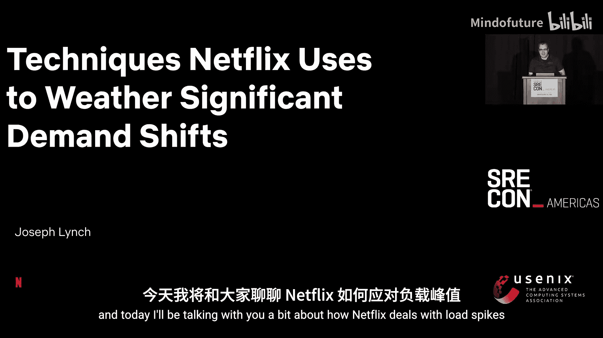
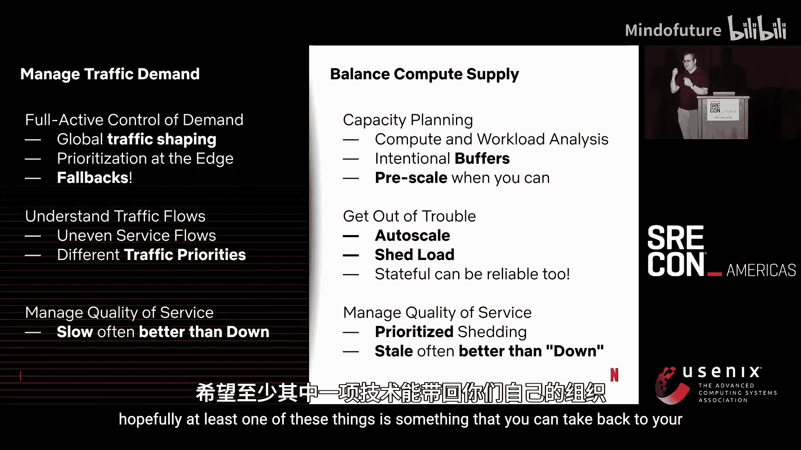

# 007：SRE大会-2025-美洲-｜-srecon-｜-分布式-｜-缓存-｜-OpenTelemetry-｜-安全-｜-AIOps-p07-P07-Techniques-Netflix-Uses-to-Weather-Significant-Demand-Shifts--BV1TmLDz7EZZ_p7-

## 课程名称：Netflix应对流量高峰的技术：P07：概述与挑战

在本节课中，我们将要学习Netflix如何应对其全球服务中出现的显著需求波动。Netflix面临的核心挑战在于其全球规模，产品被全球数百万用户在不同时间、通过数千种不同设备类型持续使用。这些设备网络能力各异，分辨率高低不同。

Netflix通过全球技术架构来应对这一挑战。其架构分为控制平面和数据平面。控制平面运行在四个亚马逊区域，负责登录、播放URL获取、个性化推荐等产品核心功能。数据平面称为OpenConnect，是一个全球性的、高度分布式的CDN网络，负责视频流数据传输。OpenConnect在全球ISP中拥有成千上万个接入点。

这种全球性产品导致了高度可变的“每秒启动数”（SPS，即流媒体开始次数），这是Netflix的主要负载指标。流量在不同时间和区域之间存在巨大差异，峰值与谷值之间可达一个数量级。这种大规模的流量转移会导致服务负载发生显著变化。

Netflix的负载高峰主要有三个来源：
1.  **每周故障转移演练**：每周进行的区域撤离演练会产生两次负载高峰——一次在接收流量的“救援”区域，一次在恢复服务时原区域承受的巨大负载冲击。
2.  **内容发布**：如《怪奇物语》等热门剧集全球同步上线，会驱动用户在同一时间尝试观看，引发全球性的关联观看高峰。
3.  **设备驱动需求**：当出现错误时，Netflix设备和用户都会不断重试，这种“重试风暴”可能引发一些最大的负载高峰。

问题的复杂性在于，Netflix的后端并非单一服务器，而是一个复杂的、分层的微服务架构。一个负载高峰会影响整个分布式调用链，因此必须理解负载高峰如何影响这个复杂的调用图。

本节课的故事由三部分组成：我们将讨论流量需求、如何平衡计算资源供给，以及当供需失衡时，我们使用哪些弹性技术来减轻对用户的影响。

## 课程名称：Netflix应对流量高峰的技术：P07：管理全局流量需求

上一节我们介绍了Netflix面临的负载挑战，本节中我们来看看如何管理全局流量需求。这始于我们的全局架构以及如何在区域之间平衡负载。

理解流量管理需要了解我们的四个区域，它们运行着微服务和数据存储。以下是允许我们在全球范围内灵活调度流量的关键组件：
*   **CDN和边缘代理（Zulu）**：它们协同工作，将用户引导至合适的区域。
*   **全活数据库和缓存复制层**：由Apache Cassandra和名为EVCache的分布式缓存系统提供支持。这两项技术是允许我们将用户流量调度到全球任何地方的关键。

当进行流量调度决策时，我们实际上是在延迟和可用性之间进行权衡。我们可以偏向于将用户引导至延迟最低的区域，也可以偏向于负载最轻的区域。在整个课程中你会看到，在为负载高峰做准备时，我们通常会从典型的延迟优先策略，转向可用性优先策略。

让我们通过一个控制平面流量引导的例子来具体说明。假设我们有四个区域，用户试图观看内容，中间有CDN接入点。Netflix的设备会探测网络拓扑，判断是直接连接云端更快，还是通过CDN更快。我们可以利用这些数据，因为负载高的区域通常响应更慢，从而引导用户远离这些区域。

我们甚至可以更进一步，主动引导用户远离特定区域。例如，我们可能希望引导用户远离US-WEST-2区域。其实现原理是DNS。Netflix在自己的OpenConnect CDN上运行权威DNS服务器，我们可以通过这些服务器来调度流量块。递归解析器通过其ISP连接到这些权威DNS服务器，这为我们提供了大约100个控制点。我们可以简单地将流量块移动到不同区域，例如将 `api.netflix.com` 解析到 `useast1.api.netflix.com`。

这种路由用户的能力对于应对负载高峰至关重要，因为它允许我们结合预测，在负载高峰发生前调整流量形态，也能在预测错误时做出反应。

以下是几种可能的流量形态策略：
*   **典型形态**：如果仅优化延迟，不做任何调整，负载分布会呈现区域性的高峰和低谷。
*   **均衡形态**：如果我们不确定负载高峰会出现在哪里，可以尝试均衡各区域的流量。
*   **非均衡形态**：如果我们有理由相信某个事件会导致特定区域（如US-WEST-2）负载激增，可以主动将流量从该区域移出。

在实践中，我们会在负载高峰发生前的一段时间（ΔT）开始调整流量形态，以最小化区域间的负载差异。当然，负载高峰并不总是按计划发生，我们可能需要在事件发生后重新调整流量形态。关键目标之一是缩短在负载高峰后重新调整流量的延迟，以便我们能快速反应。

然而，仅靠流量调度还不够，因为无论如何调整，在全球范围内移动流量都需要几分钟时间（DNS TTL过期、路由生效等）。在此期间，我们依赖路由层的回退行为。

这建立在我们的技术博客中提到的“优先级负载丢弃”机制上。其核心思想是：Netflix的每个客户端在向云端控制平面发送请求时，都会附带一个优先级。低优先级代表重要工作（如立即播放），高优先级代表不重要工作（如发送日志）。边缘代理Zulu可以有选择地丢弃低优先级工作，以保护高优先级工作。

但如果一个服务因负载高峰而宕机了呢？通常，一个区域被压垮时，并非所有服务都出问题，而是一两个服务在复杂的调用链中承受了意外的负载高峰。在这种情况下，用户请求会被Zulu丢弃。我们意识到，我们还有其他三个云端区域，为什么不降低请求的优先级并将其发送到其他地方呢？

这里有一个关键问题：为什么我们必须降低优先级？这是为了避免**级联故障**。如果我们不降低优先级，并且没有优先级负载丢弃机制，那么将一个故障区域的所有流量转移到另一个健康区域，可能会导致全局性故障。因此，故障转移能力的关键在于对工作进行优先级划分。

## 课程名称：Netflix应对流量高峰的技术：P07：管理计算资源供给

仅仅管理流量需求是不够的，我们还必须管理计算资源的供给。本节将探讨如何结合云端现实、进行预测性和反应性扩缩容。

这本质上是让计算机去做困难的事情，因为人类并不擅长管理扩缩容策略，计算机则更擅长。首先，我们需要了解在Netflix我们如何讨论服务容量。历史上，我们使用CPU百分比等指标，但出于多种原因，这不是一个好的思考方式。我们更倾向于使用**成功缓冲区和故障缓冲区**来讨论。

一个系统在特定负载下运行，存在一个额外的负载量，系统可以成功处理而不违反延迟SLO或抛出错误，这就是成功缓冲区。超过这个缓冲区的负载，我们将丢弃请求，这些就是错误或故障。我们很快就会明白为什么我们非常希望丢弃这些负载。

缓冲区与业务成果紧密相连。你可以通过自动扩缩容或预测性扩缩容来恢复缓冲区，但这需要时间，我们称之为恢复常数。有状态服务通常比无状态服务需要更长的恢复时间。更重要的是，缓冲区的大小也取决于该服务对业务的重要性。例如，对流媒体播放路径至关重要的服务，比那些对个性化推荐非关键的服务，需要更多的缓冲区。

这是一个业务权衡决策。Netflix的许多服务都运行在“较冷”的状态，但这并非偶然，也不是浪费资源，而是我们有意在系统中构建缓冲区，以便在不影响用户体验的情况下处理负载高峰。

一个关键结论是：**恢复速度快的服务需要更少的缓冲区**。如果服务能更快地扩缩容、更快地恢复缓冲区，就能运行得更高效。

这引出了云端现实第一点：**云端资源并非无限，你仍然需要进行容量规划**。在Netflix，我们将其分为两大类：
1.  **慢速扩缩容的无状态服务**：我们几乎完全预留容量并持续运行。
2.  **快速扩缩容的无状态服务**：随着可变负载而动态调整。

你会预留一部分容量，在负载低谷时，这些预留的计算机并非闲置，Netflix会利用它们进行编码等工作。当微服务有需求时，我们再释放这些容量给微服务使用。

但即使这样，你也不会预留全部容量，因为成本极高。因此，基于运行时间和定价，你会使用按需实例或竞价实例。这揭示了云端现实第二点：**计算资源的供给是可变的**。如果你依赖云提供商提供资源但没有预付费或预运行，就需要考虑哪些类型的实例具有“深度供给”。通常，较新的、性能更好的实例类型，其资源池深度可能不如老旧的实例类型。在采用新实例类型时，我们必须非常小心。

供给的深度也受其他客户行为的影响。例如，在一天中的特定时段或黑色星期五等时期，获取容量可能相对困难。

你的选择有：预留并付费；使用按需预留；通过利用之前建立的缓冲区来处理负载高峰；或者优先将服务器分配给最重要的工作负载（即Tier 0服务）。

问题进一步复杂化，因为计算资源的供给在不同实例类型上每小时都在变化。如果你能灵活选择工作负载的运行环境，能访问更多的计算资源池，你就能访问云提供商更多的容量。例如，如果你严格要求工作负载必须在 `i4i.2xlarge` 实例上运行，并且没有回退方案，那么当这种特定实例在负载高峰期间出现容量紧缩时，你可能会陷入困境。

这引出了云端现实第三点：**当你试图在不同计算机之间保持灵活性时，不同的服务器在性能上存在显著差异**。在Netflix，我们使用容量规划库/服务容量建模库来具体理解这些服务器之间的差异。例如，`m7a.4xlarge` 有16个物理核心，而 `m6id.4xlarge` 只有8个物理核心，这会显著影响你的缓冲区计算。

让我们看看这是如何影响的。这是一个简单的分析，我们查看了M7A和M7I系列的不同计算机规格，发现故障缓冲区开始的CPU使用率点差异很大。这是因为核心数更多的服务器，在性能曲线进入非线性区域（即“拐点”）之前，可以运行在更高的负载下。我们称这个安全区域为“净空”。Tier 0和Tier 1目标则是我们在故障缓冲区基础上，再预留的线性缓冲区倍数（例如Tier 0可能是2倍缓冲区，Tier 1是1.5倍）。这是一个相当简化的分析，没有考虑服务器数量等因素。但关键在于，如果开发者要求2倍缓冲区，而作为平台方你在不同计算机之间迁移服务，你必须承担不同计算机在不同负载点提供缓冲区的复杂性。

缓冲区也因工作负载而异。例如，一个无状态的Java应用没有像数据库那样的数据压缩、修复或备份等后台任务。因此，你可能会看到两个工作负载在同一类服务器上，一个运行在10% CPU，另一个运行在30% CPU。如果不了解导致这些差异的缓冲区需求，你就无法判断它们是“冷”还是“热”，也许它们正好处于为后台活动预留缓冲区的合适热度。

## 课程名称：Netflix应对流量高峰的技术：P07：预测与反应性扩缩容

现在我们已经理解了缓冲区，我们可以利用它来预测和预扩缩容我们的服务，以及设置反应性的自动扩缩容策略。

预扩缩容相对直接。如果你提前知道负载高峰即将到来，并且你知道服务运行在线性区域内，你可以线性外推，并在负载到来前将服务器组的指标钉在高位。第一步，我们钉高指标；然后负载到来，顶部发生少量自动扩缩容；最后负载过后，我们再缩容。

这种方法的主要复杂性在于，正如之前提到的，负载高峰对每个服务的影响是不同的。Netflix前门的4倍SPS负载高峰，可能只会在个别服务上引发2倍、3倍或1.5倍的负载高峰。你的调用链在流量和关键性上并不均匀。这一点尤其重要，因为当我们试图分配稀缺的服务器资源时，我们希望确保为Tier 0服务（如流媒体播放）建立缓冲区，并从对业务重要性较低、可用性要求不高的Tier 3或Tier 4服务那里收回计算机。

当然，我们必须问：如果我们预测错了怎么办？据我所知，没有水晶球能完美匹配供给与需求，我们总会出错，总会遇到容量短缺。当我们出错时，就必须通过自动扩缩容来反应。

Netflix是EC2自动扩缩容的重度用户，拥有数万个服务器组随着SPS流量不断自动扩缩容。既然我们理解了缓冲区，就很容易将其转化为自动扩缩容策略。我们以成功缓冲区的起点作为目标追踪点，然后我们在故障缓冲区的起点进行“锤击”。“锤击”是我们喜欢的一个术语，它是一种阶跃扩缩容策略，注入的容量比仅基于利用率数字计算出的要多。一个直观的理解是：CPU利用率本质上是一个受限的指标，10倍、100倍、1000倍的负载高峰都会导致100% CPU。因此，我们需要寻找其他指标来帮助我们应对这种数量级的负载挑战。CPU“锤击”意味着，服务很少运行在成功缓冲区的末端，所以我们只想添加比正常情况下更多的计算机。

但自动扩缩容可能很慢，它有各种延迟来源。我们将其分解为五个主要部分：
1.  **检测问题的时间**
2.  **控制平面启动硬件的时间**（例如，启动虚拟机）
3.  **内核或系统单元启动应用程序的时间**
4.  **应用程序自身启动的时间**
5.  **流量收敛的时间**

在Netflix，大多数人曾认为控制平面延迟是主要贡献者，认为启动虚拟机很慢。但事实证明，亚马逊的控制平面非常快，这不是问题。真正的问题是**检测**和**长尾应用启动**。检测负载高峰在我们的配置下需要好几分钟，如果我们主要依赖目标追踪策略，就需要多次扩缩容。长尾应用启动是指那些没有充分理由（有时有正当理由）却需要15分钟才能启动的Tier 0应用。此外，系统启动时间和服务发现也存在一些问题。

对我们来说，这是一个很好的反思机会。我们学到的教训是：几乎每个参与这个项目的人都没有预测到这一点。只有在我们真正开始测量自动扩缩容各组成部分的延迟后，才意识到真正的瓶颈在哪里。

一旦我们理解了问题，就可以解决它。例如，为了解决检测问题，我们使用了EC2高分辨率指标。我们能够根据实际启动延迟自动调整ASG冷却时间，这意味着阶跃策略会更迅速地采取更多行动。最后，我们开始观察每个服务的RPS（每秒请求数）比率，并添加了RPS“锤击”。第三点之所以重要，是因为它提供了负载高峰的完整粒度。例如，你可以区分1000 RPS、10，000 RPS和20，000 RPS的负载高峰，而仅基于CPU扩缩容时，它们都是100%。

这是我们最大的解决方案，我们也优化了其他大部分部分。我们通过深入研究特定服务来减少长尾启动时间，性能工程团队的优秀工程师们也做了一些工作，例如并行启动系统单元以消除systemd启动中的关键阻塞路径。我们从未真正解决服务发现问题，因为我们使用的是轮询的30秒服务发现，对我们来说已经足够快了。

我们优化得有多快？在进行任何调优之前，我们的Tier 0服务如果暴露在10倍负载高峰下，需要8到15分钟才能恢复完全可用性。这对业务来说是不可接受的。改进之后，我们能够将其降低到个位数分钟，即3到4分钟。这些微小的改变，比如改变自动扩缩容的依据、优化冷却时间，实际上能产生显著的影响。我们的业务更能接受3到4分钟的中断，而不是15分钟的中断。所以，这确实有效。

## 课程名称：Netflix应对流量高峰的技术：P07：弹性技术：负载丢弃与优先级

但是，3到4分钟仍然不够好。在这段时间内，我们的用户会经历什么？我们希望确保拥有弹性技术，在这段时间内为用户提供尽可能好的体验。本节将深入探讨负载丢弃和工作优先级。

当我们预测出错时，我们可以使用负载丢弃。负载丢弃相当直接：你查看目标追踪策略，在成功缓冲区的起点，如果有低优先级工作，就开始丢弃；当深入故障缓冲区（接近90%-95% CPU）时，就开始丢弃一切可能丢弃的请求。

让我们通过一个例子来理解为什么这是一个好主意。想象一条高速公路，上面有一些汽车，代表系统在标称利用率下运行，通行时间是10分钟。当服务开始负载增加时，更多汽车驶上高速，通行时间增加，但我们仍然让所有车都上去。然后我们到达我最喜欢的部分——高速公路开始过载，通行时间越来越长。这就像加州的高速公路，那个限制你进入的交通信号灯。服务与高速公路的主要区别在于，在服务中，我们会直接丢弃请求，而不是延迟它们。

我们这样做的原因是试图避免通行时间趋向无穷大，因为路上发生了连环车祸。当一个服务的利用率达到100%时，你会进入我们所说的**拥塞性故障**，也称为队列无限增长、系统彻底崩溃，或者我个人最喜欢的说法——“一段非常糟糕的时光”。你想避免这种情况，因为在拥塞性故障期间，成功请求数会降至零。问题是，要让服务恢复处理负载，比它维持在正常QPS水平时需要多得多的计算资源供给。

我们可以看到负载丢弃如何帮助我们远离那种情况。但缓冲区的其余部分呢？事实证明，我们可以通过将成功缓冲区划分为不同的流量优先级来更早地丢弃负载，这样我们就能更早地将对我们不那么重要的负载从服务上卸下。这就是**优先级负载丢弃**。

这是一个丢弃曲线的例子。服务的目标追踪点设在40% CPU。在Netflix，我们允许人们用0到100之间的数字来划分流量优先级，低数字代表重要，就像之前的Zulu例子一样。为了便于指标分析，我们将其分为四个主要桶：尽力而为流量、降级流量、关键流量和批量流量（Netflix中很少）。通过观察X轴（系统负载）和Y轴（我们将丢弃的该流量类别的百分比），你可以看到这自然允许我们存活更长时间，因为我们可以更早地丢弃更多不重要的工作，为真正关键的工作保留CPU周期。

服务所有者如何确定其工作的优先级？一种方式是明确告知我们。通常，Netflix的服务所有者非常清楚哪些URL、哪些路径对产品至关重要，哪些不是。但我们始终有一个后备方案，即直接采用设备声明的优先级。如果服务所有者不想表达对流量重要性的意见，设备已经表达了意见，我们可以将其作为一个相当不错的后备方案。

回到我们的高速公路类比，现在有了优先级划分，它本质上通过允许我们优先决定谁可以上高速来创建了更多缓冲区。我喜欢用的类比是：我要确保救护车能上高速，而开跑车兜风的人可以回家。我们希望救护车在高速上，我们希望用户能够点击播放。

这有效吗？是的，效果非常好。你能看出这张图与之前那张图的区别吗？这张图发生了数量级的流量高峰，而服务在整个过程中持续存活（蓝线），这意味着我们没有进入拥塞性故障。这是巨大的成功。

但I/O密集型工作负载呢？因为正如前一位演讲者提到的，CPU密集型工作负载和I/O密集型工作负载非常不同。我对此的最佳类比是：想象汽车驶上高速，消失一段时间，然后又回到高速。你要避免的是它们全部在同一时间重新出现，导致我们之前讨论过的那种爆炸性拥堵。我知道这个类比有点牵强，但我尽力了。

让我们看看这两张图，试着找出区别。右边是重负载的I/O工作负载，左边负载较轻。区别在于通行时间。重负载的I/O系统更慢。因此，我们实际上可以使用服务级别目标（SLO）利用率作为**延迟利用率**的代理。在这个例子中，服务有50毫秒的延迟目标，然后我们计算有多少请求比这个目标慢。如果100%的请求都比目标慢，那么该服务就是高负载；如果比例很小，就是低负载。

我们实际上将这种方法用于数据层。我之前提到的那些数据网关，允许开发者基于后端数据库负载来丢弃负载。因此，如果后端数据库变慢，位于该数据库前面的服务就会提前丢弃负载。

举个例子，如果该服务因拥塞而变慢，现在88%的请求都超过延迟目标，即使我们只处于最大负载的5%。这有效吗？是的，有效。这是我们与一个提供文件（非常重要的文件，你可以猜猜是哪种重要文件会提供给我们的边缘）的服务一起运行的测试。我们能够将几个服务器推到超过50 Gbps。我们知道在这个水平上，网卡将开始丢包，从而引入延迟。我们想在这里看到的关键点是：一旦我们开始丢包、出现延迟，我们希望看到右侧的低优先级文件被限流器丢弃。这正是我们观察到的。

## 课程名称：Netflix应对流量高峰的技术：P07：有状态服务的弹性与缓存策略

我们已经讨论了负载丢弃，但重试呢？很多人认为重试不好。实际上，我们认为只要是在负载丢弃上的重试，就是可以的。因为你发送初始请求的服务器只做了极少的工作，基本上只是丢弃了请求。我们发现这有助于我们从高负载服务器重试到平均负载的服务器。如果你的负载均衡策略明确地做到这一点，那就更好了。底部的数学公式本质上是完全抖动指数退避算法，主要区别在于，因为我们在负载丢弃时重试，所以可以在早期重试上稍微激进一些。除此之外，这是一个相当标准的指数退避算法。

现在我们对无状态服务的弹性有了很好的理解。接下来我想谈谈如何让有状态服务适应这个世界。我们将讨论容量规划，因为我们需要给它们更多缓冲区；以及数据网关，我们用它来将它们原本无界的工作量，转化为易于推理的工作单元，然后我们可以进行负载丢弃等操作。

这涉及到架构图的右侧。Netflix很久以前做出的一个关键决策是：**每个微服务都有自己的数据存储**，我们不共享微服务之间的存储资源。这会导致更频繁的中断，但与多租户系统相比，这些中断的爆炸半径更小。这对我们来说是正确的业务权衡，但可能不适合你。

由于我们采用了这种单租户模型，我们必须非常小心地进行容量规划。几年前我做了一个演讲，介绍我们如何利用排队论来最优地选择计算机，以尽可能少的成本为我们提供所需的缓冲区。这本质上是一个统计模型，试图模拟我们需要处理多少读操作、写操作，以及它们的大小。当然，一旦工作负载实际运行，你可以直接观察这些指标，但通常我们在应用程序实际启动之前就需要配置数据存储。这允许我们以一种严谨的方式建立之前提到的缓冲区，例如，我们可以给关键数据存储更多缓冲区，而限制非关键数据存储的缓冲区。

那么数据网关层如何帮助我们呢？我们已经对数据存储进行了容量规划，但即使有容量规划，数据存储有时也可能没有足够的容量应对负载高峰。网关的作用是将具有挑战性的API转化为能很好地适应我们之前讨论的弹性技术的东西。网关做的第一件事是将所有读写操作转化为右侧的分块操作或读侧的分页操作。想象一下，如果你的数据库API可以返回无界数量的行，那么你无法真正建立延迟SLO，因为你可能要求数据库返回其整个数据存储。另一方面，如果你能让每个操作返回固定数量的数据（比如几兆字节），写操作也一样，那么你就可以建立延迟SLO，然后测量该SLO的利用率。如果你不这样做，那么当你尝试之前为无状态服务讨论的基于延迟的推测和对冲方法时，你只会不断重试最昂贵的工作，效果非常差。但如果你有网关可以将这些操作转化为分块或分页操作，那么你就可以利用我们之前讨论的同一套弹性技术工具包。因此，网关首先将你的数据存储转化为增量API。

然后，它们还可以帮助你使其具有**幂等性**。这一点至关重要，因为重试和对冲严重依赖于能够安全地重复操作。很多数据库本身并不具有幂等性。例如，如果你在Postgres上执行一个操作，向一列写入一个值，然后在一段时间后与其他写入并发地重试该写入，你可能会损坏数据——那个对冲写入可能会覆盖你之前写入的数据。因此，网关的作用是使用我们称为“幂等令牌”的东西，为所有操作提供统一的幂等层。然后，为每个支持它们的数据存储实现这些抽象层的代码，会实现这种幂等性。例如，对于Cassandra，技术是“最后写入获胜”；对于事务性数据存储，你可能使用版本戳并事务性地推进它。

当你将增量和幂等性结合起来时，你就得到了**可重试性**。这对于处理负载高峰至关重要，因为处理负载高峰的一部分是知道系统何时变慢。我们之前讨论过基于延迟的丢弃，这些技术结合起来让我们拥有这种“对冲前时间”曲线。我希望你从这张图中带走的关键点是：你可以为你的业务选择任何对冲策略，但关键是，当客户端观察到的延迟变得非常高时，我们会停止所有对冲。这是我们使用的一种弹性技术，试图在出现大负载高峰时挽救系统，我们不想通过重试所有昂贵的工作而使情况恶化。但在正常操作中，这些对冲有助于我们尽可能严格地保持SLO。

让我们把它们放在一起。这是一个真实世界的负载高峰，Netflix一个关键值抽象层上出现了2倍负载高峰。我们看到负载翻倍。立即，我们的服务器开始使用内置的并发限制器和CPU限制器丢弃负载。然后，客户端对冲和指数退避重试减轻了对用户的影响（顶部的图大部分是绿色的，这很好）。最后，自动扩缩容在几分钟内自我修复了系统，并且没有唤醒任何人类。计算机为我们做到了这一点——这就是我们的目标：我们希望这些弹性技术协同工作，这样我就不必被叫醒，我们的值班工程师也不必被叫醒。

如果你对这些抽象感兴趣，我们写了一系列关于如何在Netflix抽象存储的文章，比如我们的键值服务和时序服务。贯穿所有这些文章的一个共同点是，我讨论的这些弹性技术都内置其中——你无法使用一个没有将工作分解为小的、可增量重试、并能持续取得进展的数据层。

最后我想提到的是，与一些行业参与者相反，我们实际上非常喜欢使用缓存来提高可用性。我想用两个例子来说明。第一个是，我们大量使用进程内服务缓存。这里的要点是，你经常听到人们说“我想缓存我的数据库”。在Netflix，数据库并不承担大部分繁重工作，服务才是——服务与各种数据源通信，组合它们，这相当昂贵。因此，如果我们在服务前面放置一个缓存，当服务有变更端点调用时使其失效，然后将大多数读操作托管在缓存中，我们基本上就能用Memcached替换那些Java服务。谁用过Memcached？是的，它能比Java服务处理多得多的负载高峰。因此，我们利用这种能力，通过简单地防止这些负载高峰击中服务本身，来应对服务上数量级的负载高峰，相反，它们击中了这些能以低成本处理高负载的缓存层。

但这里有一个问题：你必须开始将那个缓存视为本质上的Tier 0服务，它基本上就是你的服务。在Netflix，我们花了很多时间让我们的缓存可以全局复制，可以从副本填充，这样我们的命中率始终保持极高。如果你好奇，可以查看我同事Privy和Triam关于全局缓存的演讲。此外，服务必须愿意接受最终一致性。显然，需要强事务边界操作的工作负载不太适合这种模型。幸运的是，大多数人并不知道推荐给他们的电影行是否正确。

最后，我们完全缓存我们能缓存的一切。这使用了一个名为Hollow的开源项目。这里的想法是：如果负载高峰根本不击中数据库呢？相反，我们做的是：我们获取数据存储的快照。例如，我们在媒体数据存储中大量使用这种方法，比如哪些内容可以在哪个国家、哪种电视上观看。这些数据被快照到S3，然后拉入我们的视频元数据服务的内存中。我们的视频元数据服务是一个无状态服务，它从S3拉取状态快照，但这没关系，它可以像任何其他服务一样自动扩缩容。这样做的好处是，你只需要在VMS服务上处理负载高峰，而不必同时在其数据库上处理负载高峰。在Netflix，我们大量使用这种方法来处理我们称之为中小型数据集的情况，即数据量在10GB以下的数据集，事实证明这涵盖了大量的数据。

## 课程名称：Netflix应对流量高峰的技术：P07：测试与总结

当然，我想在这里以提醒结束：我讨论的许多技术可能不适合你的环境。我强烈鼓励你持续测试。如果你认为其中一种技术会有帮助，我鼓励你运行测试。在Netflix，我们使用一个测试金字塔，从底层的标准单元测试、属性测试、模糊测试和负载测试，一直到我们实际上将Netflix的所有流量引导到一个区域，看看哪些我们不知道的缓冲区开始耗尽的情况。我们还进行自动扩缩容挤压测试，我们选取单个服务，用10倍负载高峰冲击它，并断言诸如“自动扩缩容是否能在四五分钟内恢复服务的成功缓冲区”等属性。因此，我讨论的这些技术确实需要被测试并持续重新测试。

这里有一个负载测试的例子，我们经常这样做：我们有一些工作负载（在这个例子中，是0到10，000次操作/秒，1到4KB数据大小），我们使用一个基准测试工具，将其作为系统测试植入，然后我们基本上测量它在哪里崩溃。我今天讨论的每一项技术，都是通过这种风格的负载测试来验证的。这就是我们知道可以安全地开始推广到生产环境的原因。

总之，如果你能运用我们今天讨论的一些技术，仔细管理你的流量需求并用供给来平衡它——比如流量整形、回退、优先级划分，做出艰难的业务权衡（有时慢比宕机好，有时过时数据比宕机好）——希望至少其中一点是你可以带回自己的组织并应用到你的业务中的。谢谢，我很乐意回答任何问题。

## 总结

本节课中我们一起学习了Netflix如何应对其全球服务中出现的显著需求波动。我们首先了解了Netflix面临的全球规模挑战和负载高峰的主要来源。接着，我们深入探讨了如何通过DNS流量调度和优先级负载丢弃来管理全局流量需求。然后，我们分析了管理计算资源供给的复杂性，包括容量规划、缓冲区概念以及预测性与反应性扩缩容策略。我们还详细介绍了负载丢弃、工作优先级、对冲与重试等关键弹性技术，以及如何将这些技术应用于有状态服务和通过缓存策略提升可用性。最后，我们强调了持续测试对于验证和确保这些技术有效性的重要性。通过综合运用流量管理、资源供给平衡和弹性技术，Netflix能够在面对巨大负载波动时保持服务的高可用性，并将对用户的影响降至最低。