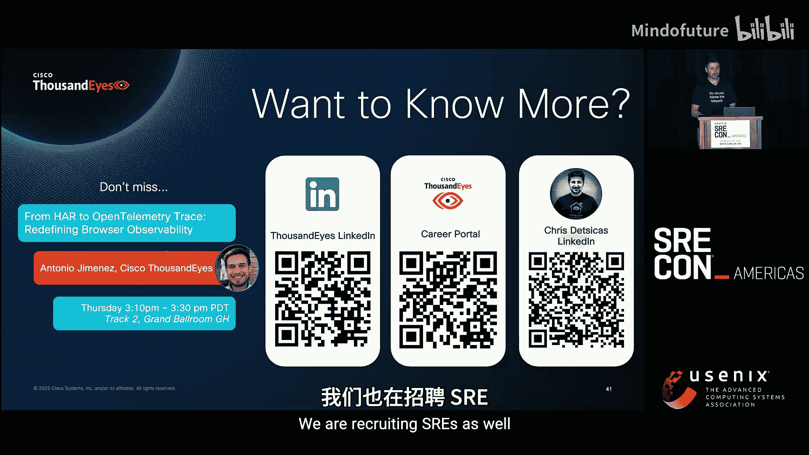

# 009：我们的 OpenTelemetry 之旅 🚀


## 概述

在本教程中，我们将跟随 ThousandEyes 公司的 SRE 团队，学习他们如何在一个复杂的分布式系统中引入并应用分布式追踪技术。我们将了解他们在没有追踪时所面临的挑战，探索 OpenTelemetry 如何帮助他们构建统一的追踪管道，并学习他们推动技术落地的宝贵经验。无论你是初学者还是有一定经验的开发者，这篇教程都将为你提供一个清晰、实用的分布式追踪入门指南。

---

## 第一章：背景与挑战

上一节我们概述了本次学习之旅。本节中，我们来看看 ThousandEyes 平台的基本情况，以及他们在引入分布式追踪之前所面临的困境。

我们的应用程序、基础设施都是分布式的。单体服务器的时代已经过去。一个请求可能会穿越许多不同的技术栈、SaaS 平台，甚至不同的云提供商。

ThousandEyes 构建了一个网络保障平台，帮助客户可视化、理解并检测其自身网络及互联网中的问题。因此，我们必须能够理解平台底层发生的情况。随着公司发展，我们向客户交付了越来越多的服务，请求在基础设施中穿行的路径也变得异常复杂。

我们内部虽然重视可观测性，但希望借助分布式追踪更进一步。

### 技术栈概览

以下是平台涉及的主要技术：

*   **编程语言**：大量 Java，以及一些 Kotlin、Go、C++、Python 和 Rust。
*   **部署平台**：主要部署在 AWS 的 Kubernetes 上，跨越三个核心区域和一些灾备区域。
*   **数据流**：大量使用 Kafka 进行数据传输。
*   **数据存储**：包括 MySQL、ClickHouse、Elasticsearch 和 MongoDB。
*   **服务网格**：使用 Istio 进行服务间通信管理。

Istio 服务网格为我们带来了许多好处，包括 gRPC 负载均衡、服务发现能力，以及大量的可观测性数据。我们甚至一度“淹没”在 Prometheus 指标中。这让我们开始更好地理解服务间的交互关系。

下图展示了我们 Web 应用命名空间中服务间的互连情况（由 Kiali 生成）。你可以看到，它看起来相当混乱，有许多移动的部分和服务相互连接。试想一下调试问题时的情景：两个服务相互连接，但我们真的能分辨出是在何种情况下、针对哪个请求或用户操作吗？

我们意识到了 Istio 的分布式追踪功能，但尚未探索。这成为我们开启分布式追踪之旅的动机之一。

---

## 第二章：没有分布式追踪时的故障排查

上一节我们介绍了平台的复杂性。本节中，我们通过一个具体场景，来看看在没有分布式追踪时，故障排查是怎样的体验。

想象一个清晨，警报响了。客户请求收到大量 5XX 错误。我们打开电脑检查指标。很好，我们看到了下降趋势，知道服务 Web 请求的某个环节出了问题。然而，指标缺乏深度上下文。它们擅长识别趋势和提醒问题，但缺乏细节。

接下来，响应人员可能会开始查看日志。访问日志在可用性问题中很有用，我们知道哪些端点失败了。但是，这个请求下游有哪些服务？是单个的 Agent View 服务有问题，还是 Scheduled Test 服务有问题，或者是 Timeline 服务？为什么返回了 500？

此时，响应人员需要检查更多的仪表盘和日志，尝试在脑海中构建图像。他们需要消化大量与当前请求不直接相关的信息，尝试确定服务所有权和请求流，并可能联系其他响应人员。这个过程非常困难且令人沮丧。

### 面临的挑战

以下是当时遇到的主要挑战：

*   **手动关联**：在众多仪表盘中搜寻，从 300 个图表中寻找异常、峰值和谷值，试图为故障和问题请求的路径构建假设。这非常耗时，且可能误入歧途。
*   **缺乏上下文**：日志量巨大，存在“大海捞针”的问题。除非日志特别详细，否则它们往往缺乏请求流的上下文。指标是高度聚合的，没有问题的具体细节。如果真有细节，又可能面临高基数问题。响应人员很难识别请求背后涉及的具体服务。
*   **知识孤岛**：我们总是依赖那个最了解服务的“专家”。当他不在时怎么办？随着团队增长和重组，这将成为更大的挑战，我们不能依赖运气。
*   **人员疲劳**：响应人员反复处理同类警报和流程，常常难以解决，只会感到疲惫。另一个副作用是，我们可能会在没有确认的情况下，将怀疑涉及的服务负责人拉入事件中，从而分散他们为客户构建新功能的精力。

所有这些因素都导致了问题与事件解决速度的放缓。

---

## 第三章：分布式追踪带来的改变

上一节我们看到了没有追踪时的混乱。本节中，我们来看看引入分布式追踪后，同样的故障排查场景有何不同。

我们有了相同的访问日志，但现在日志中包含了 `trace ID`。这是我们做的一项工作：确保信号混合，这确实能帮助人们找到追踪链路。

让我们深入查看这些具体请求的追踪详情。这里有很多信息。首先，我们看到请求从 Nginx Ingress Controller 开始。从日志中我们也能知道这点。但我们还能看到它经过了 API Gateway，各种 Istio 代理拦截了请求，最终到达了 Agent View Service。

我们甚至看到它调用了 Data Access Scheduled Test Service。问题似乎就出在这里。让我们进一步深入查看这个跨度（Span）：“get timeline data for metrics method”。进一步查看，我们看到那里有一个异常，甚至可以展开查看完整的堆栈跟踪。

现在，团队获得的信息比最初的访问日志多得多。他们可以精确定位问题发生在测试数据未找到时。在这个案例中，他们能够确定 UI 即使在测试被禁用时，仍然在错误地调用测试数据。他们通过提交 PR 更新 UI 来缓解问题，随后也更新了后端，确保 API 在测试未找到时也返回 404。

我们之前也通过其他错误报告工具获取异常，但有了追踪，我们能够直接从日志一路追踪到端到端的流程，了解涉及哪些服务，并在上下文中查看异常。

---

## 第四章：上下文传播与 OpenTelemetry 方案

上一节我们看到了追踪的强大。本节中，我们来探讨实现追踪的核心概念——上下文传播，并介绍我们基于 OpenTelemetry 的解决方案。

### 理解上下文传播

上下文传播是分布式追踪的关键。请求流中的第一个服务需要启动一个跨度上下文（Span Context）对象。它会确定一个 `trace ID`，以及自身操作的 `span ID`。对于根服务，没有父 `span ID`。这里通常还会做出采样决策。

当服务 A 向服务 B 发起请求时，它会注入头部信息（在 HTTP 情况下是 HTTP 头部）。服务 B 会提取这些头部，并启动自己的跨度上下文对象。这个对象会识别出来自服务 A 的父 `span ID`，然后为其自身操作创建新的 `span ID` 和跨度上下文对象，依此类推，服务 C 也是如此。

我们可以看到，`trace ID` 在整个链路中保持不变，而 `span ID` 则在整个追踪中维持着跨度之间的链接。这对于维持追踪的顺序和结构至关重要。跨度会来自我们基础设施的各个角落。采样决策通常也随上下文一起传递。在大多数情况下，第一个服务通过头部采样做出决策。当然，还有更复杂的采样策略，但我们目前保持简单。

### 我们的请求流与挑战

我们的典型请求流是怎样的？我们是否需要更新所有应用程序的代码来维护这个上下文？

让我们先看一个典型请求流。用户请求某个 Agent 的测试数据。首先，请求通过 Istio 代理到达我们的 Nginx Ingress Controller。Istio 服务网格会拦截所有进出请求。然后，请求会调用 Agent View Service，再到达 Data Access Service，后者会调用其他服务和数据库来完成请求。

Istio 正在拦截你的请求。我们最初天真地想：能否在不更改应用程序代码以传播上下文的情况下，仅仅通过启用 Istio 的追踪功能，就从应用程序中获取追踪信息并理解这些请求流？当我们推广追踪时，经常被问到：Istio 不能替我们做这些吗？

遗憾的是，不能。请求到达 Nginx Ingress Controller，Istio 启动一个追踪，创建带有 `trace ID` 的跨度上下文对象。但 Nginx 会将头部传递给下一个服务。所以，Istio 代理和 Agent View Service 会收到请求，并从 Ingress Controller 提取追踪上下文。然而，当 Agent View 应用向 Data Access Service 发起请求时，除非它包含了追踪上下文头部，否则 Istio 会启动一个新的追踪。Istio 不是“读心术”。不更改代码，我们最终会得到断开的追踪。

这看起来会是这样：我们有一个追踪对应请求流的第一部分（Ingress Controller 和 Agent View）。当 Agent View 向 Data Access Service 发出请求时，这个追踪就断开了，除非它传递头部以传播上下文。这不理想。之前提到的问题是手动关联，所以我们需要保持追踪的连贯性。

我们必须弄清楚如何在应用程序和基础设施组件（如 Istio 和 Nginx）中保持上下文的传播。这时，OpenTelemetry 走到了前台。

### 引入 OpenTelemetry

在深入我们的管道细节之前，我先为不熟悉的人介绍一下 OpenTelemetry。

在 OpenTelemetry 出现之前，分布式追踪相对是专有的、端到端的。供应商之间没有一致的追踪格式或协议共享。如果你想从供应商 X 切换到供应商 Y，就必须从代码中剥离旧的插桩（Instrumentation）并替换成新的。这非常耗时，而你本可以用这些时间构建新功能。

OpenTelemetry 出现了，它提供了一个供应商中立的插桩、收集和导出遥测数据的框架。它提供了一组 API、SDK 和工具，用于插桩、生成、收集和导出日志、追踪和指标。还有一些关于事件和性能分析的新工作，我们也在密切关注。

它有一个标准化格式：OpenTelemetry 线路协议（OTLP）。但也支持多种格式的接收和导出。这一点尤其引起了我们的兴趣：我们如何收集所有数据呢？

我们引入了 OpenTelemetry 世界的“瑞士军刀”——OpenTelemetry Collector。它提供了一个供应商无关的解决方案，用于收集、处理和导出遥测信号。这样，我们可以接收不同格式的遥测数据。对我们来说，这意味着 OTLP 和 Zipkin。我们当时评估了基础设施，Istio 不支持 OpenTelemetry 格式（尽管后来增加了支持，最近甚至获得了 HTTP 支持，我们正在考虑迁移）。因此，我们将 Collector 配置为同时接收 OTLP 和 Zipkin。这允许我们从代码中的 OTel Agent 收集 OTLP 信号，并从 Istio 和 Nginx 等基础设施组件收集 Zipkin 格式的数据。

然后，我们也可以导出到多个后端。刚开始时，我们尝试了许多不同的后端。通过 OTel Collector，我们可以确保相同的追踪最终出现在各种不同的后端中，并可以并排比较完全相同的追踪。我们根据用户界面、搜索和查询语言灵活性、API 集成等因素对它们进行评估。

### 部署架构

在部署 OTel Collector 方面，一种方法是使用 Agent 模式，将其作为 Sidecar 与应用程序一起部署。另一种方法是将其集中部署在集群中，即网关模式。我们决定集中部署，因为这意味着当我们更改配置变量（如更改追踪后端或后端参数）时，不需要重启或重新配置所有应用程序。同时，我们可以在中心位置过滤跨度，通过资源处理器添加资源属性（如环境级别详情）。如果未来我们转向尾部采样，由于已经集中部署，我们可以过滤所有数据。

我们如何部署这个 Collector 呢？这里有一个好主意，尤其是在 Kubernetes 中操作时：OpenTelemetry Kubernetes Operator。我们用它来管理我们的 OTel Collector。我们定义一个 OpenTelemetry Collector 自定义资源，在其中定义接收器、处理器和导出器配置。然后，Operator 会在 Kubernetes 服务后面部署多个 Collector 副本，甚至处理诸如通过 HPA 管理自动扩缩容等事情。这是快速启动和运行 OTel Collector 的好方法。

但真正的魔力来自于注入的自动插桩。为了传播至关重要的上下文并从应用程序中获取丰富的遥测数据，我们需要插桩。通过 Operator，我们定义一个 Instrumentation 资源，它将环境变量注入到 Pod 中，并允许我们按服务在自定义资源中定义 Agent 配置。

在服务启动时，一个 Init 容器被注入到 Pod 中，它会挂载 OpenTelemetry Java Agent。同时，在服务启动时将其注入。这意味着团队无需直接将库添加到代码中，就能获得相当不错的插桩水平。

我们的 Instrumentation 资源看起来像这样：

```yaml
apiVersion: opentelemetry.io/v1alpha1
kind: Instrumentation
metadata:
  name: my-instrumentation
spec:
  propagators:
    - tracecontext
    - b3multi
  sampler:
    type: parentbased_traceidratio
    argument: "0.01"
  java:
    image: otel/java-agent:latest
```

敏锐的读者会注意到，我们的传播器（propagators）同时包含了 `tracecontext` 和 `b3multi`。我们基于 Zipkin 的基础设施（Istio 和 Nginx）需要 `b3multi` 格式来在整个链路中传播头部。因此，虽然我们以两种格式发送追踪，但需要配置 OTel Agent 不仅为未来传播 `tracecontext`，还要支持 Zipkin 的 `b3multi` 格式，以兼容 Istio 和 Nginx。

我们还使用 Kubernetes 对象元数据来构建一些 OTel 环境变量，特别是服务名称，以匹配 Istio 的服务名称，保持一致性，避免出现服务名称变体和重复。插桩还会向 Pod 启动添加大量与 Kubernetes 相关的元数据环境变量，包括 Pod 名称、命名空间、节点名称等。这对于故障排查、与日志和指标关联，或者查看来自特定 Pod 的追踪非常有用。

### 整体架构

那么整体架构是什么样的呢？我们有一个相同的请求流：请求到达 Ingress Controller，Istio 启动追踪上下文，将请求发送给 Agent View Service，上下文作为 `b3multi` 头部包含在内。Agent View Service 向 Data Access Service 发起请求，也发送 `b3multi` 格式的追踪上下文。来自 Nginx 和 Istio 代理的追踪跨度是 Zipkin 格式的。应用程序中的自动 Agent（通过注入的插桩添加）使用的是 OTLP 格式。但由于我们全程使用 `b3multi` 来保持追踪上下文和 `trace ID` 一致，传播不会中断，我们的追踪保持连贯。

所有数据在 OTel Collector 处被转换为 OTLP 格式，然后导出到我们的后端（目前是 Grafana Tempo）。如果你深入追踪领域，可能会发现旧的软件和基础设施不支持最新的 OTLP 和 W3C 标准。但好处是，OTel Collector 很可能支持你需要的标准，并能将其转换为 OTLP。它支持许多不同供应商和格式。

---

## 第五章：推动采用与未来展望

上一节我们构建了追踪管道。本节中，我们来看看下一个挑战：如何推动团队采用这项技术，并展望未来的发展方向。

一旦我们的管道启动并运行，下一个挑战就是采用。如何鼓励使用它？关于采用，我认为有两方面：服务需要被插桩，以获得重要的上下文传播和服务操作详情，这需要尽可能简单。另一方面是人员，他们需要在数据就位后开始使用这个系统。

### 插桩策略

我们意识到有两种主要的插桩类型：自动插桩和手动插桩。

OpenTelemetry 的自动插桩 Agent 为多种语言提供支持。当使用通用库时，它们能原生地插桩应用程序的常见功能，如 HTTP、RPC、数据库和消息调用。这也能确保在这些操作跨越多个服务时进行上下文传播。我们的大多数服务是 Java，可以快速受益于自动插桩。

然后是手动插桩。工程师需要将 OTel API 或 SDK 添加到代码中，然后需要手动使用这些 SDK 来提取和注入追踪头部，并为他们的代码操作创建跨度。这提供了更多的灵活性和细节，但也带来了开发时的障碍。最终，我们一些使用 C++、Go、Rust 的服务必须使用这种方式。但我们希望首先专注于自动插桩。

我提到了注入的自动插桩。这是我们真正投入的地方。我们可以在几分钟内将 OTel Java Agent 添加到服务中，并快速从追踪中获得价值。这可能是目前主要的插桩方法，我们已有 100 多个服务通过这种方式进行了插桩。

### 鼓励插桩

有了这些选项，我们如何鼓励插桩呢？

首先，我们专注于一个核心服务——我们的主 Web 应用程序。我们与 Web 平台团队合作，为我们的 Web 应用和 API 添加了注入的插桩。这为我们提供了一个在整个组织内被认可的核心示例。许多人都使用过这个主 Web UI，很多人也为它贡献过代码。这有助于我们鼓励其他应用程序进行追踪。

有一个团队实际上有 50 多个服务，全部是 Java，在一个单体仓库中。通过一些巧妙的定制化补丁，我们能够相对快速地为他们所有的服务进行插桩。

然后是丰富的文档。ThousandEyes 是一个全球性组织，工程师能够异步地插桩他们的代码并掌握分布式追踪非常重要。因此，我们的文档解释了管道架构，提供了详细的插桩说明，并引用了 OpenTelemetry 官方文档，还提供了使用 Operator 和注入插桩来插桩服务的复制粘贴和自助服务示例。

ThousandEyes 有很好的技术分享文化。技术分享允许工程师分享他们发现的有趣技术、新功能以及构建方式，也包括像这样的平台变更。一旦我们有了像 Web 应用这样的核心示例和一些演示，我们就可以向整个组织展示，并有文档供人们参考以便开始。我们准备并发表了一场技术分享，涵盖了分布式追踪概述、管道工作原理以及如何插桩你的服务，重点介绍了注入的自动插桩。这引发了很多问题，一些非常热情的团队立即开始插桩他们的服务。

然后是生产就绪检查清单。让旧代码更改和插桩总是更困难，但我们不想进一步增加技术债务。因此，我们将插桩要求加入了我们的生产就绪检查清单中。

### 鼓励使用

一旦我们获得了所有数据，人们需要开始使用系统才能真正从中获得洞察。

我们做的其中一件事是，在有了核心示例并更新了 Web 应用程序后，我们更新了 Web 应用程序的应急预案。这确实给了响应人员一个提醒：追踪是存在的。尤其是在事件发生的紧张时刻，他们可能会忘记。预案中还包含了定制化的查询。这样，如果他们还不熟悉查询语言，可以帮助他们理解并找到诸如 5XX 错误或高延迟等问题，他们只需点击链接，追踪信息就会呈现在他们面前，他们会记住它。

然后是混合信号。旧习惯很难改掉，习惯于检查日志的响应人员可能仍然会专注于日志。因此，我们从第一天起就将 `trace ID` 添加到了 Istio 和 Nginx 的访问日志中。OTel Java Agent 通常也会将 `trace ID` 添加到日志中。我们发现许多用户会直接从日志跳转到追踪。他们在日志中看到 `trace ID`，就会想：“好吧，让我看看这下面发生了什么。”

还有一个通用的追踪探索仪表盘。我们意识到人们可能需要一些时间来学习查询语言。我们希望人们一旦插桩了他们的服务，就能快速探索涉及他们应用程序的追踪。通过这个仪表盘，他们可以去点击他们的服务，它会运行一些查询，比如查找高延迟追踪、查找有错误的追踪，然后查找一些跨度多的追踪（因为它们往往更有趣）。这允许人们在插桩后立即探索工具，并可以使用这些查询作为示例来构建自己的查询。

然后是事件演练日。在 ThousandEyes，我们通过运行模拟事件来培训新的事件响应人员。在一些场景中，我们使用追踪，并且应急预案与 Web 应用程序的相同，这帮助人们熟悉可观测性工具。实际上，在响应过程中可能没用上，但我们可以在事后复盘时使用它，帮助人们熟悉。塑造新面孔更容易。如果他们从一开始就看到价值，希望他们会更频繁地使用它。

然后就是一般性地推广追踪，思考“我们能用追踪解决这个问题吗？”或者在事件中帮助他人。我和我的团队有时会关注线上问题，如果我们认为追踪可能有助于解决问题，或者问题与 Web 应用程序有关，我们会去帮忙，帮助人们构建查询，并给予一些小小的提醒。我们甚至在事件中途为某个服务添加过自动插桩。

另一个奇怪的用例是 Jenkins。有一个团队的构建特别慢，他们无法确定原因，构建有很多并行分支和大量步骤。我们为 Jenkins 添加了追踪。他们可以将整个构建可视化为一个追踪，并立即看到耗时最长的部分。结果发现是读取外部文件多花了大约一到两分钟。他们将文件嵌入到 Jenkins 作业中，立即为每次构建节省了这一到两分钟。

### 未来工作

接下来是推广使用和采用，但我们的旅程还没有真正结束。当然，科技领域的事物需要持续维护，我们还有更多工作要做。

以下是一些未来的想法：

我们仍然相对较新于分布式追踪，所以需要插桩更多服务。采用率在增长，但仍有“潜伏者”。Istio 拦截所有请求带来的一个好处是，我们可以追踪哪些服务尚未插桩。我们需要关注这些服务。

接下来是 Exemplars。我提到了日志中的 `trace ID`，我们的用户使用的一个关键途径是从日志跳转到追踪。然而，如果能使用 Exemplars 会更好。通过 Exemplars，我们可以在图表上拥有数据点。例如，在那个可用性下降的图表上，有一个数据点，点击它，你就可以看到确切的上下文和一个示例场景，一个导致该可用性下降和 500 错误的示例追踪。想象一下，你能多快地从警报跳转到完整上下文。

还有更多：前端的 OpenTelemetry。我们的数字体验越来越多地在浏览器中，用户与 JavaScript 的交互也越来越多。我们一直在探索为前端元素添加追踪能力，以真正理解从浏览器到后端代码的完整用户体验。

然后是一些高级采样策略。目前，我们在预发布环境中采样 100%，这对于调试预发布版本甚至复现问题非常棒。但在生产环境中，我们大多采用 1% 采样，以保持数据量较低。大多数时候这没问题，但有时我们得不到足够的数据，或者错过了某些请求。同时，我们仍然保留了许多不感兴趣的数据，例如大量成功的交互。因此，我们想要探索头部采样：在客户端采样 100%，然后在 Collector 中收集所有追踪，再做出决策，例如对包含错误的追踪采样 100%（或稍低），对高延迟的追踪采样，甚至对具有特定操作的追踪以更高百分比采样。

---

## 总结

本节课中，我们一起学习了 ThousandEyes 公司实施分布式追踪的完整旅程。

我们需要认识到，系统和组织的复杂性将持续增长。我们的可观测性工具可以帮助克服这一点。我们可以不断改进工具，以打破故障排查的障碍。分布式追踪被证明是帮助我们更快解决问题的有效方法之一。

但如果没有 OpenTelemetry，我们无法做到这一点，或者至少旅程会更加艰难且缺乏未来保障。对我们来说，其标准化和开箱即用的功能，尤其是集成多种标准、测试多个后端以及未来相对轻松切换的能力，至关重要。

在采用方面，这总是一个障碍。但我们发现，尽可能简化流程、通过详细文档降低门槛以便人们异步操作，以及通过技术分享进行现场演示、鼓励采用并让人们对此感到兴奋，这些方法都很有帮助。注入的自动插桩确实是“救星”，它真正帮助我们让团队快速启动并运行，将插桩融入他们的代码。




当然，在让人们使用系统方面，只需尝试通过应急预案将追踪呈现在人们面前，给予他们小小的提醒，并混合信号（如在日志中添加 `trace ID`），确保他们在查看其他信号时能遇到它，从而可以直接从日志跳转到追踪。