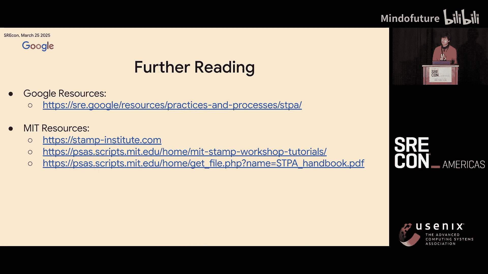

# 011：SRE大会-2025-美洲-｜-srecon-｜-分布式-｜-缓存-｜-OpenTelemetry-｜-安全-｜-AIOps-p11-P11-Mapping-a-Better-Future-with-STPA--BV1TmLDz7EZZ_p11-

## 课程概述：SRE与系统理论过程分析（STPA） 🧭

在本节课中，我们将要学习一种名为**系统理论过程分析（STPA）** 的方法论。STPA由麻省理工学院的Nancy Leveson博士和John Thomas博士开创，它帮助我们在系统构建之前，就识别出可能导致故障的设计缺陷。我们将通过一个Google Maps路况更新系统的真实案例，了解STPA如何超越传统的可靠性实践，预防那些并非由单一组件故障引起的系统级损失。

---

## 章节1：传统SRE方法的局限性 ⚠️

作为站点可靠性工程师（SRE），我们的目标是预测甚至预防尽可能多的系统中断。然而，SRE团队通常只占工程总人数的一小部分，我们面临着现实的资源约束。那么，我们如何才能有效地预测和预防所有可能的故障呢？

传统的SRE实践主要关注由**组件故障**引起的损失。例如，我们会问：“当我的服务崩溃时，客户会受到什么影响？”或者“当后端返回500错误时会发生什么？”。

但是，存在一整类系统损失，它们并非源于任何单一组件的故障，而是源于**组件之间的交互**。对于这类系统级损失，SRE和软件工程师往往缺乏有效的应对工具。

为了说明这一点，让我们看一个John Thomas博士使用的例子：黄油刀。

*   **黄油刀**本身是可靠的。它很少会断裂，在切割黄油时能安全地履行其功能。
*   然而，其**安全性取决于上下文**。如果一个孩子将黄油刀插入电源插座，情况就变得不安全了。
*   那么，是什么“失败”了？刀是可靠的（金属导电），插座是可靠的（提供电力），孩子也是“可靠的”（如果你给他一把刀，他很可能会去插插座）。
*   这里的损失源于**刀、孩子和插座之间的交互**，而非任何单一组件的故障。

上一节我们介绍了传统方法在处理系统交互问题上的不足，本节中我们来看看一个具体的系统故障案例。

---

## 章节2：一个令人困惑的系统中断案例 🚧

假设我负责一个处理并发布Google Maps上道路封闭信息的系统。这个系统包含多个环节：数据摄取、处理、验证、上传到数据库、进一步传播，最后提供服务。

一天早晨，我收到了手动告警，因为许多用户被导航到了一条正在举行游行的封闭街道上。这绝不应该发生。我检查了仪表盘，发现没有违反任何SLO（服务等级目标），所有服务都显示为绿色，每个服务都按预期工作。

那么，故障是如何发生的？

经过深入调查，我发现尽管每个组件都按设计工作，但**服务之间的交互配置有误**。关键服务对其他系统部分的行为做出了**错误的假设**。为了修复这个问题，开发者和我需要花费两个月的时间来重新设计和调整这个系统。

这个案例引出了核心问题：为什么在一切看似正常的情况下，系统依然会发生中断？答案在于，传统的可靠性解决方案（如冗余或组件级质量改进）无法预防所有类型的损失。

---

## 章节3：引入STPA：系统安全性的新视角 🔍

在Google Maps SRE团队，我们采用了一种较新的方法论——**系统理论过程分析（STPA）**。我们坚信，STPA填补了我们在管理系统方式上的必要空白。

STPA的核心思想是：在软件系统构建之前，就揭示它们将如何被“破坏”。这能为我们节省时间和金钱，并最终帮助我们的用户。

STPA分析包含四个关键步骤：

1.  **定义分析目的**：划定系统与环境的边界，明确系统目标、不可接受的损失以及危险状态。
2.  **建立控制结构模型**：这与数据流图完全不同。控制结构模型描述的是**控制和反馈回路**，包含了系统中各部分之间的非线性关系。
    *   `控制结构 != 数据流图`
3.  **分析控制结构，识别不安全控制行为**：找出在何种条件下，控制指令会导致系统进入危险状态。
4.  **识别损失场景**：找出可能导致系统中断的具体、可实现的例子。

接下来，让我们将这些步骤应用到之前提到的道路封闭系统中。

---

## 章节4：应用STPA分析道路封闭系统 🗺️

首先，我们进行**步骤1：定义分析目的**。

*   **目标**：同步Google Maps与第三方道路封闭信息的状态。
*   **损失**：不可接受的结果。例如：用户被导航至封闭道路。
*   **危险**：导致损失的系统状态。即：**Google Maps与第三方道路封闭信息不同步**。
*   **约束**：为防止危险和损失，系统必须满足的条件。
    *   **主要约束**：必须始终保持同步（即危险状态的反面）。
    *   **次要约束**：如果进入危险状态，必须能够快速检测并缓解。这正是SRE在可观测性、灾难恢复等方面投入大部分精力的地方。

完成了目标定义，我们进入**步骤2：建立控制结构模型**。

系统的总体目标是确保Google Maps包含第三方封闭信息的最新状态。

*   **底层**是**受控过程**：Google Maps的状态。
*   **上一层**是**道路封闭处理器**：负责同步Google Maps状态，通过向Google Maps发送“创建”或“删除”指令来实现。
*   **再上一层**是**快照差异分析器**：负责告诉处理器具体要添加或删除哪些封闭信息。它接收第三方快照作为输入。
*   **顶层**是**人类（工程团队）**：他们拥有处理器和差异分析器的逻辑，并在系统不同步时收到告警。人类始终是系统的一部分。

这个控制结构揭示了关键点：差异分析器做出决策时，依赖的反馈是第三方快照，但**它并没有直接获得关于Google Maps当前状态的反馈**。

---

## 章节5：发现致命的设计缺陷 💥

现在进入**步骤3：分析不安全控制行为**。一个不安全的行为是：当Google Maps上不存在某个道路封闭时，差异分析器**没有创建**该封闭信息。

那么，这如何发生？差异分析器如何知道Google Maps是否不同步？回顾之前的系统描述，差异分析器的**心智模型假设：上一个快照等同于Google Maps的当前状态**。

但这个假设总是成立吗？让我们看看它如何被打破。

假设系统需要创建“25街封闭”的信息。但如果这个“创建”操作失败了呢？（例如，数据库提交失败、消息未发送、快照之间存在竞争条件等）。那么，Google Maps就不会应用这个封闭，系统进入危险状态。

接下来，当第三个快照到达时，系统会比较快照3和快照2。由于“25街封闭”在两个快照中都存在，**差异分析器认为没有变化，因此永远不会重新尝试发布该封闭信息**。

至此，我们发现了设计缺陷：系统依赖于一个**可能错误的假设**。即使所有组件都按设计运行，系统也会持续更新其他封闭信息，而永远不会重试丢失的“25街封闭”，最终导致与真实世界完全脱节。

几天或几周后，大量用户因被导航至封闭道路而感到不满，我收到了告警。此时系统已处于损失状态。

---

## 章节6：STPA带来的改变与巨大收益 🚀

前面我们详细分析了一个由设计缺陷导致的潜在故障。如果我将这个有缺陷的设计投入生产，会发生以下情况：

1.  系统上线，道路封闭信息开始从Google Maps上消失。
2.  几小时、几天或几周后，用户受到影响，我收到告警。
3.  我们花费一周时间试图找出哪些封闭信息丢失，但仍不知道根本原因。
4.  再花两周找到这个设计缺陷。
5.  最后用六周时间启动一个新系统（新设计直接从Google Maps读取状态，这在事后看来是显而易见的方案）。

然而，**上述中断实际上从未发生**。因为我们在构建系统之前就使用了STPA进行分析。我们通过STPA发现了这个设计缺陷，并在设计文档中通过**重写几个段落**就修复了它。具体来说，新设计**将Google Maps的状态反馈直接提供给快照差异分析器**。

不仅如此，通过STPA，我们总共发现了**七个重大设计缺陷**，包括操作顺序无效、数据处理竞争条件、同步状态反馈不足、易出错的数据源接入流程等。

对于一个已经由各系统技术负责人审核通过的设计来说，这是一个很长的缺陷列表。为什么传统评审方法会遗漏这些？因为软件开发主要基于“快乐路径”，默认系统状态是安全的。而当思考“不快乐路径”时，我们缺乏系统性地审视系统安全性的工具，只能依赖在庞大状态空间中的随机探索，这通常导致我们选择忽略这些路径。

在**设计阶段**应用STPA，识别和修复这七个缺陷的总成本极低：**仅26小时**，平均每个缺陷不到4小时。修复设计问题的成本随着产品成熟度呈指数级增长。因此，在新服务和新系统的早期阶段与STPA团队合作最为有效。

在Google，当我们将STPA应用于成熟系统时，如果发现安全漏洞，可能会遇到工程团队的阻力，因为修改成熟系统的成本很高。但是，当我们将STPA应用于系统设计时，工程合作伙伴非常乐于与我们合作。现在，他们甚至会主动来找我们进行STPA分析，因为我们在他们构建系统之前就帮助修复问题，这对他们来说成本要低得多。

---

## 课程总结 📝

本节课中，我们一起学习了系统理论过程分析（STPA）的核心价值。

*   我们认识到，传统可靠性方法对**由组件交互和错误假设引发的设计缺陷**是盲目的。
*   我们通常只能等待系统中断，然后被动地修复，这成本极高，并会打乱产品路线图。
*   STPA提供了一种在系统实现之前，就系统性地识别和预防此类问题的方法。
*   在**设计阶段**应用STPA，能够以极低的成本（如案例中的26小时发现7个缺陷）解决问题，避免未来高昂的故障修复和业务影响成本。
*   这使工程师能够提前解决根本问题，成为效率倍增的“1000倍工程师”。

如果你想学习更多关于STPA的知识，可以参考麻省理工学院（STPA的发源地）发布的相关资料，Google也开始发布如何应用STPA的资源。

（演讲结束，进入问答环节）

