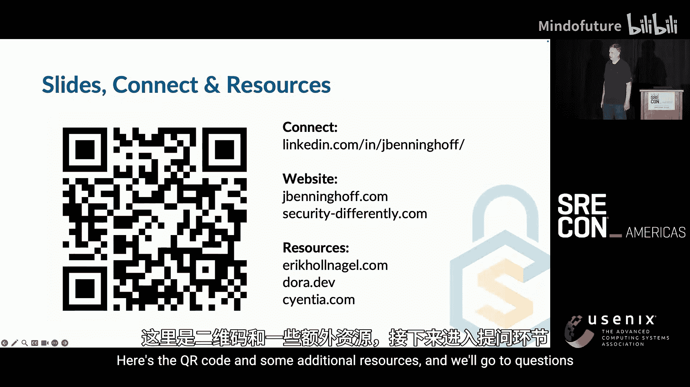
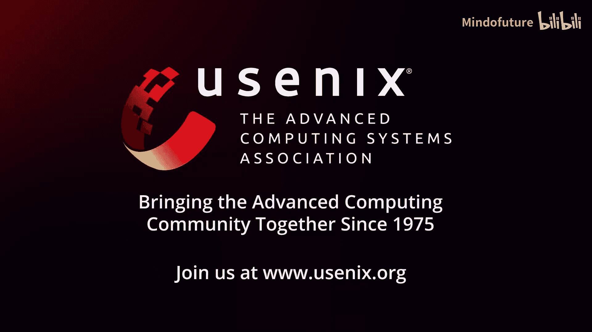

# 012：SRE大会-2025-美洲-｜-srecon-｜-分布式-｜-缓存-｜-OpenTelemetry-｜-安全-｜-AIOps-p12-P12-Is-the-S-in-SRE-for-“Security”--BV1TmLDz7EZZ_p12-

## 概述 📋

在本教程中，我们将探讨SRE（站点可靠性工程）与安全（Security）之间的深刻联系。我们将通过数据分析、实际案例和核心概念，阐述为何安全性能与软件交付及可靠性性能高度相关，并介绍如何将SRE的实践与思维模式应用于安全领域，以实现整体技术性能的提升。

## 课程内容：1：安全与可靠性——共同的基石

我的目标是让安全变得不那么可怕，并使其像结构工程或机械工程中的安全性一样，成为技术工程不可或缺的一部分。这是一个关于安全与SRE如何重叠的故事。

我的祖父是一名飞行员，他飞行时总是使用检查清单。这启发我阅读了《清单宣言》一书。书中，外科医生阿图·葛文德讲述了如何将航空业的检查清单理念应用到外科手术中。这让我思考：我们能否将这种方法应用于网络安全？

这引导我进入了安全科学领域。安全科学家埃里克·霍兰格尔提出了“安全第二”的概念。他认为，传统上我们通过“没有坏事发生”来定义安全成功，但这无法形成科学。真正的安全科学需要关注全部结果范围，包括积极结果和正常结果，并将安全重新定义为“安全地工作”。

改变结果有两种策略。一种是**约束性能**，这会同时减少负面和正面结果。另一种更好的策略是**提升整体性能**，将绩效曲线向右移动。这样不仅能减少负面结果，还能增加正面结果。这种思维转变意味着安全或SRE工作不应被视为成本，而应被视为能带来更好结果的投资。

安全性能的核心在于：当系统暴露于威胁、危险或故障时，其表现如何。我将通过数据研究表明，网络安全性能与软件交付及可靠性性能高度相关。

## 课程内容：2：数据揭示的关联性

上一节我们介绍了安全性能的思维转变，本节中我们来看看支持这一观点的三项关键研究。

以下是来自2019年的三项不同研究，它们从不同角度证实了这种关联：

1.  **2019年DORA《加速DevOps状态报告》**：这项研究表明，可靠性、性能和安全性的度量指标倾向于同步移动。采用DevOps实践的团队在提升部署频率的同时，也降低了变更失败率并缩短了服务恢复时间。
2.  **2019年Veracode《软件安全状态报告》**：该报告发现，代码扫描频率与漏洞修复速度存在强关联。每年仅扫描1-3次的团队，修复50%的漏洞需要近一年时间；而每天扫描（约300次/年）的团队，修复漏洞仅需数天。这不仅是测试更快，更与DevOps团队的整体快速迭代和修复能力相关。
3.  **2019年《软件供应链状态》研究**：对Java Maven仓库的分析显示，保持安全的最佳方式是**保持依赖项更新**，而不仅仅是关注安全更新。频繁更新依赖项的项目更安全。核心公式是：**频繁更新 → 更快纳入安全补丁 → 更安全的状态**。

我个人践行这一理念：在开始任何新功能开发前，先更新所有依赖项并修复由此产生的问题。定期这样做，破坏通常很小，同时我也不必专门担心安全问题。

## 课程内容：3：安全与SRE的重叠模式

基于以上学习和数据，我认识到安全性能与广义的技术性能存在大量重叠，并总结出三种模式：

*   **模式一：安全性能完全包含在通用性能之内**。例如，系统维护活动（如配置管理、打补丁）既是核心SRE工作，也是最有效的安全控制措施。
*   **模式二：安全与通用性能部分重叠**。两者共享某些核心能力，但各自也有独特领域。
*   **模式三：安全处理的是全新或未知领域**。此时通用技术实践尚未覆盖，例如早期的软件供应链攻击。

本教程将主要探讨模式一和模式二，特别是它们如何应用于SRE。

一项2024年的元分析研究指出了最有效的安全控制措施，前两名是：
1.  攻击面管理（即配置和资产管理）
2.  补丁更新节奏（即软件更新和依赖管理）

这两者本质上都是**系统维护**活动，是SRE的核心职能。因此，提升安全最有效的方法之一就是做好SRE的日常工作。真正的挑战往往不是“不知道做什么”，而是“没有时间和资源去做维护”，因为功能开发通常优先级更高。

## 课程内容：4：核心重叠能力详解

上一节我们看到了安全与SRE在维护工作上的重叠，本节我们来深入探讨几个关键的重叠能力领域。

以下是四个核心的重叠能力领域：

1.  **可观测性**：安全团队和SRE团队都需要洞察系统内部状态。SRE更关注性能与可用性指标，而安全团队更关注异常行为。但两者都基于相同的数据源和基础设施。市场趋势也显示，许多顶级安全信息与事件管理工具实际上是通用可观测性平台增加了安全功能。使用统一平台可以节省成本，并且通常能更好地扩展。
2.  **事件响应与事后调查**：安全事件和系统故障事件在影响和频率上有所不同。安全事件通常影响更大（可达百亿级）、频率更低（数年一次）；而系统故障更频繁、单次影响相对较小（百万级）。这导致响应模式不同：安全事件响应周期长，可能涉及深度取证和威胁狩猎；SRE事件响应要求快速恢复，事后复盘节奏更快。但两者都需要事件协调、日志分析和根因定位技能。双方合作能带来互补视角：安全团队擅长“大海捞针”找异常，SRE团队擅长快速协调资源。
3.  **测试**：SRE和安全团队都关注“非快乐路径”。SRE思考“出错时怎么办”（错误、故障），安全团队思考“有人故意破坏时怎么办”（攻击）。测试方法广泛重叠，包括：静态代码分析、混沌工程、形式化方法、使用内存安全语言、参数化SQL查询，甚至记录系统设计假设。自动化测试对两者都至关重要。一个关键理念是：**Bug就是Bug**。无论是安全漏洞还是可靠性缺陷，快速发现并修复都能让系统更健壮、更安全。
4.  **安全水平目标**：我在此提出 **SLO** 的概念。SRE使用服务水平目标作为承诺机制：当可用性低于目标时，承诺将资源从功能开发转向可靠性建设。SLO思路类似：预先确定可接受的安全风险水平，当风险超过此水平时，承诺将资源转向安全加固。挑战在于，安全很难用“每年允许一次入侵”来度量。因此，SLO应使用前瞻性、与成功相关的指标，例如：
    *   每个端点的漏洞数量
    *   对互联网开放的TCP端口数量
    *   未使用多因素认证的IAM比例
    *   孤儿账户比例
    *   登录失败/成功率

早期漏洞管理实践可视为一种原始的SLO：当漏洞报告过长时，基础设施负责人会决定暂停新功能开发以修复漏洞。这实际上就是SLO在起作用。

## 课程内容：5：实践建议与总结

基于以上讨论，以下是三个核心实践建议：

1.  **SRE工作支撑核心安全性能**：做好配置管理、资产清点、依赖更新和补丁安装等日常维护工作，是提升安全性的最有效手段之一。
2.  **扩展SRE能力以支持安全，反之亦然**：在事件响应、风险管理和可观测性等方面，鼓励两个团队协作。他们独特的视角和技能可以互补。
3.  **安全与SRE协同并进**：这两个领域拥有大量重叠且互补的技能组合。共同协作比各自为战能走得更远。

## 总结 🎯

本节课中我们一起学习了SRE与安全之间的紧密联系。我们通过数据看到，提升软件交付和可靠性性能会直接促进安全性能。两者在可观测性、事件响应、测试和维护等核心能力上高度重叠。通过采用SRE的实践，如定义SLO，并将安全视为整体技术性能的一部分，我们可以更有效、更主动地管理安全风险，最终构建出更可靠、更安全的系统。

