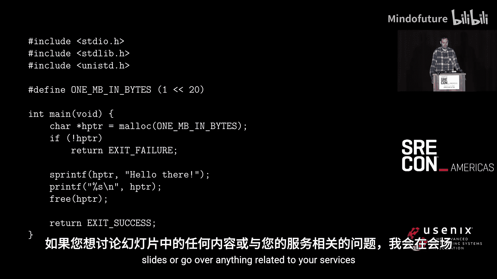

# 013： 关于内存的常见误解


## 概述

在本节课中，我们将探讨程序员和系统管理员在内存管理方面常见的误解。内存是系统可靠性和性能的核心，但许多关于其工作原理的直觉可能是错误的。我们将从基础概念开始，逐步深入到Linux内核的内存管理策略、现代资源控制机制，以及如何正确监控和优化内存使用。

## 1：内存分配的真实情况

我的名字是Christown。我是一名Linux内核工程师。我主要在内核的内存管理子系统上工作，特别是资源控制和隔离方面。我也是systemd项目的维护者。我的工作重点是思考如何让Linux更可靠、更具可扩展性。

今天，我想谈谈程序员和系统管理员在内存方面常见的误解。内存是一个基础话题，但关于它的讨论常常充满情绪，例如关于交换空间的争论。在我与SRE和软件工程师合作的15年里，我看到了很多关于内存实际工作原理的误解。希望本次分享能帮助你更新一些概念，并获得一些优化生产系统的新思路。

让我们从一个基础例子开始。请看以下C代码：

```c
char *ptr = malloc(1 * 1024 * 1024); // 分配1MB内存
strcpy(ptr, “hello”); // 写入字符串
printf(“%s\n”, ptr); // 打印
free(ptr); // 释放内存
```

这个程序看似简单：分配1MB内存，写入字符串，打印，然后释放。现在，请思考一个问题：**`malloc`调用在何时真正分配了物理内存？`malloc`的契约到底是什么？**

如果我告诉你，`malloc`这个函数名虽然暗示“内存分配”，但它实际上**与物理内存分配毫无关系**，你会怎么想？

那么，这一系列事件究竟是如何展开的呢？

## 2：Linux内存管理的目标

首先，为了确保我们在同一层面理解，我们需要了解Linux内存管理的高层目标和非目标。

以下是几个主要目标：
1.  **最大化系统资源利用率**：我们希望尽可能利用所有可用内存。这不仅意味着让内存可访问，还要确保应用程序有合适的系统调用来有效使用它。理想情况下，系统内存应被持续使用，空闲空间通常会被磁盘缓冲区、文件系统缓存等填充。
2.  **确保内存访问安全**：如果一个程序试图侵入另一个进程的内存且没有权限，我们必须阻止。这主要由CPU硬件支持，但内核需要根据CPU的异常报告采取行动。
3.  **自身资源高效**：内存管理代码必须非常快。完美的内存跟踪如果导致系统变慢，就毫无意义。因此，内核代码中充满了近似计算和权衡，性能至关重要。
4.  **对应用程序透明**：绝大多数内存管理活动不应涉及应用程序。效率优化工作需要在应用程序无感知的情况下透明地进行。这要求我们重新思考应用程序“看到”内存的方式。

上一节我们介绍了内存管理的基本目标，本节中我们来看看Linux为实现这些目标采用的一个关键策略。

## 3：超量承诺与按需分页

Linux为了最大化内存利用率，采用了一种称为**超量承诺**的策略。

超量承诺就像一张信用卡：每次你申请内存，系统都会答应你。事实上，系统甚至乐于给你比整个系统物理内存总量更多的内存。为什么会允许这样？

这与另外两个概念紧密相关：**按需分页**和**交换**。
*   **按需分页**：我们不会预先分配物理内存，只有在应用程序实际使用某块内存时，才为其保留物理内存。
*   **交换**：我们允许将一些已加载的内存卸载到更慢的存储设备（如磁盘）上。

这一切都基于一个事实：**程序分配的内存数量，是预测其实际使用情况的非常糟糕的代理**。事实上，程序分配的大量内存要么从未使用，要么极少使用。

将这些页面一直保留在物理内存中会非常浪费，因为系统无法将这些内存用于其他用途。因此，我们的目标是通过**将申请内存的行为与实际物理分配解耦**，来提高系统整体的内存利用率。

一种典型的反对观点认为，内存管理应该是应用程序开发者的责任，内核不应插手。然而，多年来我们经历的所有安全漏洞都证明，人类非常不擅长管理内存。因此，许多项目转向了像Rust这样对内存访问有高度抽象的语言，甚至是现代C++。当然，还有解释型语言，你对其内存完全无法控制。

超量承诺确实有其缺点。例如，如果所有程序都同时要求使用它们申请的所有内存，那么系统就会陷入困境。不过，这些问题可以在内核和用户空间层面得到缓解，我们稍后会讨论一些方法。

了解了内存分配的策略后，我们来看看Linux在底层是如何实现这些概念的。

## 4：虚拟内存与缺页异常

Linux在底层通过**虚拟内存**来实现上述机制。

虚拟内存是内核和CPU共同实现的一种抽象层。例如，系统可能“虚拟地”给了应用程序一些内存，但从未为其保留物理内存。每个进程在Linux上都有自己的虚拟地址空间。在这个空间内，程序看到的内存就像普通内存一样，但它并不真正知道背后是什么，甚至可能根本没有物理内存支持。

一个虚拟内存地址不一定由RAM支持，它同样可以由交换空间支持。当访问时，我们需要将其提升到主内存。它也可能根本没有映射，就像按需分页的情况，我们需要逐步将页面调入内存。

当然，这并不能阻止你在自己程序内访问有效但错误的内存区域。我们只能阻止你干扰其他程序，或者对内存进行无权限的操作。

我们将超量承诺和按需分页这两个概念混合在了一起。按需分页就是我们之前讨论的：直到被“需求”时，才实际分配物理内存。这种需求通常以**缺页异常**的形式出现。

缺页异常这个名字听起来很吓人，它实际上是CPU发来的一个消息：“有人试图访问一块内存，但我完全不知道他们在说什么。” 这意味着CPU没有从该虚拟页面到任何物理RAM的映射。因此，内核要么需要分配一个新的物理页帧并建立映射，要么判定这是一个无效地址访问。

以下是典型的工作流程：
1.  用户空间应用程序通过库函数（如`malloc`）请求内存。这些函数内部可能使用`sbrk`或`mmap`等系统调用来增加虚拟内存空间。**关键点：这些操作只增加虚拟内存空间，完全不涉及物理RAM**。
2.  稍后，当进程实际去使用这块内存（解引用虚拟地址）时，CPU因无映射而产生缺页异常。
3.  Linux内核发现这块内存尚未放入主存，于是分配一个新的物理页帧，并建立正确的映射。
4.  如果需要从后备设备（如交换空间）加载数据，内核会先将数据复制到内存，然后恢复程序执行。**整个过程对程序是透明的**。

这里需要记住的关键点是：像`malloc`这样的函数与实际分配内存是**脱节**的。程序调用`malloc`时并没有分配真实内存，它们只是获得了将来可以使用的选项。这其中的间接交互非常多，因此在推理应用程序的内存语义和生命周期时必须非常小心。

既然`malloc`可能“说谎”，那么`free`呢？它总该释放内存了吧？

## 5：释放内存的真相

Chris，你告诉我调用`malloc`时它在说谎，它说给了我内存但实际上还没给。但至少当我调用`free`时，它总该把内存释放掉吧？他们不会对我说两次谎，对吧？

当然会。他们是Linux内核开发者，当然会。

请看这个简单程序：它分配1MB，触及每个页面，然后释放，最后等待。如果你运行这个程序并在`free`之后检查其驻留集大小，你期望它会降到0，对吗？很可能不会。实际上，更可能发生以下三种情况之一，每一种都令人困惑：

以下是可能发生的情况：
1.  **毫无变化**：RSS保持1MB。这是因为分配器只是将你的内存放到了某个空闲列表上，没有归还给操作系统。像Google的TCMalloc这样的分配器通常会这样做，以避免昂贵的系统调用。
2.  **部分下降**：RSS下降了一些，但不是全部。分配器比较慷慨，归还了部分页面给OS，但保留了一些，心想“也许你以后还会用到”。这在Glibc的`malloc`或`jemalloc`中更常见。
3.  **不降反增**（我最喜欢的情况）：释放内存后，RSS反而增加了。这是因为`free`操作本身可能需要分配内部元数据，或者分配器为了重组其内存池（例如对抗内存碎片）而触及了更多页面或页表。

**关键点**：`free`是给你使用的内存分配器的一个**信号**，而不是给操作系统的信号。它的意思是“我不再需要这个了”，而不是“请立即归还”。分配器决定如何处理它。这就像在聚会上说“我要走了”，然后挥手告别。你可能真走了，也可能三小时后被发现还在后面玩。你的声明对最终结果可能毫无影响。

这就是为什么在生产环境中监控内存泄漏如此棘手和繁琐。一个可能释放了所有内存的进程，实际上可能并没有释放内存。现代分配器为此做了许多不同的权衡。这也是为什么在现代系统上测量RSS相当棘手的原因之一。

我们讨论了内存分配和释放的复杂性，但内存访问本身也存在巨大误解，这源于它的名字。

## 6：随机存取内存并不“随机”

我看到观众席中有我不喜欢的人，一位会议组织者Dan。Dan，你能帮我个忙，读一下这张幻灯片吗？

> “随机存取存储器是一种电子计算机存储器，可以以任何顺序读取和更改，通常用于存储工作数据和机器代码。随机存取存储器设备允许数据项的读取或写入时间几乎相同，而与数据在存储器内的物理位置无关。”

我不敢相信你会对在场的女士们和先生们撒谎，在这种场合说这样的假话。你真应该感到羞愧，Dan。

让我们来看一个大型二维数组的两种遍历方式。

```c
// 列优先遍历 (慢)
for (int j = 0; j < COLS; j++) {
    for (int i = 0; i < ROWS; i++) {
        access(array[i][j]);
    }
}

// 行优先遍历 (快)
for (int i = 0; i < ROWS; i++) {
    for (int j = 0; j < COLS; j++) {
        access(array[i][j]);
    }
}
```

你可能会想，我最终都要访问这个二维数组中的所有元素，对吧？那么为什么第二种方式快了**50倍**？

因为尽管我们尊敬的同事和维基百科那么说，**随机存取存储器实际上非常不擅长“随机”访问内存**。

原因之一是DRAM是按行组织的，其操作由**CAS预充电周期**控制。
*   **RAS**：行地址选通，告诉RAM激活哪一行。
*   **CAS**：列地址选通，在已激活的行中选择哪一列。
*   **预充电**：准备切换到一个新行。

关键点在于：你可以在一个激活的行上执行多次列操作，然后才需要下一次预充电。在列优先遍历中，每次访问都需要预充电、激活新行、选择列。在行优先遍历中，我们连续多次访问同一行，只需要一次RAS，然后是一连串CAS操作。RAS和预充电操作相比CAS操作极其昂贵。

行优先访问也更利于缓存利用。缓存行是CPU缓存和内存之间数据传输的最小单位（x86-64上通常是64字节）。我们以连续对齐的块读取它。如果随机读取，我们每次都可能要读入一整条缓存线然后丢弃。而顺序读取则可以持续利用同一条缓存线。

顺序读取更快的另一个原因是虚拟内存被划分为固定大小的页（x86上通常是4KB）。转译后备缓冲器是虚拟地址到物理地址的缓存，通常容量有限。如果我们在地址空间中跳跃寻找页面，就需要不断换入换出TLB条目。顺序访问则不需要。

大多数现代编译器还会自动对第二种版本进行**向量化**，使用SIMD指令。但需要明白，性能提升的大部分原因并非SIMD，而是RAS/CAS和预充电。

你可能注意到我没提预取。预取是CPU自动检测这种顺序访问并提前加载数据。在这个特定例子中，它帮助不大。本幻灯片的主要目的是提醒你，在编写代码时，请记住：尽管名字叫“随机存取内存”，但无论是RAM还是CPU，实际上都非常不擅长真正的随机访问。

理解了内存访问的模式后，我们还需要了解Linux如何看待不同类型的内存。

## 7：内存类型与RSS的局限性

理解Linux内存管理的另一个关键是，Linux从语义上区分不同类型的内存。

例如：
*   **匿名内存**：顾名思义，没有后备存储。这是程序运行期间通过`malloc`等分配的内存。
*   **缓存和缓冲区**：现在它们统一为**统一页面缓存**。但如果你问大多数Linux管理员，他们会说页面缓存/缓冲区是可回收的，可以随时释放。

问题在于，**“可回收”并不意味着“可以立即释放”**。可回收意味着如果你真的非常需要，并且在某些条件下，也许回收会被允许。但这不意味着“哦，上帝，发生了坏事，我现在就允许你回收”。它不在乎你的紧急需求。

例如，如果某个应用程序正在频繁读写某个文件，我们不太可能直接丢弃那个文件的缓存。因此，虽然在某些情况下它可以被轻易释放，但并非总是如此。这导致人们不可避免地会问：“为什么我的应用程序内存不足？我明明有大量的缓冲区和缓存。” 很可能那些缓存是必需的。

缓存可能是必需的，这也是为什么**驻留集大小**这个人们喜爱且无处不在的指标是**不靠谱的**。

RSS将大量注意力集中在少数几种内存类型上（匿名内存和映射文件内存），但我们忘记了，许多工作负载离开大量的缓冲区和缓存根本无法运行。

**我们测量RSS是因为它容易测量，而不是因为它是一个好的度量标准。**

因此，当有人问你“你的应用程序实际使用了多少内存”时，除非你做过压缩测试直到性能下降，否则很难给出准确答案。在Facebook的一个案例中，一个团队多年来一直认为他们的服务在每个机器上的内存占用是100-150MB，但通过我们将在本课讨论的指标，他们发现实际占用接近2GB。这是一个巨大的认知差距。

这也是为什么在现代资源控制中，我们通常**一起限制所有类型的内存**，而不是只限制匿名内存。因为如果只限制匿名内存而忽略页面缓存，应用程序仍然可以轻易地突破限制。

既然RSS有局限性，那么现代系统是如何进行资源控制的呢？

## 8：Cgroups与内存保护

现代内存管理的一个关键构建块是**Cgroups**。

Cgroups是一种内核机制，用于平衡和控制机器上共享的资源，如内存、CPU、IO等。它本质上是由用户定义的一组进程，并施加一组资源限制。通常，你会为某个服务（如一个守护进程）创建一个cgroup。

如果你操作过容器，你可能已经接触过它们。所有现代容器运行时都使用cgroups。这是因为cgroups解决了传统Unix内存管理（如ulimit）长期存在的许多问题和限制。

Cgroups已经存在14年了，变化很大。最值得注意的是，大约10年前（4.5内核），我们发布了**cgroup v2**。在cgroup v2中，我们**一起限制所有内存**。`memory.max`文件不仅限制RSS，而是限制包括缓存、缓冲区、套接字内存、为应用程序分配的内核内存等在内的所有内容。这与过去每个进程限制或cgroup v1只限制部分内存类型相比，是一个重大变化。

表面上看，这应该工作得很好，也确实如此。它设置了cgroup允许消耗的最大内存量。但问题是，**如何用它来构建一个可靠的系统？**

假设你有几个切片。在systemd术语中，切片是层次结构中某类应用程序的子部分。例如，在`best-effort.slice`中，你会放置尽力而为的服务；在`workload.slice`中，放置你真正想在机器上运行的应用。

尽力而为的应用程序可能是配置管理或指标收集。它们很好，但如果在机器完全过载时不运行，也可以接受。而工作负载则包含你真正需要在这台机器上运行的应用，例如Web服务器上的HHVM或Nginx，数据库服务器上的MySQL。如果不运行这些，这台机器就失去了意义。

一个典型的、负责任的系统管理员可能会这样想：我担心某个尽力而为的应用发生内存泄漏，可能会拖垮整个机器。这很糟糕。所以我最好在`best-effort.slice`上设置内存限制。但里面有些东西其实挺重要的，我得确保它不会影响其他部分……如此循环，直到没人能说清这台机器应该如何工作为止。

不可避免地，其中一个的内存使用量会增长一点，然后你就必须思考如何进行资源分配。如果你在像Facebook或Google这样的公司工作，有成千上万的服务和团队，情况会无限恶化。

我们的最终目标只是**保持`workload.slice`中的东西运行**。如果我们能直接编码这个目标呢？比如这样：

```
workload.slice: memory.low = 20G
```

`memory.low`是过去50年Unix内存控制方式的一个根本性改变。其理念不是试图通过给每个应用套上紧身衣来控制内存，而是**声明我们的主要工作负载需要多少内存才能运行，然后让系统去解决其余问题**。

那么这是如何工作的呢？这一切都基于**回收**。回收是尝试释放一些页面的过程。`memory.low`会挂钩到内核的回收基础设施，并执行所谓的**保护**。例如，如果你将`memory.low`设置为20G，那么只要你使用的内存低于20G，我们通常会豁免你被回收内存。这意味着我们倾向于从其他所有人那里回收内存。只有出现全局性严重短缺时，我们才会动用你的“储备”。

这听起来简单，但实现起来相当复杂。例如，当系统上多个保护相互竞争时，我们必须决定如何处理。我们还需要处理从父cgroup到子cgroup的保护分配，特别是当子cgroup相互竞争时。

使用这种内存保护方式的一个真正好处是，它是**工作守恒**的，或者至少更接近工作守恒。因为它不是预留。只要你不影响他人，你可以使用任意多的内存。只有当受保护的应用程序需要使用它时，我们才会强制执行。这对临时性的内存峰值和内存构成变化更加宽容。

我们现在主要依靠`memory.low`和`memory.min`来进行内存保护。限制仍然有适用场景，但通常更有限。

这种保护机制自然地将我们引向了另一个相关话题：交换空间。

## 9：交换空间的真正作用

几年前，我写了一篇名为《In Defence of Swap》的博客文章。我写这篇文章是因为我们刚刚经历了一次新闻推送服务中断，我调查后发现，**如果当时启用了交换空间，这次中断很可能不会发生**。

如果你没读过这篇博客，我强烈推荐。很多人认为交换空间在如今内存充足的时代已经无关紧要。这种想法很奇怪，因为交换和内存并不是完全可互换的概念。对于交换擅长的事情，你很难通过其他方式获得；而对于它不擅长的事情，你通常可以缓解。

这些讨论通常围绕着对交换空间用途的误解。交换空间**几乎与“紧急内存”或“备用内存”或“更慢的内存”这些概念毫无关系**。

你也会在网上看到有人说：“我不使用交换空间，因为那样内存就会变成磁盘IO。”但这显然没有道理。无论你是否使用交换空间，内存都可能变成磁盘IO。因为如果我们不能换出匿名页面，我们就会去**驱逐文件缓存**。现在你必须从磁盘获取文件缓存数据。这甚至更糟，因为可供选择的页面池更小了。

这些误解严重损害了交换空间的声誉，并导致了“如果你有很多可用内存，交换空间就没用”的错误观念。

那么，如果它不是扩展RAM的机制，它是什么？
1.  **允许回收本应锁定的内存类型**：它为原本会锁定在RAM中的内存（匿名内存）提供了后备存储。
2.  **允许更渐进地增加内存争用**：如果没有交换空间，内存耗尽会变得非常快速和二元化。有了交换空间，争用可以更平缓地上升。
3.  **保持适度的内存压力以促进高效利用**：就像我们编译时常用`make -j $(nproc+1)`一样，我们希望在内存上也保持一点正压力，以确保我们使用了所有可用资源，同时又不影响系统延迟太多。如果没有交换空间，这几乎不可能做到，因为内存争用的增加会极其迅速且难以判断。

交换空间确实有其权衡，我在文章中详细讨论了。但总的来说，在系统中启用它是一个非常积极的事情。

我们讨论了如何控制内存，但首先我们需要知道如何正确测量它。你如何查看Linux进程的内存使用情况？

## 10：超越RSS：正确测量内存使用

谁想告诉我如何在Linux中查看进程的内存使用情况？有人说`top`，我爱你。`top`之类的工具往往只测量一种类型的内存。它们有不同的列显示不同内容，但呈现给你的主要数字通常是RSS或PSS。

**关键点**：它们**不知道**你可能正在使用的任何缓存。你可能会想，缓存只是可选的，对吧？问题在于，对于任何足够复杂的应用程序，答案几乎总是“不”。

以Chrome为例。Chrome的二进制代码段超过130MB。我们将其代码加载到内存中，是逐步进行的，作为页面缓存的一部分。但是，如果我们想执行某部分代码，那块缓存就不是我可以随时回收的。我需要它在内存中，否则程序无法运行。

对于程序执行期间显式加载的文件的缓存也是如此。最终，这些页面必须进入主内存才能被访问。

在cgroup v2中，我们有一个名为`memory.current`的文件，它测量cgroup的当前内存使用情况，包括缓存、缓冲区等所有内容。那么问题解决了，对吧？

当我告诉人们不要测量RSS时，一个常见的反应是：“好吧，那我测量`memory.current`。”`memory.current`顾名思义，显示cgroup当前使用的所有内存。但了解这意味着什么以及区别在哪里非常重要。

我们不再只谈论RSS，而是包括该应用程序使用的**所有类型的内存**，如缓存、缓冲区、套接字内存等。所有这些都在`memory.current`中。这样做是对的，因为如果不这样，我们就无法防止滥用系统资源。但同时，它也带来了一个非常不同的推理范式。

理解为什么推理`memory.current`比看起来更复杂，需要回到为什么我们行业最初倾向于使用RSS作为度量标准。

人们选择RSS作为指标，是因为它**相当稳定**，通常相对静态，不会大幅波动，很容易为其设定一个限制，并且晚上看着这个指标会让你感觉良好，即使它实际上什么也没做。

而`memory.current`则恰恰相反，它告诉你**真相**，但人们完全不知道如何处理真相。例如，如果你设置了一个8GB的内存限制，而你的应用程序在夜间运行，系统没有内存压力。`memory.current`的值会是多少？它也会是8GB。为什么？因为我们已经用各种好东西填满了它——缓冲区、缓存等等。这并不是说你需要8GB，而是我们给了你8GB，因为没人向我们要。那么为什么不给你呢？

所以，如果没有压力迫使其收缩，我们如何判断在任何给定时间真正需要的内存量是多少？

## 11：使用PSI与Semaphore寻找内存工作集

让我们看一个内核编译的例子。在没有限制的情况下，这个内核编译的峰值`memory.current`超过800MB。在cgroup v2中，我们有一个可调参数叫`memory.high`，它会从cgroup回收内存，直到其回落到某个阈值以下。现在，没有限制时，构建大约需要4分钟，占用约800MB。当我们应用600MB限制时，它花费的时间几乎完全相同，但可用内存减少了25%。即使设置为400MB，也只用了一半内存，总时间只增加了3秒，这是很好的权衡。但如果我降到300MB，构建永远无法完成。

我们知道这个过程需要300MB到400MB之间的内存才能以合理的性能运行。但找到这个确切的临界点是一个非常繁琐的试错过程。而且这种试错只适用于像本例这样高度均匀的工作，不适用于像Web服务器这样的场景。因此，要获得准确的数字，我们需要不同的方法。

**Semaphore**是一个自包含工具，它使用cgroup v2的压力失速信息系统来找出你的应用程序自然需要多少内存。

PSI是我们为cgroup v2开发的新技术之一，用于确定特定资源是否被过度使用。以前内核中从未有过这样的指标。我们有很多相关指标，如内存使用量、页面缓存/缓冲区使用量、页面扫描率等。但即使有这些指标，也很难区分系统的有效使用和过度使用。

在PSI中，我们使用这些指标来测量系统上线程因内存相关工作而停滞的时间比例。例如，`pressure=0.16`意味着在某个时间窗口内，有0.16%的时间我在做一些**如果我有更多内存就不必做的工作**。

这可能包括等待内存锁、被限制、等待回收完成，甚至是等待一些与内存相关的IO，如将页面内容换入页面缓存或从交换空间换入。本质上，它是在说：“如果我有更多这种资源，我可以运行得快0.16%。”

使用PSI和`memory.high`，Semaphore对cgroup施加**刚好足够的内存压力**，以驱逐对工作负载性能不必要的冷内存页面。它基本上是一个积分控制器，动态适应峰值和低谷。例如，Web服务器请求增多时，我们扩展；请求减少时，我们收缩。

它提供的是应用程序随时间变化的**内存工作集概况**。因此，它可以用来回答“这个东西实际需要多少内存来运行？”这个问题。

在本例中，我们发现答案大约是340MB。为了得到这个结果，我们不断压低应用程序的内存限制，直到开始看到问题或压力，然后回退到刚好足够的程度。

为什么有人想这样做？我们为什么不直接让应用程序自由运行？正如我之前提到的，在可观测性方面，我们曾有一个团队多年来认为他们只用了100-150MB内存，正是通过这种方法，他们意识到实际上每个机器需要2GB。我们用这种方法发现了RSS测量无法发现的回归和泄漏。

我们还用它来**分摊内存短缺并提前应对**。当一台机器已经严重争用时，快速释放内存可能很困难，因为资源已经非常稀缺。我们可以通过在情况还好的时候就采取行动，来避免这些情况。

这些功能的结合意味着Semaphore是我们进行工作负载堆叠的关键部分，因为它不仅准确反映了工作负载当前的需求，还允许我们随时间监控并调整堆叠限制。

## 总结

本节课我们一起学习了关于内存管理的多个核心概念和常见误解。

我们从一个简单的`malloc`/`free`例子开始，揭示了内存分配与物理RAM分配的脱节，以及`free`并不立即向OS归还内存的真相。我们探讨了Linux内存管理的目标，包括最大化利用率、安全性、高效性和对应用的透明性。

我们深入了解了**超量承诺**和**按需分页**策略，以及**虚拟内存**和**缺页异常**如何协同工作。我们纠正了关于“随机存取内存”的误解，强调了顺序访问的重要性。

我们指出了**RSS指标的局限性**，它忽略了缓存等关键内存类型。接着，我们介绍了现代资源控制的核心——**Cgroups**，特别是cgroup v2如何统一限制所有内存类型，以及**`memory.low`保护机制**如何提供更灵活、工作守恒的内存保障。

我们为**交换空间**正名，解释了它作为匿名内存后备存储、平缓内存争用的重要作用，而非仅仅是“慢速内存”。最后，我们探讨了如何正确测量内存，引入了**PSI**指标和**Semaphore**工具，它们能帮助我们找到应用程序真实的**内存工作集**，实现更精准的资源管理和堆叠。




希望本课程为你提供了理解和推理生产环境中服务内存复杂性的工具与技术。设计、调试和优化时，请记住这些概念。