# 014：关于SRE值班的“九个糟糕”与改进之路

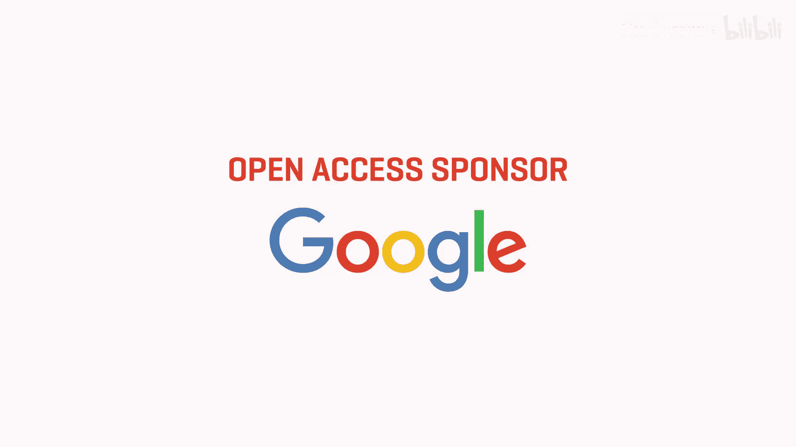

在本节课中，我们将一起探讨SRE（站点可靠性工程）领域一个普遍存在但常被忽视的痛点：值班（On-Call）。我们将基于一项广泛的行业调查和研究，揭示当前值班实践中普遍存在的九个核心问题，并探讨如何通过团队协作和流程改进来应对这些挑战，最终目标是让值班工作变得可持续且不那么令人痛苦。

## 研究背景与方法

上一节我们概述了值班带来的普遍困扰，本节中我们来看看支撑本次讨论的研究基础。为了获得行业层面的洞察，而非仅基于个人经验，我们进行了一项综合研究。

以下是研究采用的方法：
*   **文献综述**：我们回顾了大量学术论文和行业文章，以理解现有的理论和最佳实践。
*   **问卷调查**：我们设计并发布了一份包含65个问题的详细调查，旨在收集一线工程师的真实体验和感受。

本次调查的受访者背景具有代表性：平均拥有18年行业经验，在当前公司工作约4年，通常身处500人以上的中大型组织，其值班轮换团队规模约为5-10人。这为我们提供了讨论行业现状的可靠背景。

## 核心发现：“九个糟糕” (The No-Good 9)

基于研究数据，我们总结出当前值班体系普遍存在的九个主要问题。我们将其称为“九个糟糕”，以便记忆和讨论。接下来，我们将逐一审视其中几个关键问题。

### 1. 入职与培训缺失

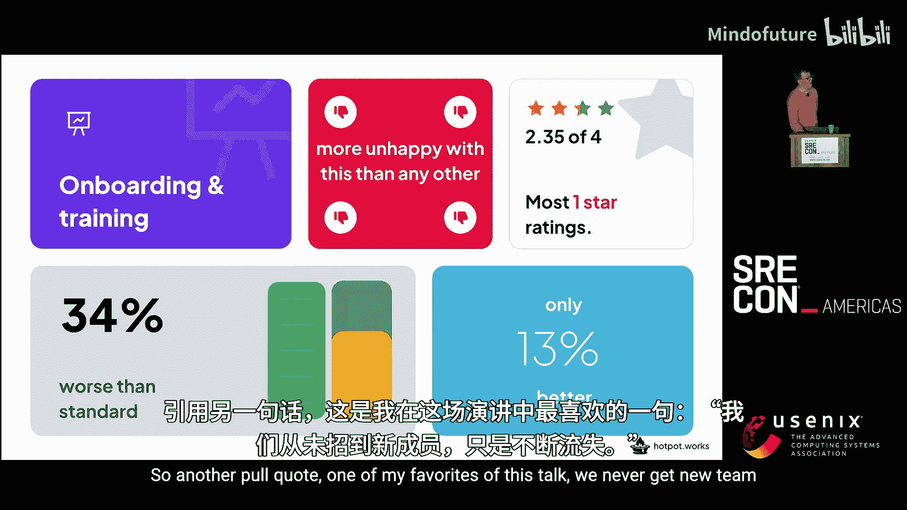

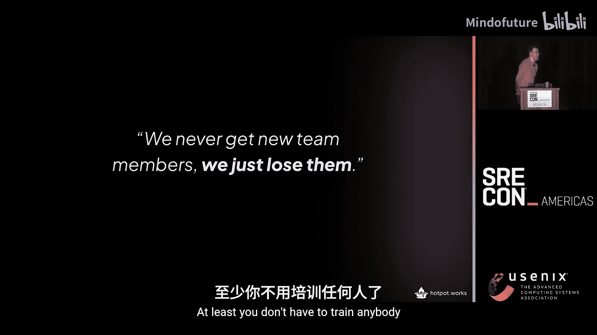

在调查涉及的所有值班相关话题中，**入职与培训**是满意度最低的一项，平均评分仅为2.35星（满分4星）。高达34%的受访者认为其培训比标准水平更差。

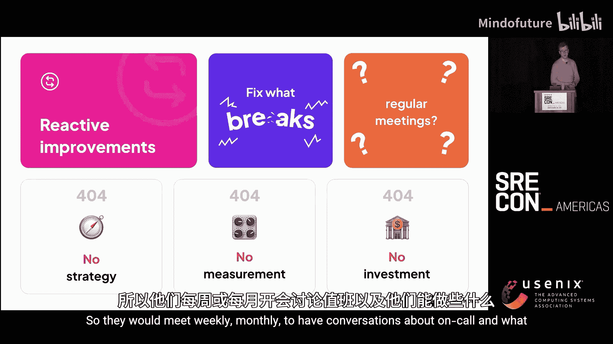

这意味着，许多工程师在未接受充分培训的情况下就被推上了值班岗位。他们可能不了解系统、不知道如何处理警报、不清楚升级路径。正如一位受访者尖锐指出的：“我们从不培训新团队成员，我们只是失去他们。” 这种缺失直接导致了值班时的无助感和压力。

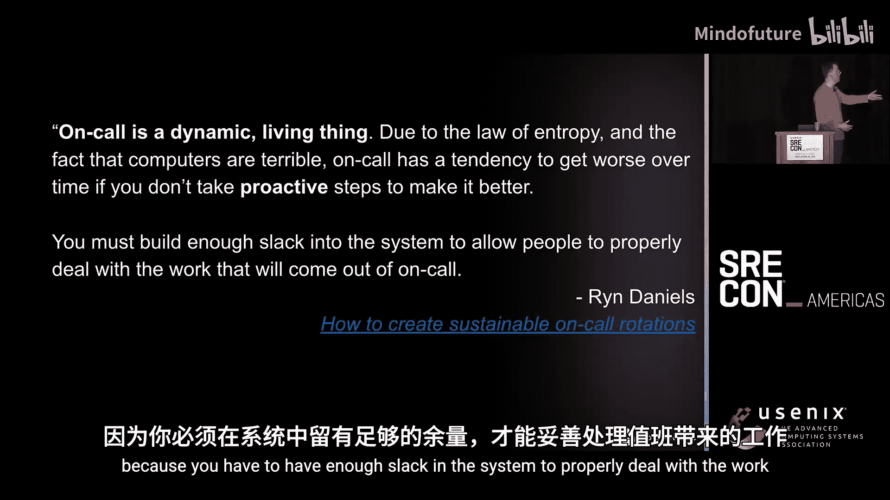

### 2. 仅限被动改进

大多数组织的值班改进策略是纯粹**被动反应式**的。问题出现了，才去修复它。缺乏前瞻性的规划、度量和投资。值班成了运维的“杂物抽屉”——所有不知道该如何处理的事情都被扔了进来。

这种模式无法持续，因为系统熵增是自然规律，如果只被动响应而不主动优化，值班负担只会越来越重。少数表现较好的团队有一个共同点：他们会定期（每周或每月）召开会议，专门讨论值班相关问题和改进措施。

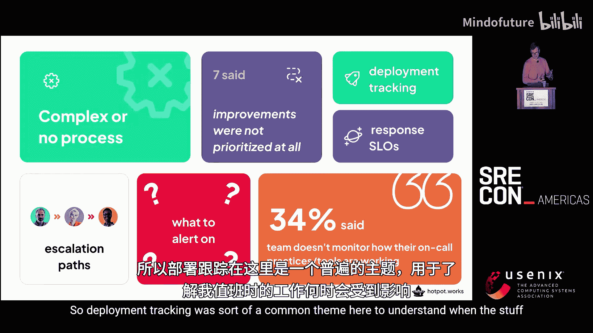

### 3. 缺乏自主权与清晰流程

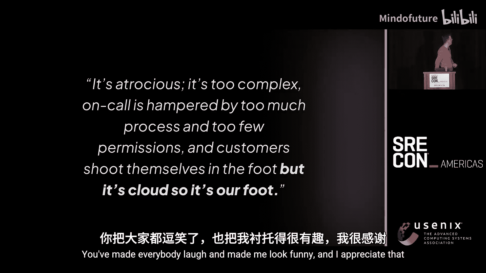

工程师常常感到没有**自主权**去解决他们值班时遇到的问题。20%的受访者表示他们不能或不愿更新警报规则。

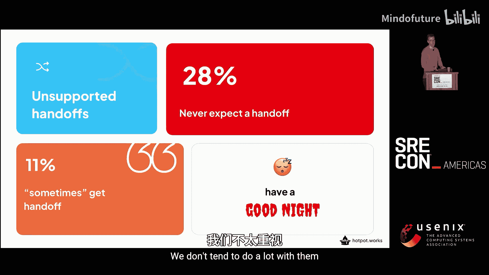

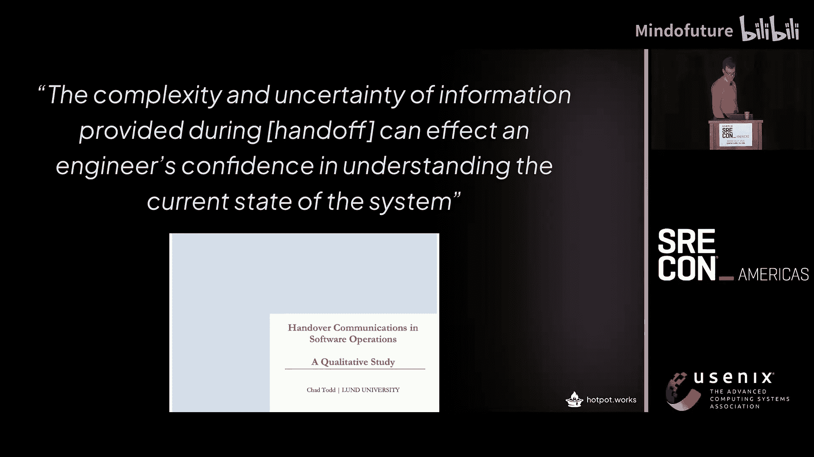

造成这种情况的原因可能包括：没有操作权限、只能将问题升级给他人、利益相关者阻挠变更等。此外，流程本身也常常缺失或过于复杂。34%的团队甚至不监控其值班工具和实践是否有效。关于服务等级协议（SLA）、升级路径、部署跟踪的信息也常常模糊不清，这加剧了值班时的混乱和焦虑。

### 4. 交接流程不受支持

**值班交接**是传递上下文、确保连续性的关键环节，但往往被忽视。28%的人表示他们从不指望能得到交接，11%的人只是有时能得到。所谓的“交接”有时只是一句“给你，晚安”。

研究表明，交接期间信息的复杂性和不确定性会影响工程师对系统当前状态的信心。有效的、有互动的口头交接远比单向阅读交接清单更有价值。

### 5. 值班安排与焦虑

值班**安排**本身也是一个压力源。虽然排班频率（2.85星）和日程管理（2.83星）的评分不算最低，但53%的受访者表示他们有时或总是对即将到来的值班感到焦虑。

这种焦虑在缺乏培训、没有自主权、流程混乱的背景下是完全可以理解的。灵活的排班、对夜间被叫醒次数的关注，以及为生活事件留出调整空间，都能有效缓解这部分压力。

### 6. 责任过载与隐形工作

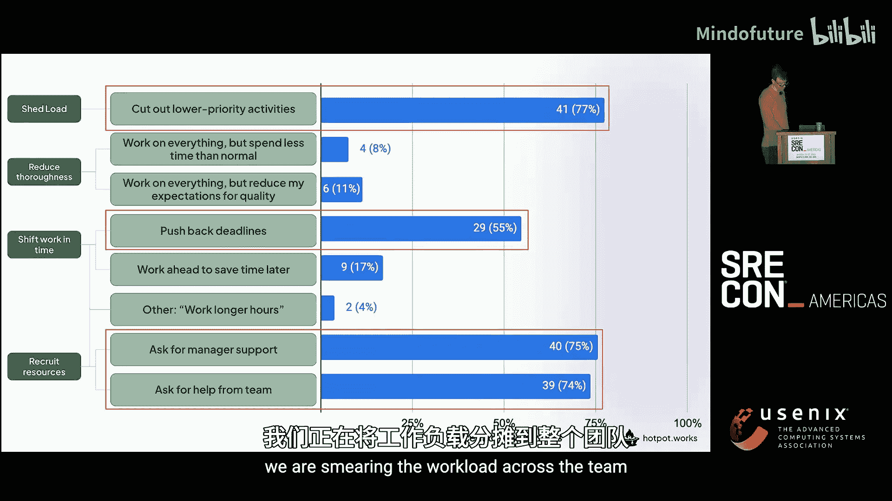

这是最核心的问题之一：值班工程师通常**责任过载**。他们不仅在值班，还在同时进行多项其他工作。

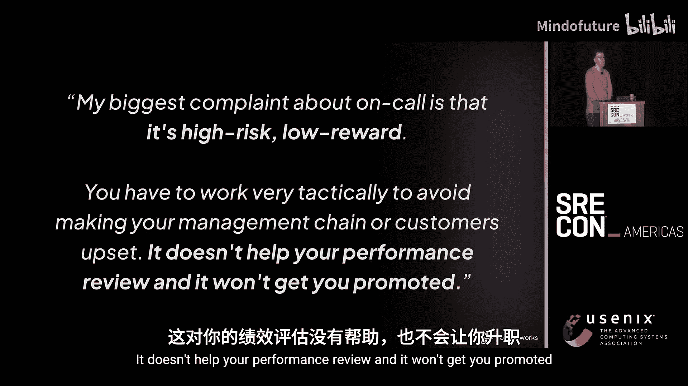

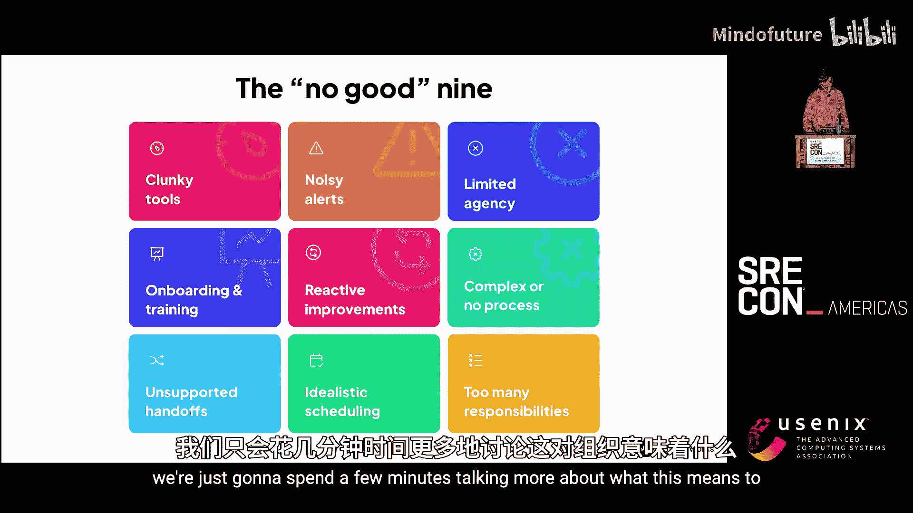

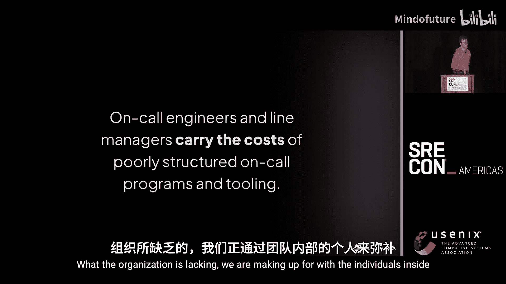

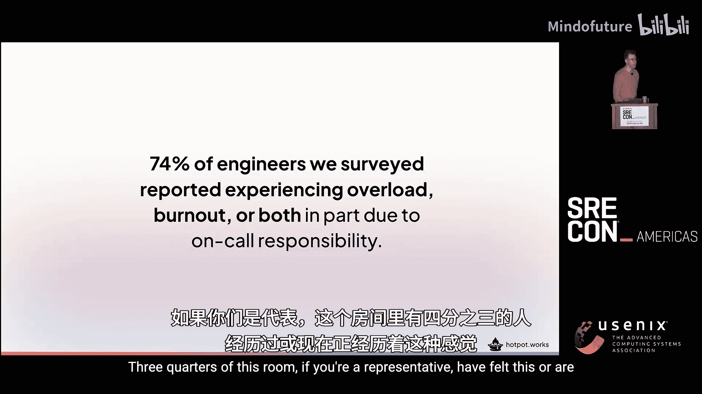

以下是值班期间工程师常需并行处理的其他任务：
*   处理非值班触发的故障（75%）
*   参加会议（75%）
*   处理内外部支持请求
*   帮助团队成员
*   修复缺陷、进行功能开发等“实际工作”

当工作超载时，人体会自然进入“效率与彻底性权衡”模式。调查显示，工程师们最常见的应对策略是：
*   砍掉低优先级任务（通常是那些有趣或主动性的工作）
*   向经理或团队寻求支持（将负担分摊给团队）
*   推迟截止日期

这引出了一个关键矛盾：值班工作至关重要且耗费大量精力（每年可能占用6-8周），但它却常常不被视为“实际工作”，在绩效评估和晋升中得不到认可。这形成了一个“值班厄运循环”：业务压力 > 值班健康被忽视 > 工作超载 > 倦怠与失误 > 压力持续 > 人员流失。

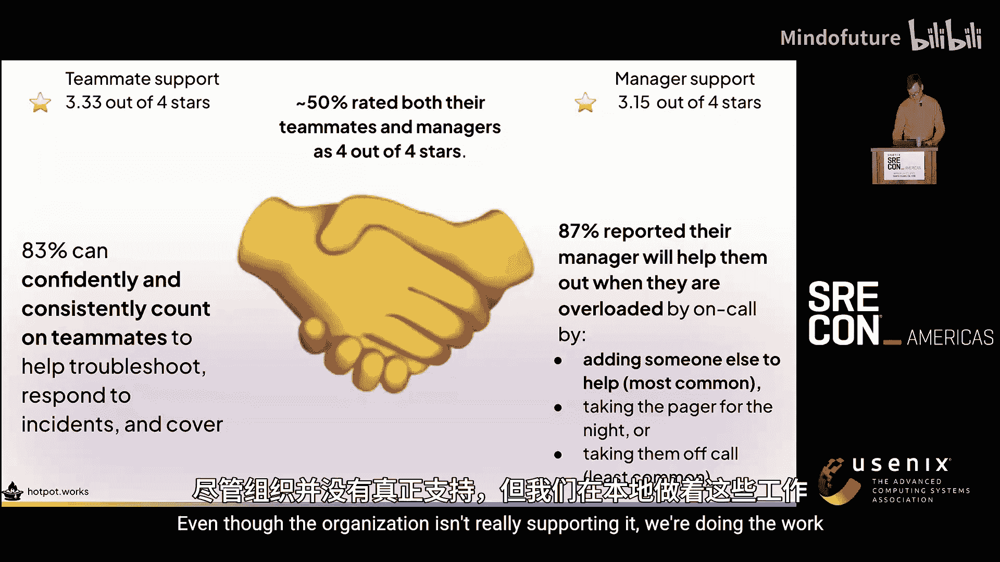

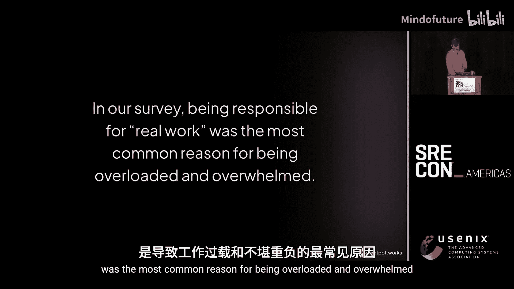

## 影响：团队在弥补组织的不足

上述“九个糟糕”的后果是严重的。74%的受访工程师表示，他们曾因值班责任经历过工作超载、职业倦怠或两者兼有。

然而，在一片黯淡中，我们发现了一线光明：**团队协作**。尽管组织层面支持不足，但团队内部的支持度很高。队友支持评分达3.33星，经理支持评分达3.15星。83%的人可以信赖队友帮助排查问题，87%的人认为经理会提供帮助。

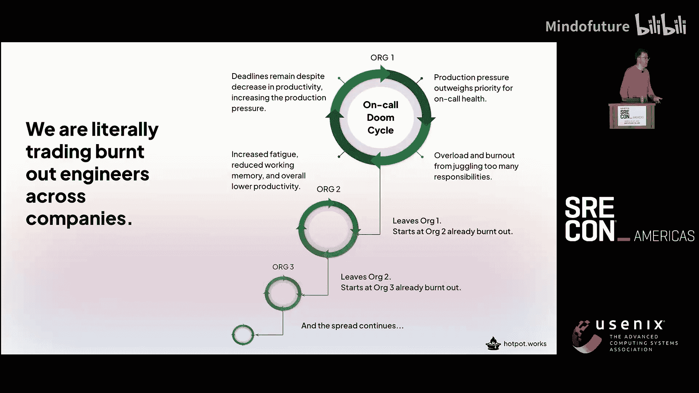

这揭示了一个深刻的事实：**是团队中的人在共同努力，以弥补组织在值班体系上的缺陷。** 他们相互支持、分摊负担，才使系统得以运转。这既是感人的，也说明了问题根源在于系统层面，而非个人。

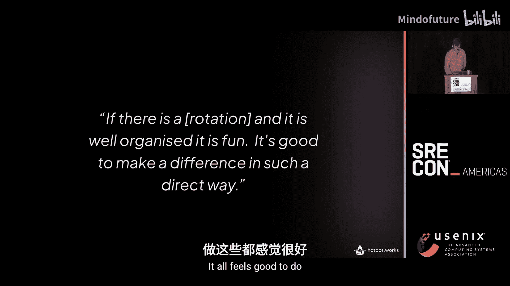

## 行动建议：从“适当实践”开始

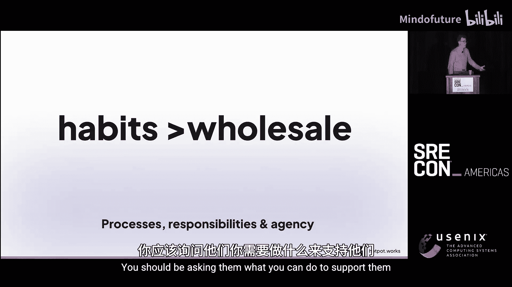

既然我们指出了问题，并看到了团队的努力，那么该如何改进呢？我们提倡关注“**适当实践**”而非空泛的“最佳实践”，并从小而可持续的**习惯**入手，而非追求颠覆式变革。

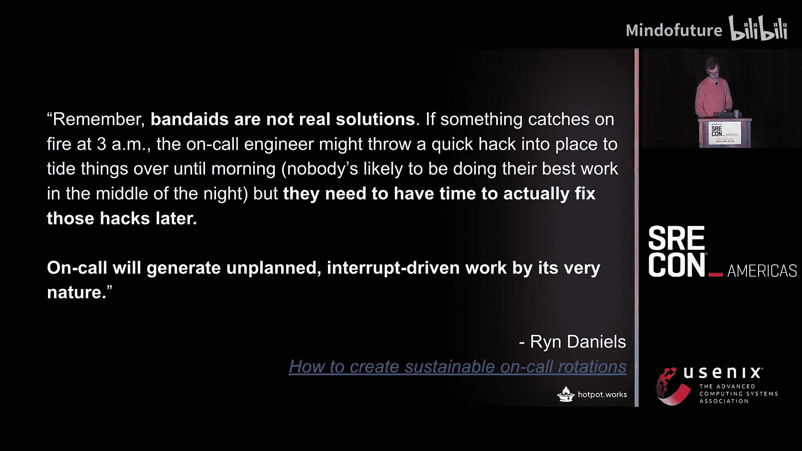

以下是针对部分“糟糕”问题的具体建议：

**针对复杂/缺失的流程：**
*   建立和维护值班手册（Runbooks）。
*   实施指标度量，跟踪值班负载、唤醒次数等。
*   完善发布工程实践，例如避免在无人支持时部署。
*   明确并沟通升级策略。
*   投资可观测性工具。
*   建立风险管理和事后复盘文化，不仅针对故障，也针对值班周期。

**针对培训与入职缺失：**
*   将培训正式化并公开进行。
*   提供正式和非正式的学习机会，如影子跟随（Shadowing）。
*   培训内容不仅包括技术知识，还应涵盖协调协作流程：如何升级？遇到故障时该如何沟通？

**针对值班安排：**
*   尽量保持排班灵活性。
*   提前规划，避开组织重大活动期。
*   监控并设法减少夜间唤醒次数。
*   体谅并照顾团队成员的个人生活安排。

**针对交接流程：**
*   鼓励并规范交接。最有效的是有互动的口头交接。
*   让接棒者主导交接对话，提出他们关心的问题。
*   确保交接是双向对话，而非单向汇报。

**一个核心原则：** 警惕并清理“创可贴式修复”。在凌晨3点为了快速解决问题而采取的临时方案，不应成为系统的长期依赖。必须为工程师留出时间，将这些临时修复转化为稳健的解决方案。

## 总结与未来行动

本节课中，我们一起深入探讨了SRE值班实践中普遍存在的系统性困境——“九个糟糕”，包括培训缺失、被动改进、缺乏自主权、交接不力、责任过载等。我们看到，这些问题导致了广泛的工作超载和职业倦怠，而一线团队正在用自己的协作默默弥补组织的不足。

改变这一现状需要行业共同努力。我们不应满足于现状，而应追求一种更好的状态。为此，我们倡议建立更广泛的行业对话，分享“适当实践”，持续测量值班的影响，并共同探索如何构建更健康、可持续的值班文化。

改变始于认知，进步源于行动。希望本次讨论能为你和你的团队提供一个起点，开始审视并改善你们的值班体验。

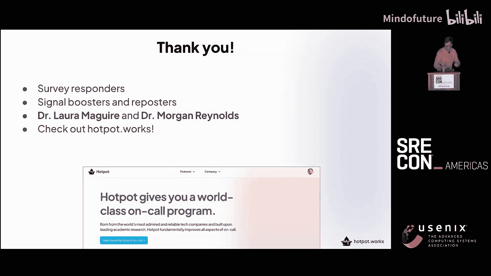

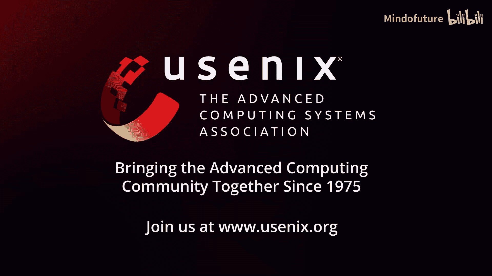

---
*注：本教程内容整理自SREcon Americas 2025大会演讲《“On-Call Is Ruining My Life” and Other Tales about Holding the Pager as an SRE》，旨在提炼核心观点，以更易理解的方式呈现给初学者。所有研究发现和引述均基于原演讲者及其团队进行的调查与研究。*