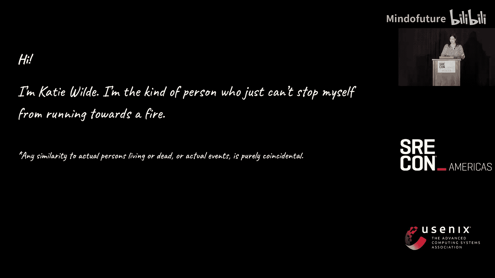
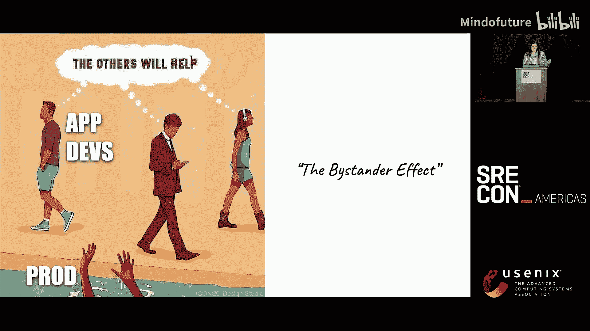
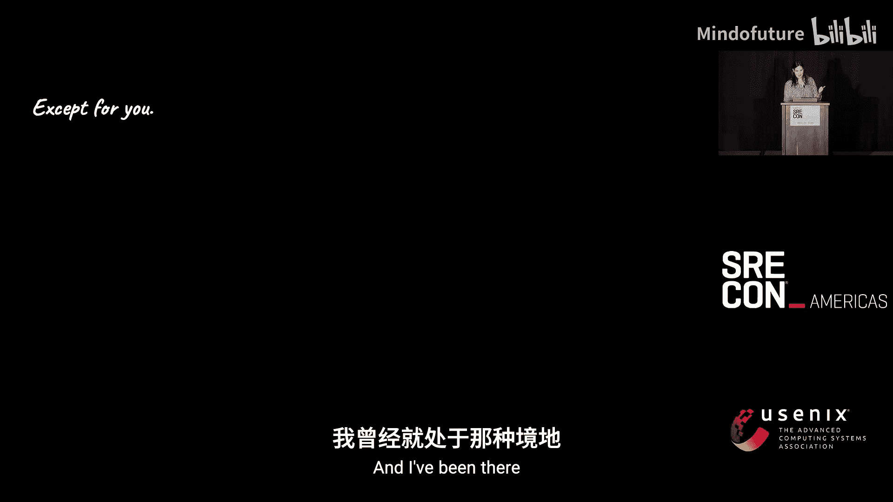
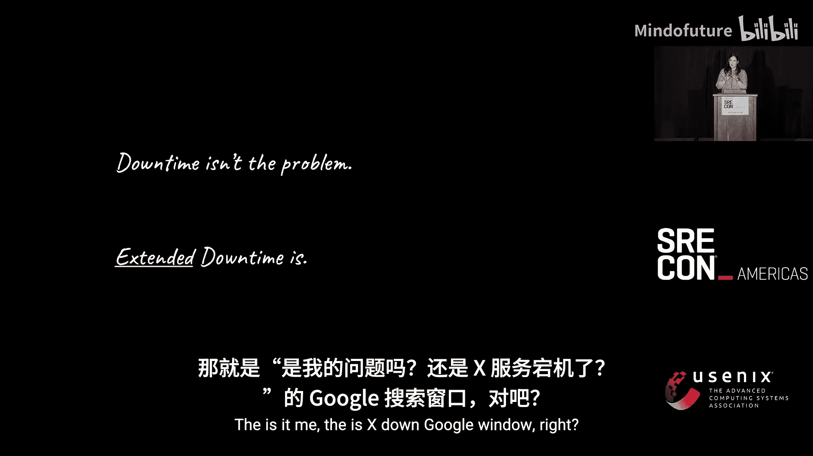
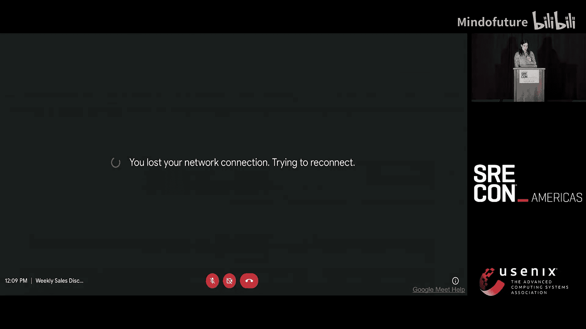
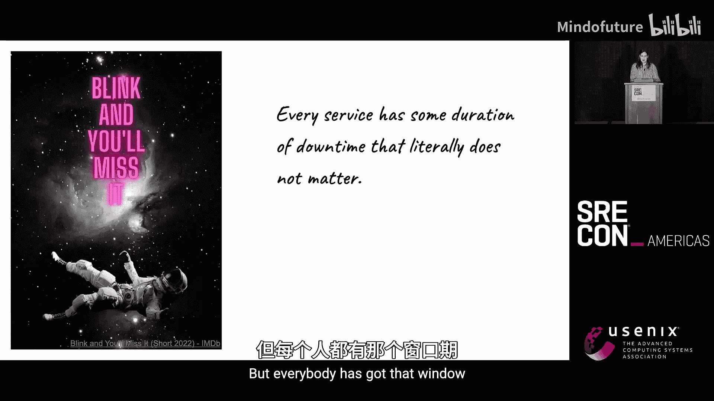
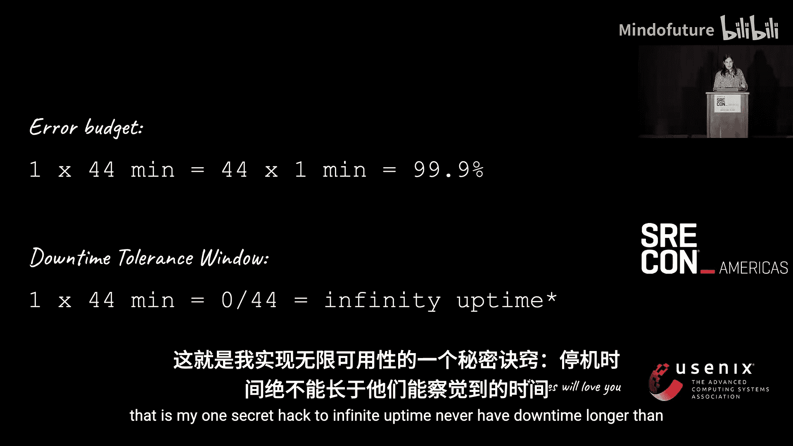
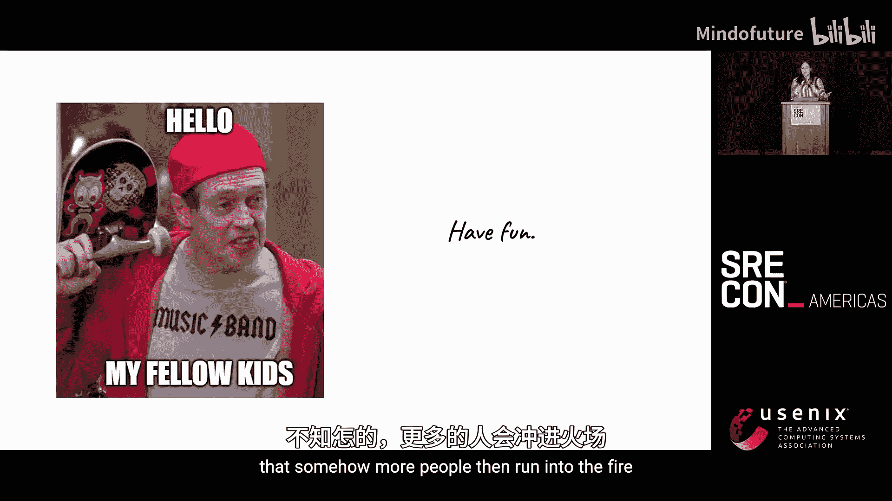
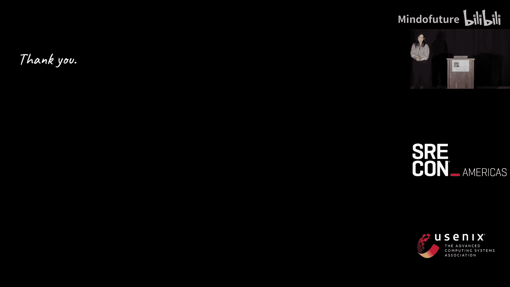
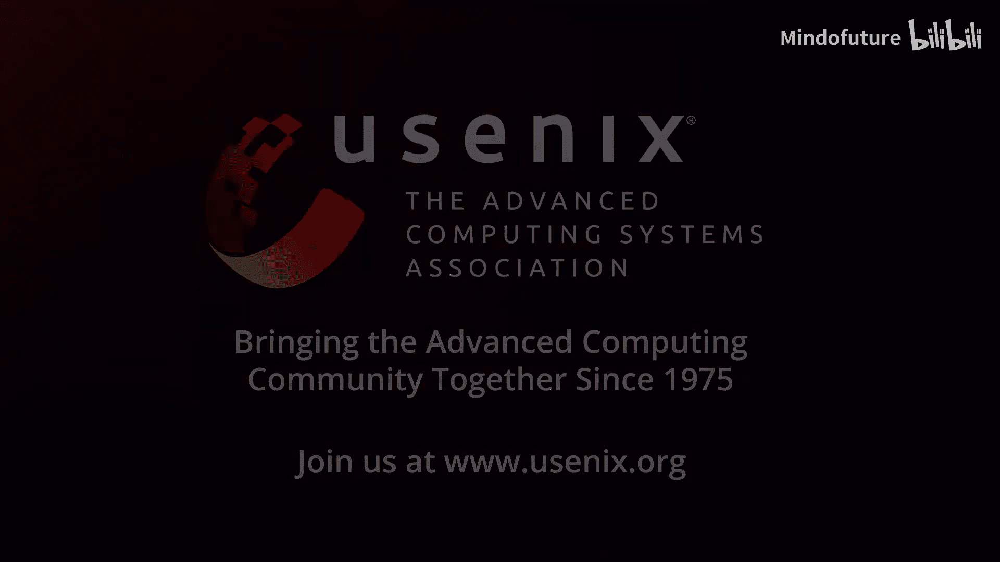

# 016：SRE大会-2025-美洲-｜-SREcon-｜-分布式-｜-缓存-｜-OpenTelemetry-｜-安全-｜-AIOps-p16-P16-The-Perverse-Incentives-of-Reliability--BV1TmLDz7EZZ_p16-

在本节课中，我们将要学习关于SRE（站点可靠性工程）领域中的一个核心挑战：扭曲的可靠性激励。我们将探讨为什么传统的“避免停机”目标可能是一个陷阱，以及如何通过调整策略和激励来更有效地工作。课程内容基于一次SRE大会的演讲，旨在帮助初学者理解复杂环境下的可靠性工作。

## 课程概述：扭曲的可靠性激励

当前，世界变得前所未有的复杂。人工智能的兴起带来了混乱。SRE团队通常资金不足、工作过度，并且在一个“用更少资源做更多事”的世界里，我们作为成本中心，很难维持已取得的可靠性成果。低问责制和高指责氛围越来越普遍，甚至可能产生一种“无法做得更好”的无力感。

## 章节1：问题的核心——无人关心的正常运行时间

我从未对一次会议演讲如此兴奋。我花了很大精力准备这次分享。

首先，快速举手示意一下。有多少人认为，归根结底，SRE的工作就是不惜一切代价避免停机？这是一个陷阱。我知道你们可能这么想，但你们也都知道这是个陷阱。你们太聪明了。

我是凯蒂·怀尔德。我是那种无法阻止自己冲向火场的人。我有时觉得我们成为SRE是因为这份工作比纵火犯收入更高。

这里有一个小免责声明：本演讲内容与任何在世或已故的人物或实际事件的相似之处纯属巧合。

我是一个“动词”型的人。我的动词是“冲入火场”。事实上，我学习过宏观经济学，现在我对一切事物都如此复杂和混乱感到非常兴奋。

好了。你们可能都认出了我们最喜爱的SRE正能量视频的开场。如果不认识，这里有一个链接。但当前的宏观经济背景是，世界比以往任何时候都更复杂。人工智能的“硬度”正在引发混乱。没人在乎SRE。我们像往常一样资金不足。我们过度工作，这是我们自己造成的，但我们停不下来。我们试图用更少的资源做更多的事。很难维持我们已经取得的可靠性成果。我们非常担心情况会变得更糟。我们可能是对的，因为我们通常都是对的。低问责制、高指责的氛围变得越来越普遍。这是你们告诉我的，我也看到了。还有一种冷漠感，一种“也许不可能做得更好”的感觉。这很艰难，因为在一个资源稀缺、追求“用更少资源做更多事”的世界里，我们是一个成本中心。在一个也痴迷于尽可能快地添加生成式人工智能的世界里，作为成本中心很难。那么，我们该怎么办？

## 章节2：扭曲的激励与“旁观者效应”

所以，在我想到“伦纳德·伯恩”这个标题之前，我演讲的标题谈到了我们拥有的激励、支配我们所在组织的激励，以及它们为何不好（技术术语是“扭曲的”）。为什么会这样？问题是，**在停机发生之前，没人在乎正常运行时间**。没人会说：“干得好，SRE，系统正常运行，做得好。”也许你的团队会，但……你们在招人吗？他们只有在没有正常运行时间时才会注意到、才会在乎，然后他们会生气，并且这是你的错，因为你搞砸了。

你所做工作的后果是严重延迟的。你正在做的事情，将在未来一段时间内逐步提高基线可靠性。未来还没到来，因为时间就是这样运作的。这对你来说很困难。应用程序开发人员（App Devs）有强烈的动机去避免这整个戏剧性场面。我们稍后会讨论原因。另一件事是，SRE们大多在事情真正搞砸时才被看到。这是巧合吗？如果你知道如何向经理解释虚假相关性，请来和我谈谈。我不知道怎么做。是的，所以你只在情况非常糟糕时看到我们。所以，是的，这不太好。

所以，不仅仅是埃隆·马斯克，我们在整个行业的董事会和Zoom会议室里都能看到这张幻灯片。

我认为最令人担忧的部分是，关于这是否是个好主意的共识仍然存在分歧。很多人没有把这些事情联系起来。我不知道为什么，但这就是我们生活的世界的事实。所以，这就是我们的处境。这就是长期运作的方式。凯恩斯有句名言：“长期来看，我们都死了。”他绝对可能是在谈论SRE。事实上，我们长期都会死，他只是不在乎。他会说：“但我会死，所以我反正也不会在乎。”另一件事是关于应用程序开发人员。为什么你们不做得更好？为什么不来帮我？生产环境宕机了，你的小部件不工作了，而他们只是“啦啦啦”地走开。有人会说：“哦，我看到我的文本写着‘别人会行动’，别人会……我们就假装我没说过。”我的意思是，我们知道如果情况真的很糟，值班的SRE会被呼叫，对吧？这通常是真的，事情就是这样运作的。因此，大多数理性的人会非常努力地远离任何类型的事件。这在技术上被称为 **“旁观者效应”** ，这是对人类本性的一个基本发现。只要人数超过三个左右，它就会适用。就像“你要帮他吗？也许应该有人帮他？”这就是人类的工作方式。

所以，这些不帮助你的应用程序开发人员，他们只是对自身激励做出反应的理性人类。他们的激励是逃离火场。他们只是在这么做。

## 章节3：SRE的困境——为何我们与众不同

除了你。谁把你弄成这样了？是的。因为你不是旁观者。我的意思是，你在这里，在这个房间里。你在听我讲，你在听伍兹博士讲，因为你就是不能眼睁睁看着一切烧毁。你会说：“我们必须做点什么。”也许，也许你最终自己做了很多，你知道这有毒，但你忍不住要拯救这一天，毕竟，我们了解这些应用程序。

那么，我们该怎么办？

我曾经历过，我有那件T恤。非常字面意义上的。他们给我寄了一件T恤，以纪念我未能创建一个可扩展的运维团队。就像在说：“干得好，你仍然自己在处理事件。”我心想：“靠。我失败得太惨了。我需要做点什么。”好吧，那么“如何不成为我”可以作为本次演讲的另一个标题。我会告诉你几个我做过的事情，它们主要是浪费了我自己的大量时间和精力。

## 章节4：传统方法的陷阱——名词思维与安全网

首先，我们应该做点什么。系统地，我们不应该接听每一个告警页面。凯蒂，我们应该建立一个能建立系统的系统，等等，等等。当然，我们从哪里开始呢？我们衡量变化，对吧？我们需要了解我们各项举措的投资回报率。所以我们需要知道我们所有的指标是什么，我们需要某种非常强大的测量工具，因为我们希望这是准确的。然后我们就去做，然后我们就能够确定优先级，比如该做什么。好吧，兔子好像在问：“你在下面还好吗？”因为问题是：**你不需要确切知道你的平均修复时间（MTTR）是多少，就能知道它很糟糕**。我们可以把它标为红色。通常，我们大致知道什么是不好的。这同时也是你作为一个“名词”型人的表现，我们知道这不好。我们稍后会读论文，但我们暂且相信这是不好的。好的，好的，所以我明白了。我陷入了分析瘫痪。让我，让我行动起来。有很多故障，其中大多数是由变更引起的。我们知道这一点。这对所有事情来说都是微不足道的真理。所以，太好了。我将防止故障影响到生产环境。

我的意思是，好吧，兔子戴上了安全帽。这很好。防止故障影响到生产环境并不是一件坏事。而这就是问题所在。你们都是非常聪明的人，不会做明显愚蠢的事情。你们做的是应该做的好事。但你们只是不应该去做。这就是你们的问题。因为你可以花费大量的时间和精力来制作你的巨型安全网，而应用程序开发人员就像在走钢丝（他们自己并不知道），而你却在制作安全网。你设置了“绿色即推送”，你拥有所有的自动化，你在预生产环境运行合成流量，你设置了邪恶的预演环境。你做得很好。这很可爱。但问题在于，你没有足够的人手。这种“名词”型SRE方法的问题是，你将需要一个至少三倍于当前规模的SRE团队。我知道你尝试过，因为我是你，我也尝试过。你告诉过领导层和其他所有人，他们应该关心。就像“我们应该做这个，你应该关心，因为我关心。”很好，他们可能不在乎。此外，你还做了很多幻灯片，说明SRE是多么重要，如果我们有安全网来接住我们那些走钢丝的应用程序开发人员，那么他们犯更多错误也没关系，这很重要，所以我们需要10倍多的SRE和更多的预算，多得多。你还写过宣言，说应用程序开发人员也应该关心，应该做得更好，还有，如果你们能别写那么烂的软件，也许有时测试一下，那就太好了。是的，我也尝试了所有这些事情，这就是我最终得到那件T恤的原因。

我逐渐意识到：**停机本身并不是问题**。你可能对防止停机感到非常兴奋，因为这很有趣。但停机不是问题。正如伍兹博士所说，混乱是不可避免的，而且“龙”并没有变得更温顺，对吧？此外，停机是一个名词。这不是我定的规则。停机不是我们的问题。**长时间的停机才是我们的问题**。现在你可能会说这两者是一回事，你在咬文嚼字，有什么区别？区别在于：存在一个机会窗口，一个宽限期。多长的停机时间是可以接受的？是我的网络问题吗？哦，我这里信号不太好。让我重新运行那个任务，那个窗口。我们知道这个窗口。“是我吗？”那个“X网站宕机了吗？谷歌一下”的窗口，对吧？

你可能不介意那张幻灯片。我对这次演讲本身就有停机容忍窗口，对吧？所以，事情是这样的：**如果他们没注意到，那就没关系**。对于你的系统，存在某个持续时间的停机是可以接受的。那是一段没人会在乎的时间，因为他们正试图弄清楚是他们自己的问题还是你的问题，你处于那种“这是谁的问题”的模糊地带。好的，这就是我们必须利用的。这就是答案。你有一个某种类型的停机容忍窗口。所以你必须找到这个数字。如果你做高频交易，我帮不了你。这次演讲不适合你，希望他们能为所有人提供充足的SRE资金。对于其他所有人，都有一个窗口，也许是几秒钟，也许是几个小时，也许是几天，也许是某种每周运行一次的报表任务，只要它在一周内运行就没事，对吧？但每个人都有那个窗口。

你需要知道它是什么。现在，**这不是你的错误预算**。这非常重要，对吧？错误预算基本上是说，你知道，一次44分钟的故障和44次1分钟的故障，对于99.9%的可用性来说是一样的，因为数学，因为它确实是一样的，对吧？是的，这是真的。这也是一个错误。这是我们跌倒的地方。**停机容忍窗口是实现无限正常运行时间的方法**。因为假设你的用户没有注意到一分钟的停机，那对他们来说，一分钟和零分钟是一样的，因为他们没注意到，就等于没发生。所以你有0除以44，数学上是无穷大。现在，这就是我实现无限正常运行时间的一个秘密技巧。

**永远不要让停机时间超过他们能注意到的时间**。基本上，就像这样，是的，如果网站宕机了但没人注意到，我们就没事。我发现当销售人员谈论100%的正常运行时间时，这曾经让我发疯。我会想：“你想要什么？星际故障转移吗？你根本不懂你在说什么。”现在我想：“哦！你只是希望停机时间短到客户不会对你尖叫。我们也许能做到。”这也比星际故障转移便宜得多。所以，嘿，赢了。好吧。所以你的使命是：**确保你的缓解时间、你的服务恢复时间在你的停机容忍窗口之内**。我想指出，这不是一个静态值，这是一个你必须不断平衡的方程。这是一件非常“动词”的事情，就像你必须不断做这件事。那个停机容忍窗口，是一个不断演变的情况。你知道，在拨号上网的时代，它相当长，因为你会想：“是我的电话线被拔掉了吗？是我的猫……哦，比如，你知道，朱迪可能正在打电话。”它曾经更长，现在变得更短了，这是一个不断演变的情况。但你必须不断地平衡这个方程，这就是你努力的方向。没有一个静态的最终状态会告诉你“恭喜你，你获得了奖杯”。你只需要继续前进。**赢得这场游戏是一个过程，而不是一个结果，因为这是一场不会结束的游戏**。你选择玩下去。

## 章节5：可行的缓解策略——动词思维实践

但这其实是个好消息，因为我们实际上有很多技术。比如，回滚。我们可以再试一次。所以我不打算深入探讨所有你可以投资的通用缓解措施。我的观点是：**你应该优先考虑通用的缓解措施，而不是所有其他我浪费生命去做的事情**。你应该做得更好，你不应该成为我。所以，回滚。同样，你需要不断确保这确实有效，你必须定期进行回滚。如果你不这样做，你就没有回滚。有趣的事实是，你不想在需要的时候才发现它不起作用。

你可能从我的口音听出我不是本地人。即使我回家，每个人也都这么问我。我来自南非，我们在无法满足需求时，非常擅长降低服务质量。所以我们有这种全国性的“减载”做法，当电网无法供电或我们无法向电网提供足够的电力时，我们就会“减载”。这很棒。令人惊奇的是，我们选择对象，选择时间，我们努力做到公平，我们尽量不对医院这样做。我的意思是，如果南非政府都能想明白，你也能想明白。**你应该进行负载卸载**。我现在住在加拿大，所以我做公开演讲时，法律上要求我必须提一下蒂姆·霍顿斯，否则我可能会失去公民身份。所以，是的，就像直接扩容，让它更大，直接砸钱。这并不免费，它很昂贵，但可能值得。但同样，这就像一个正在运行的实践。如果你不经常进行扩容和缩容，你会遇到各种各样的问题，你会知道的。就像水流过管道，你不能只把一根管子变大，然后指望不会混乱，你必须经常练习这个。但是，是的，就让它更大。在你弄清楚发生了什么之前，直接砸钱直到问题解决。这是你应该经常做的事情。

最后，你应该在你的工具箱里有这些东西。你应该能够阻止一个用户或一个查询，你应该能够隔离，你应该能够引流，你应该能够做所有这些事情，以便快速缓解情况。同样，你要确保你正在这样做。“用进废退”是这里的基本思想。你不能只是把它设置好一次，然后就说“我完成了，这是我的漂亮名词”。因为当你需要它时，它不会在那里为你服务。你必须不断检查它，确保它有效。

## 章节6：获取资源与盟友——利用贪婪与恐惧

好的，你可能会说，是的，我们可以做这些项目。但是凯蒂，我们仍然有问题。我们仍然需要钱。说实话，我们也需要爱。实际上有一个爱尔兰乐队叫“爱与金钱”。你需要这些家伙，他们的音乐不怎么样。但我的意思是，是的，你需要保持有酬就业，而不是像我一样失去理智。我理解这一点，这当然是真的。你可以做很多伟大的工作，但如果你被解雇了，那就不会发生。所以是的，你仍然需要钱，你仍然需要爱，而且你值得拥有。我们如何得到它？好吧，有一个方法。人类行为的方式是贪婪和恐惧。这是我们两个主要的驱动力。我们想远离坏东西，走向好东西，对吧？当这两者起作用时，我们就会移动，从坏处移向好处。这就是我们所做的。这就是进化。所以，贪婪和恐惧，我们如何利用这个来为我们自己获得爱和金钱呢？这稍微取决于你是在企业对企业（B2B）的世界，还是在消费者对软件即服务（B2C SaaS）的世界。你的贪婪和恐惧目标有点不同。但如果你在企业世界，**你想和你的企业销售团队以及法务部门交朋友**。因为企业销售是关于我们如何达成和续签这些支付大量资金的企业交易，同时不被起诉。现在，律师们担心：“我们会被起诉吗？有人说了起诉吗？我们应该……等等，让我们锁定这个。”所以你要确保你正在与你的销售团队交朋友。他们理解“企业就绪”、“卓越运营”等等，所有这些我们都可以销售的东西，人们会为此付费。现在他们就像：“哦，这很令人兴奋。我们喜欢这些SRE人。”而法务部门会说：“嗯，我们能在服务积分上节省多少钱？什么是主服务协议（MSA），它说了什么？如果我们因为没做到而被起诉会发生什么？”哦，现在他们非常担心。现在他们就像：“哦，我的天哪。”而你就像：“我们完全可能被起诉，因为SRE就是我和我的朋友在一个悲惨的法庭上。”不管怎样，现在他们就像跑向CEO：“哦，救命，好吧。”

而在一个消费者对客户（B2C）的SaaS公司，你通常没有庞大的销售团队和庞大的法务团队。但你有产品经理。你的产品经理真的很想确保功能小部件有参与度，并且当结账功能出问题时他们不会亏钱。这些实际上都是可靠性指标。我们只需要做一些翻译。你还有支持团队，他们会说：“拜托，当一切都坏了的时候，所有这些工单太可怕了。”所以你和他们交朋友。然后事情是这样的：你不需要自己去要钱。你那些有点贪婪、有点焦虑的朋友会为你争取到。

## 章节7：改变开发人员文化——从逃离到参与

如果你像我一样，你可能会想：“但是那些应用程序开发人员呢？”因为如果他们只是继续制造混乱而不在乎，那一切都毫无意义。这也是真的。你可以做很多事，你可以有很多盟友，但你一个人不够。你仍然需要更广泛的可靠性文化，需要从事件中学习，你需要编写代码的人在乎。但他们有动机逃跑，记得吗？因为那就像一场火，他们不想靠近，因为他们是理性的。我们（SRE）是“坏了”的，他们在逃跑。我们如何让他们跑向火场？好吧，事实上，我找到了两个技巧，我非常兴奋。第一个是 **“侦探刷”** 。他们是工程师。他们是好奇心很强的人。当东西坏了，就像“是谁干的？”就像“Wasm代理插件发生了什么？我们用了Wasm。我想在场。”这确实有效，非常令人兴奋。另外，有人说“简历开发”吗？因为如果你能指出，理解一个系统如何崩溃是理解系统设计总体上的好方法，而这是你职业阶梯的一个组成部分。如果你能帮他们把这些点连起来，突然之间，他们会感兴趣得多。

第二个是：**你必须赢得人们的注意力**。你可以强迫他们给你时间，但你不能强迫某人给你他们的注意力。就像尊重一样，必须赢得它。所以你必须像这样：“我们是SRE。每个人都想和我在一起，想成为我，想成为我。”你必须体现这种氛围。那么我们怎么做呢？第一件事是保持友善，即使你真的告诉过他们是这样，即使他们在凌晨三点呼叫你，让你像读睡前故事一样给他们读手册，即使他们不友善，你也要友善。第二件事是，找点乐子。我真的很喜欢在我的事件复盘会议上播放音乐，我试着把歌曲和事件配对起来。人们试着猜事件中发生了什么，以及这怎么会和碧昂丝有关。这很有趣，我发现在这种“燃烧”的情况下我享受自己，而这种快乐是具有传染性的，不知何故，更多的人会跑向火场。

所以，谢谢你们。你们也很有趣。

## 总结

在本节课中，我们一起学习了SRE领域中的“扭曲激励”问题。我们认识到，单纯追求“零停机”是一个陷阱，真正的目标应该是将服务恢复时间控制在用户能容忍的窗口内。我们探讨了如何从“名词”思维转向“动词”思维，通过实践回滚、负载卸载和流量控制等通用缓解策略来动态平衡可靠性。我们还学习了如何利用组织内的“贪婪与恐惧”（如销售、法务、产品、支持团队的诉求）来为SRE工作争取资源和盟友。最后，我们讨论了如何通过激发好奇心（侦探刷）和营造积极、有趣的氛围来改变开发人员文化，让他们从事件的“旁观者”转变为积极的参与者。记住，赢得可靠性是一场持续的过程，而非一个静态的终点。