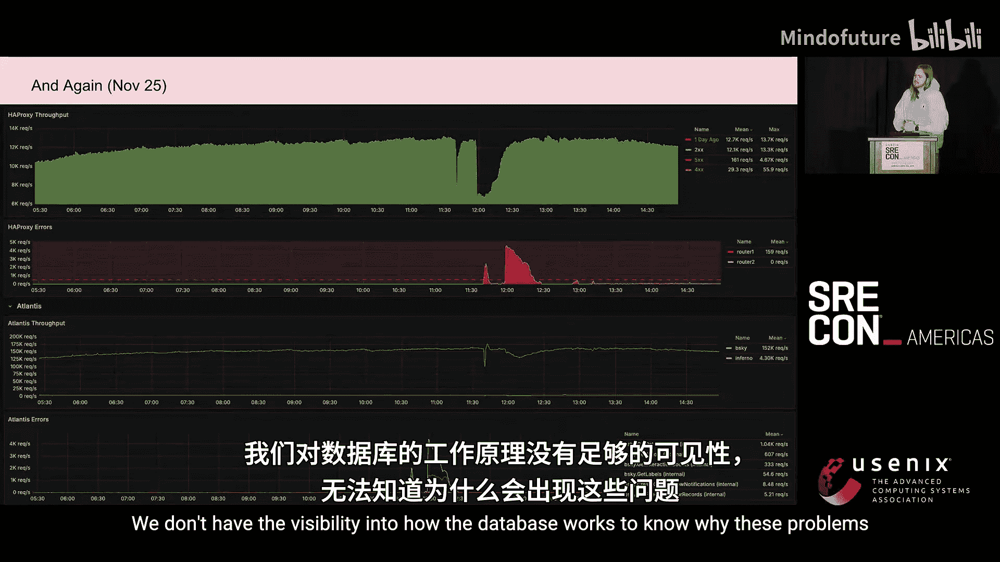
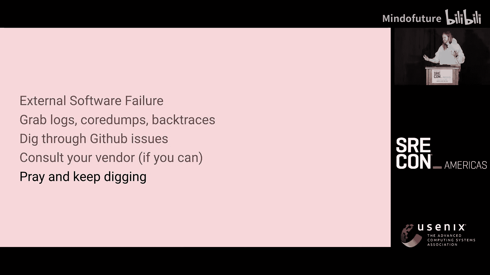
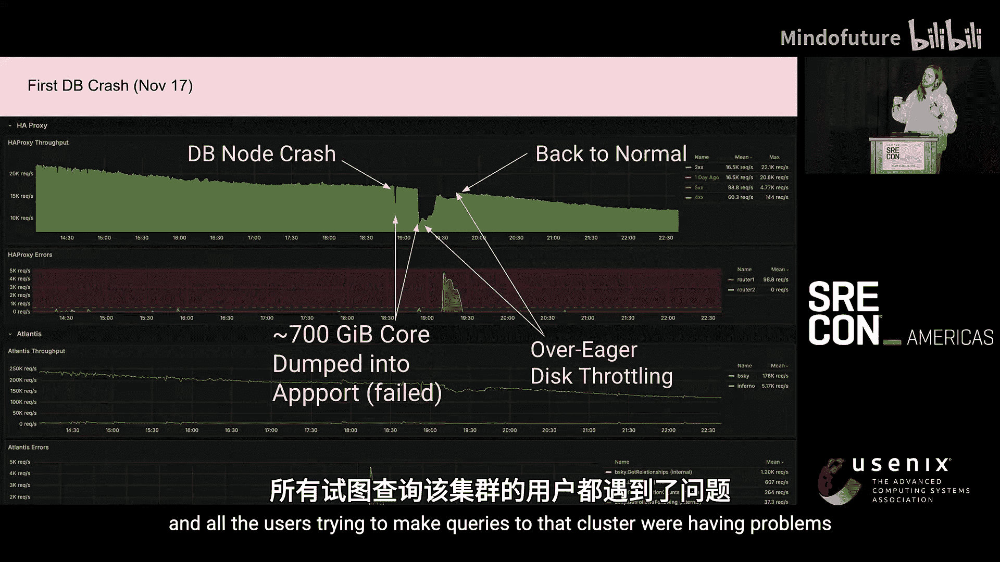
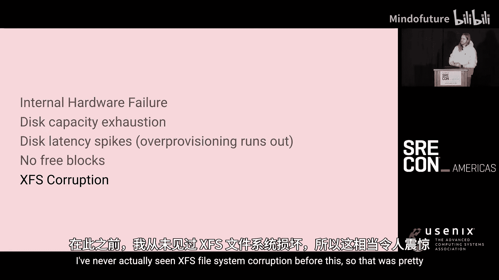
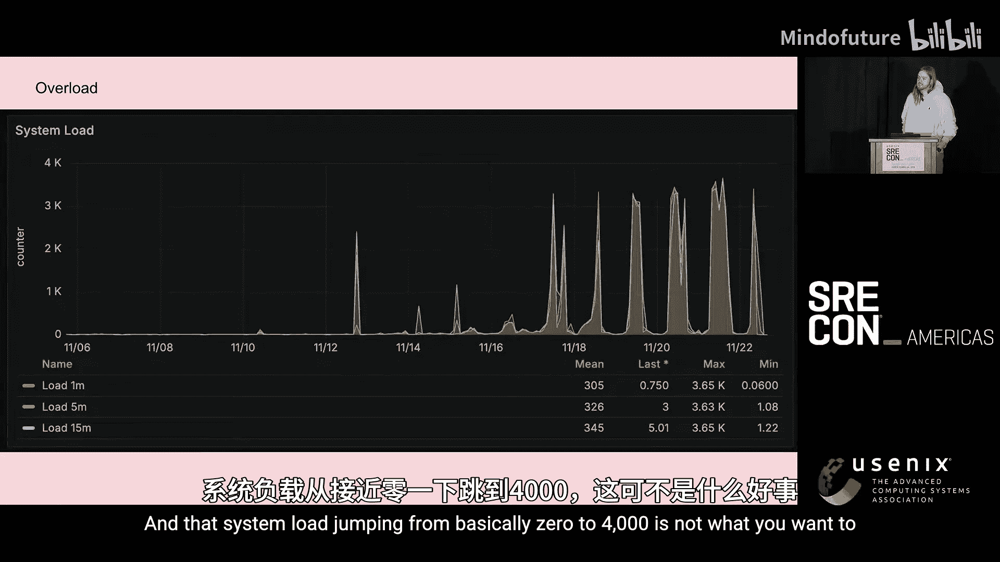
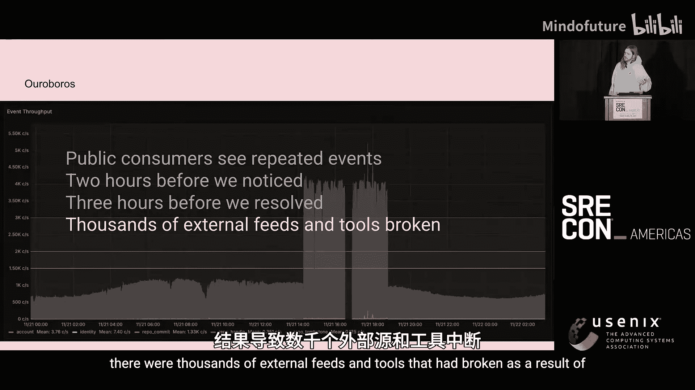

# 017：如何在风暴中成熟你的数据架构——Bluesky的生存故事 🚀


在本节课中，我们将跟随Bluesky团队的Jazz，回顾他们在11天内用户量激增10倍的极端压力下，如何应对一系列复杂的系统故障，并逐步成熟其数据架构。这是一个关于韧性、快速决策和架构演进的真实案例。

## 1. 背景与挑战：风暴来临前的平静 🌊

大家好，我是Jazz，来自Bluesky团队。我们是一个约21人的团队。大约两年前我加入时，用户量约为10万。如今，我们的用户已超过3300万，在极短的时间内经历了爆炸式增长。


我们的系统运行在裸金属服务器上，这意味着容量基本固定。那么，如何应对固定容量下10倍的增长呢？

## 2. 风暴时间线：识别四种故障模式 ⚡

在本次超大规模事件中，我们经历了四种故障模式。理解这些模式是解决问题的第一步。

以下是四种故障模式及其特点：

1.  **可控软件故障**：自己编写的软件出现问题。相对容易修复，只需部署更好的代码。
2.  **不可控软件故障**：第三方或开源软件出现问题。修复难度大，需要联系供应商或深入研究。
3.  **可控硬件故障**：自有硬件（如磁盘、节点）故障。虽然麻烦，但可以自行更换解决。
4.  **不可控硬件故障**：外部依赖的硬件（如运营商光纤）故障。最令人无奈，通常只能等待供应商解决。

我们的流量峰值从每天5000次请求/秒飙升至超过50000次请求/秒。低谷时的流量也超过了历史峰值，这意味着我们全天24小时都处于高压状态，没有安全的维护窗口。

## 3. 实战案例一：外部硬件故障与失败的容灾 🌐

我们首先遭遇的是不可控硬件故障：数据中心的光纤被切断。当时我们在该设施是单线接入，无法快速切换流量，导致约50%的用户无法访问。


我们决定将流量故障转移到另一个数据中心。然而，这次转移并不顺利。

转移后约五分钟，我们的数据库缓存被彻底击穿。热分片（存储热门数据的分片）的负载翻倍，而我们的缓存架构无法应对这种突发压力，导致所有用户都受到影响。我们不得不回滚操作。



**我们学到的教训是**：在事故中，不做决定有时比做错决定更糟。果断很重要，但必须权衡“不作为”的成本与“尝试”的风险。我们之前在小规模下测试过容灾，但在10倍流量下这是第一次，结果我们学到了艰难的一课。





对于此类外部故障，我们能做的是：联系供应商、向用户致歉、更新状态页。更重要的是，**优先实现BGP配置的双线接入**，让冗余系统真正发挥作用。

## 4. 实战案例二：不可控软件故障与数据库自限流 🗄️

在读取路径上，我们遇到了由开源数据库引起的不可控软件故障。一个数据库节点崩溃后，重新加入集群时引发了长达30分钟的严重性能下降。

我们当时缺乏足够的可见性来理解数据库内部发生了什么。我们收集日志、核心转储，在Github上搜索类似问题，在恐慌中试图找出原因。

**问题根源是**：节点崩溃时尝试生成一个700GB的核心转储失败。重启后，它需要追赶上千万条写入操作。虽然我们使用了NVMe硬盘，但数据库错误地认为自己可用的IOPS（每秒输入输出操作次数）很少，从而进行了**激进的自我限流**。这导致整个集群超时，而不仅仅是该节点有问题。

此外，当时我们只有一个大型数据库集群承载所有工作负载，其中一个高写入负载的服务成为了“吵闹的邻居”，加剧了问题。最终，我们在一个非常详细的监控面板中发现了自限流的迹象，并通过调整配置告知数据库真实的IOPS能力解决了问题。

## 5. 实战案例三：可控硬件故障与“消防水管”过载 🔥





在写入路径上，我们遇到了可控硬件故障。Bluesky有一个公共事件流（Firehose），允许外部订阅。当写入吞吐量增加时，广播这些事件带来了巨大的扩展性挑战。

我们的“中继”进程负责聚合和广播事件流。它从单机单进程运行，在流量激增下不断崩溃，导致网络上的写入延迟高达8-10秒。

**问题根源是硬件层面的**：
1.  **磁盘空间耗尽**：数据压缩例程跟不上写入速度，磁盘被填满。
2.  **NVMe延迟飙升**：持续高强度的写入耗尽了SSD的**预留空间**。垃圾回收器无法跟上，导致写入延迟从几百微秒暴增至几十毫秒。公式上可以理解为：
    `实际写入延迟 = 基础延迟 + 垃圾回收排队延迟`
    当垃圾回收跟不上时，排队延迟急剧增加。
3.  **文件系统损坏**：在机器生命末期，我们甚至遭遇了罕见的XFS文件系统损坏。

系统负载从接近0飙升至4000，这是机器“极度痛苦”的信号。

**我们的应对策略是多管齐下**：
1.  **切换至低负载架构**：启用一个已搁置8个月的“非归档中继”方案，减少磁盘I/O。
2.  **卸载服务子组件**：将广播流量分流到另一台机器。
3.  **启用热备硬件**：用备用机器承载新服务。
4.  **团队分工协作**：将不同任务分给不同成员，在2-3小时内并行解决。


## 6. 实战案例四：内部软件故障与“衔尾蛇”循环 🐍



我们还制造了一个“衔尾蛇”式的内部软件故障。由于配置错误，我们部署的代理将公共事件流流量错误地引向了新建的内部流量卸载服务，而这个服务又连接回自身，形成了一个循环。

这导致外部订阅者在数小时内收到大量重复事件，而错过了真实事件。这起事故由**疲惫**和**创可贴式修复**叠加导致。在高压下，我们进行了许多手动修复且未及时纳入代码管理，导致配置混乱和人为错误。


**事后我们**：修复代理配置、为消费者重放丢失的事件、向开发者社区致歉，并决定**自动化未来的代理部署流程**，要求至少两人审查。同时认识到，团队疲惫时，自查和交叉检查至关重要。


## 7. 实战案例五：可控软件故障与名人缓存策略 ✨

我们遇到了典型的“贾斯汀·比伯问题”：极少数名人账号占据了绝大部分流量。我们的分片数据库虽然水平扩展，但每个数据分区只由三个核心服务。当所有人都查询同一个名人时，这三个核心就会过载，拖累整个数据库的P99延迟。

**我们的解决方案是引入动态缓存**：
1.  每个数据进程维护一个内存缓存。
2.  Redis每30秒同步一次**缓存配置**（即“谁是热门用户”列表），而非缓存数据本身。
3.  各进程根据此配置管理自己的缓存。

代码逻辑大致如下：
```python
# 伪代码示例：数据进程定期从Redis获取热门用户列表
def update_cache_config():
    hot_actors = redis.get(‘hot_actors_list‘)  # 获取配置，非数据
    local_cache.set_policy(hot_actors)         # 更新本地缓存策略
```

部署该策略后，数据库查询P99延迟从100毫秒降至10毫秒，峰值查询吞吐量降低了50%，效果显著。这个案例告诉我们，**数据的访问模式**极大程度上决定了何种优化策略最有效。

## 8. 其他挑战与速战速决 🛠️

在11天的风暴中，我们还快速应对了其他问题：

*   **DNS限流**：公共DNS服务（如1.1.1.1）对查询速率有限制（约5000次/秒）。我们通过搭建本地DNS解析器并请求供应商提升限额来解决。
*   **搜索API被滥用**：一个帮助用户迁移的Chrome扩展程序疯狂调用我们的搜索API，形同DDoS攻击。我们联系开发者修复了扩展。
*   **服务资源竞争**：算法推荐服务与Postgres数据库同机部署，导致内存竞争。这促使我们将工作负载隔离到专属机器。

## 9. 总结与反思：如何恢复并变得更强大 🌈

本节课中，我们一起回顾了Bluesky在极端增长压力下面临的多重挑战。我们从这些实战中学到了：

1.  **冗余不是摆设**：确保冗余系统（如网络双线）真正可用，并提前测试容灾方案。
2.  **可见性是关键**：深入监控系统内部指标（如数据库自限流），以便快速定位根因。
3.  **理解硬件极限**：了解所用硬件（如SSD的预留空间）的物理限制，设计与之匹配的架构。
4.  **避免创可贴式修复**：手动变更需及时回滚至代码库，防止配置漂移和“衔尾蛇”错误。
5.  **针对数据模式优化**：像名人缓存策略那样，根据实际查询形状制定最有效的解决方案。
6.  **团队与流程**：在危机中分工协作，并在事后自动化流程、加强审查，为下一次压力做好准备。


最终，我们通过增加硬件、完善架构和团队协作度过了难关。这段经历虽然充满压力，但也极大地提升了我们的系统韧性和应对危机的能力。记住，系统总会出问题，但我们可以选择如何应对并从中成长。