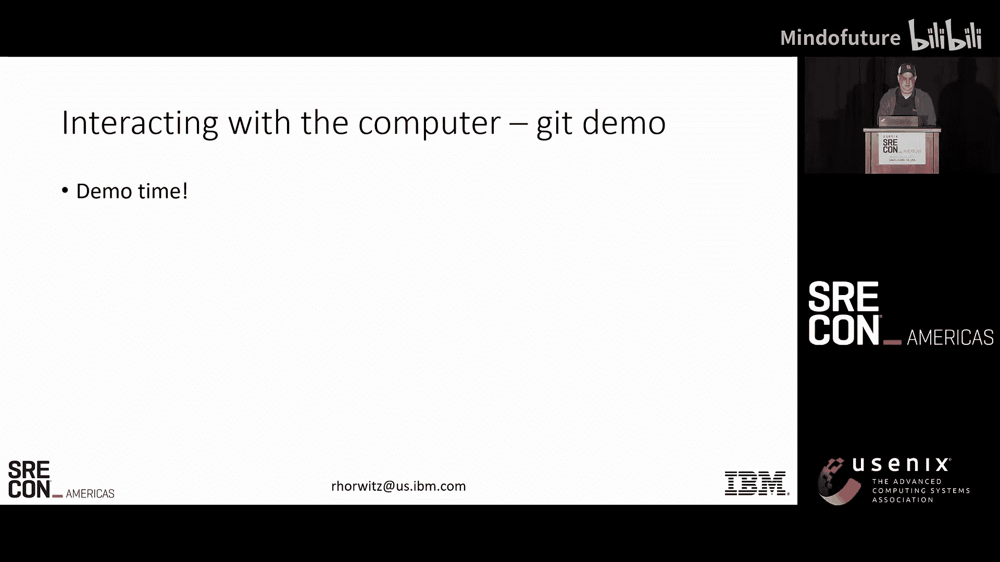
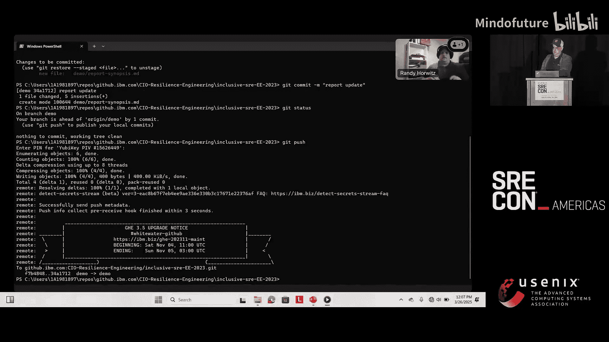
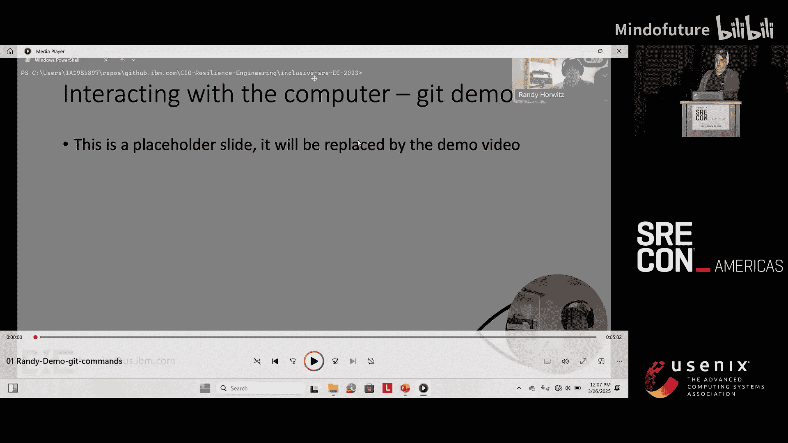
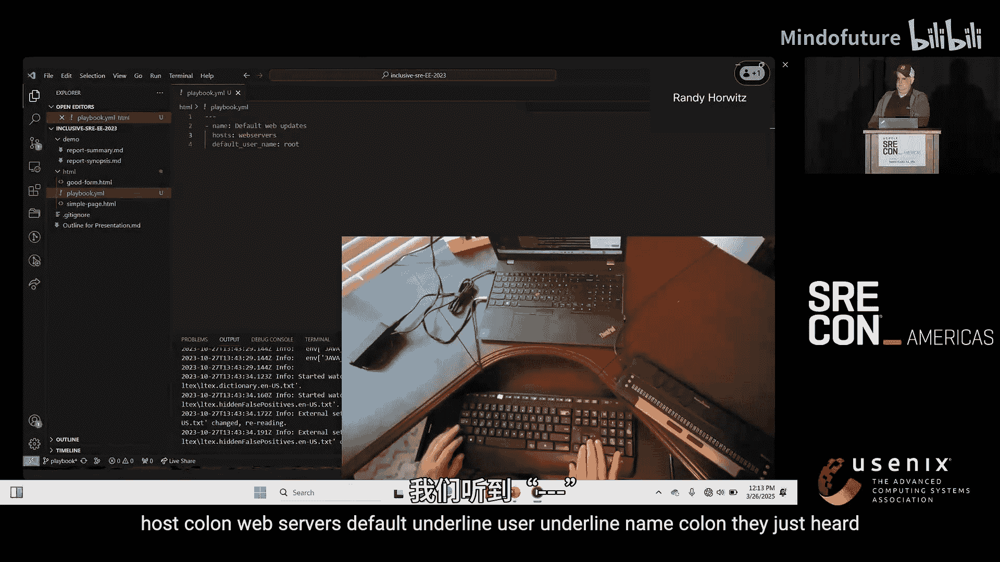
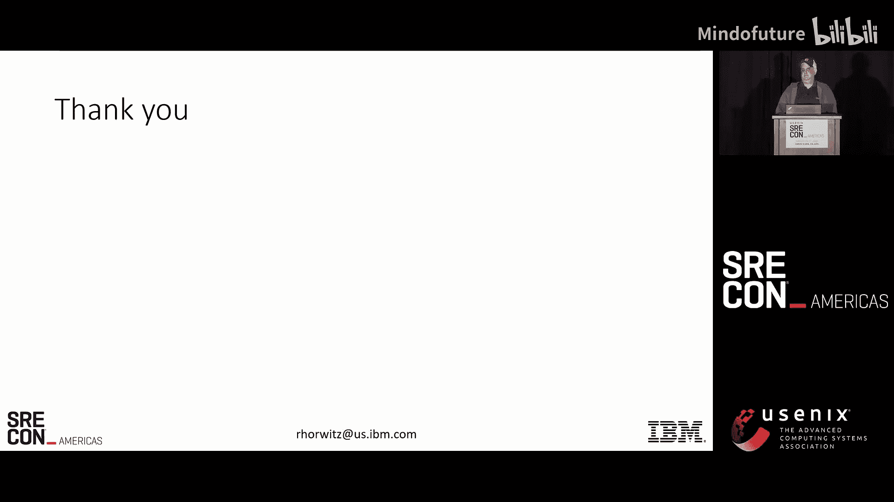
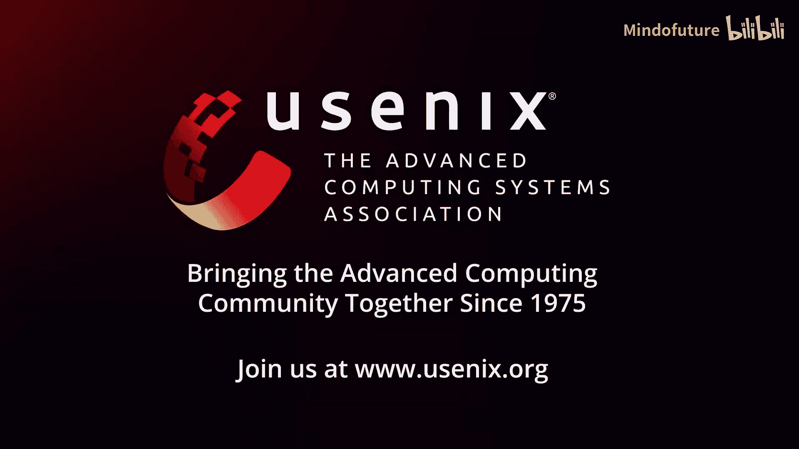
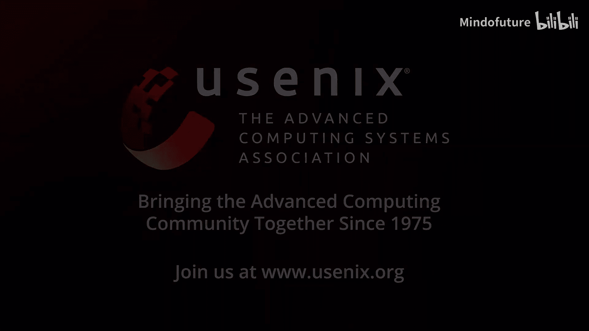

# 018：与视障事件响应者协作的最佳实践


在本教程中，我们将学习如何与视障或盲人SRE（站点可靠性工程师）进行有效协作。我们将探讨如何调整与计算机的交互方式、改进团队沟通，并确保工具和流程对所有人都可访问。这些实践不仅能帮助视障同事，也能提升整个团队的效率和协作质量。

---

## 课程1：不同的视角与适应

上一节我们介绍了本课程的目标，本节中我们来看看视障工程师能为团队带来的独特价值。

作为视障人士，我们一直在适应环境。这种成长经历使我们天生擅长处理音频信息、进行多任务处理，并能敏锐地捕捉语音中的细微差别。在事件响应团队中，这些技能非常宝贵，因为我们能够“听”出问题的不同方面，从而提供独特的视角。

拥有多元化的团队，你自然能获得这些不同的视角。

---

## 课程2：与计算机交互——输入

上一节我们了解了视障同事的独特优势，本节中我们来看看他们如何与计算机进行交互，首先从输入开始。

对于视障用户，高效的输入方式至关重要。

以下是几种主要的输入方法：
*   **盲打**：在早期学习盲打是一项关键技能，它能确保用户将双手保持在键盘上，提高输入效率。
*   **语音输入**：在移动设备或特定场景下，语音输入是常用的辅助方式。
*   **键盘替代方案**：许多操作依赖键盘快捷键和等效命令，而非鼠标，因为鼠标操作对屏幕阅读器不友好。

核心概念是保持双手在键盘上，并使用**键盘快捷键**（如 `Ctrl+S` 保存）来提高效率。



---

## 课程3：与计算机交互——输出

上一节我们讨论了输入方式，本节中我们转向输出，重点介绍屏幕阅读器。

屏幕阅读器是一个“监视”其他应用程序（如桌面程序或网页）的软件。它通过API或DOM获取信息，并将其转换为语音或盲文输出。

为了让屏幕阅读器有效工作，应用程序必须与之正确通信。如果通信失败，屏幕阅读器要么沉默，要么猜测屏幕内容，这通常会导致不理想的结果。

---

## 课程4：演示1——使用屏幕阅读器进行终端操作

现在，让我们通过一个实际演示来看看屏幕阅读器如何辅助技术工作。以下演示将展示在终端中使用屏幕阅读器完成Git操作。



我将使用Windows终端和屏幕阅读器。对于输入，我使用盲打。对于输出，我主要依靠语音反馈，必要时用盲文显示器核对。

```bash
# 检查Git状态
git status
# 添加文件
git add demo/*
# 提交更改
git commit -m “报告更新”
# 推送更改
git push
```



在演示中，屏幕阅读器会朗读命令、输出结果和错误信息（如输入`fit`而非`git`时的提示），使我能够像视觉正常的工程师一样完成工作。这凸显了工具（此处是终端和Git）通过屏幕阅读器提供清晰、准确信息的重要性。

---

## 课程5：演示2——使用盲文显示器进行编码

上一节我们看到了语音输出的例子，本节中我们体验另一种输出方式：盲文显示器。

盲文显示器是一种硬件设备，能以盲文形式实时显示屏幕内容。对于编码等需要精确核对字符（如括号、缩进）的技术工作，它不可或缺。

在演示中，我使用盲文显示器在Visual Studio Code中编写一个Ansible playbook的YAML文件。

```yaml
---
- name: 默认Web更新
  hosts: web_servers
  become: true
  tasks:
    - name: 确保Nginx最新
      apt:
        name: nginx
        state: latest
```

通过盲文显示器，我可以逐字检查代码，确保缩进（在YAML中至关重要）和语法正确无误。同时，屏幕阅读器的语音反馈与盲文输出同步，验证了开发环境（VSCode）与辅助技术之间的良好通信。

---

## 课程6：改进沟通——核心原则

前面的演示展示了个人如何与工具交互。现在，我们来探讨如何改进人与人之间、以及人与技术之间的沟通。



对于视障SRE而言，改进沟通的核心在于**调整你的沟通方式**。目标不仅是让屏幕阅读器能获取信息，更是要确保它提供的是**有用的输出**。

一个历史教训是：仅通过自动化工具（如过去的“Bobby”测试）确保“可访问”，而不进行真实用户测试，可能会产生像所有图片都标注为“alt text”这样毫无用处的页面。因此，进行屏幕阅读器和最终用户测试至关重要。

---

## 课程7：改进沟通——具体实践（爬行阶段）

“爬行”阶段指的是基础的、必要的适应性调整。以下是几个关键实践：

在屏幕共享时，请勿仅说“错误在屏幕上”。请将关键文本粘贴到聊天窗口。
*   **良好示例**：“数据库似乎出了问题。我把错误信息贴到聊天框里了。”
*   **不良示例**：“数据库报错了，信息在屏幕上。”

发送截图时，请务必描述截图内容。更好的做法是附带文字说明。
*   虽然OCR技术可以识别截图文字，但直接提供文字描述更可靠、更高效。

注意“反向可访问性”问题。例如，如果文本和背景色对比度太低，任何人都难以阅读。
*   我曾提交一份技术文档，因为前景色和背景色相同，导致同事一开始以为页面是空的。

沟通是双向的。如果你发现我的摄像头角度不对，或者我提供了难以访问的内容，请直接告诉我。

---

## 课程8：改进沟通——不要单独使用颜色

使用颜色传达信息时，切勿仅依赖颜色本身。

大约8%的男性和0.5%的女性患有某种形式的色盲（如红绿色盲）。如果仪表盘仅用红色表示故障，视障或色盲用户将无法识别。

解决方案是提供额外的标识符。

以下是一个不良的服务状态列表示例（对屏幕阅读器而言）：
```
服务器名        状态
node1.example.com
node2.example.com
```
（屏幕阅读器可能只读出“状态，空白列2”，无法传达“故障”信息。）

改进后的示例如下：
```
服务器名        状态
node1.example.com  !
node2.example.com
```
通过添加感叹号等符号，并在团队内约定其含义，所有成员都能理解状态信息。

---

## 课程9：改进沟通——处理图表数据（行走阶段）

“行走”阶段涉及更复杂的场景，例如处理仪表盘中的图表。

对于屏幕阅读器用户，一个复杂的折线图或柱状图可能只是一系列没有上下文的数据点朗读，认知负荷极大。

**解决方案包括：**
*   **确保数据可用**：提供图表的表格化数据视图或可下载的数据集（如CSV文件）。
*   **发送智能通知**：与其让人在大量数据中寻找异常，不如让监控工具分析、总结并直接发出通知：“Randy，服务器X在Y时间出现CPU尖峰，请查看。”

这不仅帮助了视障工程师，也**减轻了所有团队成员的认知负荷**，是多元化团队协作带来共同优化的典型例子。

---

## 课程10：总结与资源

在本课程中，我们一起学习了与视障SRE协作的最佳实践。

**爬行（基础调整）**：我们通过额外沟通来弥合差距，例如在屏幕共享时进行语言描述、解释截图内容，并避免单独使用颜色来传达信息。

**行走（优化协作）**：我们确保图表数据可通过表格或下载方式获取。更进一步，我们优化工具，使其能够分析、总结、优先处理数据，并以可读格式（如清晰的通知）呈现给所有人。这提升了整个团队的效率。

**奔跑（持续学习）**：如果你不确定该怎么做，最好的方法是**直接询问**。开放、双向的对话是包容性文化的基石。

**一些有用的资源：**
*   **IBM企业可访问性页面**：提供丰富的资源和检查工具。
*   **Web内容可访问性指南（WCAG）**：为网页与辅助技术通信提供了国际标准。
*   **社区与交流**：可以通过会议Slack、RSA Slack或电子邮件与我联系，共同探讨解决方案。







感谢你的时间。包容性设计让每个人都能更好地奔跑。