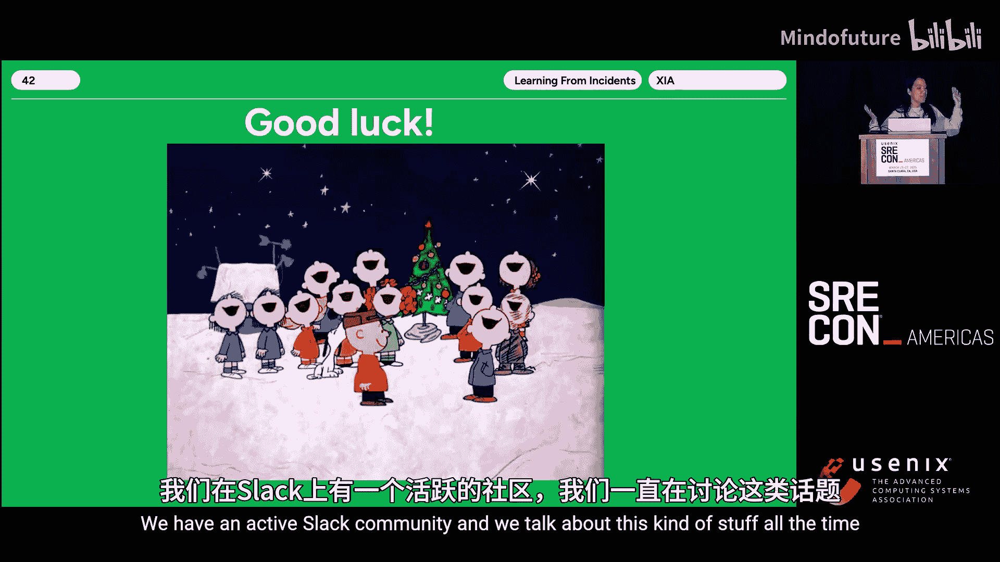

# 019：实际进行跨事件分析 🚀

在本节课中，我们将探讨如何超越对单个事件的回顾，通过跨事件分析来获取宏观洞察，从而推动组织层面的系统性改进。我们将学习如何构建一个可持续的、大规模的事件学习计划。

---

## 概述：从单个事件学习到跨事件分析 📈

上一节我们介绍了从单个事件中学习的重要性。本节中，我们来看看如何将这种学习规模化，即进行跨事件分析。跨事件分析旨在从大量事件回顾中识别模式和主题，从而发现更深层次的系统性问题和改进机会。

## 为什么传统的度量标准不够？🤔

有多种方式可以衡量一年中的事件。你可以统计事件总数、产生的行动项总数，或者事件持续的总时长。但这些数字本身缺乏上下文，无法提供有意义的洞察。它们无法告诉我们事件背后的原因、影响以及如何系统性预防。

我们真正需要的是建立在大量个体事件回顾基础上的洞察。我们希望从这些事件集合中识别出带有上下文的模式，以突出改进机会。

## 什么是“从事件中学习”？📖

“从事件中学习”是一种深入理解事件如何从不同视角发生的方法。其重点不在于行动项或为满足合同要求而填写的报告。它旨在全面理解事件的成因。

以下是进行事件回顾的典型步骤：
*   **第一步：识别数据**。确定涉及的人员、沟通渠道（如Zoom、Slack）、相关的代码提交或支持工单。
*   **第二步：准备并召开回顾会议**。基于已有数据，邀请相关人员，创建叙事时间线，并召开协作式会议，让每个人分享经历。
*   **第三步：总结并分享发现**。将最终发现整理成他人能理解的格式，根据受众（如领导层或技术团队）调整内容细节。

这种方法帮助我们获得超越表面原因（如“发现一个Bug”）的深刻理解，例如发现组织合并后的权限遗留问题，从而采取能惠及整个团队的行动。

## 规模化分析的挑战与机遇 ⚙️

将单个事件分析的做法规模化会面临诸多挑战。不同组织的做法可能不同，但通常包括：为所有重大事件进行回顾、建立可比较的结构化流程、以及进行足够多的分析以发现共性主题。

然而，规模化是困难的。原因如下：
*   **耗时耗力**：创建叙事时间线、协调会议、撰写报告需要大量时间。
*   **技能差异**：工程师可能不擅长收集定性数据、进行数据分析或向非技术人员有效呈现发现。
*   **数据不完美**：叙事报告难以进行数据查询和跨事件比较。

## Inova的成功实践：我们的故事 🏆

在Inova，我们建立了一个可持续的跨事件分析计划。我们有一个专职团队，负责对所有重大和敏感事件进行无责难的学习回顾。我们定期（季度、年度）进行宏观分析，并向组织提出改进建议。关键点在于，我们让工程、运营、市场、法务等多个部门都参与并认同这个过程。

我们通过以下方式实现了这一目标：
1.  **证明价值**：我们主动参与讨论，展示工作带来的直接改进。
2.  **持续改进**：我们不断回顾并调整程序，以适应组织和技术的演变。
3.  **发挥创造力并推动边界**。

## 实践指南：如何发挥创造力？🎨

### 在回顾流程上创新

没有固定规则。你可以决定回顾哪些事件、由谁主持、准备时长等。我们的创新包括：
*   **集中化分析团队**：为确保质量，我们组建了专职分析团队，而非让产品团队兼顾。
*   **一体化会议**：我们将时间线回顾、因素分析和后续步骤讨论合并到一个会议中。
*   **扩大参与范围**：邀请工程以外的部门（如市场、法务）参与，这有助于理解事件的全方位影响并促进团队协作。

### 在事件报告（产出物）上创新

我们的报告存储在Jira中，混合了定量和定性字段：
*   **定量字段**：如时间戳、影响分类，便于查询和初步分析。
*   **定性字段**：如叙事时间线、影响描述、人员决策依据，提供深度上下文。

这种“带上下文的指标”方法，为深入分析奠定了基础。

### 在分析方法上创新

我们的分析从专注于数字演变为富有洞见的对话：
*   **月度会议**：与产品领导讨论具体事件的学习点和优先事项。
*   **季度/年度回顾**：展示数据、提出顶层发现和项目建议。

分析时，我们采用“蔬菜与肉酱”法：既提供指标（蔬菜），也提供上下文（肉酱）。例如：
*   分析受影响最大的客户旅程，并深挖其背后原因（如供应商不稳定）。
*   分析贡献因素的共性，例如在节假日是否出现更多容量问题。
*   分析行动项的重复主题，是否可以催生更大的倡议（如建立SLO季度计划）。

## 分析师思维速成指南 🧠

即使不是专业分析师，你也可以培养相关思维：
1.  **保持好奇，而非评判**：询问事情如何运作，思考当事人面临的约束条件。
2.  **关注社会技术系统**：不仅考虑技术故障，还要思考流程、工具、团队沟通、人员培训和组织变动的影响。
3.  **将数据视为方向性指标**：数据本身没有意义，**上下文决定一切**。给领导呈现MTTR时，务必附上背景说明。
4.  **与人交谈**：从他们的视角理解经历，避免基于数据的错误假设。

## 经验与教训：成功模式与失败反模式 ⚖️

### 成功经验

1.  **避免成为“行动项工厂”**：确保行动项的所有者认同并拥有它，允许取消无意义的行动项。我们引入了“建议”与“承诺”的区分，以跟踪那些单次事件中难以优先但反复出现的重要改进。
2.  **促进透明与跨团队学习**：通过定期分享会，让不同团队了解其他部门的情况并相互学习。例如，关于功能标志工具的决策后来催生了相关的流程改进，各团队得以分享经验。

### 失败教训

1.  **MTTR等聚合指标的局限性**：平均解决时间（MTTR）本身信息量有限，因为它无法区分10分钟的事件和40小时的事件。我们通过提供上下文（例如，安全事件因涉及新团队和流程而耗时更长）来补充这些指标，并逐渐减少对其的依赖。
2.  **避免指标被博弈**：事件总数、内部原因事件数等指标曾引起领导关注，但很快被博弈（例如，通过制造大量短暂“闪烁”来降低MTTR）。我们通过引入“未遂事件”（near misses，我们称为“挽救”）分析和区分安全事件流程，为这些数字增添了有意义的上下文，从而发现了更多学习机会。

## 如何开始？你的第一步 🚶

你不需要一个完整的团队才能开始：
*   **从小处着手**：选择一个小组或一个季度，先提升单个事件回顾的质量。
*   **让他人参与**：在召开回顾会议前，与参会者沟通议程；在分享分析前，先征求技术主管或经理的意见。
*   **积累成功**：小的胜利会吸引更多的支持和资源。
*   **这不是冲刺，而是马拉松**：不要试图单挑CTO或指责同事。争取盟友，循序渐进地推动变革。

## 总结与行动号召 🌟

本节课中，我们一起学习了如何从对单个事件的学习，演进到进行有意义的跨事件分析。关键在于**为数据赋予上下文**，**创新你的流程与工具**，并**让更广泛的组织成员参与进来**。通过构建一个专注于学习、所有权和持续改进的文化，你可以规模化地从事件中学习，并真正推动有意义的改变。

如果你想深入探讨，欢迎加入“韧性软件基金会”（Resilience and Software Foundation）的社区。现在，就去尝试实践这些步骤吧！

---

