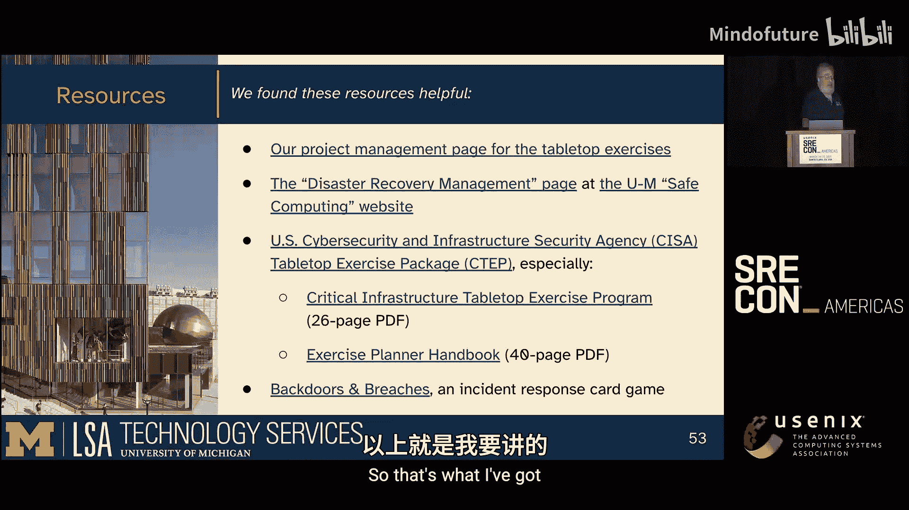

# 020：运行DRP桌面演练

## 概述

在本教程中，我们将学习如何规划和执行灾难恢复计划的桌面演练。我们将以密歇根大学文学、科学与艺术学院技术服务中心的真实案例为基础，介绍从发现问题、制定计划、执行演练到评估改进的完整流程。目标是帮助你理解如何通过结构化的演练，提升团队对灾难恢复流程的熟悉度，并发现计划中的潜在缺陷。

---

## 背景与问题

上一节我们概述了课程目标，本节中我们来看看促使我们进行演练的背景和遇到的问题。

我们的团队负责为学院提供超过70项基础服务。我们自2008年起就制定了灾难恢复计划，但在实践中发现了以下问题：

*   **范围狭窄**：大多数计划只考虑自然灾害导致数据中心损毁的情况，忽略了服务或组件级别的故障。
*   **恢复步骤模糊**：许多计划的恢复步骤仅限于“购买新硬件、重装系统、从备份恢复”，缺乏详细指导。
*   **文档缺失或过时**：部分服务没有构建指南，或者指南未随系统变更而更新，知识仅存在于个别成员脑中。
*   **计划不完整**：并非所有服务都有对应的灾难恢复计划。
*   **缺乏一致性**：由于计划模板不统一，不同作者会删除自认为不必要的部分，导致计划间差异巨大。
*   **测试有效性存疑**：年度测试可能只是个人的思维实验，缺乏团队协作和验证。人员流动也导致服务负责人变更，最初的假设和知识可能丢失。

我们希望通过演练达到以下目标：统一团队的认知基线、识别服务上下层的所有依赖关系、建立一致的计划编写和测试方法。

---

## 灾难恢复计划应包含的内容

在了解了存在的问题后，本节我们来看看一份合格的灾难恢复计划具体应包含哪些核心要素。我们的计划模板包含以下部分：

*   **服务描述**：提供服务的高级概述。实施恢复的人可能不是该服务的专家。
*   **依赖项列表**：包括硬件（主机名、IP、型号/序列号、CPU/内存/磁盘、位置）、软件（特定版本要求）、配置信息（服务账户、数据库用户等）。
*   **安全与设施**：物理和电子安全访问控制。
*   **备份信息**：明确指出备份存储的位置和解决方案。
*   **操作信息**：测试频率、最小运行标准（例如，单节点只读）与完全运行标准的定义。
*   **文档位置**：**关键：** 不要将文档内嵌在计划中，但必须提供指向构建指南、架构图等文档的明确链接或路径。
*   **计划任务**：例如 `cron` 作业，包括运行时间、执行账户及备份方法。
*   **联系人信息**：服务负责人、技术负责人、需要通知的客户或合作伙伴、硬件/软件供应商紧急联系人。
*   **服务级别与影响**：如果存在服务级别协议，请链接。否则，需说明最大可接受停机时间以及超出时限的业务影响。

---

## 桌面演练的设计与执行

明确了计划内容后，本节我们将焦点转向如何设计和执行有效的桌面演练。

我们为整个15人团队组织了引导式桌面演练，针对三项服务进行：虚拟机管理程序基础设施（基础服务）、网络托管环境（应用服务）、校内数据中心（物理位置）。

以下是我们的方法：

*   **角色**：我们简化了正式角色。服务经理和技术负责人扮演自己，其他成员扮演中央IT、学院办公室等外部依赖方。多人兼任观察员和数据记录员。
*   **形式**：协作讨论，引导员（我）不隐藏信息，也不通过掷骰决定行动成败，目标是共同找到恢复路径。
*   **未做的部分**：我们没有模拟发送真实通知（邮件、状态页），也未撰写正式的事后报告，以降低复杂性。

**具体演练场景：**

1.  **虚拟机环境入侵**：攻击者侵入集群中的一个节点，进而可能访问所有节点和底层存储（包含虚拟机镜像和备份）。如果中央IT的备份也已过期，后果将是灾难性的，需要从零开始重建一切。
2.  **网络服务器入侵**：攻击者侵入托管了136个网站的核心服务器。由于访问受限，破坏被控制在单台服务器内。恢复工作包括重建服务器、从备份恢复网站、更换所有密码和证书。
3.  **数据中心物理入侵**：讨论窃取、破坏、为掩盖盗窃而破坏等多种可能性。演练揭示了一些非技术约束，例如某研究设备根据资助条款必须存放在特定机柜，灾后迁移需要法律部门介入。

---

## 演练成果与衡量标准

执行演练后，我们需要评估其成效。本节我们回顾最初的目标，并查看参与者的反馈来衡量成功与否。

我们通过调查问卷（1-5分）收集反馈，问题包括：演练进行得如何？最喜欢/最不喜欢的部分？如何改进？

**2024年2月首次演练结果：**
*   平均分：**4.3**
*   **积极反馈**：形式有吸引力；增进了对计划和个人思考过程的了解；圆桌讨论和头脑风暴有帮助；通过讨论别人的计划，发现了自己计划中的漏洞。
*   **改进点**：讨论有时会陷入细节（“钻进兔子洞”）；问题定义可以更清晰；首次尝试纳入重大事件沟通流程显得多余，后续已移除。

**关键反馈引用**：
> “这次演练令人恐惧。” — 这恰恰是演练的目的之一，即真实地感受灾难的压力。

**2024年3月第二次演练结果：**
*   平均分提升至：**4.7**
*   超过一半参与者认为两次演练效果相当或第二次更好。
*   **积极反馈**：主题更集中；专注于技术行动而非沟通，效果更好。
*   **持续改进点**：仍需控制讨论深度；部分人认为范围有时过窄。

**衡量标准达成情况：**
*   提升了对计划实施的理解？**是**。
*   考虑了需要在学院/大学层面进行的增、删、改？**是**。
*   发现了更多漏洞和盲点？**是**。
*   制定了填补漏洞的计划？**是**。

---

## 后续行动与关键要点

根据演练的发现和反馈，我们制定了后续步骤。本节将介绍这些行动，并总结一些供你参考的关键要点。

**后续行动：**
1.  **修订计划**：参与者根据新认知更新其灾难恢复计划、构建指南、架构图和设计文档。
2.  **明确通用依赖**：团队一致同意，即使有些依赖看似明显（如电力、冷却、核心网络、DNS、中央认证、文档存储），也应在计划中列出。
3.  **实施改进**：
    *   确保所有服务器磁盘**静态数据加密**。
    *   在资产清单中添加缺失的软件许可证。
    *   研究并实施虚拟机**亲和性/反亲和性规则**。
    *   更新监控项。
    *   鼓励加入大学级的灾难恢复实践社区。
4.  **固化流程**：引导员分析结果，团队决定**每年2月/3月**进行演练，并开发培训模块以培养更多引导员。

**供你参考的关键要点：**
*   **做最坏打算**：假设需要**从零开始重建且没有备份**。
*   **文档至关重要**：维护最新的构建指南和架构图。考虑使用变更日志来记录与指南的偏差。
*   **备份验证**：确保备份了正确的内容，并定期验证其可恢复性。
*   **测试深度**：根据风险选择测试方式——思维实验、桌面演练、部分恢复测试或完整重建。可以混合使用，例如每年做桌面演练，每3-5年做一次完整重建。
*   **资源准备**：如果计划中引用了外部资源（如Wiki），确保在恢复环境也能访问，或将其PDF副本附加到计划中。

---

## 总结

在本教程中，我们一起学习了运行灾难恢复计划桌面演练的全过程。我们从识别现有计划的不足出发，探讨了完整DRP应包含的要素，详细介绍了如何设计并执行针对不同服务场景的桌面演练。通过分析参与者反馈来衡量演练成效，并根据发现制定了具体的后续改进措施。最后，我们总结了一系列在编写和测试自身灾难恢复计划时的关键考量。记住，演练的目的不是追求完美，而是暴露问题、统一认知、并为真实的灾难做好准备。