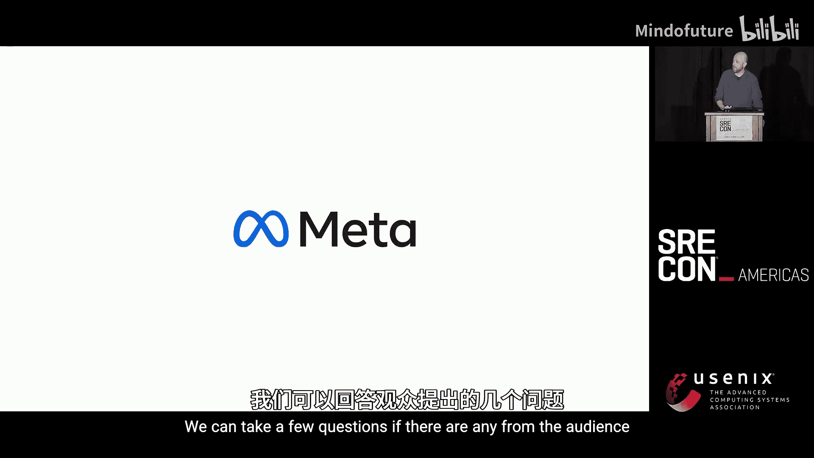
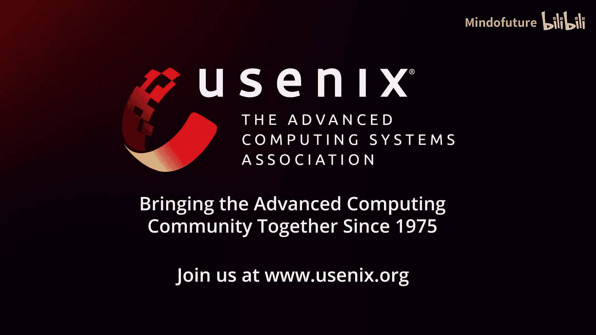

# 021：一种治理方法 🧠


在本教程中，我们将学习如何通过治理方法来优化机器学习训练基础设施。我们将探讨容量管理、可观测性、治理框架的设计与实施，以及如何将这些实践与业务投资回报率联系起来。课程内容基于Meta公司的实践经验，旨在为生产工程师和SRE提供可操作的见解。

---

## 容量管理与挑战 ⚙️

机器学习训练硬件非常昂贵且稀缺。获取和部署这些硬件需要大量时间和配套基础设施。为了最大化投资回报率，必须确保硬件在其生命周期内获得最大效用。

模型开发过程本身也带来挑战。与请求-响应服务不同，机器学习开发更具实验性和迭代性，反馈周期很长。由于反馈周期长，我们需要尽早考虑可靠性和容量使用问题。此外，结果的可调试性有限，因此需要确保在启动阶段就尽可能正确。

在大型环境中，我们会面临异构硬件环境、区域限制、内部产品竞争以及不同使用阶段（构思、测试、生产）的资源分配问题。要充分利用整个计算集群，需要全面的可观测性。

## 可观测性与治理基础 📊

要实现有效治理，首先需要出色的归因和指标。没有这些，很难为业务取得正确的结果。

归因可以有不同范围，从公司级到产品组甚至子组。目标是尽可能细化归因，以支持治理。治理初期可能由人工主导，但最终目标是实现自动化治理。

**归因示例**：
*   **基础设施**：硬件类型、区域。
*   **训练栈**：使用的软件栈。
*   **业务上下文**：模型名称、项目、模型类型（业务目的）、训练阶段。

**指标示例**：
*   **成本**：GPU小时数、网络带宽、存储。
*   **效率**：每秒样本数、GPU利用率、SM利用率（GPU寄存器级）。

通过收集这些属性和指标，并采取治理方法，我们可以更好地将基础设施使用与业务投资回报率联系起来。

## 训练工作负载治理框架 🏗️

上一节我们介绍了治理所需的基础数据，本节中我们来看看如何构建一个治理框架。治理可以应用于多个领域，例如模型组合管理、资源访问控制和项目优先级排序。本案例将深入探讨**训练工作负载治理**，即管理启动并使用ML训练容量的作业。

训练工作负载治理可分为几个层次：

1.  **归因治理**：这是基础层，为作业提供目的信息（如关联的项目、模型类型、开发阶段）。这些属性是可观测性的关键，也是构建其他治理工具的基础。
2.  **容量治理**：通过配额检查，确保作业使用正确的容量池（例如，高优先级池提供低延迟保证）。
3.  **可靠性治理**：防止作业因使用已弃用功能或不兼容的硬件配置而失败，这既影响容量效率，也影响开发人员生产力。
4.  **效率治理**：在容量有限时，根据作业的业务上下文（如项目紧急程度、收入影响）进行精细化的优先级排序，并推广使用更高效的训练技术。

为了达成这些治理目标，我们构建了一个治理框架，并设定了以下核心要求：
*   **通用性**：框架可用于训练工作负载及其他治理领域。
*   **分布式与层次化**：支持Meta大型组织的分层级、分范围的规则管理。
*   **多治理点一致性**：在作业提交链路的不同节点（如笔记本、编排器、中央调度器）实施一致且灵活的规则。
*   **强大的规则表达能力**：允许团队利用其专有数据源和业务状态，制定丰富、敏捷的治理规则。
*   **高可靠性**：框架本身需可靠且维护开销低。

## 框架设计与关键技术 🔧

我们设计的解决方案将治理业务逻辑与具体执行框架分离，并将其集中管理。然后在所有关键通道（尤其是中央调度器）部署客户端，以确保治理覆盖的全面性和早期问题检测。

以下是该解决方案的一些关键设计细节：

*   **层次化规则结构**：规则像树一样组织，与公司职责结构对应。每个策略节点负责提供特定功能，并决定下一个执行的策略节点。这提供了所需的隔离性和层次化治理结构。
    ```python
    # 概念性伪代码，表示策略节点决策流程
    def evaluate_policy_node(job, context):
        if not check_company_level_rule(job):
            return "REJECT", "违反公司级规则"
        elif not check_product_group_rule(job, context):
            return "REJECT", "违反产品组规则"
        else:
            return "PROCEED", determine_priority_and_pool(job)
    ```
*   **团队自主与责任**：各团队可以独立推出并拥有其策略，同时负责处理策略失败、维护指标和告警。
*   **安全隔离**：框架提供基于模板的方法来构建策略，并在编写、运行时隔离上下文，确保错误只会影响负责该策略的团队。
*   **可靠性保障**：
    *   服务设置为 **故障开放**，以保障作业提交不受框架自身故障影响。
    *   策略上线前经过 **影子模式** 多日观察，预知其影响。
    *   提供框架级的 **紧急熔断机制**。
*   **沟通与渐进式推行**：治理涉及大量人力协作。在阻止违规作业前，必须进行充分沟通，提供明确警告和修复指南，以获取社区支持，避免摩擦。治理策略的推行是缓慢而结构化的过程。

## 关键成果与经验总结 🎯

通过实施该治理框架，我们取得了多项成果：
*   实现了对关键业务属性（如模型类型）的 **100%覆盖**，获得了清晰的成本洞察以支持投资决策。
*   在容量紧张时，实现了工作负载的 **高效优先级排序**。
*   显著提升了 **开发人员生产力**，阻止了大量将在生产环境中失败的作业。

我们从实践中总结出以下核心经验：

1.  **治理推行是艰难的**：沟通至关重要，这是一个以人为本的缓慢过程，框架的目标是结构化前进并最小化损害，而非追求速度。
2.  **治理是有限使用的工具**：自动化才是最佳方式。能够通过自动化实现的目标，就不应使用治理。治理应与自动化相辅相成。
3.  **治理需与激励结构对齐**：如果治理规则与业务目标存在深层冲突，导致“打破规则反而收益更大”，那么该治理注定会失败并引发摩擦。
4.  **不同治理领域需协同工作**：模型开发、训练、A/B测试、推理管线等各个环节的治理故事必须与更大的业务叙事保持一致，否则会出现低效和漏洞。

## 治理的价值与推广 🚀

治理的最佳状态是轻量级的，它通过推动可观测性来实现目标。可观测性使我们能够看清投资流向和效果，从而获得实现业务目标和SRE目标的杠杆。治理是达到目的的手段。

生产工程师和SRE非常适合推动这项工作，因为：
*   **全局视野**：PE擅长审视开发过程的整体图景，使其更可重复、可靠和高效。
*   **可靠性核心**：治理本质上是可靠性驱动的，这与SRE的核心关切一致。
*   **可观测性驱动**：PE善于跨整个生态系统构建可观测性，而不仅仅是关注特定产品切片。
*   **解决方案构建**：我们擅长构建解决复杂挑战的解决方案，推动系统向更自动化、更可调试、更可理解的方向发展。

即使在小规模环境中，也可以开始思考如何引入这些实践：开始跟踪关键属性和指标，并利用它们为业务创造更大价值。

---





**本节课中我们一起学习了**如何通过构建系统的治理框架来优化机器学习训练基础设施。我们从容量挑战和可观测性基础出发，深入探讨了一个分布式、层次化治理框架的设计、实施与可靠性保障，并总结了关键的成功经验和推广价值。治理的核心在于通过可观测性赋能业务，在保障可靠性与效率的同时，推动整个ML开发流程向更自动化、更高效的方向演进。