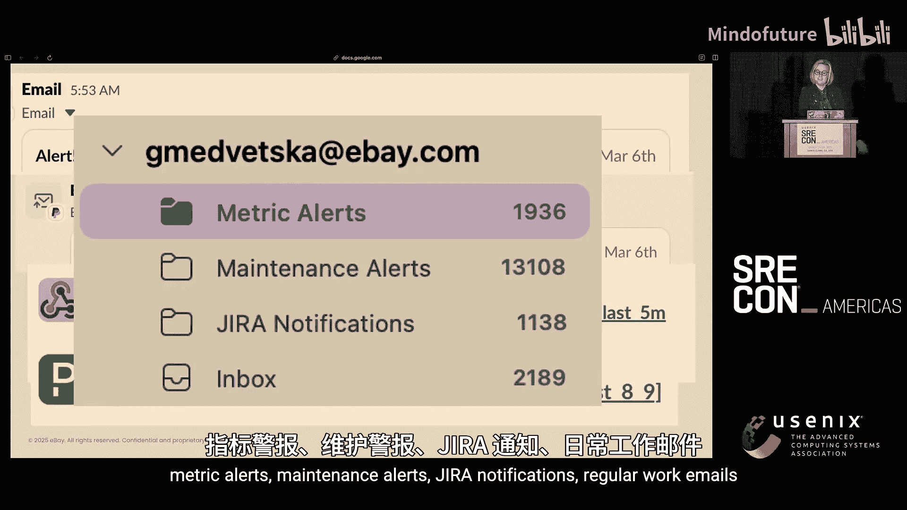

# 022：超越顺序——异步流水线可观测性与告警方案

## 概述
在本节课中，我们将学习如何为异步应用程序定义服务级别目标，以确保其得到有效监控，从而为用户提供一致的体验。我们将分享一个包含三个主要步骤的“配方”：准备指标、定义SLO与仪表盘、以及维护覆盖与合规性。

## 1：准备原料——收集应用与指标
上一节我们介绍了本教程的目标，本节中我们来看看实现可观测性的第一步：准备必要的“原料”。

异步应用程序在我们的组织中并不罕见。许多用例并不需要立即响应用户请求，例如收集请求后进行“发射后不管”的处理，只需在结果就绪时再关注即可。这是基础设施中非常常见的模式。

以下是构建可观测性“配方”所需的核心要素：
*   **异步应用程序**：这是我们的主要“食材”。需要明确其工作流程与状态。
*   **指标**：没有指标就无法实现任何可观测性。这是基础。
*   **仪表盘与可视化**：在指标之上，需要创建可视化的仪表盘，这自然意味着需要查询能力。
*   **有效事件与良好事件的定义**：在定义SLO之前，需要明确什么事件是“有效的”，什么事件是“良好的”。
*   **服务级别指标**：在良好事件与有效事件的定义之上，才能构建SLI。

为了确保我们对“异步应用程序”有清晰的理解，这里以eBay的商品推荐系统为例进行说明。

该系统的工作流程如下：
1.  **生产者**：用户通过UI或API购买商品或添加商品到关注列表。这些是同步服务，但它们会生成一条消息（或称“事件”）并将其放入一个队列（种子商品队列）。事件负载包含用户ID和商品ID。
2.  **队列**：作为生产者与消费者之间的缓冲区。
3.  **异步排序服务**：这是我们要监控的主要消费者应用。它从队列中消费事件。
4.  **外部调用**：消费者会调用机器学习推荐API。由于网络瞬态问题，调用可能失败。
5.  **重试队列**：平台支持重试队列。如果消费事件失败，事件会被自动加入重试队列。消费者可以从主队列或重试队列读取事件。
6.  **已排序商品数据库**：处理完成后，结果（例如，针对某个用户ID的推荐商品ID列表）被写入该数据库，供其他服务（如推荐商品页面）后续使用。

## 2：烹煮与调制——从指标到SLO与仪表盘
上一节我们了解了异步应用的工作流程，本节中我们来看看如何为其定义服务级别指标。

以下是一些可能的SLI示例（非详尽列表）：
*   **可用性**：衡量成功处理事件的比例。
*   **延迟**：衡量从事件产生到被成功处理所需的时间。
*   **新鲜度**：衡量处理结果（如推荐商品）的时效性。
*   **质量**：衡量处理结果（如推荐列表的准确性或完整性）的好坏。
*   **吞吐量**：衡量单位时间内处理的事件数量。

在我们的实践中，我们主要关注**可用性**和**延迟**这两个SLI。原因在于其关键性：如果能有效测量可用性和延迟，可以在很大程度上推导出其他三个指标。例如，可以将低质量结果定义为失败响应；新鲜度和吞吐量也可以从延迟中推导（处理时间越长，结果越不新鲜，吞吐量也越低）。

### 定义可用性SLI
每个进入异步应用的事件都有三种可能状态：**成功**、**放弃**和**重试**。其中，重试是瞬态，所有事件最终都会变为**成功**或**放弃**。我们使用Prometheus计数器来记录事件状态。

以下是定义“良好事件”与“有效事件”的Prometheus查询示例：
*   **良好事件（成功）**：`sum(rate(consumed_item_count{consumer="ranking", event="rank_item", status="success"}[1m]))`
*   **有效事件（总数）**：`sum(rate(consumed_item_count{consumer="ranking", event="rank_item", status=~"success|abandoned"}[1m]))`

**可用性SLI**即为：`良好事件数 / 有效事件数`。

### 定义延迟SLI
我们使用Prometheus直方图来计算延迟。延迟的计算涵盖整个流水线：
1.  事件在队列中的等待时间。
2.  事件在重试队列中的等待时间（如果发生重试）。
3.  消费者处理事件的时间。
将所有阶段的耗时相加，得到总延迟并存入直方图。

基于此，定义延迟SLI的Prometheus查询如下：
*   **良好事件（延迟达标）**：`sum(rate(consumed_item_latency_bucket{consumer="ranking", event="rank_item", le="10000"}[1m]))`
    *   这里 `le="10000"` 表示延迟小于等于10秒的事件被认为是“良好的”。
*   **有效事件（总数）**：`sum(rate(consumed_item_latency_bucket{consumer="ranking", event="rank_item", le="+Inf"}[1m]))`

**延迟SLI**即为：`延迟达标的事件数 / 总事件数`。

### 构建监控仪表盘
收集了指标和SLI后，是时候用自定义仪表盘来“调味”了。仪表盘面板可以包括：
*   事件状态（可用性指标）
*   消费者积压
*   重试队列积压
*   生产者到消费者延迟（P99延迟）

这些面板可用于日常SRE工作流。但更高效的方式是在此基础上引入SLO和告警系统。

## 3：装盘点缀——维护覆盖、合规性与进阶实践
上一节我们完成了SLO的定义和仪表盘的构建，本节我们将探讨如何维护SLO的覆盖与合规性，并介绍一些进阶实践。

### SLO与告警
SLO是服务级别目标，代表了对客户期望的内部承诺。它设定了SLI在一段时间内的目标。例如：“99%的事件应在30天内于10秒内被处理”。其中，99%是SLO目标，30天是SLO周期，10秒是SLI指标（延迟）。

为了避免告警疲劳，我们采用基于**错误预算**和**消耗率**的告警策略。
*   **错误预算**：在服务超出合规性之前，允许累积的错误数量。公式为：`错误预算 = 1 - SLO目标`。例如，99.9%的可用性目标对应0.1%的错误预算。
*   **消耗率**：服务消耗错误预算的速度相对于SLO周期的比率。消耗率为1表示预算将在30天周期内平稳耗尽；消耗率为2表示将在15天内耗尽。

我们采用**多窗口多消耗率告警**来减少误报。例如，可以组合设置：
*   **关键告警**：在1小时窗口内消耗率达到14.4时触发（对应消耗2%的月错误预算）。
*   **警告告警**：在2小时窗口内消耗率达到3时触发。

### 利用SLO指标
除了基础面板，我们还可以 harness SLO指标来获得更深入的洞察，例如：
*   **近7天性能**：展示服务在过去7天的SLI表现趋势。
*   **SLI成功率**：直接展示可用性或延迟SLI的成功率。
*   **月度错误预算消耗率**：展示30天周期内错误预算的消耗情况。
*   **基于错误预算的每日SLO表现**：显示每日分配的错误预算以及服务当日的实际消耗对比。

这些可视化能清晰展示服务何时、因何（如部署）接近或违反SLO，帮助团队量化变更或事件对用户的影响。

### 进阶点缀建议
为使您的异步可观测性从基础升级为“ gourmet 体验”，建议尝试以下“点缀”：
1.  **SLO分类助手与AIOps**：利用AI处理初步告警，为工程师提供必要的上下文，实现“厨房预热”。
2.  **将SLO集成到CI/CD流水线**：当SLO超出合规性或故障调查未在一定时间内解决时，自动阻止发布滚动。
3.  **定义覆盖与合规性标准**：为整个组织制定策略，确保所有服务都满足可用性目标，并定义SLO应覆盖的流量比例和整体合规性要求。

### 实践收益
通过实施SLO，我们能够：
*   在收到告警后，快速通过SLO仪表盘定位问题（如下游依赖部署）。
*   根据影响评估，决定是自动回滚、通知产品负责人，还是进一步优化。
*   量化特定变更或功能对用户的影响（如2.1%的收入影响），从而提升系统韧性并预防未来问题。

## 总结
本节课中我们一起学习了为异步流水线构建可观测性与告警的完整“配方”。我们从挑选最新鲜的指标开始，到烹制出有意义的SLO和仪表盘，最后讨论了如何装盘点缀以实现覆盖与合规性。伟大的可观测性如同一顿均衡的美食，需要正确的原料、恰当的技术和一丝创造力。通过实施能直接代表客户体验的异步流水线SLO，您将获得可操作的见解和可量化的影响，从而增强站点可靠性与客户满意度。请将这些技巧带回您的“厨房”，根据您的独特环境调整“调味”，烹制出让客户回头再次享用的可靠性大餐。