# 023：处理史上最大规模的域名迁移

## 概述

在本教程中，我们将跟随Squarespace工程师的视角，深入了解他们如何成功完成对Google Domains的收购与迁移。这是一次涉及超过900万个域名、数百万工作区席位，并需要在10个月内完成技术、产品和业务全面升级的复杂工程挑战。我们将学习域名系统的基础知识、大规模迁移的架构设计、性能优化策略以及如何在不影响用户体验的前提下完成如此庞大的系统整合。

## 域名基础知识 🧠

在深入迁移细节之前，我们需要理解一些域名领域的核心概念。这对于理解后续的技术挑战至关重要。

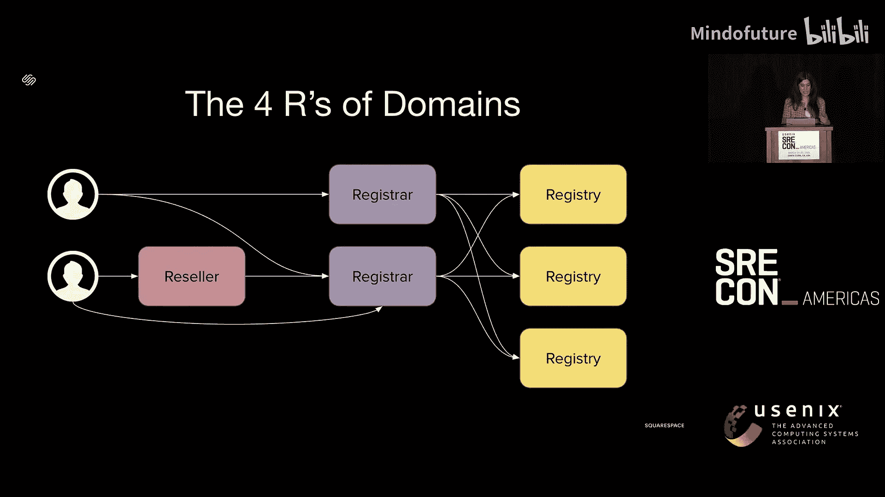

一个域名主要由两部分组成：点号左边的部分和点号右边的部分。

*   **顶级域名**：位于点号右侧的部分，简称 **TLD**。例如 `.com`、`.net`，或国家地区代码如 `.uk`、`.au`，以及一些新潮的域名如 `.shop`、`.blog`。
*   **二级域名**：位于点号左侧的部分，简称 **SLD**。这是客户在购买域名时可以自由选择的部分。将SLD与TLD组合，就得到了完整的域名。

接下来，我们快速了解域名生态中的四个关键角色，即“域名四R”。

以下是域名生态系统中的四个核心角色：

1.  **注册局**：负责运营特定TLD的公司。例如，Verisign公司运营 `.com` 和 `.net` 域名。全球所有的 `.com` 域名都归该公司管理。
2.  **注册商**：注册局不直接向消费者销售域名。注册商与多个注册局合作，向消费者销售其TLD。当您去一家公司购买域名时，您接触的就是注册商。注册商受ICANN（互联网名称与数字地址分配机构）监管，需要遵守诸多规定，如运行WHOIS服务器、确保没有商标侵权、防止域名被用于网络钓鱼和欺骗等。
3.  **经销商**：如果一个公司想销售域名，但不想承担注册商的合规责任，它可以成为经销商。经销商通过注册商提供的API在其平台上销售域名，而注册商仍然是背后的实际服务提供者。
4.  **注册人**：即最终购买和使用域名的客户。注册人可以从经销商或注册商处购买域名。

## 迁移背景：收购的挑战 🎯

上一节我们介绍了域名的基础概念，本节中我们来看看这次收购项目启动时，Squarespace面临的起点和挑战。

故事始于2023年。当时的Squarespace作为一个域名提供商，形态还很初级。我们主要是一个网站建设平台，域名是作为网站服务的附属产品提供给客户的。

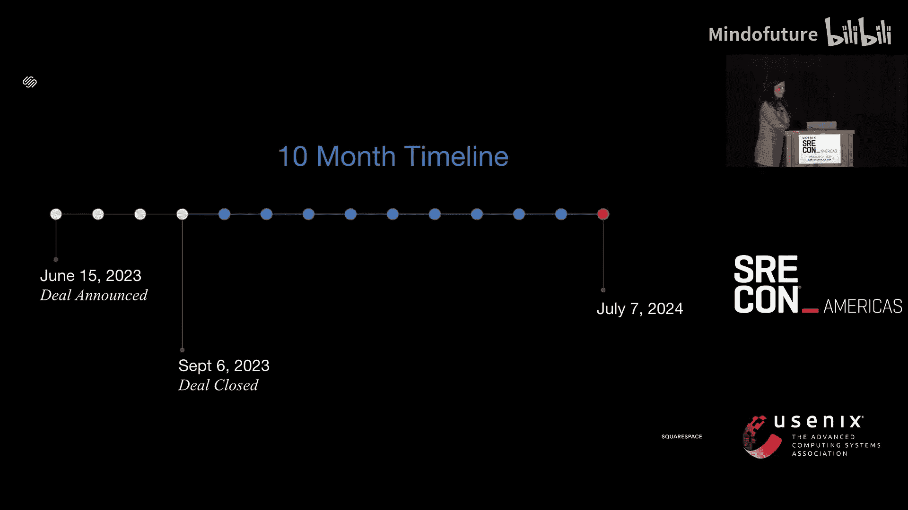

这意味着在Squarespace内部，域名被视为网站的子产品。客户管理域名需要进入其网站的设置页面。作为注册商，我们也非常年轻，仅支持 `.com` 和 `.net` 两个TLD的直营销售，其他TLD均通过经销商模式销售。我们的客户也大多是新手用户，他们只希望域名能与网站配合工作，最多再购买一个邮箱，并不使用域名转发、邮件转发等高级功能。

团队小，产品也小。我们当时只有大约8名工程师、1名经理和1名产品经理。尽管我们系统内管理的域名数量已经不少，但我们的目标仅仅是服务好网站建设客户，并未刻意寻求扩张域名业务本身。

2023年4月，我从当时的CTO那里得知了可能收购Google Domains的消息，并且公司需要我来领导这次收购。在与当时的域名团队经理沟通后，我们克服了最初的震惊，开始思考Squarespace需要进行哪些改变才能确保这次收购成功。交易尚未公布，我们有一些准备时间。我们开始与全公司的首席工程师和资深工程师合作，因为我们知道，根据即将引入的新业务，我们的数据量或服务吞吐量可能会翻倍、三倍、四倍，甚至五倍。我们开始进行负载测试，修复代码瓶颈，并扩容部分数据库集群。

2023年6月，收购消息正式公布。当我们开始与Google Domains团队合作时，我们才真正了解到这次收购的具体内容：

1.  **域名**：我们将转移超过900万个域名，这会使我们管理的域名数量翻两番。这些域名还附带了Google Workspace席位，约有100万个席位随之转移，这使我们管理的Workspace席位数量也翻了三倍。
2.  **经销商业务**：Google Domains本身也是一家经销商。Google Workspace和Google Cloud会向其客户提供域名，并通过Google Domains的API来完成服务。
3.  **前端流量**：Google Domains的前端网站将进行调整，用户无法再通过其注册新域名，这部分流量将被重定向到Squarespace。我们需要思考如何向这批新客户展示自己。

当时是6月，我们尚不清楚交易何时完成，但知道律师需要工作几个月。我们明确的是，一旦交易完成，我们将有**10个月**的不可变更时间线来完成所有相关工作流。

除了上述三点，这促使我们思考Squarespace内部需要在产品、系统等方面做出哪些其他改变。因为这不仅仅是转移域名，我们更希望随域名而来的客户能够留在Squarespace。

## 目标差距：我们需要成为什么？⚡️

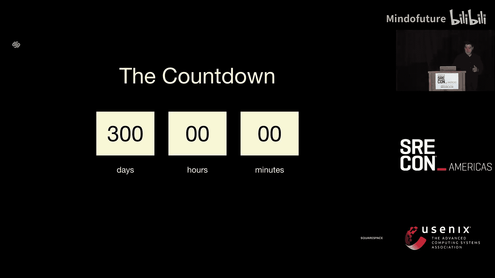

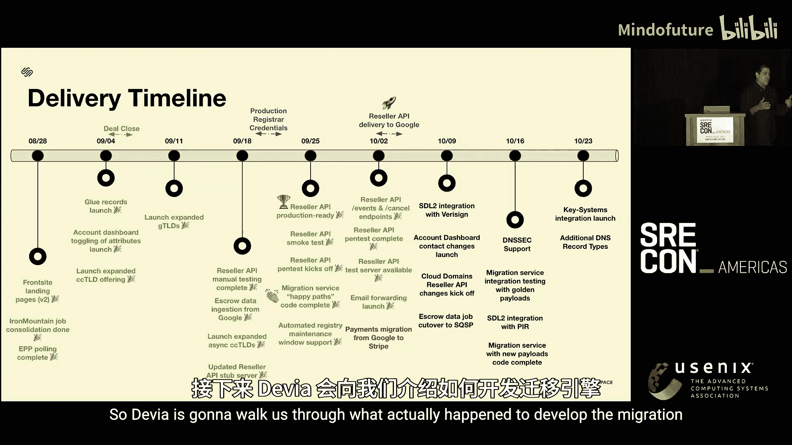

我们了解了Squarespace域名业务的起点，现在来看看Google Domains是什么样子，以及我们需要追赶的目标。

客户选择Google Domains，是因为它是一个为各类域名客户（新手和高级用户）提供强大工具的域名提供商。这意味着Google支持许多Squarespace当时不具备的功能，例如域名和邮件转发、DNS GLUE记录等。同时，它也是一个成熟得多的注册商，通过其注册商支持超过300个TLD，而我们只支持2个。因为是Google，其系统内的域名数量是我们的五倍。

这带来了三个核心挑战：

1.  Squarespace需要成为一个支持所有类型客户的域名提供商。
2.  我们需要构建一个用于经销域名销售的API。
3.  我们需要打造一个以域名为中心的产品体验。

具体来说，这意味着：

*   我们的注册商需要从支持**2个TLD**扩展到支持**超过360个TLD**。
*   我们需要支持Google Domains提供的**所有功能**，不能让客户失去他们依赖的功能。
*   我们需要构建一个独立的、以域名为中心的产品。之前域名功能被隐藏在网站设置里，但对于来自Google的客户，他们是将我们视为新的域名提供商，而非网站提供商。我们需要一个能让他们管理甚至购买更多新域名的平台。

因此，虽然这听起来像是一次迁移，但实际上此次收购包含了**六项并行的工作**：

1.  构建将域名从Google迁移到我们的**迁移引擎**。
2.  构建支持Google Workspace和Cloud等大型提供商的**经销商API**。
3.  构建一个**全新的前端网站**，以建立Squarespace Domains品牌。
4.  在我们的注册商系统中实现**功能对等**。
5.  在我们的产品中实现**功能对等**。
6.  在Squarespace内部定义独立的**域名产品**并建立品牌。

## 迁移引擎架构 🏗️

所有工作都在并行推进，但真正的“房间里的大象”是域名迁移本身。本节中，我们来看看迁移引擎是如何设计和工作的。

显然，Google和Squarespace需要紧密合作，因为我们的系统将开始通信。最终的方案是构建一个流式API。Squarespace提供一组REST API，接收Google告知的“已准备好迁移”的域名。我们在自己这边完成所有设置后，会通知Google。Google最后确认并清理其系统，将域名所有权正式移交给我们。

在Squarespace侧，我们决定构建一个**事件驱动架构**，因为许多系统需要并行设置。我们的迁移服务本质上是一个**编排器**，它在Squarespace的多个服务间进行协调：账户服务（需要为新客户创建账户）、多个域名服务（注册商、产品、DNS服务等）、网站服务、计费服务等。所有这些都尽可能并行发生。

审计日志记录是其中关键的一环。在迁移系统时，我们需要高度确信操作正确无误。我们需要能够核对Google发送的信息是否最终正确落地到我们的系统中，确保必要的功能已正确设置，客户没有丢失关键功能。同时，我们也需要为未来可能出现的客户疑问提供核查依据。

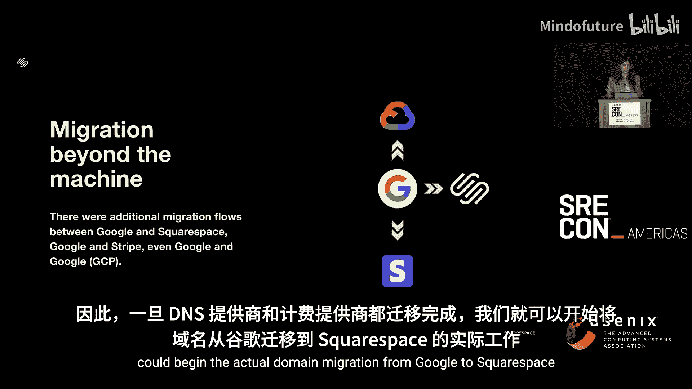

我们的一大目标是**最小化对客户的影响**，不希望他们失去对域名的访问权限超过必要时间。这意味着我们在后台进行大量准备工作。Google告知域名就绪后，我们开始设置。一旦耗时较长的步骤（如创建账户、设置账单信息、在域名系统中设置基础信息）完成，如果期间域名信息未变，我们就继续完成最终迁移。此时，域名会在Google侧被锁定，客户无法再更改任何信息。如果在我们的配置期间客户进行了更改，我们会重新开始流程。最终，我们将锁定窗口压缩到了**10秒**。在这10秒内，客户实际上是从Google Domains被切换到了Squarespace Domains。

实际上，这次迁移不仅仅是更换域名提供商。一个域名包含多个部分，因此发生了**三次迁移**：
1.  域名提供商从Google迁移到Squarespace。
2.  DNS提供商迁移（多数客户使用Cloud DNS）。
3.  账单提供商从Google Payments迁移到Squarespace。

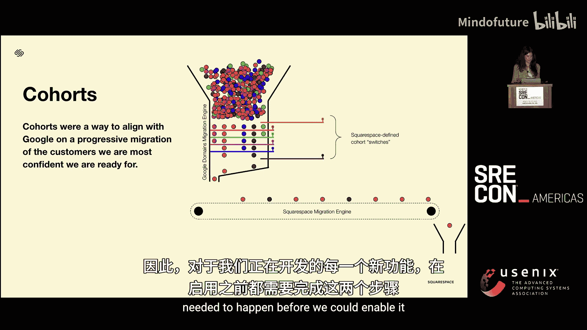

对于DNS迁移，我们与Cloud DNS团队合作，将DNS提供商账户直接从Google转移到Squarespace。在迁移开始前的一段时间内，双方都有权限访问DNS区域，之后切断Google的连接。

对于账单迁移，Squarespace使用Stripe作为计费提供商。为了安全，我们促成了Google的计费系统直接将账单信息传递给Stripe，然后Stripe向我们提供一个令牌，用于向这些客户收费。这样避免了敏感信息流经我们的系统。

## 迁移就绪与推进策略 📈

在上一节我们了解了迁移引擎的架构，本节中我们来看看如何判断一个域名“准备就绪”，以及我们如何规划和推进整个迁移过程。

我们通过“队列”的概念来控制迁移节奏。每个队列就像一组开关或闸门，对应一个功能是否就绪。每当一个功能准备就绪，我们就打开一个闸门。只有当一个域名的所有功能条件都满足时，它才能通过所有闸门，流入迁移引擎，最终被迁移。

这比听起来更复杂。要使一个域名就绪或一个功能可用，需要两件事同时完成：
1.  我们的产品需要**构建出该功能**，服务要能支持它。
2.  我们的迁移引擎需要**知道如何设置该功能**。如果设置错误，即使支持了也无法工作。

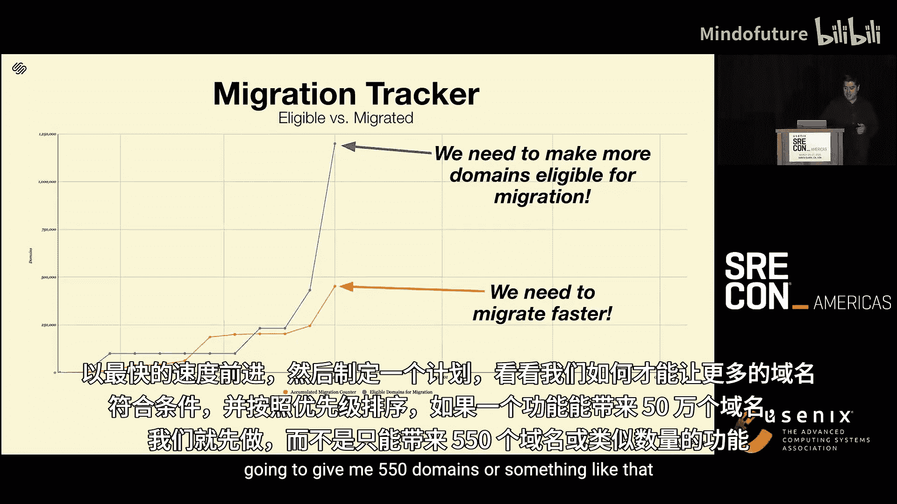

域名不仅仅是域名，它附带许多“功能”。我们需要支持的功能包括：
*   **TLD支持**：如果我们的注册商不支持 `.uk`，显然无法迁移 `.uk` 域名。
*   **产品体验**：例如，我们需要为拥有多个域名但没有网站的客户设计管理体验。
*   **高级功能**：如DNSSEC、域名转发、邮件转发、附加的Workspace等。

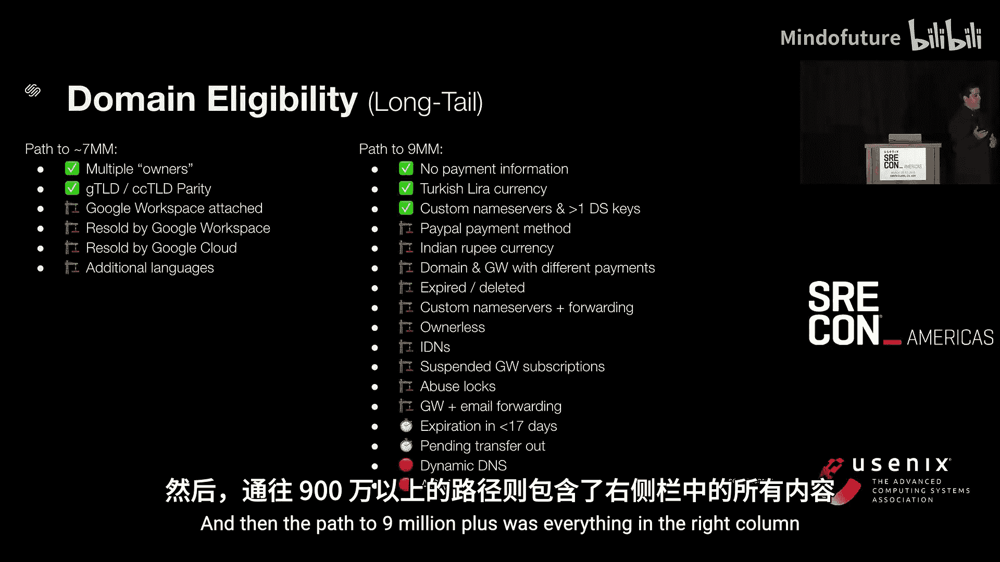

所有这些工作都在并行进行。大约在项目进行到第7个月（2024年4月），我们进行了一次检查点评估。此时倒计时还剩90天，但情况不容乐观。

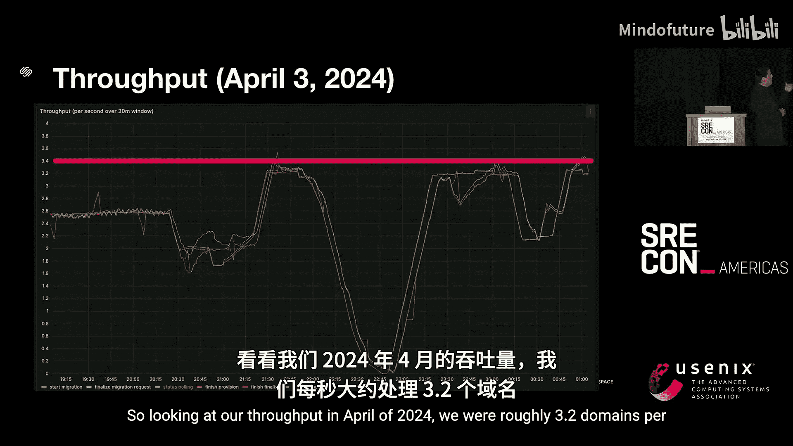

查看迁移跟踪器，有两条线：
*   **蓝线**：表示我们有资格迁移的域名数量。当时只有约120万个域名符合条件，距离900多万的目标很远。
*   **黄线**：表示实际已迁移的域名数量。当时不到50万。

我们面临两个问题：
1.  需要让更多域名尽快符合迁移条件。
2.  如果域名符合条件，我们需要大幅提高迁移吞吐量。

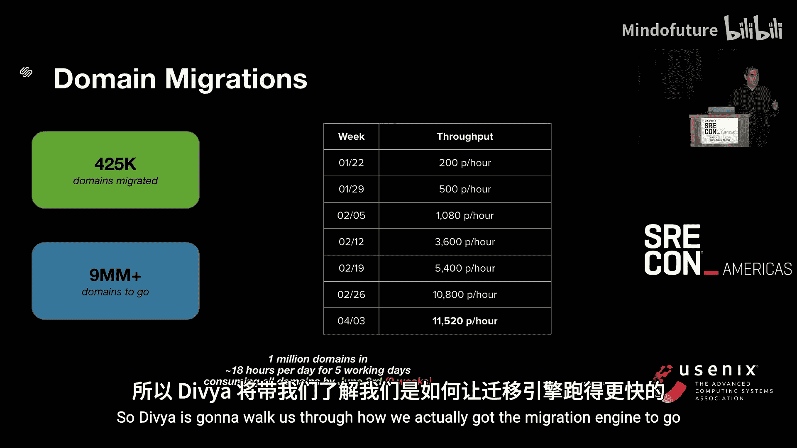

我们决定采取**两步走策略**：
1.  **保护迁移团队**：给他们几周时间专注于修复瓶颈、优化速度，而不施加“更快”的压力。迁移以现有速度继续进行。
2.  **让所有功能团队全速前进**：制定计划，按功能能解锁的域名数量排序，优先开发能解锁大量域名的功能。

通过与Google Domains团队深入分析，我们发现没有捷径。为了迁移绝大多数域名，我们必须构建**所有功能**，包括那些使用量很少的“长尾功能”。我们制定了计划：先实现能覆盖约700万个域名的功能（左列），再实现覆盖剩余200多万直至900多万域名的功能（右列）。

根据甘特图规划，要到5月底6月初才能让所有域名符合条件。这给了我们大约一个月的时间来完成全部迁移。假设我们速度足够快，时间还算充裕。

## 性能优化：让引擎飞起来 🚀

我们有了推进策略，但迁移引擎本身的速度是关键瓶颈。本节中，我们看看如何通过基础优化大幅提升迁移吞吐量。

在2024年4月，我们的迁移速度大约是 **3.2个域名/秒**。以这个速度计算，迁移100万个域名需要每天运行18小时，连续5个工作日。要迁移900万个域名，则需要连续运行9周。在6月初才开始全力迁移的情况下，我们没有9周的容错时间。我们必须更快。

好消息是，我们不需要什么特殊技巧，只需回归基础优化。我们构建的是事件驱动架构，因此首先检查了Kafka配置：分区数量是否合理？是否充分利用了分区？消费者数量是否足够？我们发现有时分区涌入大量数据，但消费者处理不过来，于是进行了扩容。

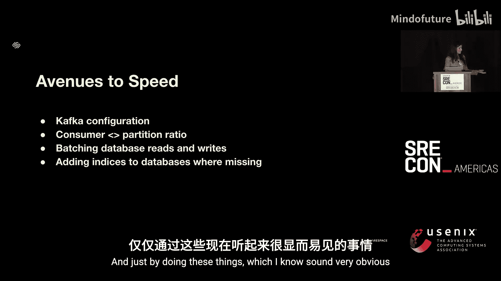

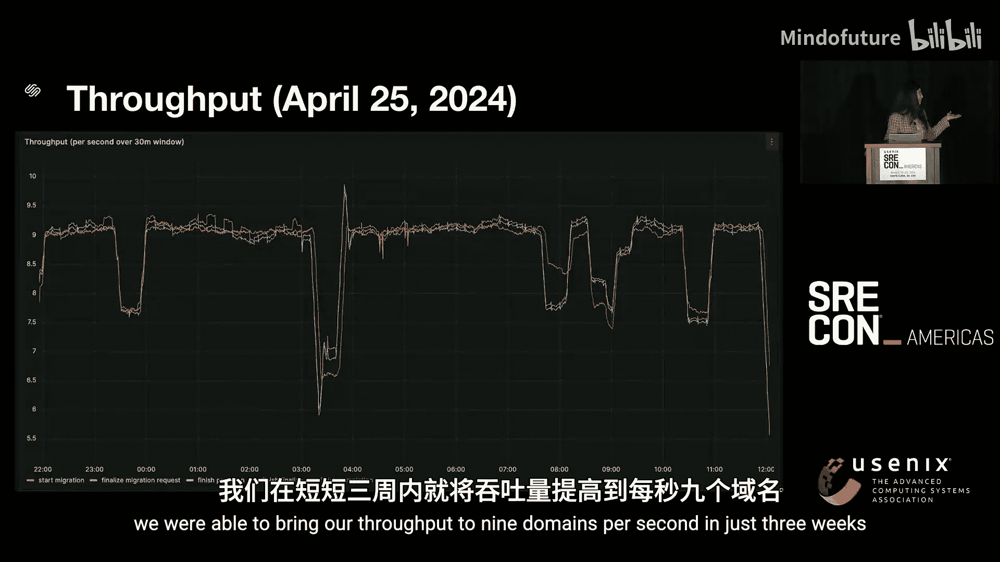

另一个例子是关于域名转发。我们测试时使用的域名通常只有5-10条转发规则。但实际迁移中，我们发现有些客户有数百甚至数千条规则。最初，迁移引擎为每条规则单独调用一次API，导致大量延迟。我们开始对请求进行**批量处理**，批量发送给API，并进一步探索批量读写数据库。

我们还做了显而易见的事：仔细检查了所有数据库的**索引**，看是否有缺失。由于涉及众多服务，这是一项跨团队协作的工程。

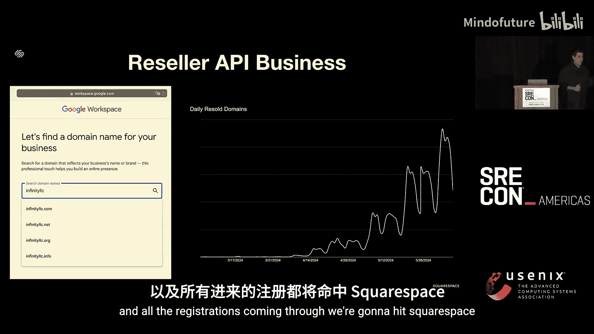

仅仅通过这些看似基础但当时被忽略的优化，我们在三周内将吞吐量提升到了 **9个域名/秒**。这使得迁移100万个域名只需每天运行10小时，连续3个工作日。全部迁移工作预计可在三周半内完成。这让我们信心大增。

我们甚至一度将峰值提升到了 **12个域名/秒**，这意味着我们**有能力在一天内迁移100万个域名**。

## 并行挑战：经销商API与最终成果 🏁

在迁移引擎飞速运转的同时，另一项重大挑战——经销商API也在同步推进。本节我们来看看这方面的进展以及整个项目的最终成果。

我们在2024年4月初启动了经销商API，并逐步接收来自Google Workspace和Google Cloud的流量。这非常令人兴奋，因为我们直接嵌入了Google Workspace的结账流程中。

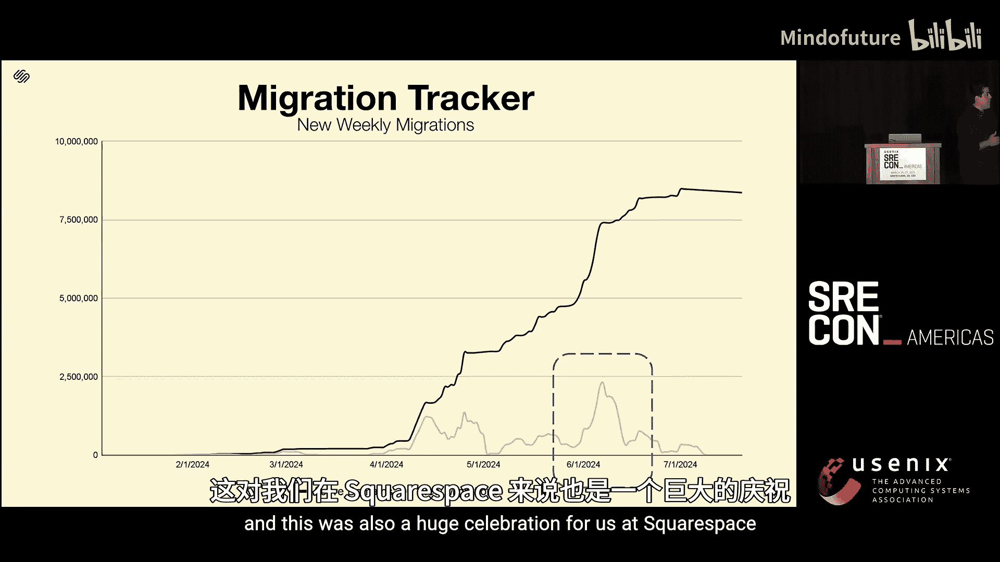

根据协议，我们需要遵守与Google Workspace之间的**SLA（服务等级协议）**，要求是**三个9（99.9%）** 的可用性。这对我们来说要求很高，最初三个月我们并未达标。原因有几个：首先，API是从零构建的，我们有很多需要学习的地方；其次，域名业务，特别是注册商服务，是一个高度依赖外部系统的分布式系统。我们依赖的注册局会有维护窗口和计划外中断，这些都影响我们的SLA。我们必须构建更具弹性的架构来满足要求。从9月开始，我们成功达到了目标。

10个月的期限到了，7月来临。回顾我们的两步走策略：
*   **蓝线（符合条件域名）**：我们非常有效地每周都让更多域名符合条件，直到5月底，所有域名都具备了迁移资格。
*   **黄线（实际迁移域名）**：可以看到，在6月初的蓝色区域，迁移活动非常密集。特别是在6月的第二周，我们**在一周内迁移了250万个域名**。值得注意的是，在收购之前，Squarespace总共才管理着200万个域名。我们一周的迁移量就超过了原有总量，且没有对系统造成任何中断或对客户产生影响。

最终，我们成功迁移了**100%的域名**（除了少数使用动态DNS等复杂功能、我们因时间不足而无法无损迁移的客户）。我们迁移了超过900万个域名，为经销商API实现了三个9的SLA，并在平台上支持了超过360个TLD。

## 总结

在本教程中，我们一起学习了Squarespace团队如何应对史上最大规模的域名迁移工程。我们从域名基础知识入手，了解了收购带来的多重挑战：包括技术架构上需要构建事件驱动的迁移引擎和经销商API，产品上需要实现数百项功能对等并打造独立品牌，以及工程上如何通过优化Kafka配置、批量处理、数据库索引等基础手段，将迁移吞吐量提升数倍，最终在紧迫的时间内成功完成了超过900万个域名的平滑迁移，并实现了高标准的服务可用性。这次成功的核心在于跨公司团队的紧密协作、清晰的阶段性策略以及对“最小化客户影响”这一核心目标的不懈追求。