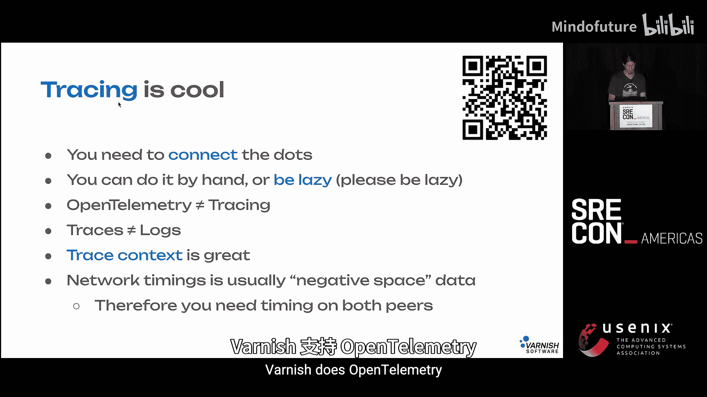
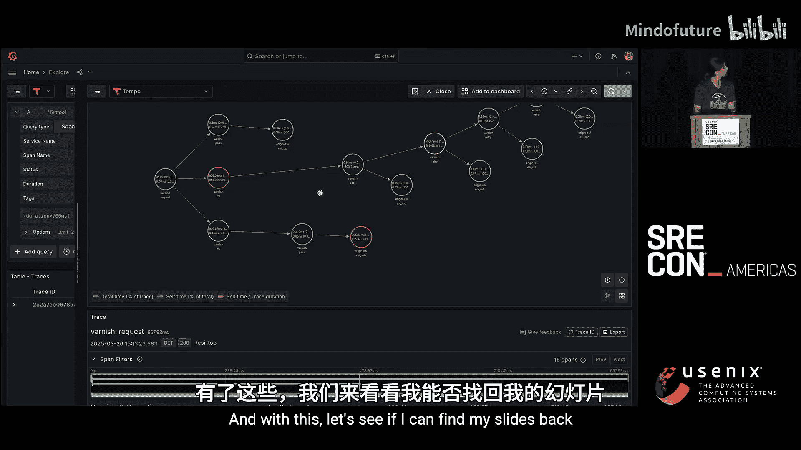

# 024：驯服野兽——理解并驾驭HTTP反向代理的力量 🦁


在本节课中，我们将学习HTTP反向代理的核心概念、其优势与挑战，并探讨如何通过有效的工具和策略来管理和调试它们，以确保系统的稳定性和可观测性。

## 概述

HTTP反向代理是现代网络架构中的关键组件，它位于客户端和后端服务之间，处理HTTP请求和响应。它们功能强大，但也可能引入复杂性。本节将深入探讨其工作原理、常见陷阱以及最佳实践。

## 关于演讲者与Varnish

首先，简单介绍一下我自己。我是一名拥有15-20年经验的开发者，目前担任解决方案工程师。我的工作重点是帮助SRE解决他们的问题。我主要使用C语言，并且偏好Arch Linux。

接下来，谈谈Varnish。这是一个始于2006年的开源项目，非常“老派”。我们的首席架构师是FreeBSD内核开发者，我们每周仍在IRC上交流。Varnish最初是作为Squid的替代缓存引擎而设计的，虽然Squid至今仍在，但Varnish在功能上已经大大扩展。与Nginx等工具不同，Varnish通过提供一种编程语言（VCL）来配置，而非简单的开关，这赋予了用户完全的控制权。此外，我认为我们拥有最好的日志系统。

## 什么是HTTP反向代理？

当我们谈论HTTP反向代理时，指的是一个广泛的范畴。它涵盖了从HTTP/0.9到HTTP/3（QUIC）的协议。常见的术语如“第7层负载均衡器”、“Kubernetes Ingress”、“API网关”等，本质上都属于HTTP反向代理。

我们可以将其视为一个通用实体，可能是一台服务器、一个容器、一个集群，甚至是像CDN这样的大规模服务。它接收客户端的HTTP请求，为了生成响应，会向后端（或称源站）发起零次或多次HTTP请求。这可以用于内容组合、重试等目的。

## HTTP反向代理的优势 🚀

我们不太关心底层的以太网或电缆，我们关心的是在机器上能看到的层面。在应用层，我们有各种构建在HTTP之上的API（视频、存储、DNS等）。HTTP本身是一个简单、基于文本的请求-响应协议，易于理解，并且几乎所有编程语言都能轻松构建HTTP反向代理。

正因为如此，HTTP反向代理能做很多事情。以下是几个基于Varnish的例子（其他系统也类似）：

*   **动态压缩**：如果后端存储的内容未压缩，Varnish可以即时压缩后再缓存，节省内存/磁盘空间和CPU。
    ```c
    // VCL示例：在收到后端响应头时触发压缩
    sub vcl_backend_response {
        if (beresp.http.content-type ~ "text") {
            set beresp.do_gzip = true;
        }
    }
    ```
*   **速率限制**：轻松实现API限流，例如限制每10秒15次请求。
    ```c
    // VCL示例：使用模块进行速率限制
    import ratecounter;
    if (ratecounter.is_denied(client.ip, 15, 10s)) {
        return (synth(429, "Too Many Requests"));
    }
    ```
*   **内容重写**：在测试环境中，可以使用正则表达式替换HTML中的链接。

## HTTP反向代理的挑战与陷阱 ⚠️

然而，HTTP反向代理也有不少问题。网络就像洋葱，有层次，而且会让你流泪。应用层协议（绿色部分）是大家共识且运作良好的；越往上走（红色部分），情况就越混乱。关键点是：要到达上层，必须经过下层。

这带来了一些陷阱：

1.  **IP地址欺骗**：一个常见的配置是只允许特定IP（如`localhost`）进行缓存清除（PURGE）。但如果前面还有另一个反向代理（如Nginx），并且它使用自己的本地IP向后端发送请求，那么任何通过该Nginx的请求都将被授权清除缓存。解决方案是让前置代理将真实的客户端IP放入一个头部（如`X-Real-IP`），然后让Varnish根据这个头部进行判断。
2.  **透明缓存限制**：我们无法“透明地”缓存像YouTube、Facebook这样的网站。因为要看到HTTP内容并进行缓存，必须经过TLS层。而你无法冒充这些网站，因为你没有它们的证书链。
3.  **工具抽象泄漏**：像`curl`这样的工具会在不同命令中做出细微但重要的差异。所有的抽象都是不完美的，HTTP在近40年的历史中，一直不善于清晰分离数据与逻辑，加上遗留实现，使得问题非常复杂。
4.  **调试歧义**：在调试REST API时，你可能会遇到HTTP状态码是200（成功），但JSON消息体却返回错误信息的情况。这时，双方可能都没错，只是没有明确是在哪个层面（传输层 vs. 应用层）进行沟通。
5.  **下层协议中断**：一个真实案例中，客户在Varnish前使用了F5负载均衡器。某些用户请求会失败，Varnish日志显示F5在收到大约4KB的头部数据后丢弃了连接。问题是，F5自身没有相关日志。Varnish实际上只是暴露了早已存在的问题（当Varnish不存在时，浏览器根本收不到任何错误响应）。这说明了由于上层（HTTP）问题导致下层（TCP/IP）连接被破坏的情况。

## 如何应对挑战：工具与策略 🛠️

上一节我们看到了HTTP反向代理可能带来的问题，本节中我们来看看如何利用工具和策略来有效管理和调试它们。

首先，一个强大的工具是 **`varnish-gather`**。这是一个通用的Shell脚本，能运行数百条命令来收集机器的完整状态信息，并打包发送以供离线分析。它能极大减少排查问题所需的来回沟通时间。即使你已有完善的仪表盘和告警，`varnish-gather`所收集的数据广度也往往是独特的。

那么，具体如何应对这些“尖刺”呢？

1.  **深入定位问题**：当收到“我的网页不工作”这样的报告时，要不断向下钻取。具体是页面中的哪个对象？哪次传输失败了？将问题范围缩小到可以构建的特定请求上。你不需要了解所有协议细节，但要知道它们的存在，并善用搜索工具。
2.  **善用协议调试工具**：
    *   对于HTTP，`curl -v`（详细模式）是一个极佳的工具。它可以展示DNS、TLS和HTTP的完整过程。参数`--connect-to`允许你强制将请求发送到特定IP，而不影响TLS分析。
3.  **利用分层日志**：Varnish的日志系统记录一切，但本身不做处理。它将事件日志记录到内存的环形缓冲区中，由其他工具读取和格式化。这提供了巨大的信息量，就像一个事件日记，记录了请求/响应的每一步状态变化。
    *   **`varnishlog`**：提供最详细、最即时的信息，适合深度调试。
    *   **`varnishlog -j`**：输出JSON格式的日志，便于集成到可观测性平台。
    *   **`varnishncsa`**：生成类似Apache NCSA格式的单行日志，适用于计费、审计等需要明确格式的场景。
    *   **指标（Metrics）**：从另一个维度讲述相同的故事。

**关键点**：你不需要永久记录所有内容。可以根据目的进行采样和设置不同的保留策略。允许数据存在重叠是可以的，随着时间的推移，重叠部分会自然衰减。重要的是要有针对性。

4.  **前后端关联**：Varnish的一个强大之处在于它能同时记录客户端请求和后端请求。一次客户端HTTP请求通常对应两次HTTP事务。如果前后端日志不一致（如之前F5的例子），猜猜谁会背锅？关联前后端日志至关重要。
5.  **实施追踪（Tracing）**：在现代分布式系统中，一次客户端请求可能会触发无数下游HTTP调用。**追踪（Tracing）** 因此变得非常重要。你不需要等到完全实现OpenTelemetry才开始。即使只是在边缘的第一个反向代理中生成并传递一个UUID头部，也能让你在日志中关联整个调用链。可以参考W3C的Trace Context规范。请注意，网络设备（电缆、交换机）通常不参与追踪，因此需要两端都报告才能拼凑出完整的网络路径。

## Varnish与OpenTelemetry实践 🌐

最后，我想展示一下Varnish与OpenTelemetry的集成。在一个演示环境中，客户端请求Varnish，Varnish会向两个不同的后端发起请求以组合内容，并可能进行重试。虽然基础设施看起来简单，但实际的调用链（瀑布图）可能相当复杂。

通过集成OpenTelemetry，Varnish能够生成详细的追踪跨度（Span），并在Grafana等工具中可视化。这使我们能够清晰地看到Varnish内部的所有操作（包括重试、后端调用），而不仅仅是最终结果。这种深度可观测性比一个只简单报告“收到请求”的黑盒服务器要有价值得多，它赋予了运维人员处理信息的能力。



## 总结

本节课中，我们一起学习了HTTP反向代理的核心概念。我们认识到它既是功能强大的工具（可用于缓存、限流、压缩等），也可能引入复杂性（如IP欺骗、调试困难、抽象泄漏）。为了有效驾驭它，我们需要：
*   使用像`varnish-gather`和`curl -v`这样的专业工具进行深度调试。
*   建立分层、有目的的日志记录策略，并关联前后端日志。
*   积极实施追踪（即使是简单的UUID传递），以获得分布式系统下的全链路可见性。
*   理解网络分层模型，并意识到问题可能跨层出现。




通过结合正确的工具、清晰的策略和对系统层次的深刻理解，我们就能“驯服”HTTP反向代理这头“野兽”，充分发挥其威力，同时确保系统的稳定与可观测性。