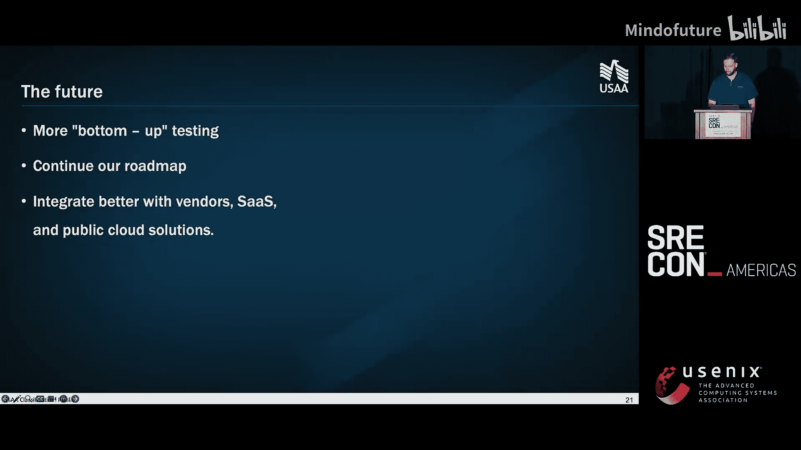

# 025：混沌实验——数据中心压力测试 🧪

在本教程中，我们将学习如何在一个大型金融机构（USAA）中，从零开始构建并持续演进一套数据中心级别的混沌实验体系。我们将涵盖其技术实现、监控策略、自动化流程，以及克服文化、人员和流程障碍的关键经验。

## 历史背景与演进之路 🕰️

上一节我们介绍了本教程的概述，本节中我们来看看混沌实验在USAA的起源。这一切始于多年前，当时团队的目标是从单一数据中心模型迁移到**双活数据中心**架构，以提升系统韧性。研究发现，80%被迫执行灾难恢复计划的企业会在五年内破产，这凸显了主动验证系统韧性的重要性。

最初的测试并非针对整个数据中心，而是从一个名为WebSphere的Java中间件应用服务器开始。团队从最简单的单元开始测试，逐步扩大规模。

以下是测试规模逐步扩大的过程：

*   **单JVM测试**：从单个数据中心的单个JVM（Java虚拟机）开始，观察其对响应时间、CPU等指标的影响。这有助于应用级别的容量规划。
*   **单节点测试**：随着信心增强，测试扩展到整台服务器节点故障，这有助于验证虚拟化策略和应对物理服务器故障。
*   **多节点/单Cell测试**：更激进地移除一个Cell（通常由多个节点组成）中的多个节点，以测试局部容量损失下的系统行为。
*   **50%容量测试**：最终，团队能够安全地移除单个数据中心内一半的计算容量。

一个重要的经验是：**始终寻找并记录测试预期目标之外的其他收益**。例如，这些测试数据为后续按业务线重构应用部署架构提供了宝贵的容量规划依据。

## 全数据中心故障转移测试 🏗️

上一节我们回顾了测试的演进历程，本节中我们来看看如何将测试规模扩大到整个数据中心。为了实现将全部用户流量切换到单一数据中心的“疏散”测试，需要进行一些工程化改造。

核心机制是通过内容分发网络（CDN）的**流量钉扎**功能，逻辑上将用户分组并引导至指定数据中心。测试采用渐进式策略，从单个用户组开始，逐步增加范围和信心。

测试范围不仅包括外部用户流量，也必须涵盖内部系统间流量。对于非双活架构的系统，测试验证了其客户端在跨地理距离调用时能否处理增加的延迟。这种“疏散”模式在实际发生重大故障时，是快速隔离问题、进行诊断和恢复的有效手段。

需要注意的是，对于**主备**架构的系统，我们不在混沌测试中对其进行故障转移，而是要求其团队自行安排定期的故障转移测试。有趣的是，许多团队会利用我们进行数据中心级测试的窗口期，同步执行他们的故障转移演练，以模拟最坏情况。

## 工程化与自动化 🤖

上一节我们介绍了全数据中心测试的模型，本节中我们来看看如何通过工程化和自动化来安全、高效地执行它。在SRE团队成立并接手该流程后，首要任务就是消除手动操作带来的繁琐和人为错误风险。

我们构建了一个完整的CI/CD流水线来编排所有测试任务。流水线集成了关键的安全与回滚机制。

以下是自动化流水线的核心组成部分：

*   **预检查**：最初检查计算和中间件层的容量与服务状态。后来升级为检查**服务等级目标**（SLO）的燃烧率警报，确保测试开始时没有活跃的短期警报。
*   **自动化执行**：按计划执行流量切换等一系列步骤。
*   **自动化回滚**：如果触发了预设的SLO燃烧率警报，测试会自动回滚，通常在几分钟内完成。
*   **手动回滚按钮**：作为安全网，提供“紧急停止”按钮，用于在自动化未触发时手动回滚。
*   **应急预案**：为每个自动化步骤准备了应急预案，以便在失败时快速联系对应团队手动处理。

我们坚持只使用**SLO燃烧率警报**作为自动化回滚的触发条件，而非普通的服务等级指标（SLI）警报。这一决策在当时有力地推动了SLO监控模式在全公司的采纳。设置回滚标志的服务所有者必须承诺：修复问题，并将触发的警报升级为事件进行处理。

## 监控策略的演进 📊

上一节我们探讨了自动化执行，本节中我们来看看如何监控这些高风险的实验。监控策略随着测试范围的扩大而不断演进。

最初，我们关注JVM级别的指标（CPU、堆内存、GC、响应时间）。当SRE团队开始负责全数据中心测试时，为了消除领导层的顾虑并确保测试可控，我们构建了一个**关键服务全景监控仪表板**，作为“单一事实来源”。尽管这并非典型的SRE实践（SRE更倡导由开发团队负责监控），但在当时是必要的。

如今，我们的监控重心已转移到**SLO燃烧率警报**上。在测试期间，我们会密切关注这些警报的触发情况。正常时可能只有零星警报，但一旦出现底层问题，就会引发“圣诞树效应”——大量依赖服务同时告警。

我们进一步将监控数据整合到内部的**状态页**中，为业务伙伴提供其服务组合运行状况的快速视图。未来的目标是向外部用户公开状态页。

## 文化、人员与流程挑战 👥

上一节我们介绍了技术层面的监控，本节中我们来看看实施此类测试所面临的最大挑战：非技术因素。我们的大部分时间和精力都花在了克服文化、人员和流程的障碍上。

首要建议是：**与现有问题管理流程对接**。早期我们依赖个人关系和“交易”来推动问题解决，导致问题积压失控。后来通过与问题管理团队协作，并利用自动化将常见优化项（如JVM参数调优）嵌入标准部署流程，才得以有效管理。

必须**利用一切可能的杠杆来处理发现的问题**。在我们的文化中，**可用性**是驱动行动的首要指标。我们通过指出未解决的问题如何影响可用性目标来推动修复。考虑到每周有2000-3000次变更，任何延迟测试都可能积累风险。

**大型问题**常常会阻碍测试的进行。应对策略包括：将触发回滚的问题正式纳入事件和问题管理流程；推动跨团队协作与问责制，而非指责；将问题及其状态定期呈报给领导层；在测试因故长期无法执行时，利用“事后复盘”会议指出测试可能预防的故障。

**用数据而非情绪说服他人**至关重要。例如，通过分析变更量与测试间隔的关联，展示长时间不测试与故障增加的相关性。我们为每次测试都保留事后复盘记录，建立了一个可搜索的“经验库”，用于发现“冒烟”（潜在问题）的迹象。

## 赋能与知识传递 🧠

上一节我们讨论了处理问题和推动文化的策略，本节中我们来看看如何通过赋能团队来扩大影响、减少知识缺口。早期，SRE团队深度参与每个问题的诊断和修复方案制定，负担沉重。

为了将应用级监控和韧性建设的知识普及，我们启动了一个“结对观测”项目。在测试期间，邀请应用团队与SRE坐在一起，分享监控技巧和“部落知识”。这项投入回报丰厚，极大地提升了工程社区的参与度和热情。

一个成功案例是帮助一个内部短链接服务团队。他们无法在测试环境复现性能瓶颈。通过共同设计混沌实验、增加合成负载，我们发现了其数据库连接未使用连接池，几乎导致端口耗尽的严重缺陷。这次提前发现避免了可能影响数十个关键应用的生产事故。

此外，我们还创建并分享了一个**容器化的本地性能测试样板项目**。开发者可以在本地工作站运行完整的监控栈和性能测试场景，并将其集成到自己的CI/CD流水线中。该项目还指导开发者如何获取和分析Java堆转储以定位瓶颈。这套工具显著提升了团队自主进行性能测试和调优的能力。

## 克服恐惧、不确定性和怀疑 🛡️

上一节我们探讨了赋能团队，本节中我们来看看实施混沌实验的头号障碍：**FUD**。对抗FUD所花费的精力一度超过测试本身的工程工作。

**领导层教育至关重要**。获得最高管理层（如CIO）的理解和支持，是抵御各方质疑的基石。

**持续用数据说话**。当遇到“这太冒险了”或“我的应用很特殊”等质疑时，要求对方提供具体数据来支撑其观点，往往能使担忧消散。有趣的是，业务部门有时会从反对变为主动要求测试，例如在预期业务高峰（如飓风季）前来验证系统承载力。

展示**价值证明**。我们保存了每次测试的复盘记录和问题追踪数据，可以列举无数个“避免了重大故障”的案例。我们还引入了一个**韧性信心指数**，该指数会根据上次成功测试时间等因素计算。当指数下降时，人们反而会开始呼吁进行测试。

**SLO自动回滚机制**成为了“安全毯”，极大地减轻了团队的压力，也增加了各方对测试安全的信心。但也要注意，它可能被某些团队当作“拐杖”，从而容忍更高的风险或降低质量门槛，这是我们正在关注的问题。

利用**未来的高风险活动**作为推动力。例如，在进行大规模生命周期升级（如操作系统迁移）时，负责该升级的领导层反而会成为混沌测试的积极倡导者，因为他们需要“数据中心的救生艇”作为保障。

## 未来展望 🚀

上一节我们分享了克服阻力的经验，本节中我们来看看混沌实验的未来发展方向。经过超过15年的演进，这项实验已被视为“常规操作”，这是一个巨大的文化胜利。

历史证明，这种从小到大的混沌实验顺序是有效的，它成功帮助我们度过了一次真实的数据中心中断事件。近期一次测试中暴露的问题，甚至揭示了一个存在多年、每次生产部署都会发生但被忽略的缺陷。

未来，我们希望：
1.  向**应用级故障转移测试**发展，并引入企业级混沌工程平台，让各团队能自主规划执行隔离的混沌实验。
2.  测试日程更加灵活，覆盖多个日期，甚至包括**业务高峰日**，以验证任何情况下的单数据中心运行能力。
3.  将测试范围扩展到**混合云/多云环境**，例如测试某个SaaS服务或公有云区域故障的影响。

## 总结 📝

本节课中我们一起学习了在USAA构建数据中心级混沌实验体系的完整历程。我们从技术层面了解了测试的演进、自动化流水线的构建以及监控策略的升级。更重要的是，我们深入探讨了在实施过程中遇到的文化、人员与流程挑战，以及通过领导层支持、数据驱动、赋能团队和建立安全网等策略来克服恐惧、不确定性和怀疑的有效方法。

最终要义是：混沌实验的价值无法估量，但它的实施无法一蹴而就。它需要激情、坚持，以及灵活运用技术与非技术手段来持续推动。希望我们的经验能为你的混沌工程之旅提供有益的参考。